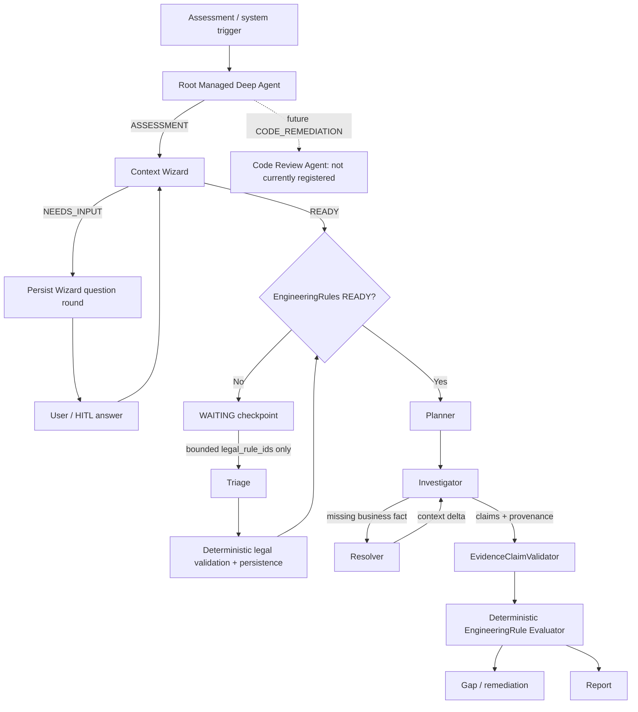
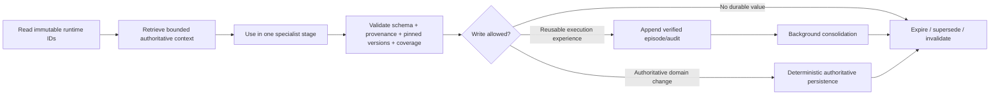
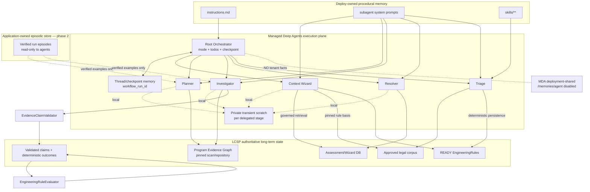
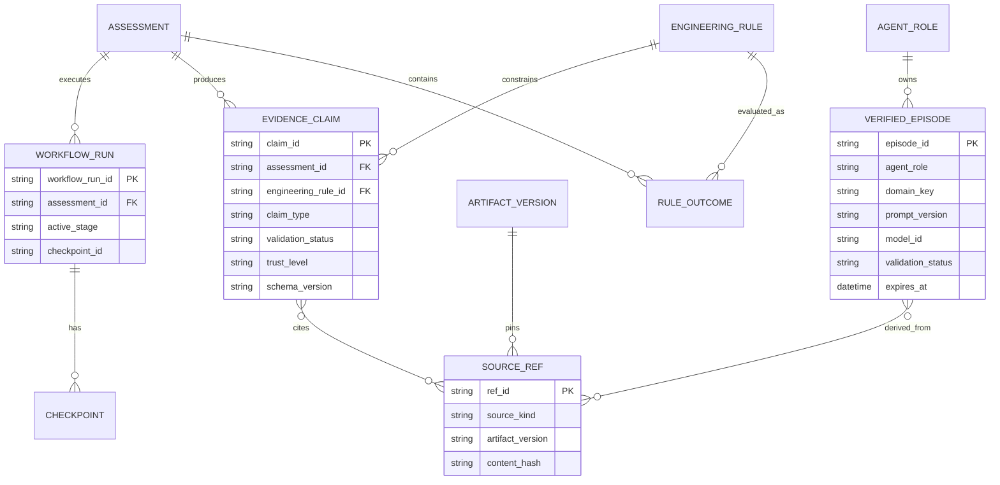

# LCSP Memory Architecture and Hallucination Mitigation for Managed Deep Agents

## Executive summary and flow-to-repository mapping

I reviewed the current `develop` branch of `khovan123/LCSP`, with particular emphasis on `deepagents/`, the repository’s own `FLOW.md`, the supplied orchestration SVG, the registered specialist definitions, orchestration lifecycle code, existing evidence-validation/evaluation code, and LangChain/LangGraph/Managed Deep Agents memory guidance. The current managed-agent surface is materially more mature than some older repository architecture notes imply: the root is already a Managed Deep Agents supervisor, the active registry contains five specialist agents (`triage`, `context_wizard`, `planner`, `investigator`, `resolver`), and LCSP already separates LLM reasoning from deterministic evidence validation and compliance evaluation. fileciteturn6file0L2-L2 fileciteturn10file0L2-L2 fileciteturn42file0L1-L2 fileciteturn43file0L2-L2

The most important conclusion is **not to add a root Managed Deep Agents `memory.py` for LCSP assessment, tenant, legal, repository, or user data**. The repository explicitly and deliberately disables deployment-shared Managed Deep Agents durable memory, and that is the correct architectural choice for LCSP at this stage. Managed Deep Agents' current durable memory is one read/write `/memories/agent/` tree shared by every caller of a deployment; LangChain explicitly warns that all callers can influence it, that private/customer data should not be stored there, and that its contents must be treated as untrusted. LCSP's tests codify the absence of both root `memory.py` and `orchestration/memory.py`. fileciteturn33file0L2-L2 fileciteturn37file0L2-L2 citeturn4search0

The recommended design is therefore **checkpoint-first, authority-separated memory**:

> **Managed Deep Agents/LangGraph thread state is execution memory. LCSP API/database and governed artifacts are long-term factual memory. Checked-in instructions/skills are procedural memory. Agent scratch is private and transient. Verified episodes may later become read-only retrieval aids, but never factual authority.**

This is closely aligned with LangChain's own memory taxonomy: short-term memory is thread-scoped state persisted by a checkpointer; cross-thread long-term memory belongs in deliberately scoped stores/namespaces; semantic memory represents facts, episodic memory represents prior experiences, and procedural memory represents instructions or behavior. citeturn4search2turn3search6

The second major conclusion is that LCSP's **hallucination defense is already strongest below the agent layer**. `EvidenceClaimValidator` fails closed on unknown evidence references, missing provenance, invalid topology, inadequate production evidence, and invalid claim confidence; `EngineeringRuleEvaluator` deterministically turns validated claims into `COMPLIANT`, `NON_COMPLIANT`, or `UNKNOWN`, explicitly preventing the LLM from being the final gate. That is exactly the right authority boundary and should be extended upward into the managed-subagent handoff contracts rather than replaced with a generic "fact-checking LLM." fileciteturn42file0L1-L2 fileciteturn43file0L2-L2

The largest current weaknesses are elsewhere:

1. **Four of the five specialist output contracts exist only as prompt text.** `ContextWizardQuestionRound` is implemented as Pydantic, but even that `OUTPUT_MODEL` is not wired into the subagent definition through `response_format`; Planner, Investigator, Resolver, and Triage do not currently define equivalent structured response schemas. Deep Agents explicitly supports `response_format` on custom subagents so the parent receives validated JSON rather than free-form text. fileciteturn11file0L2-L2 fileciteturn12file0L2-L2 fileciteturn13file0L2-L2 fileciteturn14file0L2-L2 fileciteturn15file0L2-L2 citeturn3search1turn3search5

2. **Trusted runtime identity is partly being delegated back to the model.** `LCSPRunContext` contains `user_id`, but `bounded_context_lines()` deliberately does not expose it to the model. At the same time, `get_assessment_context` requires the model-callable tool arguments to include `user_id`, and forwards that value into the trusted internal API request. This is a contract mismatch and a hallucination/security surface. LangChain's `ToolRuntime` exists specifically so runtime context such as a user ID can be injected into tools without exposing it in the model-visible tool signature. fileciteturn16file0L2-L2 fileciteturn17file0L2-L2 fileciteturn35file0L2-L2 citeturn3search0turn3search11

3. **`RootSubagentDispatcher` is not equivalent to managed root dispatch.** It constructs a fresh `create_agent(...)`, supplies a `thread_id` in configuration, but does not supply a checkpointer or runtime `context`; it then ignores the specialist's returned state/content. LangChain documents that a `thread_id` only gives persistent conversation history when the agent has a checkpointer configured. This direct-dispatch path should therefore not be treated as resumable agent memory simply because it receives a `thread_id`. fileciteturn22file0L2-L2 citeturn3search18

4. **The supplied SVG and current managed-agent registry have drifted.** The SVG depicts an `Interview Agent`, a targeted interview/clarification agent, and a `Code Review Agent`. Current code instead implements pre-planning interview behavior in `context_wizard`, investigation-time clarification in `resolver`, and has no registered `code_review` specialist in `FLOW_SUBAGENTS`. The repository does contain deterministic remediation capabilities, including a provenance-aware remediation proposal path, but that is not currently the same thing as the managed `Code Review Agent` drawn in the SVG. fileciteturn10file0L2-L2 fileciteturn38file0L2-L2

The following mapping should therefore be used as the **current implementation interpretation** of the supplied diagram.

| Supplied flow element | Current LCSP implementation | Memory implication | Status |
|---|---|---|---|
| Root Orchestrator / Supervisor | `deepagents/agent.py`, `instructions.md`, `orchestration/*` | Owns thread/checkpoint state, stage/todo state, immutable runtime IDs; not factual authority | Implemented. fileciteturn6file0L2-L2 |
| Interview Agent before planning | `subagents/context_wizard/definition.py` | Hydrates authoritative assessment/Wizard/legal context into one bounded handoff | Implemented under different name. fileciteturn11file0L2-L2 |
| Wizard clarification loop | `ContextWizardQuestionRound` → external Wizard answer → rerun Context Wizard | Question round belongs in checkpoint/application state; answer belongs in authoritative DB | Implemented contractually. fileciteturn8file0L2-L2 |
| READY EngineeringRule gate | Root/application deterministic readiness logic | Reads pinned legal versions; does not learn them as agent memory | Implemented architectural boundary. fileciteturn8file0L2-L2 |
| WAITING / rule-not-ready | `WaitingAssessmentRegistry` + triage lifecycle | Durable workflow-resume record, not semantic LLM memory | Implemented. fileciteturn39file0L2-L2 |
| Planner Agent | `subagents/planner/definition.py` | Transient stage state plus fixed Context Wizard handoff | Implemented. fileciteturn12file0L2-L2 |
| Investigator Agent | `subagents/investigator/definition.py` | Working evidence set; outputs claims/provenance; should not have independent factual long-term writes | Implemented. fileciteturn13file0L2-L2 |
| More Business Context? / targeted clarification | `resolver` for investigation-time `NEEDS_INPUT` | Context delta is temporary checkpoint state; authoritative answer remains application data | Implemented as Resolver. fileciteturn14file0L2-L2 |
| Deterministic evaluation / classification | `EvidenceClaimValidator` + `EngineeringRuleEvaluator` and related runtime | Authoritative derived outcome; must never be replaced by memory | Implemented and strong. fileciteturn42file0L1-L2 fileciteturn43file0L2-L2 |
| Gap / remediation | Deterministic agentic-evidence remediation capabilities | Persistent proposal/artifact with evidence refs; not learned agent truth | Implemented at capability level. fileciteturn38file0L2-L2 |
| Code Review Agent | No current entry in `FLOW_SUBAGENTS` | Must remain isolated by repo/commit/branch if introduced | **Diagram-only / missing as managed specialist at examined HEAD.** fileciteturn10file0L2-L2 |
| Legal Maintenance / Triage Agent | `subagents/triage/definition.py`, singleton lifecycle | Global legal workflow state but no customer/assessment memory; authoritative results written through deterministic persistence | Implemented. fileciteturn15file0L2-L2 fileciteturn21file0L2-L2 |

The resulting current flow should be read as:



This revised interpretation follows the repository's current `instructions.md`, which explicitly separates legal maintenance from assessment reasoning, uses Context Wizard before Planner, treats Resolver as an investigation-time loop, and stops model delegation before the deterministic compliance gate. fileciteturn8file0L2-L2

## Memory touchpoints, scopes, ownership, and lifecycle

LCSP should use **six memory classes**, but only two of them should be implemented as "agent memory" in the ordinary sense. The rest are better represented by already-governed state and artifacts. This distinction is important because LangChain's taxonomy describes memory semantically, not as a requirement that every category live in one vector database or one Managed Deep Agents memory store. citeturn4search2turn3search6

**Short-term execution memory** is the root's thread/checkpoint state: active mode, current stage, todo progression, pending `NEEDS_INPUT`, compact specialist handoffs, and resume position. Managed Deep Agents provides thread/session conversational persistence, while LCSP separately has durable LangGraph/Postgres checkpoint support for deterministic governed graphs. The existing `GraphRunState` already records pinned input versions, guardrail status, LLM references, node results, and resumable workflow identity; its `invoke_graph` uses `PostgresSaver` and a stable `workflow_run_id` when a checkpoint database is configured. fileciteturn25file0L2-L2 citeturn3search11

**Working/scratch memory** should remain private to one specialist invocation: selected graph seeds, partial tool observations, alternative hypotheses, unresolved frontiers, and the current evidence search frontier. Deep Agents' subagents are useful specifically because delegation quarantines detailed task context from the supervisor. LCSP's harness additionally prevents arbitrary filesystem scratch by hiding write/edit/execute and allowing `read_file` only under `/skills/**`; consequently working memory should live in transient agent state/tool interactions and be compressed into a typed handoff rather than persisted as free-form files. fileciteturn7file0L2-L2 citeturn3search1turn3search9

**Semantic memory** should mean LCSP's authoritative factual state: Wizard answers, assessment facts, repository/PGE evidence, approved legal corpus, EngineeringRules, deterministic evaluations, and approved report/remediation artifacts. The repository already says these remain in API/database storage rather than Managed Deep Agents memory, and its tools are designed to hydrate bounded projections from those authorities. fileciteturn5file0L2-L2 fileciteturn35file0L2-L2

**Episodic memory** should be introduced cautiously as an append-only record of prior agent runs—what stage ran, which tools/evidence classes were useful, whether the handoff validated, and what deterministic outcome followed. LangChain describes episodic memory as prior experiences that can support future behavior, often as few-shot examples. For LCSP, episodes should initially serve observability/evaluation; only episodes that pass deterministic validation should later become read-only retrieval examples for the same specialist/domain. citeturn4search2

**Procedural memory** already exists in the right form: `instructions.md`, each subagent's system prompt, the `lcsp` skill, and the `legal-rule-triage` skill. LangChain distinguishes instructions/skills from learned durable memory, and Managed Deep Agents deploy-owned instructions and skills are read-only to the agent. LCSP should keep them code-reviewed and versioned; no production agent should autonomously rewrite them from successful or failed runs. fileciteturn15file0L2-L2 fileciteturn33file0L2-L2 citeturn4search0turn4search7

**Long-term user/org memory** should be narrow and application-owned. A future user preference profile could retain harmless UX preferences, but factual compliance reasoning should not depend on opaque personalization. An organization-policy store, if LCSP reintroduces an organization identifier into current runtime contracts, should be application-write/agent-read-only and version-pinned. Current `LCSPRunContext` has `user_id` but no `organization_id`, despite older prose mentioning organizations, so an organization-scoped namespace cannot yet be safely treated as an implemented identity boundary. fileciteturn16file0L2-L2

### Memory ownership matrix

| Memory / state | Scope | Primary owner | Readers | Writers | Lifetime | Retrieval | Trust / validation |
|---|---|---|---|---|---|---|---|
| Root thread/checkpoint | `workflow_run_id` / assessment run | Root orchestrator | Root; bounded projection to active specialist | Managed runtime/orchestration | Run → resumable until terminal/retention | Exact `thread_id`/checkpoint | Execution state only; never evidence. fileciteturn5file0L2-L2 |
| Todo/stage state | Thread | Root | Root | Root through `write_todos` | Run | Direct state | Coordination only; cannot change authority. fileciteturn6file0L2-L2 |
| Specialist scratch | Invocation/stage | Individual subagent | Same specialist only | Same invocation | Transient | Local state/tool messages | Untrusted working hypotheses; discard after typed handoff. fileciteturn7file0L2-L2 |
| Wizard/business facts | User + assessment | LCSP application | Context Wizard, Resolver, deterministic runtime as authorized | User/application workflow | Persistent/versioned | Exact assessment + version, not semantic global search | `USER_ASSERTED`; never overwrites repository evidence. fileciteturn8file0L2-L2 |
| Repository/PGE evidence | Assessment + pinned repository artifact | Scanner/evidence subsystem | Planner, Investigator, validators | Deterministic scan/index pipeline | Artifact/version lifetime | Exact graph/ref + bounded search | `AUTHORITATIVE_SOURCE`; references validated against graph. fileciteturn42file0L1-L2 |
| Legal corpus | Legal catalog/corpus version | Legal subsystem | Context Wizard for pinned rules; Triage maintenance | Approved legal maintenance | Persistent/versioned | Exact legal/version/rule/chunk | `AUTHORITATIVE_SOURCE`; Triage cannot fabricate sources. fileciteturn15file0L2-L2 |
| EngineeringRules | Legal rule + catalog/corpus version | Deterministic legal persistence | Context Wizard, Planner, Investigator, evaluator | Triage proposal → deterministic persistence only | Persistent until superseded | Exact pinned IDs | `VERIFIED/AUTHORITATIVE_DERIVED`. fileciteturn15file0L2-L2 |
| Investigation EvidenceClaims | Assessment + rule + artifact version | Investigator proposes; validator owns acceptance | Deterministic gate, report | Accepted only after validator | Assessment artifact lifetime | Exact claim/rule/ref | `INFERRED` before validation; `VERIFIED` after `EvidenceClaimValidator`. fileciteturn41file0L2-L2 fileciteturn42file0L1-L2 |
| Deterministic verdicts | Assessment + rule version | Evaluator | Gap/report/audit | Deterministic runtime only | Persistent/versioned | Exact assessment/rule | `AUTHORITATIVE_DERIVED`; never LLM-writable. fileciteturn43file0L2-L2 |
| Waiting-assessment checkpoint | Workflow/evidence report | Root orchestration | Root only | Root only | Until readiness succeeds / cleanup | Exact checkpoint | Resume metadata only; Triage cannot read it. fileciteturn39file0L2-L2 |
| Legal Triage singleton state | Global legal-maintenance execution | Root lifecycle + singleton coordinator | Triage only for claimed execution | Deterministic lifecycle/tools | Execution lease | Exact execution ID | Authority comes from ownership validation, not memory. fileciteturn21file0L2-L2 |
| Verified agent episodes | Agent + domain + schema/model/prompt version | Background consolidator | Same specialist, optionally Planner/Investigator | Deterministic post-run job only | Persistent with TTL/version invalidation | Metadata first; semantic search second | `VERIFIED_EXAMPLE`; never authority |
| User preferences, optional | `user_id` | Application | Root/UI-context layer only when relevant | User/application | Persistent | Exact user key | `USER_PREFERENCE`; explicitly excluded from evidence |
| Procedural instructions/skills | Deployment + agent role + version | Engineering/legal owners | Relevant agent | Human-reviewed deployment only | Until next deploy/version | Direct/on-demand skills | `AUTHORITATIVE_PROCEDURE`; read-only to agents. citeturn4search0turn4search7 |
| MDA `/memories/agent/*` | Whole deployment | None for LCSP | None | None | Disabled | N/A | **Keep disabled for LCSP tenant/domain facts.** citeturn4search0 |

### Logical namespace design

These should be treated as **logical authority namespaces**, not as an instruction to mount them under Managed Deep Agents' globally shared `/memories/agent/` tree:

```text
lcsp/checkpoints/{workflow_run_id}
lcsp/assessments/{assessment_id}/context/{artifact_version}
lcsp/assessments/{assessment_id}/claims/{engineering_rule_id}/{claim_id}
lcsp/assessments/{assessment_id}/outcomes/{engineering_rule_id}

lcsp/users/{user_id}/preferences
# only after an authoritative organization ID exists:
lcsp/orgs/{org_id}/policies/{policy_version}

lcsp/legal/catalogs/{catalog_version}
lcsp/legal/rules/{legal_rule_id}/{source_version}
lcsp/legal/engineering-rules/{engineering_rule_id}/{version}

lcsp/episodes/{agent_name}/{domain_key}/{episode_id}
lcsp/procedures/{agent_name}/{procedure_version}
```

Exact-key and metadata filtering should precede semantic search. An assessment agent should first filter by assessment ID, pinned artifact/version, rule ID, agent role, and trust status; semantic similarity should only rank records **inside an already-authorized bounded set**. This follows the general LangChain model of custom namespaces and filtered/semantic store retrieval while preserving LCSP's stricter authority boundary. citeturn3search6turn4search2

### Trust and provenance model

I recommend five trust levels and one orthogonal lifecycle status:

| Trust | Meaning | Can close a compliance criterion? | Can be promoted automatically? |
|---|---|---:|---:|
| `AUTHORITATIVE_SOURCE` | Repository/PGE, approved legal source, pinned application facts | Only through deterministic interpretation/validation | No |
| `AUTHORITATIVE_DERIVED` | Deterministic evaluation/persistence result | Yes, according to evaluator rules | Created only by deterministic code |
| `VERIFIED` | Agent-derived claim whose refs/schema/version/topology validate | Can feed deterministic evaluator | Yes, but only through existing validation gate |
| `USER_ASSERTED` | Wizard/business answer supplied by user | Only where the relevant criterion is explicitly business-context dependent | Never overwrites contradictory repository evidence |
| `INFERRED_UNVERIFIED` | Model reasoning, retrieved episode suggestion, summarization | No | No |

A separate status should mark `ACTIVE`, `STALE`, `SUPERSEDED`, `REVOKED`, or `EXPIRED`. That prevents the common design error of treating "high confidence" and "current" as the same dimension.

Every persisted nontrivial semantic/episodic record should include at least:

```text
record_id
record_type
scope_type
scope_id
owner_agent
assessment_id?
user_id?
workflow_run_id?
engineering_rule_ids[]
source_kind
source_refs[]
artifact_versions{}
trust_level
validation_status
validator_id/version
created_at
updated_at
valid_from?
expires_at?
supersedes_record_id?
schema_version
content_hash
prompt_version?
model_id?
```

`confidence` may be recorded for diagnostics because LCSP's existing `EvidenceClaim` model has it, but a model-generated confidence number should **never** be used as an authorization or compliance gate by itself. The existing validator already constrains confidence and requires material provenance for closed claims. fileciteturn41file0L2-L2 fileciteturn42file0L1-L2

### Lifecycle and conflict rules

The production lifecycle should be:



**Read → Retrieve.** Start from trusted runtime identifiers and pinned versions, not from previous natural-language conversation. LangChain runtime context is designed specifically to pass static per-run dependencies such as user IDs and database access to tools/nodes without treating them as LLM-generated text. citeturn3search0turn4search13

**Use.** Give each specialist only the minimal stage input. The current repository already states "pass compact stage input and immutable identifiers, not raw tool histories," which should remain a hard rule. fileciteturn8file0L2-L2

**Validate.** Validate Pydantic output, immutable IDs, pinned versions, source references, coverage status, and domain-specific invariants before an LLM handoff can mutate application state. For investigation claims, reuse `EvidenceClaimValidator`, which already rejects unknown refs and evidence that cannot materially support a closed criterion. fileciteturn42file0L1-L2

**Write.** Models should not have a generic `save_memory` tool. Domain writes should go through existing deterministic API/service boundaries. A model may propose a claim, question, plan, rule candidate, or remediation proposal, but deterministic code controls whether that proposal is persisted as trusted state. Triage already follows this pattern. fileciteturn15file0L2-L2

**Consolidate.** Episodic extraction belongs in the background, after the run and after validation. LangChain documents hot-path memory writes as lower latency-to-availability but higher complexity and latency during the agent task; LCSP's high-integrity workload benefits more from background consolidation than autonomous hot-path "learning." citeturn4search2

**Expire.** Invalidate on artifact/version drift first; use TTL second. For example, a Planner episode created under scan `S1`, PGE schema `G1`, EngineeringRule `ER-v3`, and prompt `planner-v4` should not be retrieved as an active exemplar for `S2/G2/ER-v5` unless the compatibility policy explicitly permits it.

Conflict resolution should be deterministic:

- A new model inference never overwrites an authoritative record.
- Wizard and repository facts remain as two provenance chains; for technical repository truth, repository evidence wins, while unresolved business interpretation becomes `NEEDS_INPUT`. This is already the documented LCSP authority rule. fileciteturn8file0L2-L2
- Same-source facts at different pinned versions coexist; the run reads the exact pinned version.
- Changed legal source/catalog versions invalidate dependent EngineeringRules until the deterministic legal workflow marks replacements READY. fileciteturn15file0L2-L2
- Conflicting validated technical claims resolve to deterministic `UNKNOWN`, which the existing evaluator already implements rather than choosing one model output probabilistically. fileciteturn43file0L2-L2

## Agent-by-agent hallucination audit

LCSP already has several strong systemic guards: narrow specialist tool sets, no general-purpose subagent, no repository access through arbitrary filesystem/shell, PII/credential redaction around model/tool surfaces, explicit authority boundaries in prompts, and deterministic final evaluation. fileciteturn7file0L2-L2 fileciteturn23file0L2-L2

The remaining risks are primarily **handoff integrity, trusted-context injection, provenance preservation, stale context, and failure behavior**, not simply "the model might make things up."

| Agent / role | Responsibility and current sources | Current context / memory | Main hallucination or integrity risks | Severity | Concrete fixes |
|---|---|---|---|---|---|
| **Root supervisor** | Routes Legal Maintenance vs Assessment; delegates specialists; owns todos and checkpoint progression. Root-authored mutation is targeted reanalysis with HITL. fileciteturn6file0L2-L2 fileciteturn8file0L2-L2 | Immutable `LCSPRunContext`; managed thread/checkpoint; compact child handoffs; todos. fileciteturn16file0L2-L2 | Free-form child results can be misread; LLM could select an invalid next stage; stale checkpoint may be resumed after pinned input drift; future durable shared memory could contaminate routing. | **High** | Add typed handoffs for every child; deterministic transition validator around `task` results; compare pinned artifact versions on resume; keep global MDA memory disabled; persist explicit `stage`/`mode` in checkpoint state rather than infer only from prose/history. |
| **Context Wizard** | Hydrates `get_assessment_context`, legal readiness, and basis only for already-pinned EngineeringRules; generates READY or bounded question round. fileciteturn11file0L2-L2 | Reads authoritative application/legal state; produces compact PipelineContext-like handoff. | `ContextWizardQuestionRound` exists but is not wired to actual `response_format`; model may invent a field/reference despite prompt; `user_id` required by the tool is not in model-visible bounded runtime context. fileciteturn11file0L2-L2 fileciteturn16file0L2-L2 fileciteturn35file0L2-L2 | **High** | Add `response_format=ContextWizardQuestionRound`; inject identity/artifact fields into tools via `ToolRuntime`, not model arguments; validate returned EngineeringRule IDs are exactly the pinned set; fail closed on required-tool failure. |
| **Planner** | Finds bounded graph seeds and scan coverage for fixed EngineeringRule technical criteria. fileciteturn12file0L2-L2 | Receives Context Wizard handoff; tool observations remain stage-local. | Entire output contract is prompt-only; may accidentally broaden graph scope or mutate a rule ID; may underweight incomplete scan coverage; stale context may produce an apparently valid but invalid plan. | **High** | Add `PlannerResult` Pydantic response; immutable-set validation for rule IDs; machine-readable coverage enum/limitation codes; require explicit provenance for seed refs; version-bind plan to PGE/scan/rule versions. |
| **Investigator** | Tool-heavy PGE investigation across static flow, data paths, decision paths, human review, symbols, provider invocations; outputs criterion-scoped claims. fileciteturn13file0L2-L2 | Highest-volume transient working context; currently expected to synthesize refs into prompt-described claims. | Highest risk of invented/misaligned refs, unsupported negative claims, over-generalization from partial coverage, stale PGE refs, or mixing inference with observed fact. | **Critical** | Make output an `InvestigatorResult` containing the existing `EvidenceClaim` shape; run every closed claim through existing `EvidenceClaimValidator`; reject unknown refs before root sees them as usable; carry structured coverage/limitations; no persistent long-term factual writes. fileciteturn41file0L2-L2 fileciteturn42file0L1-L2 |
| **Resolver** | Resolves exactly one missing Wizard/business fact, optionally comparing Wizard claim to governed technical evidence. fileciteturn14file0L2-L2 | Reads pinned assessment context; returns minimal delta to existing Investigator plan. | Could silently transform an ambiguous user answer into certainty; could phrase a "resolution" that obscures repo/Wizard disagreement; resume instruction is currently free text. | **High** | Typed `ResolverResult`; source-class field (`WIZARD`, `REPOSITORY`, `USER_CONFIRMATION`); conflict object containing both values/refs; deterministic permitted-field whitelist for context delta; root constructs resume transition rather than executing model-authored arbitrary instructions. |
| **Triage** | Shared legal-maintenance specialist; exact approved chunks → Candidate / Context Only / Reject → EngineeringRule proposal → deterministic persistence. fileciteturn15file0L2-L2 | Deliberately receives no generic assessment runtime context; singleton-owned legal scope; checked-in procedural skill. | Legal hallucination can strengthen/soften normative language; source chunk confusion; accidental assessment leakage if orchestration later broadens inputs; free-form output contract. Existing deterministic persistence substantially mitigates this. | **Critical impact, medium residual probability** | Add typed Triage result; chunk hash/source-version fields; require every proposed rule to map exact candidate chunk IDs; preserve current no-assessment-context policy; keep skill read-only/versioned; never retrieve customer episodes into Triage. |
| **Code Review Agent — diagram target** | Intended remediation agent in supplied SVG. Current managed registry has no such specialist; deterministic remediation proposal capabilities exist separately. fileciteturn10file0L2-L2 fileciteturn38file0L2-L2 | Not defined as a current managed subagent. | A future code-writing agent would face repo/branch drift, writing beyond evidence scope, invented fixes, test-skipping, and cross-repository memory contamination. | **Critical when introduced** | Do not give it generic long-term memory. Scope scratch to `{assessment, repo, pinned_commit, remediation_id}`; require branch/HEAD revalidation before write; keep write credential outside model context; evidence-map each patch; run deterministic lint/types/tests/security and targeted rescan before accepting remediation; HITL on sensitive write/PR actions. |
| **Interview Agent — diagram name** | Current behavior split between Context Wizard before Planner and Resolver after investigation `NEEDS_INPUT`. fileciteturn8file0L2-L2 | Application Wizard state + thread question round | Risk arises if old diagram semantics cause one generic interview agent to mix pre-planning fact collection and post-investigation conflict resolution. | **Medium** | Keep the split. Do not recreate one generic interview agent unless contracts distinguish the two authority phases. |

Two cross-cutting findings deserve special emphasis.

**The current identity/tool-envelope design should be hardened before adding any persistent user memory.** LCSP's `identity.py` uses the default Managed Deep Agents LangSmith API-key identity. Managed Deep Agents documentation says this secures whether a caller can reach the deployment but does **not** provide separate private threads for Alice vs Bob; Supabase is the documented option for per-end-user private threads. Therefore LCSP should either keep the MDA deployment behind its own trusted service boundary or add true per-user deployment identity before allowing browsers/users to invoke it directly. fileciteturn34file0L2-L2 citeturn4search1

**PII redaction is not hallucination or prompt-injection verification.** LCSP's model-governance middleware redacts several credential/PII classes and retries model calls, which is valuable, but tool-derived source text can still contain adversarial natural-language instructions. Tool results should therefore be explicitly treated as data/evidence, never as procedural instructions, and no source/repository/legal text should be allowed to modify skills, prompts, permissions, or durable memory. fileciteturn23file0L2-L2 Managed Deep Agents similarly warns that shared memory itself is an untrusted input and must not grant authority or bypass approvals. citeturn4search0

## ADR: authority-separated, checkpoint-first memory

**Status:** Recommended for implementation.

**Decision:** LCSP will use Managed Deep Agents/LangGraph thread checkpointing for execution continuity, LCSP's API/database and versioned artifacts for cross-thread factual memory, checked-in prompts/skills for procedural memory, transient isolated state for specialist scratch, and a future application-owned verified episodic store for reusable examples. **LCSP will not enable deployment-shared Managed Deep Agents durable memory for assessment/user/customer/legal/repository knowledge.**

This decision preserves the architecture already documented in `FLOW.md`: the root owns execution memory while Wizard answers, assessment state, Program Evidence Graph evidence, legal corpus/EngineeringRules, deterministic outcomes, and report/audit artifacts remain authoritative outside agent memory. fileciteturn5file0L2-L2

It also fits the managed platform's current semantics. Managed durable memory is global to a deployment and every caller can influence it; thread state is separately scoped to one thread. That global durability model is suitable for knowledge safe for every caller to read and modify, but it is not an appropriate tenant data plane for LCSP. citeturn4search0

### Target architecture



The target entity relationships are:



### Read/write policy by agent

The **Root** may read checkpoint state and bounded child handoffs. It may update execution/todo state, but cannot write domain facts or verdicts.

**Context Wizard** is read-only against assessment/Wizard/legal authorities. Its only model-generated durable product is a candidate question round, persisted by the application workflow after schema validation.

**Planner** is read-only against PGE/coverage. Its plan should normally live only in checkpoint state for that assessment cycle. Persisting it for audit is acceptable, but not as reusable factual memory.

**Investigator** is read-only against PGE and writes *candidate* EvidenceClaims. Those become persistent `VERIFIED` claims only after deterministic validation.

**Resolver** is read-only against authoritative facts. It proposes a context delta; application/root logic applies only whitelisted fields and never overwrites repository evidence.

**Triage** reads only legal-maintenance scope and approved chunks. It can propose legal triage/EngineeringRule content but only deterministic persistence may commit it. Current isolation from generic assessment runtime context should remain. fileciteturn15file0L2-L2

**Future Code Review** may mutate a remediation branch only after explicit capability validation/HITL according to the product flow; it should never have a generic "remember patches" facility across repositories.

### Hot path versus background

| Operation | Hot path? | Reason |
|---|---:|---|
| Root checkpoint / stage / todos | Yes | Needed for immediate resume and deterministic orchestration |
| Retrieve pinned assessment/PGE/legal data | Yes | Required for current decision |
| Store raw conversation/tool history as long-term memory | **No** | High contamination/privacy cost |
| Validate subagent schema | Yes | Must happen before next transition |
| Validate EvidenceClaims | Yes | Must happen before deterministic gate |
| Persist accepted authoritative domain records | Yes, through existing deterministic service | Current transaction requires them |
| Extract candidate episode | Prefer post-run | Not needed to answer current task |
| Deduplicate/score episodes | Background | Avoid added latency and model multitasking |
| Update prompts/skills | **Never automatically** | Human/code-review controlled procedural authority |
| Learn global user/tenant facts through MDA memory | **Never** | Current MDA memory is deployment-shared. citeturn4search0 |

The main trade-off is that LCSP does more database/tool retrieval and gains less "automatic learning" than a consumer assistant. In exchange, every meaningful fact remains versioned and auditable, customer context does not silently leak across threads or agents, and an LLM's remembered inference cannot mutate legal/compliance authority. For LCSP's domain, that is the correct trade.

## PoC and concrete code-level changes

The PoC should **not** start by implementing a memory database from scratch. LCSP already has the difficult foundation: governed retrieval, checkpoint helpers, PGE provenance, evidence validation, and deterministic evaluation. The PoC should close the gaps between those components and the new Managed Deep Agents orchestration layer.

### Structured handoff contract

Create:

```text
deepagents/contracts/
├── __init__.py
└── handoffs.py
```

Reuse the current `EvidenceClaim` semantics but expose Pydantic types suitable for managed structured output. The precise class can either wrap the existing frozen dataclass or replace it in a compatibility-safe refactor.

```python
# deepagents/contracts/handoffs.py
from typing import Literal
from pydantic import BaseModel, ConfigDict, Field


class ProvenanceRef(BaseModel):
    model_config = ConfigDict(extra="forbid")

    ref: str = Field(min_length=1)
    source_kind: Literal[
        "PROGRAM_GRAPH",
        "SOURCE_ANCHOR",
        "WIZARD",
        "LEGAL_CHUNK",
        "SYSTEM"
    ]


class PlannerResult(BaseModel):
    model_config = ConfigDict(extra="forbid")

    status: Literal["INVESTIGATE", "NEEDS_INPUT"]
    engineering_rule_ids: list[str]
    selected_scope: list[dict]
    coverage_state: Literal["COMPLETE", "LIMITED", "OUT_OF_COVERAGE", "UNKNOWN"]
    unresolved_facts: list[str] = []
    next_step: Literal["INVESTIGATE", "RESOLVE"]
    artifact_versions: dict[str, str]


class EvidenceClaimOutput(BaseModel):
    model_config = ConfigDict(extra="forbid")

    claim_id: str
    engineering_rule_id: str
    criterion: str | None
    claim_type: Literal[
        "RULE_REQUIREMENT_MET",
        "RULE_REQUIREMENT_NOT_MET",
        "UNRESOLVED_ENGINEERING_FACT",
    ]
    value: bool | None
    evidence_refs: list[str] = []
    graph_path_refs: list[str] = []
    source_anchor_refs: list[str] = []
    limitations: list[str] = []
    confidence: float = Field(ge=0, le=1)


class InvestigatorResult(BaseModel):
    model_config = ConfigDict(extra="forbid")

    status: Literal["READY", "NEEDS_INPUT"]
    claims: list[EvidenceClaimOutput]
    limitations: list[str]
    missing_input: str | None = None
    next_step: Literal["GATE", "RESOLVE"]
    artifact_versions: dict[str, str]


class ResolverResult(BaseModel):
    model_config = ConfigDict(extra="forbid")

    status: Literal["RESOLVED", "CONFLICT", "NEEDS_INPUT"]
    fact_key: str
    resolved_value: object | None = None
    source_refs: list[str] = []
    conflicting_values: list[dict] = []
    # Root, not the model, determines arbitrary workflow transitions.
    can_resume_existing_plan: bool
```

Then change the subagent definitions to use `response_format`. Deep Agents documents that this returns JSON-serialized structured content to the parent and supports Pydantic schemas. citeturn3search1turn3search5

```python
# deepagents/subagents/planner/definition.py
SUBAGENT = {
    "name": "planner",
    ...
    "response_format": PlannerResult,
}

# deepagents/subagents/investigator/definition.py
SUBAGENT = {
    "name": "investigator",
    ...
    "response_format": InvestigatorResult,
}

# deepagents/subagents/resolver/definition.py
SUBAGENT = {
    "name": "resolver",
    ...
    "response_format": ResolverResult,
}
```

For Context Wizard, the smallest immediate fix is simply:

```python
SUBAGENT = {
    "name": "context_wizard",
    ...
    "response_format": ContextWizardQuestionRound,
}
```

because that Pydantic model already exists and has status/transition validation. fileciteturn11file0L2-L2

Triage should get a similarly strict `TriageResult` with exact execution ID, trigger, source versions, triaged/chunk/rule IDs, and bounded limitations.

### Trusted runtime envelope

This is the highest-value code correctness fix.

Today:

```text
LCSPRunContext.user_id
    ↓
bounded_context_lines()
    ✕ omitted
    ↓
LLM sees no user_id

but:

get_assessment_context(...)
    requires model-provided user_id
```

That mismatch is visible directly in current code. fileciteturn16file0L2-L2 fileciteturn35file0L2-L2

Do **not** solve this by exposing more identity data in the prompt. Instead, move trusted envelope fields to `ToolRuntime`, whose runtime parameter is hidden from the model-visible tool signature. LangChain explicitly demonstrates accessing short-term/runtime data inside a tool this way. citeturn3search11turn3search0

Suggested new utility:

```text
deepagents/tools/common/runtime_envelope.py
```

Pseudocode:

```python
from langchain.tools import ToolRuntime
from orchestration.context import LCSPRunContext


def trusted_tool_envelope(runtime: ToolRuntime) -> dict:
    context = runtime.context
    if not isinstance(context, LCSPRunContext):
        raise RuntimeError("LCSP tool requires trusted LCSPRunContext")

    if not context.assessment_id:
        raise RuntimeError("assessment_id is required")
    if not context.user_id:
        raise RuntimeError("user_id is required")

    return {
        "assessment_id": context.assessment_id,
        "user_id": context.user_id,
        "workflow_run_id": context.workflow_run_id,
        "artifact_versions": dict(context.artifact_versions),
    }
```

Then make model-visible schemas contain only domain parameters:

```python
class GetAssessmentContextInput(BaseModel):
    model_config = ConfigDict(extra="forbid")
    fields: list[str] = []


@tool(args_schema=GetAssessmentContextInput)
def get_assessment_context(
    fields: list[str],
    runtime: ToolRuntime,
) -> dict:
    trusted = trusted_tool_envelope(runtime)
    return _dispatch_agentic_tool(
        "get_assessment_context",
        trusted=trusted,
        input={"fields": fields},
    )
```

This removes `assessment_id`, `user_id`, `workflow_run_id`, and pinned versions from the model's freedom to fabricate while retaining them in trusted runtime dependency injection.

Apply the same pattern to all governed agentic-tool wrappers that currently ask the model to reproduce trusted envelope values.

### Verification guard between Investigator and deterministic gate

Do not write a second generic verifier from scratch. Adapt the existing validator:

```text
deepagents/orchestration/result_validation.py
```

```python
from tools.common.capabilities.assessment.claims.evidence_claim.models import (
    EvidenceClaim,
)
from tools.common.capabilities.assessment.claims.evidence_claim.evidence_claim_validator import (
    EvidenceClaimValidator,
)


def validate_investigator_handoff(
    result: InvestigatorResult,
    *,
    pinned_rule_ids: set[str],
    pinned_versions: dict[str, str],
    program_graph: dict,
) -> list[EvidenceClaim]:
    if result.artifact_versions != pinned_versions:
        raise StaleHandoffError("Investigator used stale artifact versions")

    validated: list[EvidenceClaim] = []

    for raw in result.claims:
        if raw.engineering_rule_id not in pinned_rule_ids:
            raise BoundaryViolation("Investigator changed EngineeringRule scope")

        claim = EvidenceClaim(
            claim_id=raw.claim_id,
            engineering_rule_id=raw.engineering_rule_id,
            claim_type=raw.claim_type,
            value=raw.value,
            evidence_refs=tuple(raw.evidence_refs),
            graph_path_refs=tuple(raw.graph_path_refs),
            source_anchor_refs=tuple(raw.source_anchor_refs),
            confidence=raw.confidence,
            limitations=tuple(raw.limitations),
            criterion=raw.criterion,
        )

        validated.append(
            EvidenceClaimValidator().validate(claim, program_graph)
        )

    if result.status == "READY" and not validated:
        raise BoundaryViolation("READY requires validated claims")

    return validated
```

The value here is not theoretical: the existing validator already checks whether refs resolve against the graph, whether a closed claim has evidence and a criterion, whether path topology actually supports the assertion, and whether selected evidence is materially aligned with production code. fileciteturn42file0L1-L2

### Persistent episodic memory PoC

To meet the "persistent memory" requirement without violating LCSP's tenant boundary, introduce a **verified episode gateway**, not MDA global memory:

```text
deepagents/memory_policy/
├── __init__.py
├── models.py
├── policy.py
└── gateway.py
```

This directory name is deliberate: avoid a root `memory.py`, because that filename has special Managed Deep Agents durable-memory semantics and the repository currently tests that it is absent. fileciteturn33file0L2-L2

Candidate model:

```python
class VerifiedAgentEpisode(BaseModel):
    episode_id: str
    agent_name: Literal["planner", "investigator", "resolver", "triage"]
    domain_key: str
    assessment_id: str | None
    engineering_rule_ids: list[str]
    artifact_versions: dict[str, str]
    input_signature: str
    successful_strategy_summary: str
    evidence_refs: list[str]
    validation_status: Literal["VERIFIED"]
    prompt_version: str
    model_id: str
    created_at: datetime
    expires_at: datetime | None
```

The agent gets **read-only** retrieval:

```python
@tool
def get_verified_agent_examples(
    domain_key: str,
    engineering_rule_ids: list[str],
    runtime: ToolRuntime,
) -> list[dict]:
    # server applies tenant/domain/version/trust filters before semantic ranking
    ...
```

There is deliberately **no** `save_agent_memory` model tool. After a successful deterministic run, application code may emit an episode candidate:

```python
def post_run_episode_capture(run, validated_claims, outcome):
    if not run.succeeded:
        return
    if not validated_claims:
        return

    episode = build_minimal_episode(...)
    episode_store.put_verified(episode)
```

For the first PoC, retrieval can be exact metadata lookup rather than embeddings. Semantic ranking can be added only after tests establish that episodes improve task success without increasing unsupported claims.

### Root dispatcher fix

`deepagents/orchestration/dispatcher.py` should be changed before relying on it for resumable specialist state.

Current code constructs an independent `create_agent` and invokes it with an optional `thread_id`, but provides no checkpointer and does not consume its output. fileciteturn22file0L2-L2 LangChain states that persistent conversation history with `thread_id` requires an agent configured with a checkpointer. citeturn3search18

**Preferred change:** deterministic system events should re-enter the managed **root** on a stable root workflow thread, letting one orchestration authority own checkpoint/resume semantics.

Conceptually:

```python
def dispatch_system_event(event: LCSPSystemEvent) -> RootRunResult:
    # Convert deterministic event into bounded root invocation.
    # Do not instantiate a separate stateless specialist.
    return invoke_managed_root(
        thread_id=event.workflow_run_id,
        context=event.run_context,
        message=event.to_bounded_instruction(),
    )
```

If direct specialist dispatch must remain for operational reasons, it must at least receive explicit `context_schema/context`, an explicit checkpointer, `response_format`, and return/validate `structured_response` instead of discarding the invocation result.

### PoC scenario

A minimal PoC needs Root + Context Wizard + Planner + Investigator; this exceeds the requested minimum of two domain agents and exercises the real LCSP path.

```python
# Conceptual, matching the repository's managed architecture.

root = define_deep_agent(
    name="lcsp-agent",
    model=ROOT_MODEL,
    context_schema=LCSPRunContext,
    subagents=[
        context_wizard_with_response_format,
        planner_with_response_format,
        investigator_with_response_format,
    ],
    middleware=[
        inject_lcsp_runtime_context,
        TodoListMiddleware(),
        ...
    ],
)

# thread 1
run_context = LCSPRunContext(
    assessment_id="A-1",
    user_id="U-1",
    workflow_run_id="W-1",
    checkpoint_id="C-1",
    artifact_versions={
        "scan": "S-10",
        "program_graph": "G-4",
        "engineering_rules": "ERSET-7",
    },
    engineering_rule_ids=("ER-11",),
)

result = root.invoke(
    {"messages": [{"role": "user", "content": "Run assessment"}]},
    context=run_context,
    config={"configurable": {"thread_id": "W-1"}},
)

# Domain tools get U-1/A-1 from ToolRuntime, not model arguments.
# Investigator's structured result is validated before the evaluator.
validated_claims = validate_investigator_handoff(...)

# Cross-thread persistent retrieval:
examples = episode_gateway.search(
    agent_name="investigator",
    domain_key="human-review-control",
    trust="VERIFIED",
    compatible_artifact_versions=...
)
```

The PoC acceptance scenarios should be:

| Scenario | Expected behavior |
|---|---|
| Same `workflow_run_id` resumes after `NEEDS_INPUT` | Root continues from checkpoint, retaining same plan and pinned versions |
| New thread, same user | No hidden customer memory appears; application DB can explicitly retrieve authorized persistent facts |
| Different user/assessment | Cannot retrieve previous assessment facts or episodes outside policy scope |
| Planner scratch vs Investigator | Planner tool history is not replayed wholesale; Investigator receives only typed plan |
| Invented evidence ref | `EvidenceClaimValidator` rejects it |
| Stale PGE/artifact version | Handoff rejected/re-hydrated; no use of stale claim |
| Tool returns unavailable/error | Specialist returns typed `NEEDS_INPUT`/`FAILED`, not a guessed answer |
| Wizard conflicts with repository | Resolver preserves both provenance chains |
| Triage request | Triage receives legal scope only, not assessment/customer memory |
| Prompt injection in source comment/legal chunk | Treated as source content; cannot change permissions, prompts, memory policy, or tool scope |
| LLM emits `COMPLIANT` | Rejected/ignored outside deterministic evaluator |
| Verified episode exists | May influence search strategy, but cannot satisfy evidence criterion without current-run refs |

## Evaluation plan, prioritized roadmap, and deadline

The evaluation should distinguish **task quality**, **grounding**, **memory correctness**, **isolation**, and **operational cost**. A single "agent accuracy" score would hide the failures that matter most in LCSP.

### Metrics and target gates

| Metric | Definition | Initial target |
|---|---|---:|
| Task success rate | Completed canonical stage with correct transition/output | Baseline first; improve without relaxing safety gates |
| Structured-handoff validity | Specialist outputs passing Pydantic/schema validation | **100% in eval suite** |
| Evidence-reference validity | Decisive claims whose refs resolve and pass validator | **100%** |
| Grounded closed-claim rate | MET/NOT_MET claims backed by criterion-aligned current evidence | **100%** |
| Unsupported claim rate | Claims containing non-resolving or unsupported factual assertions | **0 for accepted claims** |
| LLM final-verdict violations | Investigator/Planner/etc. outputs treated as final compliance outcome | **0** |
| False authoritative-memory write rate | Unvalidated model fact persisted to authoritative namespace | **0** |
| Cross-user leakage | U1 factual/persistent state exposed to U2 | **0** |
| Cross-assessment leakage | A1 evidence reused as A2 fact without explicit governed linkage | **0** |
| Cross-agent unintended leakage | Scratch/tool history from one specialist visible to another outside handoff | **0** |
| Triage customer-context leakage | Assessment/repo/customer content reaching legal Triage | **0** |
| Stale artifact consumption | Accepted handoff with incompatible pinned versions | **0** |
| Tool-failure abstention | Required source fails and agent correctly fails/asks rather than fabricates | **100%** |
| Memory precision | Retrieved verified episodes relevant/compatible with active task | ≥95% before semantic retrieval goes production |
| Memory utility | Delta in task success/token/tool cost when verified episodes enabled | Must be positive without grounding regression |
| Checkpoint resume correctness | Resumed runs preserve intended stage/plan/version identity | **100% test fixtures** |
| Token/context cost | Input tokens per canonical assessment stage | Record baseline and keep bounded |
| Added validation latency | Time added by schema/provenance guard | Record p50/p95; deterministic checks should precede adding LLM verifier |

These targets are realistic because several of the strictest conditions are already enforceable by deterministic code rather than relying on probabilistic model behavior. LCSP's current evaluator already fails closed to `UNKNOWN` when required evidence cannot close the criteria and handles conflicting evidence deterministically. fileciteturn43file0L2-L2

### Baseline eval set

Before changing prompts, capture current behavior on at least these fixtures:

```text
B1  context_wizard valid READY
B2  context_wizard missing business fact
B3  context_wizard tool error
B4  planner incomplete scan coverage
B5  planner attempts to add EngineeringRule ID
B6  investigator valid production evidence
B7  investigator fabricated graph ref
B8  investigator test-only evidence presented as production proof
B9  investigator missing topology for path criterion
B10 investigator absence-of-evidence negative claim
B11 resolver Wizard/repository conflict
B12 stale pinned artifact on resume
B13 cross-assessment context injection
B14 triage legal chunk ambiguity
B15 triage normative strengthening
B16 triage receives forbidden assessment context
B17 waiting checkpoint → triage → readiness resume
B18 source-text prompt injection
B19 direct dispatcher thread/resume behavior
B20 specialist emits forbidden compliance verdict
```

Many of the Investigator cases can directly exercise the existing `EvidenceClaimValidator`; the source already contains explicit logic for unknown refs, source-anchor/path resolution, confidence constraints, required criteria, topology validation, materiality, and production-vs-test evidence. fileciteturn42file0L1-L2

### Prioritized implementation roadmap

Given the deadline of **EOD September 1, 2026**, the scope should be optimized around eliminating architectural uncertainty and the highest-risk handoff defects rather than building a broad long-term-memory feature.

| Priority | Work | Suggested paths | Effort estimate | Deadline value |
|---|---|---|---:|---|
| **P0** | ADR + memory ownership/trust/schema contract | `docs/architecture/adr/...`; `deepagents/memory_policy/*` | 0.5 engineer-day | Locks the authority boundary |
| **P0** | Pydantic response contracts + `response_format` for all current specialists | `deepagents/contracts/handoffs.py`; each `subagents/*/definition.py` | 0.75–1.25 engineer-days | Removes free-form inter-agent protocol |
| **P0** | Runtime-identity/tool-envelope refactor using `ToolRuntime` | `orchestration/context.py`; `tools/common/runtime_envelope.py`; governed wrappers | 0.5–1 engineer-day | Eliminates model-authored trusted IDs |
| **P0** | Investigator handoff → existing `EvidenceClaimValidator` integration | `orchestration/result_validation.py` plus tests | 0.5 engineer-day | Direct hallucination guard at highest-risk stage |
| **P0** | Fix or constrain direct `RootSubagentDispatcher` | `orchestration/dispatcher.py` | 0.5–1 engineer-day | Restores coherent checkpoint semantics |
| **P0** | Isolation/staleness/failure tests | `deepagents/tests/test_*memory*`, `test_*handoff*`, eval tasks | 0.75 engineer-day | Prevents regressions |
| **P1** | Append-only verified episode model/capture, retrieval disabled by default | `deepagents/memory_policy/*`; API persistence | 0.5–1 engineer-day | Establishes real persistent episodic memory safely |
| **P1** | Read-only exact-filter episode retrieval to Planner/Investigator | new governed tool + eval | 0.5 engineer-day | Demonstrates cross-thread memory |
| **P2** | Semantic ranking, deduplication, TTL/background consolidator | API/worker + eval | 2–4 engineer-days | Useful after baseline, not deadline-critical |
| **P2** | Managed `Code Review Agent` from SVG | new `subagents/code_review/` plus branch/write/HITL lifecycle | Multi-day separate feature | Should not be folded into memory PoC |

The estimates are implementation-sizing estimates, not guarantees; several items can be parallelized, but the total full-production design exceeds the remaining period if a single engineer also has to build the missing Code Review managed specialist.

For **EOD September 1**, the recommended cut line is:

**Must be complete:** ADR, memory ownership/schema, all-agent hallucination audit, structured subagent contracts, runtime identity fix design or implementation, Investigator validation guard, and baseline isolation/hallucination tests.

**Strongly preferred:** minimal persistent verified-episode model with append-only capture and one read-only retrieval path.

**Defer:** semantic episode retrieval tuning, autonomous background consolidation, prompt/skill reflection, user-personalization memory, organization memory before an organization identity contract is reintroduced, and any Managed Deep Agents global `memory.py`.

The final implementation direction can therefore be summarized as:

> **LCSP should not make its multi-agent system safer by teaching every subagent to remember more. It should make the system safer by making the root remember execution state, making specialists see only bounded current evidence, making deterministic services remember authoritative facts, and allowing only validated, provenance-bearing experiences to survive across runs.**

That conclusion is consistent both with LCSP's present code—which already keeps authoritative data outside model memory and places deterministic validation after LLM investigation—and with Managed Deep Agents' current warning that deployment durable memory is shared and caller-influenceable. fileciteturn5file0L2-L2 fileciteturn42file0L1-L2 fileciteturn43file0L2-L2 citeturn4search0