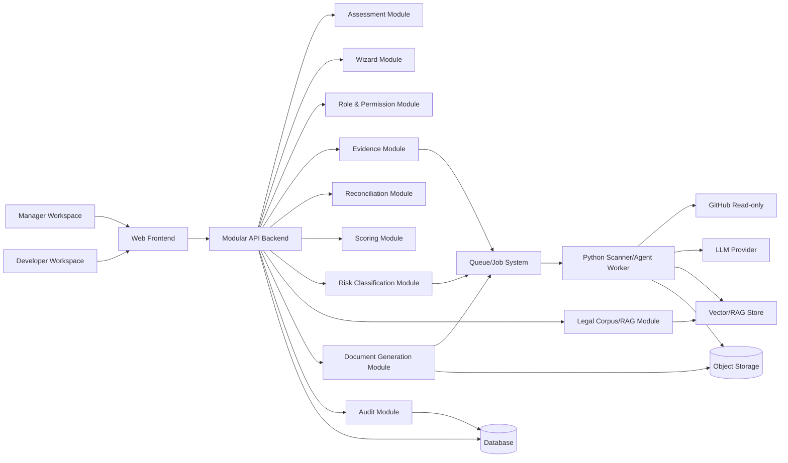
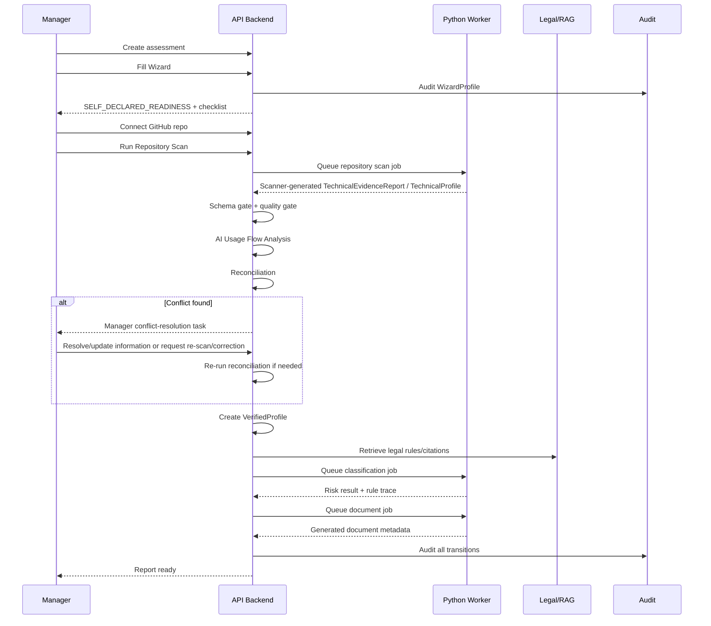
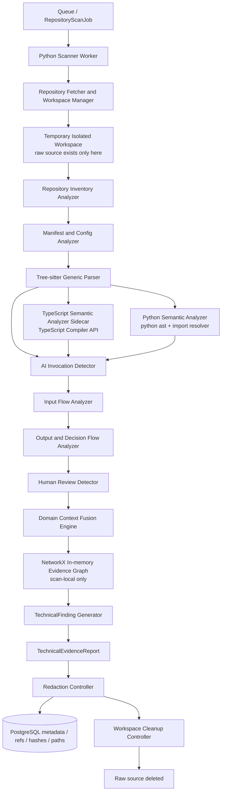
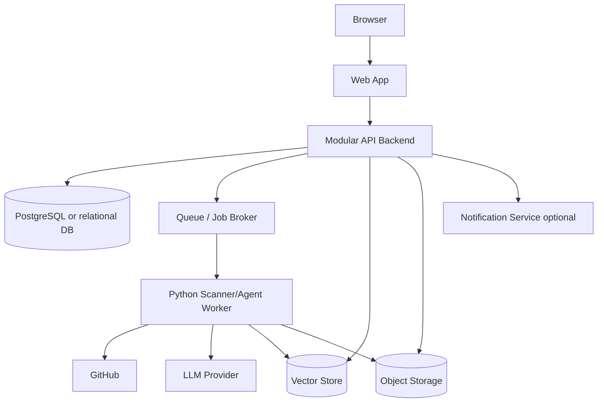

# LCSP Conditional Architecture Document

## 1. Architecture Overview

Tài liệu này mô tả kiến trúc có điều kiện cho LCSP dựa trên Conditional PRD, Validation Plan, Architecture Exploration và Conditional ADR. Đây chưa phải kiến trúc đã khóa tuyệt đối để triển khai backlog.

LCSP được định vị là **evidence-based compliance platform**, không phải chatbot pháp lý hoặc checklist tự khai. Vì vậy kiến trúc phải bảo đảm risk classification chỉ được chạy khi đã có technical evidence hợp lệ, reconciliation đã tạo VerifiedProfile và không còn unresolved conflict.

Hướng kiến trúc MVP được chấp nhận có điều kiện là:

```text
Modular monolith backend + separate Python scanner/agent worker
```

Các thành phần chính:

| Layer | Vai trò |
| --- | --- |
| Web Frontend | Manager Workspace và Developer Workspace |
| Modular API Backend | Assessment, Wizard, RBAC, Evidence, Reconciliation, Scoring, Report, Audit |
| Python Worker | Scanner jobs, evidence normalization, agent orchestration workload |
| Database | Assessment, profile, evidence metadata, conflict, score, audit, document metadata |
| Vector/RAG Store | Legal corpus retrieval và rule/citation lookup |
| Object Storage | Generated documents và non-source artifacts |
| Queue/Job System | Scan, evidence processing, classification, document jobs async |

LCSP chưa chọn full microservices cho MVP vì service boundary còn phụ thuộc vào A1-A3, contract dữ liệu chưa ổn định hoàn toàn và MVP cần demo end-to-end với complexity thấp. Modular monolith vẫn phải thiết kế module boundary đủ rõ để có thể tách sang service-oriented architecture sau này.

Conditional dependencies:

| Dependency | Ảnh hưởng kiến trúc |
| --- | --- |
| A1 - Wizard simplicity vs completeness | WizardProfile schema, Wizard UI, reconciliation input, Manager Workspace |
| A2 - Legal corpus/rule reliability | Legal corpus/RAG, rule/citation contract, classification boundary |
| A3 - Human attestation abuse risk | Attestation schema, permission, evidence gate, audit, conflict resolution |

Trace to ADR:

| ADR | Status | Ảnh hưởng |
| --- | --- | --- |
| ADR-001 | Conditionally Accepted | Modular monolith cho MVP |
| ADR-002 | Conditionally Accepted | Python worker tách khỏi API runtime |
| ADR-003 | Accepted for MVP | Manager-led workflow với optional Developer participation |
| ADR-004 | Accepted for MVP | Evidence-first classification gate |
| ADR-005 | Conditionally Accepted | GitHub Repository Scan active MVP; Local/CI/manual deferred |
| ADR-006 | Accepted for MVP | No raw source to LLM, no long-term source storage |
| ADR-007 | Accepted for MVP | Binary conflict routing; scores are supporting signals |
| ADR-008 | Needs Validation | Controlled human technical attestation |
| ADR-009 | Conditionally Accepted | Orchestrator-controlled multi-agent workflow |
| ADR-010 | Conditionally Accepted | MVP evidence collection simplified to Repository Scan only |
| ADR-019 | Conditionally Accepted | Static-analysis scanner with language-specific semantic analyzers |
| ADR-020 | Conditionally Accepted | Claim-level evidence references for AIUsageFlow |
| ADR-021 | Conditionally Accepted | Controlled multi-level data-flow analysis |

## 2. System Context

### Actors

| Actor | Trách nhiệm |
| --- | --- |
| Manager | Required and sufficient MVP role: tạo assessment, đăng nhập password/OAuth-OIDC, trả lời Wizard, kết nối GitHub repository, chạy Repository Scan, review findings/AIUsageFlow, resolve all MVP conflicts, approve VerifiedProfile, trigger classification, generate report |
| Developer | Optional technical collaborator: chỉ làm task/policy được Manager delegate; không bắt buộc cho MVP success path |

MVP chỉ expose 2 role này. Các trách nhiệm như legal, compliance, product owner nằm trong Manager. Manager là superset role và có mọi active MVP capability. Các trách nhiệm như developer, tech lead, DevOps, security engineer nằm trong Developer nếu Manager muốn delegate technical collaboration.

### External Systems

| External System | Mục đích | Boundary |
| --- | --- | --- |
| GitHub | GitHub App read-only scan, repo/branch/commit metadata | Least privilege, read-only |
| OAuth/OIDC Identity Provider | User login/identity authentication into LCSP | Active MVP auth capability; separate from GitHub App repository integration |
| Local/CI scanner environment | Deferred/Future enterprise-safe evidence path | Không thuộc MVP main flow |
| Legal corpus source | Legal texts, rule definitions, citation references | Versioned source; không để LLM tự suy luận luật |
| LLM provider | Hỗ trợ reasoning có kiểm soát trong agent boundary | Không nhận raw source code; chỉ nhận normalized evidence và retrieved rules |
| Document storage | Lưu generated documents và non-source artifacts | Không lưu raw source dài hạn |
| Email/notification service | Invite Developer, task notification | Optional cho MVP, không chứa sensitive source content |

## 3. User Workspaces

### Manager Workspace

Manager Workspace là entry point chính của assessment.

Capabilities:

| Capability | Ghi chú |
| --- | --- |
| Create assessment | Manager owns assessment |
| Fill Wizard | Tạo WizardProfile bằng ngôn ngữ nghiệp vụ |
| Connect GitHub repository | Active MVP evidence path; OAuth/OIDC login does not grant repo access |
| Run repository scan | Manager can run scan without Developer assignment |
| View scan status/findings | Manager can review TechnicalEvidenceReport, TechnicalProfile and AIUsageFlow |
| Invite Developer | Developer chỉ vào assessment qua invitation/task |
| Assign Developer policy | Giới hạn quyền Developer theo task |
| Track progress | Xem trạng thái evidence, reconciliation, report |
| Resolve conflicts | Manager resolves business/legal and technical conflicts in MVP |
| Approve VerifiedProfile | Final assessment ownership thuộc Manager |
| Trigger Risk Classification | Chỉ sau VerifiedProfile và legal rule/citation gates |
| Generate report | Chỉ sau khi classification/report gate pass |

Wizard-only behavior:

```text
No technical evidence -> no risk level.
Wizard-only -> SELF_DECLARED_READINESS, readiness checklist, preliminary indicators.
```

Manager Workspace không được hiển thị HIGH/MEDIUM/LOW khi chưa có technical evidence hợp lệ.

### Developer Workspace

Developer Workspace là optional / limited collaborator experience, không phải required component trong MVP success path. Developer Workspace chỉ hiển thị technical tasks được Manager giao.

Capabilities:

| Capability | Ghi chú |
| --- | --- |
| Accept task | Developer vào assessment theo policy |
| Connect repo | Nếu có delegated `CONNECT_REPOSITORY` |
| Run repository scan | Nếu có delegated `RUN_REPOSITORY_SCAN`; Manager không cần delegation để chạy scan |
| Review findings | Nếu có `VIEW_TECHNICAL_FINDINGS` |
| Confirm technical truth | False positive/false negative, production scope, repo/commit |
| Provide structured technical attestation | Chỉ cho role-bound technical claims |
| Respond to technical clarification | Developer input không finalize conflict; Manager là final resolver |

Developer không có quyền approve VerifiedProfile, run final classification, generate final report, export compliance dossier hoặc thay đổi Manager decisions.

## 4. High-Level Architecture



The backend is modular first. Scanner, evidence normalization and agent workloads run outside the web request lifecycle in Python worker jobs.

## 5. Module Decomposition

### Web Frontend

| Aspect | Detail |
| --- | --- |
| Responsibility | Render Manager Workspace và Developer Workspace |
| Inputs | Assessment state, tasks, wizard definitions, evidence status, conflicts |
| Outputs | Wizard answers, task actions, confirmations, attestation submissions |
| Owned data | Không own domain data; frontend state only |
| Dependencies | API Backend |
| Guardrails | Không hiển thị risk level khi classification locked; không expose Developer vượt policy |

### Assessment Module

| Aspect | Detail |
| --- | --- |
| Responsibility | Lifecycle tổng của assessment |
| Inputs | Manager actions, evidence gate results, reconciliation results |
| Outputs | Assessment status, readiness state |
| Owned data | Assessment metadata, owner, current state |
| Dependencies | Wizard, Evidence, Reconciliation, Audit |
| Guardrails | Manager owns assessment; state transitions phải kiểm tra gates |

### Wizard Module

| Aspect | Detail |
| --- | --- |
| Responsibility | Thu thập business/legal truth từ Manager |
| Inputs | Manager answers |
| Outputs | WizardProfile, preliminary indicators, readiness checklist |
| Owned data | Wizard answers, question mappings, WizardProfile |
| Dependencies | Assessment, Audit |
| Guardrails | Không tạo risk level; câu hỏi critical phải map về WizardProfile fields |

Conditional A1:

Wizard schema và question design chưa được khóa tuyệt đối cho đến khi validation A1 pass.

### Role/Permission Module

| Aspect | Detail |
| --- | --- |
| Responsibility | RBAC hai role: Manager super-role và optional Developer delegated collaboration |
| Inputs | Manager invites, assigned policies |
| Outputs | Access decisions, visible tasks, allowed actions |
| Owned data | Role assignments, Developer policies, invitations |
| Dependencies | Assessment, Audit |
| Guardrails | Developer không inherit Manager permissions |

### Evidence Module

| Aspect | Detail |
| --- | --- |
| Responsibility | Nhận, validate và quản lý scanner-generated evidence metadata |
| Inputs | MVP: GitHub Repository Scan result / scanner-generated `TechnicalEvidenceReport`; Deferred/Future: Local/CI/manual evidence |
| Outputs | TechnicalEvidence, TechnicalProfile, evidence status |
| Owned data | Evidence reports metadata, provenance, report hash, privacy flags |
| Dependencies | Queue, Worker, Audit, Reconciliation |
| Guardrails | Reject nếu schema/privacy/provenance fail; không lưu raw source dài hạn |

### Reconciliation Module

| Aspect | Detail |
| --- | --- |
| Responsibility | So sánh WizardProfile, TechnicalProfile và AIUsageFlow |
| Inputs | WizardProfile, TechnicalProfile, AIUsageFlow, Manager resolutions |
| Outputs | Conflicts, reconciliation decisions, VerifiedProfile candidate |
| Owned data | Conflict records, conflict resolution history |
| Dependencies | Scoring, RBAC, Audit |
| Guardrails | Any MVP conflict creates Manager resolution task; Developer assignment is not required |

### Scoring Module

| Aspect | Detail |
| --- | --- |
| Responsibility | Tính Evidence Confidence, AI Intervention, Conflict Score |
| Inputs | Findings, confidence signals, WizardProfile, TechnicalProfile |
| Outputs | Score records and supporting review/classification signals |
| Owned data | Score snapshots |
| Dependencies | Evidence, Reconciliation, Audit |
| Guardrails | Workflow blocking uses binary unresolved conflict state; scores do not create routing branches |

### Risk Classification Module

| Aspect | Detail |
| --- | --- |
| Responsibility | Tạo risk classification dựa trên VerifiedProfile và legal rules |
| Inputs | VerifiedProfile, legal rules/citations |
| Outputs | Risk result, rule trace, classification basis |
| Owned data | Classification output metadata |
| Dependencies | Legal Corpus/RAG, Queue, Worker, Audit |
| Guardrails | Không chạy trước VerifiedProfile; không final nếu thiếu rule/citation quan trọng |

### Legal Corpus/RAG Module

| Aspect | Detail |
| --- | --- |
| Responsibility | Versioned legal corpus retrieval, rule lookup, citation validation |
| Inputs | Legal corpus, rule definitions, classification query |
| Outputs | Retrieved rules, citations, rule trace |
| Owned data | Legal document metadata, rule_id, corpus version |
| Dependencies | Vector Store, Database |
| Guardrails | RAG hỗ trợ retrieval; không tự bịa legal rule |

Conditional A2:

Rule schema, citation format và degraded/blocked behavior phụ thuộc validation A2.

### Document Generation Module

| Aspect | Detail |
| --- | --- |
| Responsibility | Sinh gap analysis và compliance report/document |
| Inputs | VerifiedProfile, risk result, citations, audit metadata |
| Outputs | Generated document, document metadata |
| Owned data | Document version metadata, storage refs |
| Dependencies | Object Storage, Audit, Risk Classification |
| Guardrails | Không final report nếu còn unresolved conflict |

### Audit Module

| Aspect | Detail |
| --- | --- |
| Responsibility | Ghi audit trail cho assessment lifecycle |
| Inputs | Wizard actions, evidence events, conflicts, attestations, classification, document generation |
| Outputs | Audit records, exportable audit trail |
| Owned data | Append-oriented audit log |
| Dependencies | Database, Object Storage |
| Guardrails | Audit không lưu raw source; phải trace who/what/when/why |

### Python Scanner/Agent Worker

| Aspect | Detail |
| --- | --- |
| Responsibility | Scanner jobs, evidence normalization, agent orchestration workload |
| Inputs | Scan job, repository access context, scanner-generated TechnicalEvidenceReport, VerifiedProfile, legal retrieval inputs |
| Outputs | Normalized evidence report, technical profile, classification/gap/doc job outputs |
| Owned data | Temporary job workspace only |
| Dependencies | Queue, GitHub, Vector Store, LLM Provider, Object Storage |
| Guardrails | No raw source to LLM; temporary workspace cleanup; no long-term raw source storage |

Python Worker cũng là **Agent Runtime Layer** cho LangGraph Orchestrator. Chi tiết Orchestrator connection points, agent/node inventory, LLM Gateway, RAG-grounded classification, document agent, audit-every-node và failure recovery được mô tả trong `docs/architecture/multi-agent-system-architecture.md`.

Phase 1 implementation architecture contracts are defined in:

- `docs/implementation/implementation-scope-and-invariants.md`
- `docs/implementation/system-runtime-and-component-contracts.md`
- `docs/implementation/repository-and-module-layout.md`

These documents are architecture guidance only. They do not create implementation backlog, source code, database schema code or sprint planning.

## 6. End-to-End Flow



Gate behavior:

```text
WizardProfile submitted
+ Repository Scan completed and TechnicalEvidenceReport received
+ Schema completeness gate passed
+ Quality threshold gate passed
+ VerifiedProfile created
+ No unresolved conflict
= Risk Classification unlock
```

If technical evidence is missing, classification is locked. Wizard-only state must not show HIGH/MEDIUM/LOW and must not be called classification.

## 7. Evidence Collection Architecture

### Active MVP Mode: GitHub Repository Scan

| Aspect | Detail |
| --- | --- |
| Input | Repo, branch, commit, Manager authorization or delegated Developer authorization |
| Output | Scanner-generated `TechnicalEvidenceReport`, then normalized `TechnicalProfile` after gates |
| Security boundary | GitHub App least privilege, read-only access, temporary scan workspace |
| Trust level | Strong for repo-derived technical signals, subject to scan coverage |
| MVP priority | P0 and only active MVP evidence path |
| Failure modes | Wrong repo/branch, insufficient GitHub permission, scan timeout, false positive/false negative, user rejects repo access |

MVP evidence flow:

```text
Manager connects GitHub Repository
-> Manager runs Repository Scan
-> Scanner creates TechnicalEvidenceReport
-> Evidence Normalization
-> Schema Gate
-> Quality Gate
-> TechnicalProfile
```

This path optimizes UX/demo/SME onboarding and keeps the MVP evidence pipeline simple.

### Deferred / Future Evidence Path: Local/CI Scanner Report Upload

| Aspect | Detail |
| --- | --- |
| Input | Scanner-generated report from enterprise environment |
| Output | Same normalized evidence contract as GitHub scan |
| Security boundary | Source stays in customer environment; LCSP receives evidence report only |
| Trust level | High if provenance, scanner version and integrity pass |
| MVP priority | Deferred / Future / Enterprise; not part of MVP main workflow |
| Failure modes | Missing provenance, stale report, incompatible report version, incomplete scope |

This path supports source privacy and enterprise adoption.

### Deferred / Future Evidence Path: Manual Technical Evidence JSON Upload

| Aspect | Detail |
| --- | --- |
| Input | Structured technical evidence JSON |
| Output | Accepted/Rejected/Insufficient evidence status |
| Security boundary | No source upload required; strict schema and provenance required |
| Trust level | Lower than machine scanner unless supported by valid provenance/attestation |
| MVP priority | Deferred / Future / Enterprise; not part of MVP main workflow |
| Failure modes | Weak evidence quality, missing machine-generated metadata, unsupported claims, insufficient auditability |

Manual evidence is not a bypass. It must pass schema and quality gates or be supplemented by valid attestation where allowed.

## 8. Scanner and Source Code Boundary

Source code handling is a hard security boundary.

Rules:

| Rule | Requirement |
| --- | --- |
| No raw source to LLM | LLM receives only normalized evidence, summaries, findings metadata and retrieved legal rules |
| No long-term raw source storage | Temporary scan workspace must be deleted after job completion/failure handling |
| Normalized evidence only | Scanner outputs technical profile, findings, confidence, provenance and report hash |
| Short snippets only if needed | Findings must not contain long raw source snippets |
| Audit metadata only | Audit stores repo/branch/commit, scanner version, report hash, not raw code |
| Secrets redaction | Scanner must detect/redact secrets from evidence output |

Scanner responsibilities:

| Responsibility | Notes |
| --- | --- |
| Dependency inventory | AI/ML/LLM packages, SBOM-like signals |
| Static detection | Model/API calls, decision flow signals, data type signals |
| Scope reporting | Files scanned/skipped, languages, tools |
| Evidence confidence | Signal-level confidence; no legal conclusion |
| Privacy flags | raw_code_uploaded, raw_code_stored, sent_raw_code_to_llm, secrets_redacted |

### Scanner Subsystem Architecture

Phase 1B locks the MVP scanner as a **static-analysis-only subsystem** inside the Python Scanner/Agent Worker boundary. The scanner collects traceable technical evidence; it does not determine legal risk and does not execute customer code.



Scanner subsystem components:

| Component | Responsibility | Boundary |
| --- | --- | --- |
| Repository Fetcher and Workspace Manager | Shallow clone selected repository at pinned commit SHA and create temporary workspace | No git history clone unless explicitly required later |
| Repository Inventory Analyzer | Identify languages, manifests, configs, routes, schemas and coverage limits | L0 analysis only |
| Manifest and Config Analyzer | Parse dependency manifests, config templates and schema/migration files | Static parse only |
| Tree-sitter Generic Parser | Multi-language file inventory, syntax parse and fallback structural analysis | Generic parse only; not semantic truth by itself |
| TypeScript Semantic Analyzer Sidecar | TS/JS import, symbol, controller/service/function call analysis using TypeScript Compiler API | Restricted Node.js process/sidecar; must not execute project code or install dependencies |
| Python Semantic Analyzer | Python import, function call, variable flow and model invocation analysis | Python `ast` plus custom import/module resolver |
| AI Invocation Detector | Detect provider/framework/model invocation candidates | Emits technical findings only |
| Input Flow Analyzer | Trace input-to-AI categories using evidence fusion | Variable name alone is weak evidence |
| Output and Decision Flow Analyzer | Trace AI output type and downstream action | Distinguishes output type from action |
| Human Review Detector | Detect review step evidence and bounded absent-review paths | `present`, `absent with bounded-path evidence`, or `unclear` |
| Domain Context Fusion Engine | Combine route/service/entity/prompt/input/output/action signals into business context | Produces usage signals, not legal conclusions |
| In-memory Evidence Graph Builder | Build scan-local call/data/control/evidence graph | NetworkX is temporary only |
| TechnicalFinding Generator | Emit structured findings, refs, hashes, confidence and coverage limitations | No raw source body |
| Redaction Controller | Remove secrets/raw confidential values before persistence | Runs before any finding persistence |
| Workspace Cleanup Controller | Delete temporary workspace after scan success/failure handling | Required audit event |

### Static Analysis Safety Boundary

Allowed scanner behavior:

- Read repository files from the selected repository/branch/commit.
- Shallow clone at pinned commit SHA.
- Parse source, dependency manifests, configuration templates and database schemas/migrations.
- Build AST, call graph, data-flow graph and evidence graph.
- Persist structured findings, hashes, metadata, graph paths, coverage limits and report hash.

Forbidden scanner behavior:

- Execute customer source code.
- Run `npm`, `pnpm`, `pip`, Maven, Gradle or other dependency install commands.
- Run build, test, Docker, shell script, CI workflow or repository script commands.
- Probe customer API endpoints.
- Persist raw source, full AST bodies, full prompts or secrets.
- Send raw source, full prompts or secrets to LLM Gateway or LLM provider.

### Scanner Analysis Depth

| Level | Scope | Required Behavior |
| --- | --- | --- |
| L0 | Repository inventory | Identify languages, frameworks, manifests, configs, routes and schemas |
| L1 | Single-function local flow | Trace input -> model call -> output -> local branch/return/update |
| L2 | Same-module flow | Follow nearby function/service calls after an AI invocation candidate exists |
| L3 | Controlled cross-module flow | Route/controller -> service -> AI invocation -> repository/status/user action |
| L4 | Dynamic or unsupported boundary | Emit uncertainty; do not infer unsupported flow |

The MVP scanner must not perform unrestricted whole-repository global data-flow analysis. L2/L3 tracing starts only after an AI invocation candidate is detected. Dynamic imports, reflection, runtime prompts, remote configuration, queue breaks, external proprietary AI services, generated/minified code and unresolved output paths must produce `SCAN_COVERAGE_LIMITATION` or `UNSUPPORTED_DYNAMIC_FLOW`.

### Evidence Graph and Persistence Boundary

Node types include `ROUTE`, `CONTROLLER`, `FUNCTION`, `METHOD`, `SERVICE`, `DTO`, `ENTITY`, `DATABASE_FIELD`, `CONFIG_REFERENCE`, `PROMPT_REFERENCE`, `AI_PROVIDER`, `AI_MODEL_INVOCATION`, `AI_INPUT`, `AI_OUTPUT`, `DECISION_RULE`, `STATUS_UPDATE`, `RANKING_ACTION`, `NOTIFICATION_ACTION`, `HUMAN_REVIEW_STEP`, `QUEUE_ACTION`, `USER_RESPONSE`, `DOMAIN_SIGNAL` and `DATA_CATEGORY_SIGNAL`.

Edge types include `CALLS`, `IMPORTS`, `READS`, `WRITES`, `PASSES_TO`, `RETURNS`, `FLOWS_TO`, `CONTROLS`, `PERSISTS`, `RANKS`, `APPROVES`, `REJECTS`, `ESCALATES_TO_REVIEW` and `RESPONDS_TO_USER`.

Persisted graph metadata must include `scan_id`, `repository_id`, `commit_sha`, `file_path`, `symbol_ref`, `line_range` when available, `evidence_hash`, `scanner_version`, `ruleset_version` and `confidence`. PostgreSQL persists normalized graph nodes, edges, evidence refs, hashes and paths only. NetworkX graph state is scan-local and temporary. Raw source text and complete AST bodies are not persisted.

### Scanner to AIUsageFlow Boundary

```text
TechnicalEvidenceReport
-> Schema Gate
-> Quality Gate
-> TechnicalProfile
-> AI Usage Flow Analysis
-> Reconciliation
-> VerifiedProfile
-> Legal Rule Matching / RAG
-> Risk Classification
```

Each material AIUsageFlow claim must contain `value`, `confidence`, `evidence_refs[]`, `source_type` and `uncertainty_reason` when applicable. Claims without `evidence_refs` cannot be used for legal rule matching. LLM assistance, when used, receives only sanitized metadata such as route category, service/module label, data category labels, output type labels, downstream action labels, human-review state, confidence and evidence reference IDs.

## 9. Evidence Report Contract

In MVP, Evidence Report Contract is produced by GitHub Repository Scan / Scanner. Local/CI and manual evidence may reuse the same contract in future/enterprise scope but are not active MVP API/UI paths.

Field groups:

| Field group | Purpose |
| --- | --- |
| `assessment_id` | Map evidence to submitted Wizard assessment |
| `source_type` | MVP: `GITHUB_REPOSITORY_SCAN`; Deferred/Future: `LOCAL_CI_REPORT`, `MANUAL_TECHNICAL_JSON`, `CLI_REPORT` |
| `system_identifier` | Identify system/repo/API under assessment |
| `provenance` | Triggered by, provider, repo, branch, commit, environment |
| `report_version` | Evidence contract compatibility |
| `scanner_version` | Reproducibility and audit |
| `ruleset_version` | Evidence detection rules used |
| `timestamp` | Evidence freshness |
| `scope` | Scan coverage, files/languages/tools |
| `privacy_flags` | Confirm no raw source/full AST/secrets handling violation |
| `technical_profile` | AI usage, data type, decision flow, human oversight signals |
| `findings` | Evidence items with source tool, type, strength, confidence |
| `confidence_per_signal` | Confidence by signal/domain |
| `report_hash` | Integrity check for report |

Technical profile minimum dimensions:

| Dimension | Allowed status |
| --- | --- |
| `ai_usage_signals` | DETECTED, NOT_DETECTED, UNKNOWN |
| `data_type_signals` | DETECTED, NOT_DETECTED, UNKNOWN |
| `decision_flow_signals` | DETECTED, NOT_DETECTED, UNKNOWN |
| `human_oversight_signals` | DETECTED, NOT_DETECTED, UNKNOWN |

The architecture intentionally does not finalize a full JSON schema here. That belongs to final architecture/detail design after A1-A3 validation.

## 10. Evidence Gates

### Schema Completeness Gate

Purpose: decide whether LCSP can accept the report.

Reject when:

| Failure | Result |
| --- | --- |
| Missing assessment mapping | `TECHNICAL_EVIDENCE_REJECTED` |
| Missing provenance/version/timestamp | `TECHNICAL_EVIDENCE_REJECTED` |
| Missing privacy flags | `TECHNICAL_EVIDENCE_REJECTED` |
| Missing technical_profile or findings array | `TECHNICAL_EVIDENCE_REJECTED` |
| Report integrity/hash invalid | `TECHNICAL_EVIDENCE_REJECTED` |

### Quality Threshold Gate

Purpose: decide whether evidence can unlock reconciliation/classification path.

Outcomes:

| Outcome | Meaning |
| --- | --- |
| `TECHNICAL_EVIDENCE_MISSING` | No technical evidence present |
| `TECHNICAL_EVIDENCE_REJECTED` | Schema/privacy/provenance/integrity failed |
| `TECHNICAL_EVIDENCE_INSUFFICIENT` | Schema accepted but quality too low for context |
| `TECHNICAL_EVIDENCE_READY` | Schema and quality threshold passed |

Quality threshold is context-aware. A low-impact internal FAQ chatbot should not require the same evidence strength as credit scoring, healthcare diagnosis or biometric processing.

Low-quality scanner evidence alone cannot unlock classification. It can be supplemented by another evidence source or valid structured human technical attestation where allowed by A3 rules.

## 11. Reconciliation Architecture

Reconciliation compares:

```text
WizardProfile + TechnicalProfile + AIUsageFlow + EvidenceGateResult + Manager resolutions
```

Outputs:

| Output | Purpose |
| --- | --- |
| Conflict records | Capture mismatch between self-declared and technical evidence |
| Conflict Score | Optional seriousness/explanation signal; not a separate MVP route |
| Resolution tasks | MVP routes to Manager; post-MVP may include optional delegated Developer clarification |
| VerifiedProfile candidate | Created only after required conflicts are resolved |

Routing rules:

| Conflict type | Primary resolver |
| --- | --- |
| Dependency/package/use in production | Manager in MVP; optional Developer clarification post-MVP |
| Scanner false positive/false negative | Manager in MVP; optional Developer clarification post-MVP |
| Wrong repo/branch/commit | Manager in MVP; optional Developer clarification post-MVP |
| Business purpose/user impact | Manager |
| Legal/business meaning of workflow | Manager |
| Auto decision / AI-assisted decision / human oversight / critical risk fields | Manager |

Any MVP conflict pauses workflow and creates a Manager conflict resolution task. Orchestrator resumes when Manager conflict resolution is completed and reconciliation no longer finds unresolved conflict. Developer assignment must not be required to unlock classification.

## 12. Scoring Architecture

LCSP uses three separate scores.

| Score | Measures | Blocks workflow? | Used by |
| --- | --- | --- | --- |
| Evidence Confidence Score | How reliable technical evidence is | No | Evidence review, Manager resolution, optional Developer clarification |
| AI Intervention Score | How deeply AI affects workflow/decision | No | Risk classification input |
| Conflict Score | Optional seriousness of mismatch between WizardProfile, TechnicalProfile and AIUsageFlow | No direct routing branch in MVP | Manager review/explanation |

Hard rule:

```text
if conflict_exists:
    route = CONFLICT_RESOLUTION_REQUIRED
else:
    route = VERIFIED_PROFILE_READY
```

Evidence Confidence, AI Intervention and optional Conflict Score are supporting signals. They may inform review, explanation and classification inputs, but they must not independently create warning/material/critical workflow routes.

Conflict routing:

| Decision | Behavior |
| --- | --- |
| `NO_CONFLICT_FOUND` | Build VerifiedProfile when all other gates pass |
| `CONFLICT_FOUND` | Pause workflow, create Manager conflict-resolution task, keep classification/final report locked |

Final blocking condition:

```text
conflict_exists = true
AND conflict remains unresolved
```

## 13. VerifiedProfile Lifecycle

VerifiedProfile is the canonical input for Risk Classification.

Lifecycle:

```text
WizardProfile
+ TechnicalProfile
+ Evidence gate results
+ Reconciliation results
+ Manager conflict resolutions
+ Valid attestation where applicable
-> VerifiedProfile
```

VerifiedProfile can be created only when:

| Condition | Required |
| --- | --- |
| WizardProfile submitted | Yes |
| Technical evidence received | Yes |
| Schema completeness gate passed | Yes |
| Quality threshold gate passed or valid supplemental evidence accepted | Yes |
| Any conflict resolved by Manager | Yes |
| Manager approval present | Yes |

VerifiedProfile must include traceability back to Wizard answers, evidence refs, conflict resolutions and attestations.

## 14. Risk Classification Agent Boundary

Risk Classification Agent is downstream of VerifiedProfile.

Detailed multi-agent orchestration, agent inventory, LangGraph state, legal RAG sequence and citation guardrails are specified in `docs/architecture/multi-agent-system-architecture.md`.

Allowed inputs:

| Input | Allowed |
| --- | --- |
| VerifiedProfile | Yes |
| Normalized evidence summaries | Yes |
| Evidence refs/report metadata | Yes |
| Retrieved legal rules/citations | Yes |
| Raw source code | No |
| Long source snippets/full AST | No |

Rules:

| Rule | Requirement |
| --- | --- |
| No pre-gate execution | Agent cannot run before VerifiedProfile |
| Legal citation required | Classification output must cite legal corpus/rules |
| Rule trace required | Each risk output must trace to rule_id |
| No unsupported legal conclusion | LLM cannot create legal conclusion without retrieved rule/citation |
| Degraded/blocked output | If rule/citation missing for important field, output must be degraded or blocked |

The agent may assist reasoning, but hard rules and validated legal corpus have priority over LLM free-form inference.

## 15. Legal Corpus / RAG Architecture

Legal Corpus/RAG supports classification with versioned and traceable legal basis.

Detailed Legal Retrieval / RAG Agent responsibilities, shared state fields, retrieval sequence and blocked/degraded behavior are specified in `docs/architecture/multi-agent-system-architecture.md`.

Core responsibilities:

| Responsibility | Detail |
| --- | --- |
| Corpus versioning | Each legal corpus snapshot has version metadata |
| Rule identity | Critical classification logic maps to rule_id |
| Citation trace | rule_id traces to legal document/version/section/clause |
| Retrieval | Agent retrieves relevant rules and references |
| Validation | Output citations must be checked before final classification |

Boundary:

```text
RAG retrieves and grounds.
RAG does not invent legal rules.
LLM cannot finalize legal conclusions without retrieved rule/citation.
```

Conditional A2:

Final rule schema, citation format, effective-date handling and degraded/blocked policy must be validated before implementation backlog.

## 16. Human Attestation Architecture

Human attestation is a controlled evidence supplement. It is not a bypass.

Attestation record must include:

| Field group | Purpose |
| --- | --- |
| assessment_id | Map to assessment |
| attested_by | User, role, organization |
| role | Manager or Developer |
| claim | Structured claim field/value |
| reason | Why attestation is needed |
| scope | System/repo/branch/commit/environment where relevant |
| supporting_evidence_refs | Link to findings/reports/docs |
| timestamp | Auditability |

Role-bound claims:

| Role | Can attest/confirm |
| --- | --- |
| Manager | Business purpose, user impact, human review process, legal/business meaning, final assessment confirmation |
| Developer | Optional delegated technical clarification for repo/branch/commit, production scope, scanner false positive/negative, AI usage in code, technical profile correction |

Manager final-review claims in MVP:

```text
auto_decision
ai_assisted_decision
human_oversight
sensitive_data_usage
user-facing external LLM
biometric/high-impact use case
any conflict that can change risk level
```

Post-MVP, Manager may delegate a scoped technical clarification task to Developer. Developer clarification is input only and does not finalize conflict resolution. Delegation never removes Manager permissions.

Forbidden metadata replacement:

| Metadata | Attestation cannot replace |
| --- | --- |
| report hash | Yes |
| scanner version | Yes |
| ruleset version | Yes |
| scan timestamp | Yes |
| repo/commit metadata | Yes |
| legal corpus version | Yes |
| evidence report integrity | Yes |
| machine-generated privacy flags | Yes |

ADR-008 remains **Needs Validation**. Final enforcement rules depend on A3 validation.

## 17. Document Generation Architecture

Document generation is downstream of risk classification and gap analysis.

Detailed Gap Analysis Agent and Document Generation Agent flow, input/output contracts, guardrails and document-generation sequence are specified in `docs/architecture/multi-agent-system-architecture.md`.

Inputs:

| Input | Required |
| --- | --- |
| VerifiedProfile | Yes |
| Risk classification result | Yes |
| Gap analysis | Yes |
| Legal citations/rule trace | Yes |
| Evidence source metadata | Yes |
| Audit metadata | Yes |
| Attestation usage summary if any | Required when used |

Outputs:

| Output | Purpose |
| --- | --- |
| Compliance report/document | User-facing report |
| Document metadata | Version, generated_at, source assessment |
| Object storage reference | File location |
| Audit event | Trace generation |

Final report cannot be generated when unresolved conflict remains.

Report must explicitly state:

| Condition | Report requirement |
| --- | --- |
| GitHub App evidence used | Include evidence source/provenance |
| Local/CI report used | Deferred/Future only; include report provenance and hash if path is enabled later |
| Human attestation used | Disclose attestation in classification basis/audit |
| Citation missing for important rule | Do not final; degraded/blocked per policy |

## 18. Audit Trail Architecture

Audit trail must be append-oriented and trace major lifecycle decisions.

Detailed Audit Logger Node requirements for agent runs, input refs, output hash, model/version, status/error and metadata-only storage are specified in `docs/architecture/multi-agent-system-architecture.md`.

Audit events:

| Event | Minimum trace |
| --- | --- |
| Wizard answers | who, when, field, value/version |
| Evidence report metadata | source_type, provenance, hash, scanner/ruleset version |
| Evidence gate result | schema result, quality result, status |
| Conflict creation | conflict type, fields, score, evidence refs |
| Conflict resolution | who confirmed what, role, timestamp |
| Human attestation | role, claim, reason, scope, supporting refs |
| VerifiedProfile creation | input refs, generated version |
| Risk classification output | risk result, rule_id, citation refs, corpus version |
| Generated document | version, source inputs, storage ref |

Audit must not store raw source code. Audit should store evidence refs and integrity metadata instead.

## 19. State Model

Core assessment states:

| State | Meaning |
| --- | --- |
| `WIZARD_IN_PROGRESS` | Manager đang điền Wizard |
| `SELF_DECLARED_READINESS` | Wizard submitted, chỉ có readiness/preliminary indicators |
| `TECHNICAL_EVIDENCE_REQUIRED` | Cần technical evidence trước classification |
| `DEVELOPER_INVITED` | Manager đã mời Developer |
| `WAITING_FOR_REPOSITORY_CONNECTION` | Manager cần connect GitHub repository; delegated Developer is optional |
| `REPOSITORY_CONNECTED` | Repository scope đã connected |
| `WAITING_FOR_REPOSITORY_SCAN` | Repository connected nhưng chưa có scan result |
| `REPOSITORY_SCAN_RUNNING` | Repository scan đang chạy |
| `REPOSITORY_SCAN_FAILED` | Repository scan failed |
| `REPOSITORY_SCAN_COMPLETED` | Scanner đã tạo TechnicalEvidenceReport |
| `EVIDENCE_COLLECTION_IN_PROGRESS` | Legacy umbrella state; trong MVP dùng repository scan states ở trên |
| `TECHNICAL_EVIDENCE_MISSING` | Chưa có evidence |
| `TECHNICAL_EVIDENCE_REJECTED` | Evidence fail schema/privacy/provenance/integrity |
| `TECHNICAL_EVIDENCE_INSUFFICIENT` | Evidence accepted nhưng chưa đủ quality |
| `TECHNICAL_EVIDENCE_READY` | Evidence pass schema và quality |
| `RECONCILIATION_REQUIRED` | Có mismatch cần xử lý |
| `CONFLICT_RESOLUTION_REQUIRED` | Có conflict, cần Manager resolve trước classification |
| `DEVELOPER_CONFIRMATION_REQUIRED` | Legacy/post-MVP optional delegated clarification; không phải MVP blocking state |
| `MANAGER_CONFIRMATION_REQUIRED` | Cần Manager resolve business/legal/technical interpretation |
| `BLOCKED_BY_CONFLICT` | Material/critical conflict chưa resolve |
| `VERIFIED_PROFILE_READY` | VerifiedProfile đã sẵn sàng |
| `READY_FOR_CLASSIFICATION` | Đủ điều kiện chạy Risk Classification |
| `CLASSIFICATION_COMPLETED` | Classification completed with rule trace |
| `GAP_ANALYZED` | Gap analysis completed |
| `REPORT_READY` | Report có thể generate/export |

State guardrails:

| Transition | Guard |
| --- | --- |
| Wizard -> classification | Not allowed |
| Evidence missing -> classification | Not allowed |
| Conflict unresolved -> final report | Not allowed |
| VerifiedProfile missing -> classification | Not allowed |
| Attestation-only metadata replacement -> evidence ready | Not allowed |

## 20. Privacy & Security Architecture

Security principles:

| Principle | Architecture implication |
| --- | --- |
| Least privilege | GitHub App read-only and scoped to selected repo |
| No raw source to LLM | Worker normalizes evidence before agent/LLM usage |
| No long-term raw source storage | Temporary workspace cleanup after scanner job |
| Role-based access | Manager/Developer separation and Developer task policies |
| Evidence integrity | report_hash and provenance required |
| Secret redaction | Scanner must redact secrets before evidence output |
| Object storage boundary | Store generated docs/non-source artifacts; do not store raw source |
| Auditability | Major decisions and gates recorded |

Developer task policies:

```text
CONNECT_REPOSITORY
RUN_REPOSITORY_SCAN
VIEW_TECHNICAL_FINDINGS
RESPOND_TO_TECHNICAL_CLARIFICATION
ATTEST_TECHNICAL_CLAIMS
VIEW_ASSIGNED_CONFLICT
VIEW_LIMITED_ASSESSMENT_CONTEXT
```

Developer forbidden capabilities:

```text
EDIT_WIZARD_BUSINESS_ANSWERS
APPROVE_VERIFIED_PROFILE
RUN_FINAL_CLASSIFICATION
GENERATE_FINAL_REPORT
EXPORT_COMPLIANCE_DOSSIER
CHANGE_MANAGER_DECISIONS
INVITE_OTHER_USERS
MANAGE_ASSESSMENT_SETTINGS
```

## 21. Deployment View

This is a conceptual deployment view, not a final infrastructure topology.



Baseline from the technical specification may include Next.js, NestJS, Python/LangGraph worker, PostgreSQL, queue, vector store, object storage and LLM provider. This document does not lock vendor choices, deployment topology, scaling model or final queue technology.

Migration path:

| Future extraction candidate | Why |
| --- | --- |
| Scanner service | Security/scaling boundary |
| Agent orchestration service | Workload isolation |
| RAG/legal corpus service | Legal rule lifecycle and indexing |
| Document generation service | Async CPU/document tooling isolation |
| Audit service | Compliance immutability and enterprise controls |

## 22. Architecture Risks

| Risk | Impact | Mitigation direction |
| --- | --- | --- |
| A1 Wizard simplicity vs completeness | Wrong/incomplete WizardProfile can distort downstream reconciliation/classification | Validate Wizard questions, field mapping, user testing |
| A2 Legal corpus/rule reliability | Classification may lack legal basis | Versioned rules, citations, rule trace, block/degrade when citation missing |
| A3 Human attestation abuse | Attestation may become scanner bypass | Role-bound schema, Manager final review, forbidden metadata replacement, audit |
| GitHub App trust risk | Enterprises may reject source access | Keep Local/CI scanner as Deferred/Future enterprise path; revisit ADR-010 if needed |
| Scanner false positives/negatives | Wrong conflicts or missed evidence | Manager review, optional delegated technical clarification, rescan, expanded scope, multiple tools |
| Evidence quality threshold tuning | Too strict blocks users; too loose overclaims | Context-aware thresholds and validation dataset |
| Source privacy risk | Leakage or over-retention of code | No raw source to LLM, temporary workspace cleanup, metadata-only audit |
| Document/report overclaim risk | Users may treat preliminary state as final | No risk level without evidence; report gate enforced |
| Premature service split | Slower MVP and unstable contracts | Modular monolith first, extraction candidates documented |

## 23. Open Architecture Questions

These questions must be resolved before final architecture or implementation backlog.

| Area | Open question |
| --- | --- |
| WizardProfile | Final field set and question-to-field mapping after A1 validation |
| Wizard configuration | Static code vs data-driven question definitions |
| Database | Final schema and audit immutability model |
| Queue | Final queue technology and retry semantics |
| Legal rules | Final rule_id/citation format and effective-date handling |
| RAG | Corpus chunking, citation validation and retrieval evaluation |
| Classification | Exact degraded vs blocked policy when legal citation missing |
| Scanner sandbox | Exact temporary isolation technology for static-analysis workspace |
| TypeScript analyzer packaging | Restricted Node.js process vs isolated sidecar packaging |
| Scanner graph persistence | Physical PostgreSQL schema for graph metadata and JSONB evidence payloads |
| A2-b thresholds | Acceptance thresholds for scanner-derived usage-purpose and legal-rule mapping accuracy |
| CodeQL evaluation | Future evaluation option only; not an MVP runtime dependency |
| Future Local/CI provenance | How to verify future Local/CI report source and freshness if that Deferred/Enterprise path is activated |
| Attestation | Final allowed/forbidden claims and enforcement model after A3 |
| Document generation | Final template engine, versioning, and export formats |
| Enterprise mode | On-prem/private deployment requirements |
| Retention | Exact temporary workspace TTL and evidence retention policy |
| Service extraction | Which module should be extracted first post-MVP |

## 24. Readiness for Backlog

This architecture document can be used for Architecture Review and for discussing module boundaries, data flow, security boundaries, evidence flow and agent boundaries.

It must **not** be used to create implementation backlog until A1-A3 have validation results:

| Assumption | Required before backlog |
| --- | --- |
| A1 | Wizard question validation result, critical field coverage, Manager usability threshold |
| A2 | Legal rule/citation contract, rule trace acceptance, degraded/blocked policy |
| A3 | Attestation schema, role-bound claim rules, Manager final review, delegation governance, metadata replacement prohibition |

If any of A1-A3 fails validation, PRD must be updated and ADR/architecture must be revisited before backlog creation.

Architecture can continue at review/exploration level. Final implementation design, service boundaries, database schema, deployment topology and backlog sequencing remain conditional until validation caveats are resolved.
