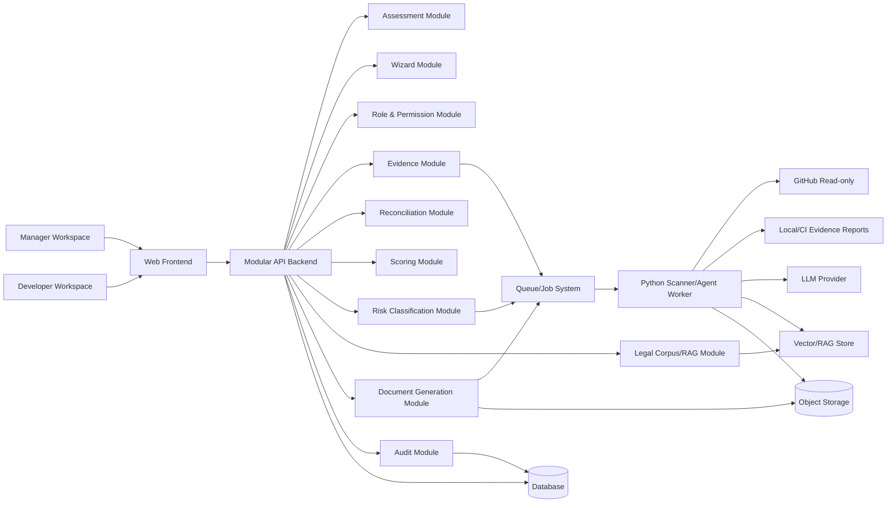
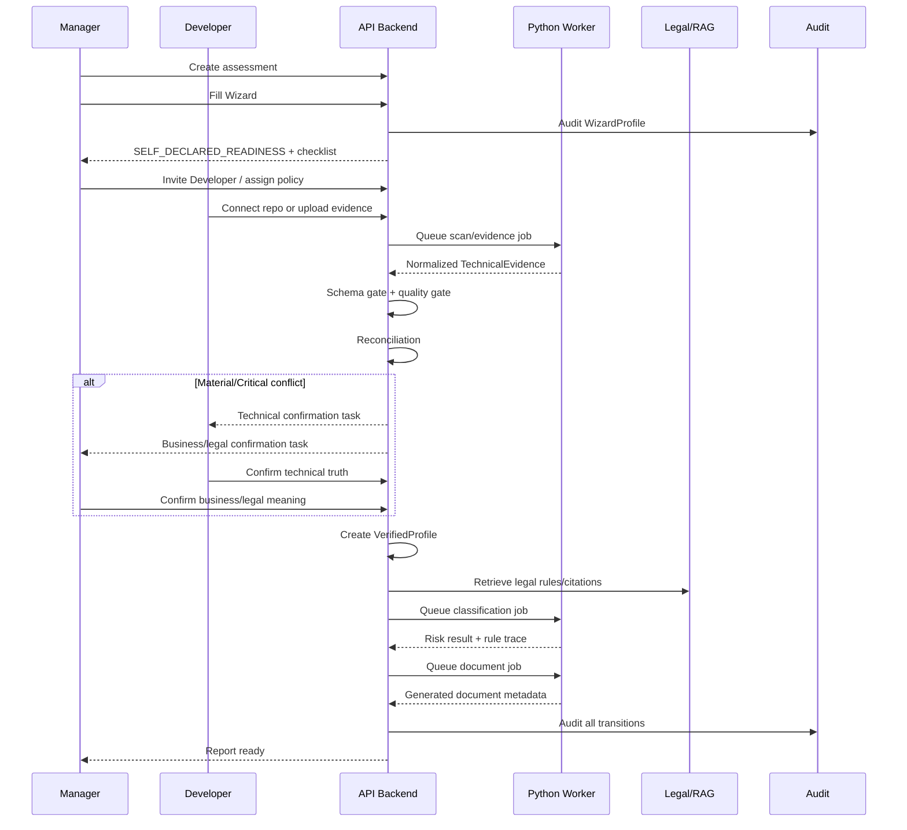
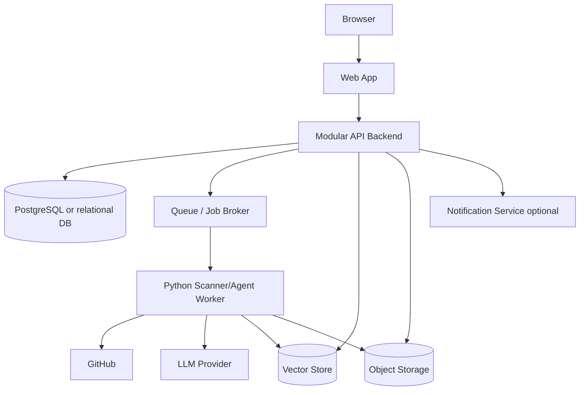

# LCSP Conditional Architecture Document

## 1. Architecture Overview

Tài liệu này mô tả kiến trúc có điều kiện cho LCSP dựa trên Conditional PRD, Validation Plan, Architecture Exploration và Conditional ADR. Đây chưa phải kiến trúc đã khóa tuyệt đối để triển khai backlog.

LCSP được định vị là **evidence-based compliance platform**, không phải chatbot pháp lý hoặc checklist tự khai. Vì vậy kiến trúc phải bảo đảm risk classification chỉ được chạy khi đã có technical evidence hợp lệ, reconciliation đã tạo VerifiedProfile và không còn material/critical conflict chưa resolve.

Hướng kiến trúc MVP được chấp nhận có điều kiện là:

```text
Modular monolith backend + separate Python scanner/agent worker
```

Các thành phần chính:

| Layer | Vai trò |
| --- | --- |
| Web Frontend | Manager Workspace và Developer Workspace |
| Modular API Backend | Assessment, Wizard, RBAC, Evidence, Reconciliation, Scoring, Report, Audit |
| Python Worker | Scanner jobs, evidence normalization, agent orchestration workload |
| Database | Assessment, profile, evidence metadata, conflict, score, audit, document metadata |
| Vector/RAG Store | Legal corpus retrieval và rule/citation lookup |
| Object Storage | Generated documents và non-source artifacts |
| Queue/Job System | Scan, evidence processing, classification, document jobs async |

LCSP chưa chọn full microservices cho MVP vì service boundary còn phụ thuộc vào A1-A3, contract dữ liệu chưa ổn định hoàn toàn và MVP cần demo end-to-end với complexity thấp. Modular monolith vẫn phải thiết kế module boundary đủ rõ để có thể tách sang service-oriented architecture sau này.

Conditional dependencies:

| Dependency | Ảnh hưởng kiến trúc |
| --- | --- |
| A1 - Wizard simplicity vs completeness | WizardProfile schema, Wizard UI, reconciliation input, Manager Workspace |
| A2 - Legal corpus/rule reliability | Legal corpus/RAG, rule/citation contract, classification boundary |
| A3 - Human attestation abuse risk | Attestation schema, permission, evidence gate, audit, conflict resolution |

Trace to ADR:

| ADR | Status | Ảnh hưởng |
| --- | --- | --- |
| ADR-001 | Conditionally Accepted | Modular monolith cho MVP |
| ADR-002 | Conditionally Accepted | Python worker tách khỏi API runtime |
| ADR-003 | Accepted for MVP | Manager-led workflow với Developer tasks |
| ADR-004 | Accepted for MVP | Evidence-first classification gate |
| ADR-005 | Conditionally Accepted | Hybrid evidence collection |
| ADR-006 | Accepted for MVP | No raw source to LLM, no long-term source storage |
| ADR-007 | Accepted for MVP | Conflict Score là score duy nhất block workflow |
| ADR-008 | Needs Validation | Controlled human technical attestation |

## 2. System Context

### Actors

| Actor | Trách nhiệm |
| --- | --- |
| Manager | Tạo assessment, trả lời Wizard, mời Developer, resolve business/legal conflicts, approve VerifiedProfile, generate report |
| Developer | Kết nối repo, chạy scan/upload evidence, review findings, xác nhận technical truth, cung cấp structured technical attestation |

MVP chỉ expose 2 role này. Các trách nhiệm như legal, compliance, product owner nằm trong Manager. Các trách nhiệm như developer, tech lead, DevOps, security engineer nằm trong Developer.

### External Systems

| External System | Mục đích | Boundary |
| --- | --- | --- |
| GitHub | GitHub App read-only scan, repo/branch/commit metadata | Least privilege, read-only |
| Local/CI scanner environment | Enterprise-safe scan bên ngoài LCSP | LCSP nhận normalized evidence report |
| Legal corpus source | Legal texts, rule definitions, citation references | Versioned source; không để LLM tự suy luận luật |
| LLM provider | Hỗ trợ reasoning có kiểm soát trong agent boundary | Không nhận raw source code; chỉ nhận normalized evidence và retrieved rules |
| Document storage | Lưu generated documents và non-source artifacts | Không lưu raw source dài hạn |
| Email/notification service | Invite Developer, task notification | Optional cho MVP, không chứa sensitive source content |

## 3. User Workspaces

### Manager Workspace

Manager Workspace là entry point chính của assessment.

Capabilities:

| Capability | Ghi chú |
| --- | --- |
| Create assessment | Manager owns assessment |
| Fill Wizard | Tạo WizardProfile bằng ngôn ngữ nghiệp vụ |
| Invite Developer | Developer chỉ vào assessment qua invitation/task |
| Assign Developer policy | Giới hạn quyền Developer theo task |
| Track progress | Xem trạng thái evidence, reconciliation, report |
| Resolve business/legal conflicts | Manager xác nhận business/legal truth |
| Approve VerifiedProfile | Final assessment ownership thuộc Manager |
| Generate report | Chỉ sau khi classification/report gate pass |

Wizard-only behavior:

```text
No technical evidence -> no risk level.
Wizard-only -> SELF_DECLARED_READINESS, readiness checklist, preliminary indicators.
```

Manager Workspace không được hiển thị HIGH/MEDIUM/LOW khi chưa có technical evidence hợp lệ.

### Developer Workspace

Developer Workspace chỉ hiển thị technical tasks được Manager giao.

Capabilities:

| Capability | Ghi chú |
| --- | --- |
| Accept task | Developer vào assessment theo policy |
| Connect repo | Nếu có `CONNECT_REPOSITORY` |
| Run scan / upload evidence | Nếu có `RUN_SCAN` hoặc `UPLOAD_EVIDENCE` |
| Review findings | Nếu có `VIEW_TECHNICAL_FINDINGS` |
| Confirm technical truth | False positive/false negative, production scope, repo/commit |
| Provide structured technical attestation | Chỉ cho role-bound technical claims |
| Resolve technical conflicts | Không sửa business/legal answers |

Developer không có quyền approve VerifiedProfile, run final classification, generate final report, export compliance dossier hoặc thay đổi Manager decisions.

## 4. High-Level Architecture



The backend is modular first. Scanner, evidence normalization and agent workloads run outside the web request lifecycle in Python worker jobs.

## 5. Module Decomposition

### Web Frontend

| Aspect | Detail |
| --- | --- |
| Responsibility | Render Manager Workspace và Developer Workspace |
| Inputs | Assessment state, tasks, wizard definitions, evidence status, conflicts |
| Outputs | Wizard answers, task actions, confirmations, attestation submissions |
| Owned data | Không own domain data; frontend state only |
| Dependencies | API Backend |
| Guardrails | Không hiển thị risk level khi classification locked; không expose Developer vượt policy |

### Assessment Module

| Aspect | Detail |
| --- | --- |
| Responsibility | Lifecycle tổng của assessment |
| Inputs | Manager actions, evidence gate results, reconciliation results |
| Outputs | Assessment status, readiness state |
| Owned data | Assessment metadata, owner, current state |
| Dependencies | Wizard, Evidence, Reconciliation, Audit |
| Guardrails | Manager owns assessment; state transitions phải kiểm tra gates |

### Wizard Module

| Aspect | Detail |
| --- | --- |
| Responsibility | Thu thập business/legal truth từ Manager |
| Inputs | Manager answers |
| Outputs | WizardProfile, preliminary indicators, readiness checklist |
| Owned data | Wizard answers, question mappings, WizardProfile |
| Dependencies | Assessment, Audit |
| Guardrails | Không tạo risk level; câu hỏi critical phải map về WizardProfile fields |

Conditional A1:

Wizard schema và question design chưa được khóa tuyệt đối cho đến khi validation A1 pass.

### Role/Permission Module

| Aspect | Detail |
| --- | --- |
| Responsibility | RBAC hai role và policy-based Developer tasks |
| Inputs | Manager invites, assigned policies |
| Outputs | Access decisions, visible tasks, allowed actions |
| Owned data | Role assignments, Developer policies, invitations |
| Dependencies | Assessment, Audit |
| Guardrails | Developer không inherit Manager permissions |

### Evidence Module

| Aspect | Detail |
| --- | --- |
| Responsibility | Nhận, validate và quản lý evidence metadata |
| Inputs | GitHub scan result, Local/CI report, manual technical JSON, attestation |
| Outputs | TechnicalEvidence, TechnicalProfile, evidence status |
| Owned data | Evidence reports metadata, provenance, report hash, privacy flags |
| Dependencies | Queue, Worker, Audit, Reconciliation |
| Guardrails | Reject nếu schema/privacy/provenance fail; không lưu raw source dài hạn |

### Reconciliation Module

| Aspect | Detail |
| --- | --- |
| Responsibility | So sánh WizardProfile và TechnicalProfile |
| Inputs | WizardProfile, TechnicalProfile, confirmations |
| Outputs | Conflicts, reconciliation decisions, VerifiedProfile candidate |
| Owned data | Conflict records, conflict resolution history |
| Dependencies | Scoring, RBAC, Audit |
| Guardrails | Material/critical conflict cần dual confirmation |

### Scoring Module

| Aspect | Detail |
| --- | --- |
| Responsibility | Tính Evidence Confidence, AI Intervention, Conflict Score |
| Inputs | Findings, confidence signals, WizardProfile, TechnicalProfile |
| Outputs | Score records, block recommendation from Conflict Score |
| Owned data | Score snapshots |
| Dependencies | Evidence, Reconciliation, Audit |
| Guardrails | Only Conflict Score can block workflow |

### Risk Classification Module

| Aspect | Detail |
| --- | --- |
| Responsibility | Tạo risk classification dựa trên VerifiedProfile và legal rules |
| Inputs | VerifiedProfile, legal rules/citations |
| Outputs | Risk result, rule trace, classification basis |
| Owned data | Classification output metadata |
| Dependencies | Legal Corpus/RAG, Queue, Worker, Audit |
| Guardrails | Không chạy trước VerifiedProfile; không final nếu thiếu rule/citation quan trọng |

### Legal Corpus/RAG Module

| Aspect | Detail |
| --- | --- |
| Responsibility | Versioned legal corpus retrieval, rule lookup, citation validation |
| Inputs | Legal corpus, rule definitions, classification query |
| Outputs | Retrieved rules, citations, rule trace |
| Owned data | Legal document metadata, rule_id, corpus version |
| Dependencies | Vector Store, Database |
| Guardrails | RAG hỗ trợ retrieval; không tự bịa legal rule |

Conditional A2:

Rule schema, citation format và degraded/blocked behavior phụ thuộc validation A2.

### Document Generation Module

| Aspect | Detail |
| --- | --- |
| Responsibility | Sinh gap analysis và compliance report/document |
| Inputs | VerifiedProfile, risk result, citations, audit metadata |
| Outputs | Generated document, document metadata |
| Owned data | Document version metadata, storage refs |
| Dependencies | Object Storage, Audit, Risk Classification |
| Guardrails | Không final report nếu unresolved material/critical conflict |

### Audit Module

| Aspect | Detail |
| --- | --- |
| Responsibility | Ghi audit trail cho assessment lifecycle |
| Inputs | Wizard actions, evidence events, conflicts, attestations, classification, document generation |
| Outputs | Audit records, exportable audit trail |
| Owned data | Append-oriented audit log |
| Dependencies | Database, Object Storage |
| Guardrails | Audit không lưu raw source; phải trace who/what/when/why |

### Python Scanner/Agent Worker

| Aspect | Detail |
| --- | --- |
| Responsibility | Scanner jobs, evidence normalization, agent orchestration workload |
| Inputs | Scan job, repo access token, uploaded report, VerifiedProfile, legal retrieval inputs |
| Outputs | Normalized evidence report, technical profile, classification/gap/doc job outputs |
| Owned data | Temporary job workspace only |
| Dependencies | Queue, GitHub, Vector Store, LLM Provider, Object Storage |
| Guardrails | No raw source to LLM; temporary workspace cleanup; no long-term raw source storage |

## 6. End-to-End Flow



Gate behavior:

```text
WizardProfile submitted
+ TechnicalEvidence received
+ Schema completeness gate passed
+ Quality threshold gate passed
+ VerifiedProfile created
+ No unresolved material/critical conflict
= Risk Classification unlock
```

If technical evidence is missing, classification is locked. Wizard-only state must not show HIGH/MEDIUM/LOW and must not be called classification.

## 7. Evidence Collection Architecture

### Mode 1: GitHub App Read-only Scan

| Aspect | Detail |
| --- | --- |
| Input | Repo, branch, commit, Manager/Developer authorization |
| Output | Normalized technical evidence report |
| Security boundary | GitHub App least privilege, read-only access, temporary scan workspace |
| Trust level | Strong for repo-derived technical signals, subject to scan coverage |
| MVP priority | P0 default evidence path |
| Failure modes | Wrong repo/branch, insufficient GitHub permission, scan timeout, false positive/false negative, user rejects repo access |

This path optimizes UX/demo/SME onboarding.

### Mode 2: Local/CI Scanner Report Upload

| Aspect | Detail |
| --- | --- |
| Input | Scanner-generated report from enterprise environment |
| Output | Same normalized evidence contract as GitHub scan |
| Security boundary | Source stays in customer environment; LCSP receives evidence report only |
| Trust level | High if provenance, scanner version and integrity pass |
| MVP priority | P1 enterprise-safe alternative |
| Failure modes | Missing provenance, stale report, incompatible report version, incomplete scope |

This path supports source privacy and enterprise adoption.

### Mode 3: Manual Technical Evidence JSON Upload

| Aspect | Detail |
| --- | --- |
| Input | Structured technical evidence JSON |
| Output | Accepted/Rejected/Insufficient evidence status |
| Security boundary | No source upload required; strict schema and provenance required |
| Trust level | Lower than machine scanner unless supported by valid provenance/attestation |
| MVP priority | P1/P2 fallback |
| Failure modes | Weak evidence quality, missing machine-generated metadata, unsupported claims, insufficient auditability |

Manual evidence is not a bypass. It must pass schema and quality gates or be supplemented by valid attestation where allowed.

## 8. Scanner and Source Code Boundary

Source code handling is a hard security boundary.

Rules:

| Rule | Requirement |
| --- | --- |
| No raw source to LLM | LLM receives only normalized evidence, summaries, findings metadata and retrieved legal rules |
| No long-term raw source storage | Temporary scan workspace must be deleted after job completion/failure handling |
| Normalized evidence only | Scanner outputs technical profile, findings, confidence, provenance and report hash |
| Short snippets only if needed | Findings must not contain long raw source snippets |
| Audit metadata only | Audit stores repo/branch/commit, scanner version, report hash, not raw code |
| Secrets redaction | Scanner must detect/redact secrets from evidence output |

Scanner responsibilities:

| Responsibility | Notes |
| --- | --- |
| Dependency inventory | AI/ML/LLM packages, SBOM-like signals |
| Static detection | Model/API calls, decision flow signals, data type signals |
| Scope reporting | Files scanned/skipped, languages, tools |
| Evidence confidence | Signal-level confidence; no legal conclusion |
| Privacy flags | raw_code_uploaded, raw_code_stored, sent_raw_code_to_llm, secrets_redacted |

## 9. Evidence Report Contract

Evidence report contract is shared by GitHub App, Local/CI and manual evidence modes.

Field groups:

| Field group | Purpose |
| --- | --- |
| `assessment_id` | Map evidence to submitted Wizard assessment |
| `source_type` | GitHub App, Local/CI, manual JSON, API probe, human technical attestation |
| `system_identifier` | Identify system/repo/API under assessment |
| `provenance` | Triggered by, provider, repo, branch, commit, environment |
| `report_version` | Evidence contract compatibility |
| `scanner_version` | Reproducibility and audit |
| `ruleset_version` | Evidence detection rules used |
| `timestamp` | Evidence freshness |
| `scope` | Scan coverage, files/languages/tools |
| `privacy_flags` | Confirm no raw source/full AST/secrets handling violation |
| `technical_profile` | AI usage, data type, decision flow, human oversight signals |
| `findings` | Evidence items with source tool, type, strength, confidence |
| `confidence_per_signal` | Confidence by signal/domain |
| `report_hash` | Integrity check for report |

Technical profile minimum dimensions:

| Dimension | Allowed status |
| --- | --- |
| `ai_usage_signals` | DETECTED, NOT_DETECTED, UNKNOWN |
| `data_type_signals` | DETECTED, NOT_DETECTED, UNKNOWN |
| `decision_flow_signals` | DETECTED, NOT_DETECTED, UNKNOWN |
| `human_oversight_signals` | DETECTED, NOT_DETECTED, UNKNOWN |

The architecture intentionally does not finalize a full JSON schema here. That belongs to final architecture/detail design after A1-A3 validation.

## 10. Evidence Gates

### Schema Completeness Gate

Purpose: decide whether LCSP can accept the report.

Reject when:

| Failure | Result |
| --- | --- |
| Missing assessment mapping | `TECHNICAL_EVIDENCE_REJECTED` |
| Missing provenance/version/timestamp | `TECHNICAL_EVIDENCE_REJECTED` |
| Missing privacy flags | `TECHNICAL_EVIDENCE_REJECTED` |
| Missing technical_profile or findings array | `TECHNICAL_EVIDENCE_REJECTED` |
| Report integrity/hash invalid | `TECHNICAL_EVIDENCE_REJECTED` |

### Quality Threshold Gate

Purpose: decide whether evidence can unlock reconciliation/classification path.

Outcomes:

| Outcome | Meaning |
| --- | --- |
| `TECHNICAL_EVIDENCE_MISSING` | No technical evidence present |
| `TECHNICAL_EVIDENCE_REJECTED` | Schema/privacy/provenance/integrity failed |
| `TECHNICAL_EVIDENCE_INSUFFICIENT` | Schema accepted but quality too low for context |
| `TECHNICAL_EVIDENCE_READY` | Schema and quality threshold passed |

Quality threshold is context-aware. A low-impact internal FAQ chatbot should not require the same evidence strength as credit scoring, healthcare diagnosis or biometric processing.

Low-quality scanner evidence alone cannot unlock classification. It can be supplemented by another evidence source or valid structured human technical attestation where allowed by A3 rules.

## 11. Reconciliation Architecture

Reconciliation compares:

```text
WizardProfile + TechnicalProfile + EvidenceGateResult + Confirmations
```

Outputs:

| Output | Purpose |
| --- | --- |
| Conflict records | Capture mismatch between self-declared and technical evidence |
| Conflict Score | Severity and workflow blocking signal |
| Resolution tasks | Routed to Manager, Developer or both |
| VerifiedProfile candidate | Created only after required conflicts are resolved |

Routing rules:

| Conflict type | Primary resolver |
| --- | --- |
| Dependency/package/use in production | Developer |
| Scanner false positive/false negative | Developer |
| Wrong repo/branch/commit | Developer |
| Business purpose/user impact | Manager |
| Legal/business meaning of workflow | Manager |
| Auto decision / AI-assisted decision / human oversight / critical risk fields | Manager + Developer |

Material/Critical conflict requires dual confirmation from Manager and Developer. LCSP coordinates and audits; LCSP is not the final human authority.

## 12. Scoring Architecture

LCSP uses three separate scores.

| Score | Measures | Blocks workflow? | Used by |
| --- | --- | --- | --- |
| Evidence Confidence Score | How reliable technical evidence is | No | Evidence review, Developer confirmation |
| AI Intervention Score | How deeply AI affects workflow/decision | No | Risk classification input |
| Conflict Score | Severity of mismatch between WizardProfile and TechnicalProfile | Yes | Reconciliation/workflow gate |

Hard rule:

```text
Only Conflict Score can block workflow.
```

Evidence Confidence and AI Intervention are supporting signals. They may trigger warnings, review tasks or classification inputs, but they must not independently block workflow.

Conflict blocking:

| Conflict Score | Behavior |
| --- | --- |
| `< 0.40` | No block |
| `0.40 - 0.59` | Warning |
| `0.60 - 0.74` | Review required, final may be constrained by policy |
| `0.75 - 0.84` | Material conflict; block final classification/report until resolved |
| `>= 0.85` | Critical conflict; block workflow and require dual confirmation |

Final blocking condition:

```text
Conflict Score >= 0.75
AND conflict affects risk classification or legal obligations
```

## 13. VerifiedProfile Lifecycle

VerifiedProfile is the canonical input for Risk Classification.

Lifecycle:

```text
WizardProfile
+ TechnicalProfile
+ Evidence gate results
+ Reconciliation results
+ Required Manager/Developer confirmations
+ Valid attestation where applicable
-> VerifiedProfile
```

VerifiedProfile can be created only when:

| Condition | Required |
| --- | --- |
| WizardProfile submitted | Yes |
| Technical evidence received | Yes |
| Schema completeness gate passed | Yes |
| Quality threshold gate passed or valid supplemental evidence accepted | Yes |
| Material/critical conflicts resolved | Yes |
| Required confirmations present | Yes |

VerifiedProfile must include traceability back to Wizard answers, evidence refs, conflict resolutions and attestations.

## 14. Risk Classification Agent Boundary

Risk Classification Agent is downstream of VerifiedProfile.

Detailed multi-agent orchestration, agent inventory, LangGraph state, legal RAG sequence and citation guardrails are specified in `docs/architecture/multi-agent-system-architecture.md`.

Allowed inputs:

| Input | Allowed |
| --- | --- |
| VerifiedProfile | Yes |
| Normalized evidence summaries | Yes |
| Evidence refs/report metadata | Yes |
| Retrieved legal rules/citations | Yes |
| Raw source code | No |
| Long source snippets/full AST | No |

Rules:

| Rule | Requirement |
| --- | --- |
| No pre-gate execution | Agent cannot run before VerifiedProfile |
| Legal citation required | Classification output must cite legal corpus/rules |
| Rule trace required | Each risk output must trace to rule_id |
| No unsupported legal conclusion | LLM cannot create legal conclusion without retrieved rule/citation |
| Degraded/blocked output | If rule/citation missing for important field, output must be degraded or blocked |

The agent may assist reasoning, but hard rules and validated legal corpus have priority over LLM free-form inference.

## 15. Legal Corpus / RAG Architecture

Legal Corpus/RAG supports classification with versioned and traceable legal basis.

Detailed Legal Retrieval / RAG Agent responsibilities, shared state fields, retrieval sequence and blocked/degraded behavior are specified in `docs/architecture/multi-agent-system-architecture.md`.

Core responsibilities:

| Responsibility | Detail |
| --- | --- |
| Corpus versioning | Each legal corpus snapshot has version metadata |
| Rule identity | Critical classification logic maps to rule_id |
| Citation trace | rule_id traces to legal document/version/section/clause |
| Retrieval | Agent retrieves relevant rules and references |
| Validation | Output citations must be checked before final classification |

Boundary:

```text
RAG retrieves and grounds.
RAG does not invent legal rules.
LLM cannot finalize legal conclusions without retrieved rule/citation.
```

Conditional A2:

Final rule schema, citation format, effective-date handling and degraded/blocked policy must be validated before implementation backlog.

## 16. Human Attestation Architecture

Human attestation is a controlled evidence supplement. It is not a bypass.

Attestation record must include:

| Field group | Purpose |
| --- | --- |
| assessment_id | Map to assessment |
| attested_by | User, role, organization |
| role | Manager or Developer |
| claim | Structured claim field/value |
| reason | Why attestation is needed |
| scope | System/repo/branch/commit/environment where relevant |
| supporting_evidence_refs | Link to findings/reports/docs |
| timestamp | Auditability |

Role-bound claims:

| Role | Can attest/confirm |
| --- | --- |
| Manager | Business purpose, user impact, human review process, legal/business meaning, final assessment confirmation |
| Developer | Repo/branch/commit, production scope, scanner false positive/negative, AI usage in code, technical profile correction |

Dual-confirmation claims:

```text
auto_decision
ai_assisted_decision
human_oversight
sensitive_data_usage
user-facing external LLM
biometric/high-impact use case
any conflict that can change risk level
```

Forbidden metadata replacement:

| Metadata | Attestation cannot replace |
| --- | --- |
| report hash | Yes |
| scanner version | Yes |
| ruleset version | Yes |
| scan timestamp | Yes |
| repo/commit metadata | Yes |
| legal corpus version | Yes |
| evidence report integrity | Yes |
| machine-generated privacy flags | Yes |

ADR-008 remains **Needs Validation**. Final enforcement rules depend on A3 validation.

## 17. Document Generation Architecture

Document generation is downstream of risk classification and gap analysis.

Detailed Gap Analysis Agent and Document Generation Agent flow, input/output contracts, guardrails and document-generation sequence are specified in `docs/architecture/multi-agent-system-architecture.md`.

Inputs:

| Input | Required |
| --- | --- |
| VerifiedProfile | Yes |
| Risk classification result | Yes |
| Gap analysis | Yes |
| Legal citations/rule trace | Yes |
| Evidence source metadata | Yes |
| Audit metadata | Yes |
| Attestation usage summary if any | Required when used |

Outputs:

| Output | Purpose |
| --- | --- |
| Compliance report/document | User-facing report |
| Document metadata | Version, generated_at, source assessment |
| Object storage reference | File location |
| Audit event | Trace generation |

Final report cannot be generated when unresolved material/critical conflict remains.

Report must explicitly state:

| Condition | Report requirement |
| --- | --- |
| GitHub App evidence used | Include evidence source/provenance |
| Local/CI report used | Include report provenance and hash |
| Human attestation used | Disclose attestation in classification basis/audit |
| Citation missing for important rule | Do not final; degraded/blocked per policy |

## 18. Audit Trail Architecture

Audit trail must be append-oriented and trace major lifecycle decisions.

Detailed Audit Logger Node requirements for agent runs, input refs, output hash, model/version, status/error and metadata-only storage are specified in `docs/architecture/multi-agent-system-architecture.md`.

Audit events:

| Event | Minimum trace |
| --- | --- |
| Wizard answers | who, when, field, value/version |
| Evidence report metadata | source_type, provenance, hash, scanner/ruleset version |
| Evidence gate result | schema result, quality result, status |
| Conflict creation | conflict type, fields, score, evidence refs |
| Conflict resolution | who confirmed what, role, timestamp |
| Human attestation | role, claim, reason, scope, supporting refs |
| VerifiedProfile creation | input refs, generated version |
| Risk classification output | risk result, rule_id, citation refs, corpus version |
| Generated document | version, source inputs, storage ref |

Audit must not store raw source code. Audit should store evidence refs and integrity metadata instead.

## 19. State Model

Core assessment states:

| State | Meaning |
| --- | --- |
| `WIZARD_IN_PROGRESS` | Manager đang điền Wizard |
| `SELF_DECLARED_READINESS` | Wizard submitted, chỉ có readiness/preliminary indicators |
| `TECHNICAL_EVIDENCE_REQUIRED` | Cần technical evidence trước classification |
| `DEVELOPER_INVITED` | Manager đã mời Developer |
| `EVIDENCE_COLLECTION_IN_PROGRESS` | Developer đang scan/upload evidence |
| `TECHNICAL_EVIDENCE_MISSING` | Chưa có evidence |
| `TECHNICAL_EVIDENCE_REJECTED` | Evidence fail schema/privacy/provenance/integrity |
| `TECHNICAL_EVIDENCE_INSUFFICIENT` | Evidence accepted nhưng chưa đủ quality |
| `TECHNICAL_EVIDENCE_READY` | Evidence pass schema và quality |
| `RECONCILIATION_REQUIRED` | Có mismatch cần xử lý |
| `DEVELOPER_CONFIRMATION_REQUIRED` | Cần Developer xác nhận technical truth |
| `MANAGER_CONFIRMATION_REQUIRED` | Cần Manager xác nhận business/legal meaning |
| `BLOCKED_BY_CONFLICT` | Material/critical conflict chưa resolve |
| `VERIFIED_PROFILE_READY` | VerifiedProfile đã sẵn sàng |
| `READY_FOR_CLASSIFICATION` | Đủ điều kiện chạy Risk Classification |
| `CLASSIFICATION_COMPLETED` | Classification completed with rule trace |
| `GAP_ANALYZED` | Gap analysis completed |
| `REPORT_READY` | Report có thể generate/export |

State guardrails:

| Transition | Guard |
| --- | --- |
| Wizard -> classification | Not allowed |
| Evidence missing -> classification | Not allowed |
| Conflict unresolved -> final report | Not allowed |
| VerifiedProfile missing -> classification | Not allowed |
| Attestation-only metadata replacement -> evidence ready | Not allowed |

## 20. Privacy & Security Architecture

Security principles:

| Principle | Architecture implication |
| --- | --- |
| Least privilege | GitHub App read-only and scoped to selected repo |
| No raw source to LLM | Worker normalizes evidence before agent/LLM usage |
| No long-term raw source storage | Temporary workspace cleanup after scanner job |
| Role-based access | Manager/Developer separation and Developer task policies |
| Evidence integrity | report_hash and provenance required |
| Secret redaction | Scanner must redact secrets before evidence output |
| Object storage boundary | Store generated docs/non-source artifacts; do not store raw source |
| Auditability | Major decisions and gates recorded |

Developer task policies:

```text
CONNECT_REPOSITORY
RUN_SCAN
UPLOAD_EVIDENCE
VIEW_TECHNICAL_FINDINGS
CONFIRM_FINDINGS
ATTEST_TECHNICAL_CLAIMS
RESOLVE_TECHNICAL_CONFLICTS
VIEW_LIMITED_ASSESSMENT_CONTEXT
```

Developer forbidden capabilities:

```text
EDIT_WIZARD_BUSINESS_ANSWERS
APPROVE_VERIFIED_PROFILE
RUN_FINAL_CLASSIFICATION
GENERATE_FINAL_REPORT
EXPORT_COMPLIANCE_DOSSIER
CHANGE_MANAGER_DECISIONS
INVITE_OTHER_USERS
MANAGE_ASSESSMENT_SETTINGS
```

## 21. Deployment View

This is a conceptual deployment view, not a final infrastructure topology.



Baseline from the technical specification may include Next.js, NestJS, Python/LangGraph worker, PostgreSQL, queue, vector store, object storage and LLM provider. This document does not lock vendor choices, deployment topology, scaling model or final queue technology.

Migration path:

| Future extraction candidate | Why |
| --- | --- |
| Scanner service | Security/scaling boundary |
| Agent orchestration service | Workload isolation |
| RAG/legal corpus service | Legal rule lifecycle and indexing |
| Document generation service | Async CPU/document tooling isolation |
| Audit service | Compliance immutability and enterprise controls |

## 22. Architecture Risks

| Risk | Impact | Mitigation direction |
| --- | --- | --- |
| A1 Wizard simplicity vs completeness | Wrong/incomplete WizardProfile can distort downstream reconciliation/classification | Validate Wizard questions, field mapping, user testing |
| A2 Legal corpus/rule reliability | Classification may lack legal basis | Versioned rules, citations, rule trace, block/degrade when citation missing |
| A3 Human attestation abuse | Attestation may become scanner bypass | Role-bound schema, dual confirmation, forbidden metadata replacement, audit |
| GitHub App trust risk | Enterprises may reject source access | Local/CI scanner and manual evidence upload path |
| Scanner false positives/negatives | Wrong conflicts or missed evidence | Developer confirmation, rescan, expanded scope, multiple tools |
| Evidence quality threshold tuning | Too strict blocks users; too loose overclaims | Context-aware thresholds and validation dataset |
| Source privacy risk | Leakage or over-retention of code | No raw source to LLM, temporary workspace cleanup, metadata-only audit |
| Document/report overclaim risk | Users may treat preliminary state as final | No risk level without evidence; report gate enforced |
| Premature service split | Slower MVP and unstable contracts | Modular monolith first, extraction candidates documented |

## 23. Open Architecture Questions

These questions must be resolved before final architecture or implementation backlog.

| Area | Open question |
| --- | --- |
| WizardProfile | Final field set and question-to-field mapping after A1 validation |
| Wizard configuration | Static code vs data-driven question definitions |
| Database | Final schema and audit immutability model |
| Queue | Final queue technology and retry semantics |
| Legal rules | Final rule_id/citation format and effective-date handling |
| RAG | Corpus chunking, citation validation and retrieval evaluation |
| Classification | Exact degraded vs blocked policy when legal citation missing |
| Scanner packaging | GitHub App runner vs CLI/CI packaging details |
| Local/CI provenance | How to verify uploaded report source and freshness |
| Attestation | Final allowed/forbidden claims and enforcement model after A3 |
| Document generation | Final template engine, versioning, and export formats |
| Enterprise mode | On-prem/private deployment requirements |
| Retention | Exact temporary workspace TTL and evidence retention policy |
| Service extraction | Which module should be extracted first post-MVP |

## 24. Readiness for Backlog

This architecture document can be used for Architecture Review and for discussing module boundaries, data flow, security boundaries, evidence flow and agent boundaries.

It must **not** be used to create implementation backlog until A1-A3 have validation results:

| Assumption | Required before backlog |
| --- | --- |
| A1 | Wizard question validation result, critical field coverage, Manager usability threshold |
| A2 | Legal rule/citation contract, rule trace acceptance, degraded/blocked policy |
| A3 | Attestation schema, role-bound claim rules, dual-confirmation enforcement, metadata replacement prohibition |

If any of A1-A3 fails validation, PRD must be updated and ADR/architecture must be revisited before backlog creation.

Architecture can continue at review/exploration level. Final implementation design, service boundaries, database schema, deployment topology and backlog sequencing remain conditional until validation caveats are resolved.
