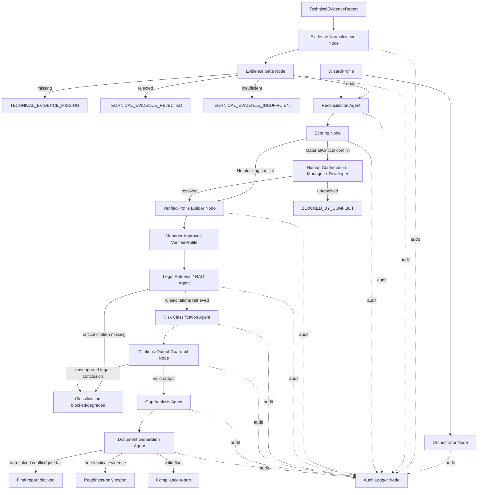
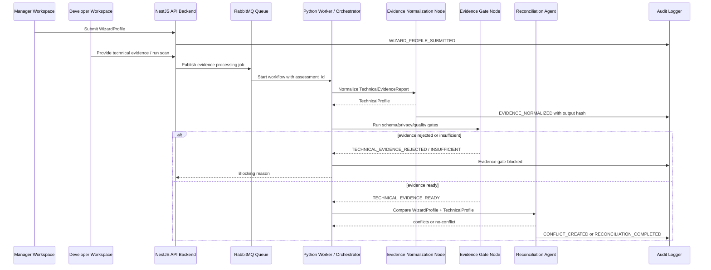
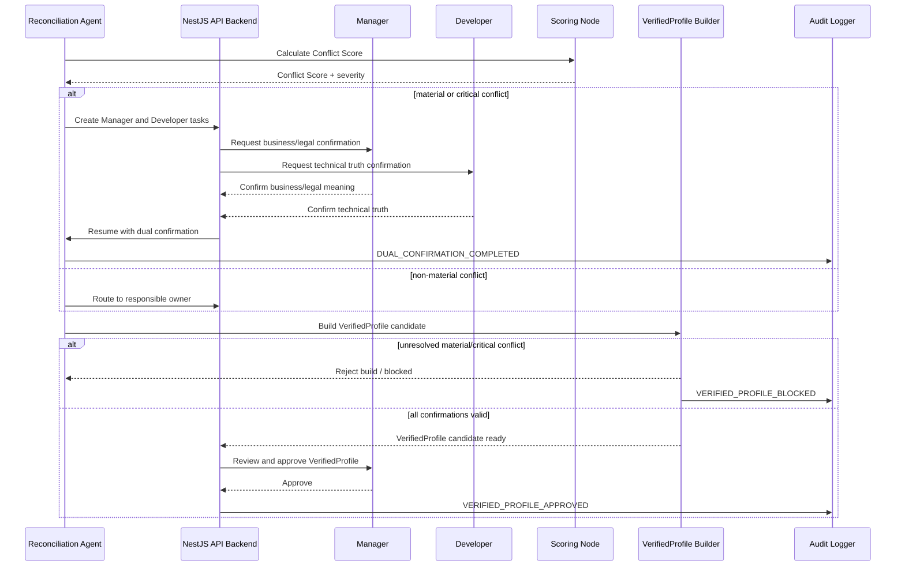
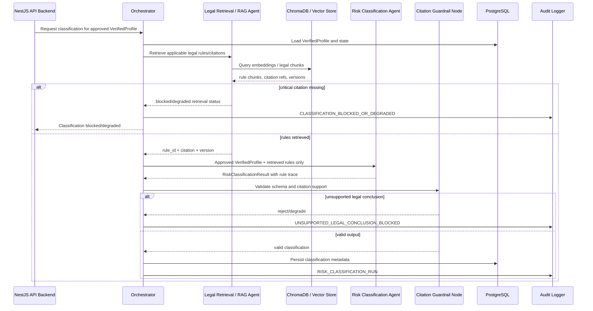
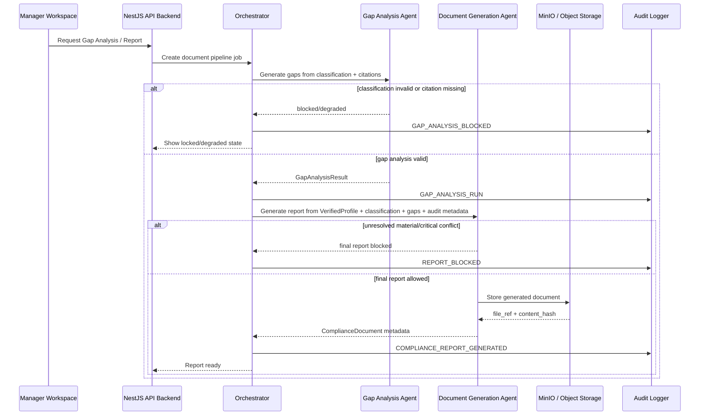

# LCSP Multi-Agent System Architecture

## Purpose

Tài liệu này mô tả kiến trúc multi-agent của LCSP ở mức design trước implementation. Mục tiêu là làm rõ LCSP dùng agent để làm gì, agent nằm ở đâu trong kiến trúc tổng thể, luồng dữ liệu giữa scanner/evidence/RAG/agent/audit ra sao, và guardrail nào ngăn agent tạo kết luận pháp lý không có căn cứ hoặc xử lý raw source code sai boundary.

Tài liệu này không tạo backlog, không viết code, không khóa implementation chi tiết. Các phần phụ thuộc A1-A3 vẫn conditional.

## Scope

In scope:

- Multi-agent workflow sau khi assessment có WizardProfile và technical evidence.
- Python LangGraph worker chạy scanner, evidence normalization và agent jobs.
- Agent inventory, input/output, shared state, guardrails, human-in-the-loop, audit.
- Legal RAG và citation boundary.
- Integration với architecture hiện tại: Next.js/Manager Workspace/Developer Workspace, NestJS API, RabbitMQ, PostgreSQL, ChromaDB, MinIO, Gemini.

Out of scope:

- Không tạo code package `lcsp_agents`.
- Không chọn physical deployment cuối cùng.
- Không tạo prompt cuối cùng hoặc Pydantic schema chi tiết.
- Không tạo backlog/story.
- Không mở rộng MVP role ngoài Manager và Developer.

## Why LCSP Needs Multi-Agent Architecture

LCSP không dùng multi-agent như chatbot tự do. LCSP cần multi-agent vì workflow compliance có nhiều bước chuyên biệt, mỗi bước cần contract hẹp và audit rõ:

- Scanner/evidence tạo technical truth, không kết luận pháp lý.
- Reconciliation đối chiếu WizardProfile và TechnicalProfile để phát hiện conflict.
- Legal retrieval lấy rule/citation versioned từ corpus.
- Risk classification cần rule/citation trace và không được chạy trên Wizard-only.
- Gap analysis và document generation cần dùng output đã validate, không tự tạo legal basis.
- Human-in-the-loop xuất hiện khi material/critical conflict cần Manager và Developer xác nhận.

Multi-agent giúp tách nhiệm vụ, nhưng LCSP chỉ dùng agent dưới **orchestrator-controlled workflow**. Agent không tự gọi nhau tự do và không được nhảy qua state gate.

## Multi-Agent Architecture Overview

LCSP dùng mô hình:

```text
Orchestrator-controlled multi-agent workflow
```

Trong MVP conditional architecture, agent system nằm trong **Python Scanner/Agent Worker**. NestJS API backend nhận request từ UI, enforce RBAC/policy, tạo job qua RabbitMQ, đọc/ghi state trong PostgreSQL và expose progress cho Manager Workspace / Developer Workspace. Python worker chạy scanner, evidence normalization, LangGraph state graph và các agent jobs.

Core invariant:

```text
WizardProfile + TechnicalEvidenceReport
-> Evidence gates
-> Reconciliation
-> approved VerifiedProfile
-> Legal RAG
-> Risk Classification
-> Citation Guardrail
-> Gap Analysis
-> Document Generation
-> Audit
```

Không có technical evidence thì không có risk level. Wizard-only chỉ tạo `SELF_DECLARED_READINESS`, readiness checklist và preliminary indicators.

## Technology Stack for Agent System

| Component | Vai trò | Status |
|---|---|---|
| Python Worker | Chạy scanner, evidence normalization, LangGraph workflow và agent jobs | Selected by technical spec / ADR-002 |
| LangGraph | Điều phối multi-agent workflow dạng state graph/DAG có gate và resume | Selected by technical spec |
| LLM Provider | Gemini 2.5 Flash cho reasoning có kiểm soát, giải thích và drafting | Selected by technical spec; model/version vẫn có thể cấu hình |
| NestJS API Backend | Nhận request UI, enforce permission, tạo job, expose trạng thái, ghi domain state | Selected by technical spec |
| RabbitMQ | Queue scan/agent/document jobs, retry, back-pressure, resume | Selected by technical spec |
| PostgreSQL | Lưu assessment state, profiles, evidence metadata, conflicts, scores, audit refs, classification metadata | Selected by technical spec |
| ChromaDB / Vector Store | Lưu legal corpus embeddings và phục vụ retrieval | Selected by technical spec |
| Embedding Model | BAAI/bge-m3 cho legal corpus embeddings | Selected by technical spec |
| MinIO / Object Storage | Lưu generated documents và non-source artifacts | Selected by technical spec |
| Manager Workspace | Hiển thị Wizard, business/legal conflict, VerifiedProfile approval, classification/gap/report | Existing architecture |
| Developer Workspace | Hiển thị technical tasks, repo scan, evidence findings, attestation, technical conflict | Existing architecture |

Architecture Decision Needed:

- Final retry/idempotency contract cho RabbitMQ jobs.
- Final schema validation library/package cho agent input/output.
- Final citation evaluation threshold và legal retrieval top-k/rerank settings sau A2 validation.

## Agent Pattern Selection

| Pattern | Pros | Cons | Fit for LCSP |
|---|---|---|---|
| Sequential pipeline | Dễ hiểu, dễ demo, ít state | Khó xử lý conflict/human loop, khó resume khi Manager/Developer cần xác nhận | Không đủ |
| Free-form autonomous agents | Linh hoạt, có thể xử lý tình huống mở | Rủi ro hallucination, khó audit, khó enforce legal citation và state gates | Không phù hợp compliance |
| Orchestrated LangGraph DAG | Có kiểm soát, audit được, hỗ trợ gate/human loop/resume, agent contract hẹp | Cần thiết kế state/schema rõ và failure handling chặt | Recommended |

Decision:

```text
LCSP dùng Orchestrator-controlled LangGraph DAG.
LCSP không dùng free-form autonomous agents.
```

Patterns áp dụng:

- **Orchestrator / Supervisor Pattern:** Orchestrator gọi node/agent theo graph, agent không tự gọi nhau tự do.
- **State Machine / DAG Pattern:** Workflow chạy theo state graph: Evidence -> Reconciliation -> VerifiedProfile -> Classification -> Gap Analysis -> Document.
- **Human-in-the-loop Pattern:** Material/Critical conflict cần Manager + Developer xác nhận.
- **RAG-grounded Reasoning Pattern:** Classification và Gap Analysis chỉ dùng legal rules/citations retrieved từ legal corpus.
- **Rule-first, LLM-second Pattern:** Rules/gates/schema chạy trước; rule thắng LLM.
- **Typed State / Schema Validation Pattern:** Agent input/output có schema; invalid output bị reject/retry có kiểm soát.
- **Audit-every-node Pattern:** Mỗi node ghi audit event hoặc audit ref.

## Agent Inventory

| Agent / Node | Type | Purpose | Input | Output | Can block workflow? | Uses LLM? | Uses RAG? | Human review needed? | Audit required? |
|---|---|---|---|---|---|---|---|---|---|
| Orchestrator Node | Supervisor / LangGraph coordinator | Điều phối workflow, kiểm tra state trước khi gọi node | Shared Agent State, assessment state, job payload | Next node decision, job status, blocking_reason | Yes, by enforcing gates | No | No | No | Yes |
| Evidence Normalization Node | Worker node | Chuẩn hóa scanner/upload report thành TechnicalProfile | TechnicalEvidenceReport ref, findings, provenance | TechnicalProfile, normalized findings | No, nhưng output failure dẫn tới evidence gate fail | No by default | No | No | Yes |
| Evidence Gate Node | Rule/gate node | Chạy Schema Completeness Gate và Quality Threshold Gate | Evidence report, TechnicalProfile, Wizard context | EvidenceGateResult, evidence status | Yes, blocks classification if missing/rejected/insufficient | No | No | No | Yes |
| Reconciliation Agent | Specialist agent / rule-assisted node | So sánh WizardProfile và TechnicalProfile, tạo conflict, route role | WizardProfile, TechnicalProfile, EvidenceGateResult | Conflicts, routed tasks, candidate resolution needs | Yes, via Conflict Score/material conflict | Optional for explanation only | No | Yes for conflicts | Yes |
| Scoring Node | Rule/scoring node | Tính Evidence Confidence, AI Intervention, Conflict Score | Evidence signals, Wizard fields, technical findings, conflicts | Score records | Only Conflict Score can block | No by default | No | No | Yes |
| VerifiedProfile Builder Node | Builder node | Tạo VerifiedProfile sau gates/resolutions/confirmations | WizardProfile, TechnicalProfile, ConflictResolution, HumanAttestation refs | VerifiedProfile candidate / ready state | Yes, refuses build if unresolved material/critical conflict | No | No | Manager approval after build | Yes |
| Legal Retrieval / RAG Agent | Retrieval node | Retrieve legal rules/citations từ legal corpus | Approved VerifiedProfile, classification query context | Retrieved rule chunks, rule_id, citation, version, retrieval status | Yes if critical citation missing | No for conclusion; retrieval/rerank may use model if approved | Yes | No | Yes |
| Risk Classification Agent | Specialist agent | Classify risk using approved VerifiedProfile and retrieved rules | Approved VerifiedProfile, retrieved LegalRules/Citations, hard rules | RiskClassificationResult, rule/citation trace, degraded/blocked status | Yes if citation/rule missing or schema invalid | Yes, low-temperature controlled reasoning | Uses retrieved RAG output | Human review only for blocked/degraded policy decisions if configured | Yes |
| Gap Analysis Agent | Specialist agent | Tạo gaps, obligations, priority và recommended actions | RiskClassificationResult, VerifiedProfile, legal obligations/citations | GapAnalysisResult | Can block final report if output invalid/citation missing | Yes for explanation/drafting | Uses legal rules/citations | No by default | Yes |
| Document Generation Agent | Drafting/render node | Sinh compliance report hoặc readiness-only export | VerifiedProfile, classification, gap analysis, citations, audit metadata | ComplianceDocument metadata, generated file ref | Yes, final report blocked if gates fail | Optional for drafting text; template/rules first | Uses citation refs, not broad retrieval | Manager triggers/generates | Yes |
| Citation / Output Guardrail Node | Validation node | Validate schema, rule_id/citation trace, unsupported legal conclusion | Agent output, retrieved rules, schema, rule refs | Validated output or block/degrade error | Yes | No | No | No | Yes |
| Audit Logger Node | Cross-cutting node | Ghi audit event cho mỗi node/job | node_run metadata, input refs, output hash, status/error | AuditEvent ref | No, but audit failure may fail-safe depending event criticality | No | No | No | Yes |

## Shared Agent State

LangGraph/Orchestrator truyền một shared state object theo field group. Đây là conceptual state, không phải code schema.

| Field group | Owner | Lifecycle |
|---|---|---|
| `assessment_id` | Assessment Module | Set khi job được tạo; immutable within workflow run |
| `organization_id` | Assessment/RBAC | Used for tenancy and permission checks |
| `wizard_profile` | Wizard Module | Loaded after WizardProfile submitted; A1 may change fields |
| `technical_evidence_report_ref` | Evidence Module | Set after GitHub scan, Local/CI upload or manual JSON received |
| `technical_profile` | Evidence Normalization Node | Created from accepted/normalized evidence |
| `evidence_gate_result` | Evidence Gate Node | Updated after schema/privacy/quality gates |
| `conflicts` | Reconciliation Agent | Created from WizardProfile vs TechnicalProfile mismatches |
| `conflict_resolutions` | Manager/Developer via Reconciliation | Added after human confirmations |
| `human_attestations` | Attestation Module | Optional controlled supplement; A3 dependent |
| `verified_profile` | VerifiedProfile Builder | Created only after gates/resolutions; approved by Manager before classification |
| `retrieved_legal_rules` | Legal Retrieval / RAG Agent | Retrieved from legal corpus with rule_id/citation/version |
| `risk_classification_result` | Risk Classification Agent | Created after approved VerifiedProfile + legal rules |
| `gap_analysis_result` | Gap Analysis Agent | Created after valid classification |
| `document_generation_result` | Document Generation Agent | Created after report/readiness export job |
| `audit_refs` | Audit Logger Node | Appended per node/run |
| `current_state` | Orchestrator / State Machine | Mirrors assessment state |
| `blocking_reason` | Orchestrator / Gates | Set when gate/conflict/citation/schema blocks workflow |

## End-to-End Agent Information Flow

1. Manager submits WizardProfile.
2. Developer provides technical evidence through GitHub scan, Local/CI report or manual JSON.
3. Evidence Normalization Node creates TechnicalProfile from TechnicalEvidenceReport.
4. Evidence Gate Node runs schema/privacy/quality gates.
5. Reconciliation Agent compares WizardProfile and TechnicalProfile.
6. Scoring Node calculates scores; only Conflict Score can block workflow.
7. Material/Critical conflicts are routed to Manager and Developer for human confirmation.
8. VerifiedProfile Builder creates VerifiedProfile candidate after resolved conflicts.
9. Manager approves VerifiedProfile.
10. Legal Retrieval / RAG Agent retrieves rule_id/citation/version from legal corpus.
11. Risk Classification Agent classifies only with approved VerifiedProfile and retrieved rules.
12. Citation / Output Guardrail validates schema and legal trace.
13. Gap Analysis Agent creates gap list and obligations from classification + legal basis.
14. Document Generation Agent creates final report only if gates pass, or readiness-only export when evidence/classification missing.
15. Audit Logger records every node event, input refs, output hash, status/error.

## Agent Workflow Diagram



## Evidence to VerifiedProfile Sequence



## Conflict Resolution Sequence



## Risk Classification with Legal RAG Sequence



## Document Generation Sequence



## Agent Input / Output Contracts

| Node | Input contract | Output contract | Validation |
|---|---|---|---|
| Evidence Normalization | Evidence report ref, provenance, findings, privacy flags | TechnicalProfile, normalized findings, confidence_per_signal | Evidence report contract + no raw source guard |
| Evidence Gate | TechnicalEvidenceReport, TechnicalProfile, Wizard context | EvidenceGateResult, evidence status, reasons | Schema completeness, privacy flags, quality threshold |
| Reconciliation | WizardProfile, TechnicalProfile, evidence confidence | Conflict list, resolver routing, required confirmations | Reconciliation policy + role ownership |
| Scoring | Evidence signals, conflict fields, Wizard/Technical values | Evidence Confidence Score, AI Intervention Score, Conflict Score | Scoring model; only Conflict Score blocks |
| VerifiedProfile Builder | WizardProfile, TechnicalProfile, conflict resolutions, human attestations | VerifiedProfile candidate/ready | Reject if unresolved material/critical conflict |
| Legal Retrieval / RAG | Approved VerifiedProfile, classification query | LegalRule refs, LegalCitation refs, retrieval status | Legal rule/citation contract |
| Risk Classification | Approved VerifiedProfile, retrieved rules/citations | RiskClassificationResult, rule_id/citation trace | Output schema + citation guardrail |
| Gap Analysis | RiskClassificationResult, VerifiedProfile, legal obligations | GapAnalysisResult, priorities, recommended actions | Citation-required for legal claims |
| Document Generation | VerifiedProfile, classification, gaps, citations, audit metadata | ComplianceDocument, generated file metadata | Report gate + no overclaim validation |
| Audit Logger | Node run metadata, input refs, output hash, status/error | AuditEvent ref | Metadata-only, no raw source |

## Agent Guardrails

### Input Guardrails

- Agent không nhận raw source code.
- Agent chỉ nhận normalized evidence, findings metadata, evidence refs và legal context.
- Risk Classification Agent chỉ nhận approved VerifiedProfile + retrieved legal rules/citations.
- Document Generation Agent chỉ nhận classification/gap/citation đã validate.
- Human attestation chỉ được đưa vào shared state khi schema/role/forbidden metadata guard pass.

### Output Guardrails

- Agent output phải có schema.
- Classification output phải có `rule_id`, citation và legal corpus/rule version.
- Gap output phải có legal basis nếu claim dựa trên luật.
- Document output phải ghi rõ evidence source, classification basis và human attestation usage nếu có.
- Unsupported legal conclusion bị block hoặc degraded.
- LLM output sai schema retry có kiểm soát; sau retry fail thì node fail và ghi audit.

### Workflow Guardrails

- Evidence gate chạy trước Reconciliation.
- Reconciliation chạy trước VerifiedProfile.
- Manager-approved VerifiedProfile chạy trước Classification.
- Classification chạy trước Gap Analysis.
- Gap Analysis chạy trước Final Report.
- Material/Critical conflict block final report.
- Only Conflict Score can block workflow; Evidence Confidence Score và AI Intervention Score chỉ là supporting signals.

### Privacy Guardrails

- No raw source to LLM.
- No long-term raw source storage.
- Temporary scanner workspace cleanup.
- Secret redaction before persistence/logging.
- Audit metadata only.
- Object storage chỉ lưu generated documents và non-source artifacts.

## Human-in-the-loop Points

| Point | Trigger | Human role | Allowed action | Not allowed |
|---|---|---|---|---|
| Technical conflict resolution | Reconciliation finds technical truth conflict | Developer | Confirm technical truth, mark false positive/unknown, request rescan | Edit business/legal answer |
| Business/legal conflict resolution | Reconciliation finds business/legal meaning conflict | Manager | Confirm/adjust business/legal meaning | Replace technical truth alone |
| Material/Critical conflict | Conflict Score material/critical or risk-impacting field | Manager + Developer | Dual confirmation | Single-role unblock |
| Human attestation | Scanner misses dynamic/wrapper/runtime logic | Developer, sometimes Manager for meaning | Submit role-bound claim with reason/scope/timestamp | Replace report hash, scanner version, ruleset version, scan timestamp, repo/commit metadata, legal corpus version, evidence integrity, machine privacy flags |
| VerifiedProfile approval | VerifiedProfile candidate ready | Manager | Approve business/legal meaning after resolved conflicts | Approve if Developer confirmation missing or conflict unresolved |

## Legal RAG and Citation Boundary

Legal RAG là retrieval boundary, không phải legal conclusion engine.

Rules:

- RAG returns retrieved rule chunks, `rule_id`, citation, legal source, version and effective date if available.
- Risk Classification Agent can only cite retrieved/approved rules.
- LLM cannot invent legal rule, citation or final conclusion.
- If critical citation is missing, classification is blocked.
- If non-critical citation is missing, output is degraded and flagged.
- Legal corpus version must be recorded in classification/audit/report metadata.

A2 dependency:

- Final `LegalRule` format, chunking, citation format, retrieval threshold and blocked/degraded behavior require validation result before backlog.

## Auditability and Observability

Every node must emit audit metadata:

| Audit field | Meaning |
|---|---|
| `assessment_id` | Assessment being processed |
| `node_name` | Orchestrator node/agent name |
| `input_refs` | IDs/hashes of input artifacts, not raw source |
| `output_hash` | Hash of normalized output / result payload |
| `model_name_version` | LLM model/version if used |
| `ruleset_version` | Scanner/rule version where applicable |
| `legal_corpus_version` | Legal corpus version for RAG/classification |
| `timestamp` | Start/end time |
| `status` | success, blocked, degraded, failed, retrying |
| `error_code` | Failure reason if any |
| `actor_or_system` | Manager, Developer or system job |

Observability expectations:

- Queue job status visible to API.
- Long-running scan/agent/document jobs expose progress.
- Retry/failure reason is stored without raw source.
- Node failure does not silently advance state.

## Failure Modes and Recovery

| Failure mode | Expected behavior | Recovery |
|---|---|---|
| Technical evidence missing | No classification; readiness-only allowed | Manager invites Developer or Developer uploads evidence |
| Evidence schema rejected | Evidence does not enter reconciliation | Developer fixes report/source mode |
| Evidence insufficient | Classification remains locked | Run rescan, upload stronger Local/CI evidence, or controlled attestation if allowed |
| Source privacy violation | Evidence rejected; privacy audit event written | Fix scanner/report; cleanup temporary workspace |
| Material/Critical conflict | Workflow blocked by Conflict Score | Manager + Developer dual confirmation |
| Legal citation missing | Classification blocked/degraded | Improve legal corpus/rule mapping; rerun retrieval/classification |
| LLM output invalid schema | Retry under controlled limit, then fail node | Fix prompt/schema/config before rerun |
| Unsupported legal conclusion | Output rejected/degraded | Require retrieved rule/citation |
| Document overclaim risk | Final report blocked | Fix classification/gap/citation/conflict basis |
| Audit write failure | Fail-safe for critical nodes | Retry audit; do not silently advance critical workflow |

## Security and Privacy Considerations

- GitHub App uses least privilege read-only selected repo access.
- Scanner may inspect temporary source workspace but must cleanup after success/failure.
- Raw source code is never sent to Gemini/LLM.
- Raw source code is not persisted in PostgreSQL, MinIO or audit.
- Findings must avoid long raw source snippets.
- Secrets are redacted before persistence/logging.
- Developer task policy gates scan/evidence/confirmation actions.
- Human attestation is controlled evidence supplement, not bypass.
- Legal citation hallucination is handled by RAG retrieval + Citation Guardrail Node.

## Integration with Existing Architecture

This document extends the current conditional architecture:

- **Architecture direction:** Modular monolith backend + separate Python scanner/agent worker.
- **ADR-002:** Scanner and agent workloads run in Python worker separate from NestJS API.
- **ADR-004:** Evidence-first classification gate is enforced by Orchestrator and state checks.
- **ADR-006:** No raw source to LLM and no long-term raw source storage.
- **ADR-007:** Conflict Score is the only blocking score.
- **ADR-008:** Controlled human attestation remains Needs Validation.

Module mapping:

| Architecture module | Agent-system responsibility |
|---|---|
| Evidence Module | Receives reports, stores metadata, starts evidence jobs |
| Python Worker | Runs normalization, gates, LangGraph nodes, scanner, agent jobs |
| Reconciliation Module | Owns conflicts/resolutions, receives agent output |
| Scoring Module | Calculates score records; enforces blocking score rule |
| Legal Corpus/RAG Module | Owns legal retrieval and citation trace |
| Risk Classification Module | Owns classification run/output state |
| Document Module | Owns generated document metadata and storage refs |
| Audit Module | Owns audit event persistence and query |

## Open Architecture Questions

| Area | Question | Dependency |
|---|---|---|
| A1 Wizard | Does WizardProfile field model change after validation? | A1 |
| A2 Legal RAG | Final legal rule schema, chunking, retrieval threshold and citation validator? | A2 |
| A3 Attestation | Which attestations are allowed to supplement evidence and which critical claims require dual confirmation? | A3 |
| Queue semantics | Final retry/idempotency/dead-letter behavior for RabbitMQ jobs? | Architecture Decision Needed |
| Schema validation | Final schema validation package and versioned contract strategy? | Architecture Decision Needed |
| LLM model config | Final Gemini model, temperature, retry limit and output validation policy per agent? | Architecture Decision Needed |
| Audit fail-safe | Which node audit failures should block state transition? | Architecture Decision Needed |
| Enterprise/on-prem | Does scanner run in customer environment for enterprise mode? | Future enterprise path |

## Readiness Impact

This document improves architecture clarity for Architecture Review. It does not unblock implementation backlog.

Current status remains:

```text
PRODUCT_READY_FOR_VALIDATION
READY_FOR_ARCHITECTURE_REVIEW
VALIDATION_READY
IMPLEMENTATION_BACKLOG_BLOCKED
IMPLEMENTATION_NOT_READY
```

Backlog remains blocked until:

1. A1, A2 and A3 have validation results.
2. No unresolved critical FAIL remains.
3. PRD is updated if validation changes requirements.
4. Architecture/ADR is revisited if validation changes design.
5. Final sign-off is complete.

