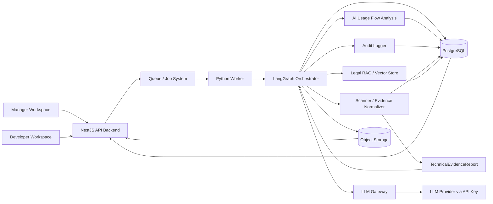
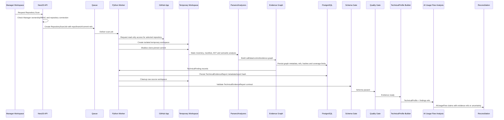
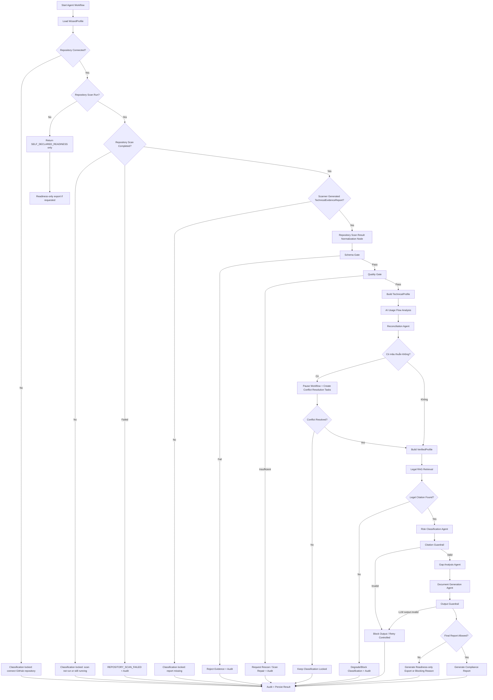
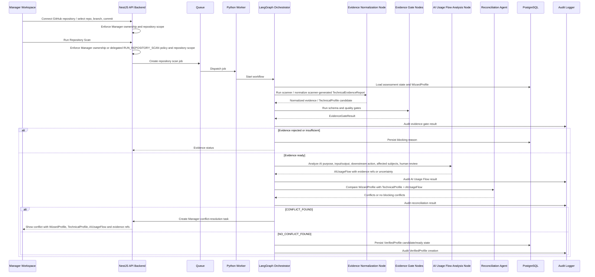
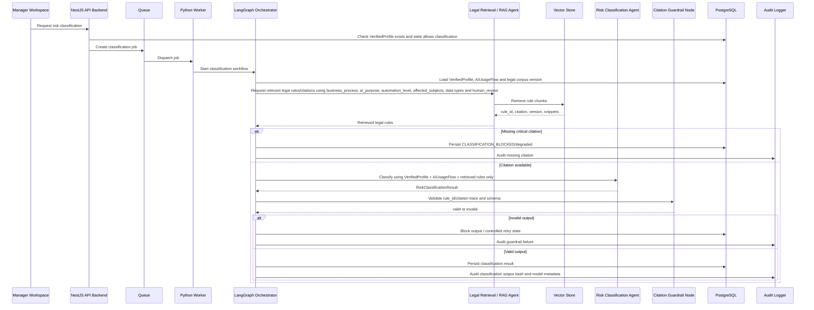
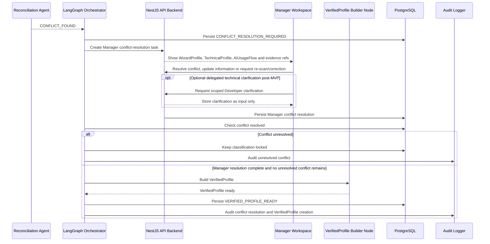
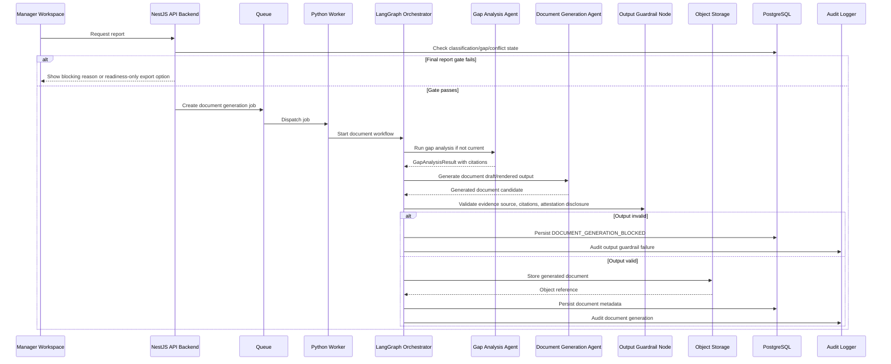

# LCSP Multi-Agent System Architecture

## Purpose

Tài liệu này mô tả **Multi-Agent System Design** của LCSP ở mức architecture trước implementation. Mục tiêu là làm rõ vì sao LCSP cần multi-agent, multi-agent xử lý phần nào, Orchestrator nằm ở đâu, agent/node nào tồn tại, luồng dữ liệu đi qua scanner/evidence/AI Usage Flow/RAG/LLM/audit như thế nào, và guardrail nào ngăn hallucination, legal overclaim và raw source leakage.

Đây là tài liệu kiến trúc có điều kiện. Tài liệu này không tạo backlog, không viết code, không khóa implementation detail, và không làm như LCSP đã sẵn sàng implement khi A1-A3 chưa có validation result.

## Scope

In scope:

- Orchestrator-controlled multi-agent workflow cho evidence, reconciliation, risk classification, gap analysis và document generation.
- Pattern selection dựa trên OpenAI Agents SDK Multi-Agent Systems và Microsoft Azure AI Agent Design Patterns.
- Agent/node inventory, LLM usage policy, shared state, state machine, sequence diagrams, guardrails, failure modes và auditability.
- AI Usage Flow Analysis như cầu nối giữa technical evidence từ repository scan và legal rule matching.
- Integration với Conditional Architecture hiện tại: modular monolith + separate Python scanner/agent worker.

Out of scope:

- Không tạo code LangGraph, prompt, schema implementation hoặc controller.
- Không tạo backlog/story.
- Không finalize physical deployment, queue technology hoặc database schema chi tiết.
- Không mở rộng MVP role ngoài Manager và Developer.

## Official Pattern References

| Source | Pattern / Concept | Meaning | How LCSP uses it | Fit |
|---|---|---|---|---|
| OpenAI Agents SDK Multi-Agent Systems | Orchestration via LLM | LLM quyết định bước tiếp theo, dùng tools và handoffs cho tác vụ mở. | LCSP chỉ dùng hạn chế cho reasoning/drafting trong node được phép; không dùng để quyết định state gate. | Partially fit |
| OpenAI Agents SDK Multi-Agent Systems | Orchestration via code | Code quyết định agent nào chạy, thứ tự nào, output được kiểm tra ra sao. | LCSP dùng state machine/DAG để quyết định Evidence -> Reconciliation -> VerifiedProfile -> Classification -> Gap -> Document. | Recommended |
| OpenAI Agents SDK Multi-Agent Systems | Agents as tools / Manager pattern | Một manager giữ quyền điều phối và gọi specialist agents như bounded tools. | LCSP diễn giải thành Orchestrator gọi các node/agent cho nhiệm vụ hẹp; specialist không tự take over workflow. | Recommended |
| OpenAI Agents SDK Multi-Agent Systems | Handoffs | Agent chuyển quyền xử lý sang specialist agent khác. | LCSP không dùng unrestricted handoff trong compliance-critical flow; chỉ có routing do Orchestrator quyết định. | Not recommended for critical path |
| OpenAI Agents SDK Multi-Agent Systems | Structured outputs and chaining | Agent output được định dạng để code kiểm tra và truyền sang bước tiếp theo. | Mọi agent output phải có schema và được guardrail validate trước khi ghi DB hoặc chuyển node. | Recommended |
| Microsoft Azure AI Agent Design Patterns | Sequential orchestration | Các agent chạy theo thứ tự tuyến tính, output agent trước là input agent sau. | LCSP có phần sequential nhưng cần branch/gate/human pause nên không chỉ là pipeline thuần. | Partially recommended |
| Microsoft Azure AI Agent Design Patterns | Concurrent orchestration | Nhiều agent chạy song song trên cùng input hoặc subtask độc lập. | Không phù hợp default vì LCSP cần thứ tự gate deterministic; có thể dùng tương lai cho non-critical checks độc lập. | Future / Optional |
| Microsoft Azure AI Agent Design Patterns | Group chat orchestration | Nhiều agent đóng góp vào shared conversation, chat manager điều phối lượt. | Không phù hợp compliance-critical workflow vì khó kiểm soát loop, provenance và deterministic gates. | Not recommended |
| Microsoft Azure AI Agent Design Patterns | Handoff orchestration | Một active agent tại một thời điểm; agent quyết định khi nào chuyển quyền. | Không phù hợp để risk/classification/document tự chuyển quyền; routing phải do Orchestrator/state quyết định. | Not recommended |
| Microsoft Azure AI Agent Design Patterns | Magentic orchestration | Manager agent lập kế hoạch, duy trì task ledger và điều phối task động. | Có ích về ý tưởng manager/audit, nhưng quá mở cho MVP compliance; LCSP không để manager LLM tự lập plan compliance. | Partially recommended |
| Microsoft Azure AI Agent Design Patterns | Human participation / HITL | Human review/approval có thể là observer, reviewer, approval gate hoặc feedback point. | Any conflict pauses workflow; Manager/Developer resolve according to truth ownership. | Recommended |
| Microsoft Azure AI Agent Design Patterns | Deterministic routing | Một số pattern cần routing do code kiểm soát thay vì agent tự chọn. | LCSP dùng deterministic routing cho gate ordering, block/unblock, legal citation missing và final report gate. | Recommended |
| Microsoft Azure AI Agent Design Patterns | Output validation before next agent | Orchestrator/receiving agent kiểm tra output quality để tránh lỗi cascade. | LCSP dùng schema validation, citation guardrail, output guardrail và fail-closed policy. | Recommended |
| Microsoft Azure AI Agent Design Patterns | Audit trail, least privilege, security trimming | Multi-agent cần audit, least privilege, identity/security control và content safety ở nhiều điểm. | LCSP audit every node, không gửi raw source cho LLM, không bypass RBAC, không log secret/raw source. | Required |

Kết luận source-grounded:

- OpenAI docs cho phép mix LLM-driven và code-driven orchestration. LCSP chọn **code/state-driven orchestration** vì compliance workflow cần predictable gates.
- OpenAI `agents as tools` phù hợp cho bounded specialist execution; unrestricted handoffs không phù hợp cho critical compliance path.
- Microsoft docs nhấn mạnh dùng mức complexity thấp nhất đáp ứng yêu cầu, deterministic routing, output validation, persistent shared state, audit và HITL. Đây là core của LCSP Orchestrator.

## Why LCSP Needs Multi-Agent System

LCSP không cần multi-agent để tạo chatbot tự do. LCSP cần multi-agent vì pipeline compliance có nhiều bước chuyên biệt với boundary khác nhau:

- Scanner/evidence xử lý technical truth, không kết luận pháp lý.
- AI Usage Flow Analysis xác định AI được dùng để làm gì trong business flow, input/output nào liên quan, output ảnh hưởng quyết định nào và ai có thể bị ảnh hưởng.
- Reconciliation so sánh WizardProfile với TechnicalProfile và AIUsageFlow để phát hiện conflict.
- Legal retrieval truy xuất legal rule/citation/version.
- Risk classification cần VerifiedProfile và legal citation trace.
- Gap analysis và document generation cần output đã validate.
- Human-in-the-loop xuất hiện khi Reconciliation phát hiện mâu thuẫn cần Manager/Developer xử lý.

Một single general-purpose agent sẽ khó enforce toàn bộ evidence gates, usage-flow interpretation, legal citation, no-raw-source boundary, human approval và audit. Vì vậy LCSP dùng nhiều node/agent chuyên biệt, nhưng mọi routing đều do Orchestrator kiểm soát.

## AI Usage Flow Analysis

AI Usage Flow Analysis identifies the purpose, role, impact, and harm potential of AI usage inside the scanned repository flow. It connects technical AI signals to business process meaning so that legal rules can be matched correctly.

Diễn giải trong LCSP:

```text
AI Usage Flow Analysis phân tích AI đang được dùng vào mục đích gì trong luồng nghiệp vụ,
output của AI ảnh hưởng tới quyết định nào, ai bị ảnh hưởng và có khả năng gây hại hay không.
Đây là cầu nối giữa technical evidence từ repository scan và legal rule matching từ corpus.
```

TechnicalProfile trả lời hệ thống có dùng AI như thế nào về mặt kỹ thuật. AIUsageFlow trả lời AI được dùng để làm gì trong nghiệp vụ và tác động tới ai. Risk Classification không được dựa chỉ trên việc repository có OpenAI/Gemini/LangChain/TensorFlow hoặc model/provider signal.

## Selected Multi-Agent Pattern for LCSP

Pattern được chọn:

```text
Orchestrator-controlled, state-machine-driven multi-agent workflow
```

Diễn giải cụ thể:

```text
Orchestrated LangGraph DAG with rule-first gates,
RAG-grounded legal reasoning,
deterministic schema/output validation,
and human-in-the-loop conflict resolution.
```

Recommended:

```text
Orchestrator-controlled LangGraph DAG using agents-as-tools for bounded subtasks,
RAG-grounded legal reasoning, deterministic gates,
and human-in-the-loop conflict resolution.
```

Not recommended:

```text
Free-form autonomous agents or unrestricted handoffs for compliance-critical flows.
```

Rationale:

- Compliance system cần state machine/gate vì risk classification không được chạy trước VerifiedProfile.
- Rule/schema validation phải nằm trước LLM reasoning để evidence và legal basis có thể audit.
- LLM không được chọn arbitrary next agent vì điều đó làm workflow khó predict và khó chứng minh.
- Risk Classification Agent không được tự gọi Document Generation Agent.
- Legal conclusion phải trace được về `rule_id`, citation và legal corpus version.
- Conflict liên quan cả business/legal và technical truth cần confirmation từ Manager và Developer.

## Orchestration Layer Design

Orchestration layer là control plane của LCSP multi-agent system. Nó không phải một chatbot, không phải business controller trong NestJS, và không phải LLM provider. Nó là workflow runtime chạy trong Python Worker để điều khiển state, gate, node routing, retry/fail-safe, HITL pause/resume và audit.

Trong LCSP, Orchestrator được hiểu là:

```text
Python Worker + LangGraph StateGraph workflow
```

Nếu framework implementation thay đổi, equivalent vẫn phải giữ các capability sau: state graph, deterministic routing, typed state, checkpoint/resume, human pause, output validation và audit hooks.

## Orchestrator Definition

Orchestrator is the workflow control layer of the LCSP multi-agent system.

Orchestrator:

- Không phải free-form autonomous agent.
- Không tự tạo legal conclusion.
- Không nằm trong frontend.
- Không nằm trong LLM provider.
- Không phải NestJS API business controller.
- Nằm trong **Python Worker / Agent Runtime Layer**.
- Điều khiển state transitions, gate execution, agent routing, retry/fail-safe behavior, human-in-the-loop pauses/resumes và audit logging.

NestJS API nhận request từ UI, enforce RBAC và tạo async job. Python Worker nhận job và chạy Orchestrator. LLM provider chỉ là inference backend sau LLM Gateway.

## Orchestrator Connection Points

| Connection Point | Direction | Purpose | Data Passed | Guardrail |
|---|---|---|---|---|
| NestJS API Backend | API -> Orchestrator via Queue; Orchestrator -> API via DB/status | Nhận job request, trả workflow status, expose task/result cho UI | job_id, assessment_id, requested action, actor refs, status refs | Không bypass RBAC; không expose raw internal prompt |
| Queue / Job System | Queue -> Python Worker | Async scan/classify/document jobs, retry/back-pressure | job payload, retry count, correlation id | Không truyền raw source qua queue; job payload chỉ chứa refs |
| PostgreSQL | Orchestrator <-> DB | Đọc assessment state; ghi workflow state, conflict, result, audit metadata | profiles, evidence refs, state, scores, audit refs | Không lưu raw source code; transaction/idempotency cần rõ |
| Object Storage | Orchestrator <-> Object Store | Lưu generated documents và non-source artifacts | generated document file, rendered export, report metadata | Không lưu raw source dài hạn; object refs audited |
| Vector Store / Legal RAG | Orchestrator -> RAG -> Vector Store | Legal retrieval node lấy rule/citation/version | query context, retrieved rule chunks, rule_id, citation, corpus version | LLM không được kết luận luật ngoài retrieved context |
| LLM Gateway | Orchestrator -> Gateway -> LLM | Boundary duy nhất để gọi LLM provider | sanitized prompt input, model config, schema, prompt version | Timeout, retry, token limit, model logging, schema validation; no raw source |
| Scanner / Evidence Normalizer | Orchestrator -> Scanner/Normalizer | Nhận repository scan ref, chạy static scanner và tạo TechnicalProfile | repo ref, pinned commit, scanner ruleset, scan result ref, normalized findings | Raw source chỉ tồn tại trong temporary workspace; scanner không execute source, không gửi raw source/full prompt/secret sang LLM |
| Audit Logger | Orchestrator -> Audit Logger -> DB | Ghi audit event cho từng node | input reference, output hash, actor/system, timestamp, status, model/version nếu có | Không audit raw source; không log secret |
| Manager Workspace | Manager -> API -> Orchestrator state | Manager nhận status/task/result qua API, không gọi agent trực tiếp | Wizard task, business/legal confirmation task, approval request | Manager confirms business/legal truth; no technical truth solo approval |
| Developer Workspace | Developer -> API -> Orchestrator state | Developer nhận technical task/status/result qua API, không gọi agent trực tiếp | evidence task, conflict task, attestation task | Developer chỉ thấy assigned task/policy; no Manager permission |

## Orchestrator Responsibilities

| Responsibility | Description | Controlled Steps | Failure Behavior |
|---|---|---|---|
| Workflow state control | Kiểm tra assessment state trước khi gọi node | All steps | Reject action hoặc set blocking reason khi state không hợp lệ |
| Gate ordering | Enforce thứ tự schema -> quality -> reconciliation -> VerifiedProfile -> classification -> gap -> report | Evidence gates, reconciliation, classification, document | Fail closed khi step trước chưa pass |
| Agent routing | Quyết định node/agent tiếp theo bằng state/rule, không bằng LLM tự chọn | All agent nodes | Không chạy node ngoài allowed transition |
| Blocking logic | Block workflow theo evidence status, VerifiedProfile, unresolved conflict, citation và final report gate | Evidence, conflict, classification, document | Persist blocking_reason và audit |
| Human-in-the-loop pause/resume | Pause khi có conflict; resume khi conflict được resolve hợp lệ | Conflict resolution, critical attestation | Giữ workflow locked cho classification/final report |
| LLM call control | Chỉ gọi LLM qua LLM Gateway với input đã sanitize và schema output | Classification, gap, document, limited explanation | Retry controlled hoặc fail closed khi timeout/output invalid |
| Retry and fail-safe | Retry lỗi tạm thời; không retry vô hạn; fail closed cho evidence/schema/citation invalid | Queue jobs, LLM calls, document jobs | Mark job failed/blocked, user-visible reason |
| Audit every node | Ghi start/success/failure, input refs, output hash, model/prompt/corpus version | All nodes | Audit critical failure có thể block persistence/release |

## Orchestrator-Controlled Agent/Step Inventory

| Step Order | Controlled Step / Agent | Type | Triggered By | Input | Output | Next Step Decision | Can Be Skipped? |
|---:|---|---|---|---|---|---|---|
| 1 | Start Assessment Workflow | State step | Assessment job/event | assessment_id, actor refs | workflow run id | Load WizardProfile | No |
| 2 | Load WizardProfile | Data load | WizardProfile submitted | assessment_id | wizard_profile | If missing, stop/readiness only | No |
| 3 | Wait for Repository Scan Result | Gate wait | Wizard submitted; Manager connects repository/runs scan or optional delegated actor does so under Manager scope | wizard_profile, repository connection/scan refs | repository connected/scan completed status | Missing scan -> SELF_DECLARED_READINESS only and classification locked | No |
| 4 | Repository Scan Result Normalization Node | Deterministic/worker | Repository scan completed | Scanner-generated `TechnicalEvidenceReport` ref | normalized evidence | Schema gate | No when scan result exists |
| 5 | Evidence Schema Gate Node | Deterministic gate | Normalization done | report metadata, required fields | schema pass/fail | Fail -> rejected | No |
| 6 | Evidence Quality Gate Node | Deterministic gate | Schema pass | wizard context, evidence quality signals | sufficient/insufficient | Insufficient -> request rescan or scan repair; classification remains locked | No |
| 7 | TechnicalProfile Builder | Builder node | Quality pass | normalized evidence | TechnicalProfile | AI Usage Flow Analysis | No |
| 8 | AI Usage Flow Analysis Node | Rule-first analysis node | TechnicalProfile ready | TechnicalProfile, TechnicalFindings, WizardProfile context | AIUsageFlow with purpose/input/output/impact/harm signals | Reconciliation | No; unclear usage can create uncertainty/conflict |
| 9 | Reconciliation Agent | Rule-first agent | AIUsageFlow ready | WizardProfile, TechnicalProfile, AIUsageFlow | conflicts | Scoring | No |
| 10 | Scoring Node | Deterministic scoring | Conflicts/evidence/usage flow ready | conflicts, evidence signals, AIUsageFlow | Evidence Confidence, AI Intervention, optional Conflict Score | Scores inform review only; route remains conflict exists/not | No |
| 11 | Human Confirmation Task Router | Workflow/HITL node | Any conflict requiring resolution or critical attestation | conflict tasks, roles, policies | Manager/Developer tasks | Wait/resume after confirmation | Skipped only when no conflict exists |
| 12 | VerifiedProfile Builder Node | Builder node | Gates pass and conflicts resolved | profiles, AIUsageFlow, resolutions, attestations | VerifiedProfile | Legal retrieval | No before classification |
| 13 | Legal Retrieval / RAG Agent | Retrieval node | VerifiedProfile ready | VerifiedProfile, AIUsageFlow, legal query context | legal rules/citations | Citation found -> classification; missing -> degraded/blocked | No for classification |
| 14 | Risk Classification Agent | LLM-allowed specialist | Legal rules available | VerifiedProfile + AIUsageFlow + retrieved rules | classification result | Citation guardrail | No for risk output |
| 15 | Citation Guardrail Node | Deterministic guardrail | Classification output | output, rule refs, citations | valid/degraded/blocked | Valid -> gap; invalid -> retry/block | No |
| 16 | Gap Analysis Agent | LLM-allowed specialist | Classification valid | risk result, rules, VerifiedProfile, AIUsageFlow | gap analysis | Document generation | Skipped only for readiness-only export |
| 17 | Document Generation Agent | Drafting/render node | Report request + gates pass | verified profile, AIUsageFlow, risk, gaps, citations | generated document/ref | Output guardrail | Skipped when final report blocked |
| 18 | Output Guardrail Node | Deterministic guardrail | Generated output | report, citations, evidence refs | releaseable/blocked output | Persist result or blocking reason | No for final report |
| 19 | Audit Logger Node | Cross-cutting | Every node start/end | node metadata, refs, status | audit event ref | Continue/fail closed depending criticality | No |
| 20 | Final State Update | State step | Workflow completion/block | result refs, blocking reason | assessment state | Stop/resume later | No |

## Technology Choice

| Component | Decision | Reason |
|---|---|---|
| Agent Orchestration | LangGraph hoặc equivalent state graph | Cần DAG/state machine/gate/human loop/checkpoint |
| LLM access | LLM Provider via API key through LLM Gateway | MVP không tự train LLM; dễ thay provider; kiểm soát prompt/model/version |
| LLM Gateway | Required | Timeout, retry, token limit, prompt versioning, model logging, schema validation |
| Legal RAG | ChromaDB / Vector Store + legal corpus metadata | Cần legal citation traceability |
| Embedding Model | BAAI/bge-m3 hoặc model đã chọn trong technical spec | Hỗ trợ retrieval legal corpus; final model có thể review theo A2 |
| Backend | NestJS API | Auth, RBAC, assessment state, job creation, UI-facing API |
| Worker | Python Worker | Scanner, evidence normalization, LangGraph workflows, agent jobs |
| DB | PostgreSQL | Assessment/profile/conflict/score/audit state |
| Object Storage | MinIO/S3-compatible | Generated documents và non-source artifacts; no raw source long-term |
| Queue | RabbitMQ or equivalent | Async scan/agent/document jobs, retry, isolation |

OpenAI Agents SDK hiện được dùng như **official pattern reference**, không phải runtime đã chọn cho MVP. Nếu tương lai LCSP chọn OpenAI Agents SDK cho một phần agent runtime, chỉ nên dùng `agents as tools` cho bounded specialist subtasks; free-form handoffs vẫn phải bị giới hạn hoặc tắt trong compliance-critical flow.

## System Boundary

Inside LCSP:

- Manager Workspace, Developer Workspace.
- NestJS API Backend.
- Queue / Job System.
- Python Worker / Agent Runtime.
- LangGraph Orchestrator.
- Scanner / Evidence Normalizer.
- Legal RAG / Vector Store.
- PostgreSQL.
- Object Storage.
- Audit Logger.

External / boundary:

- GitHub repository access through read-only GitHub App.
- Local/CI scanner environment only as Deferred/Future enterprise evidence path, not MVP main workflow.
- LLM Provider via API key through LLM Gateway.
- Legal corpus source documents ingested/versioned by LCSP process.

Raw source boundary:

```text
Raw source may be temporarily processed by scanner only.
Raw source must not be sent to LLM.
Raw source must not be stored long-term.
Agents receive normalized evidence, references, findings summaries and metadata.
```

## Agent Inventory

| Agent / Node | Type | Uses LLM? | Uses RAG? | Deterministic? | Input | Output | Blocking Power | Human Review | Audit |
|---|---|---:|---:|---:|---|---|---|---|---|
| Orchestrator Node | Control plane | No | No | Yes | shared state, job payload | next step, state, blocking reason | Yes, by state/rule | Creates tasks | Required |
| Evidence Normalization Node | Worker/parser | No or limited deterministic parsing | No | Yes | evidence report ref | normalized evidence | No direct | No | Required |
| Evidence Schema Gate Node | Gate | No | No | Yes | report fields | pass/fail | Yes for evidence acceptance | No | Required |
| Evidence Quality Gate Node | Gate | No | No | Yes | evidence signals, wizard context | ready/insufficient | Yes for classification unlock | No | Required |
| AI Usage Flow Analysis Node | Rule-first analysis | Optional, limited | No | Mostly | TechnicalProfile, findings, WizardProfile context | AIUsageFlow | No direct block; may create conflict/uncertainty | Yes if unclear/conflicting | Required |
| Reconciliation Agent | Rule-first specialist | Limited explanation only | No | Mostly | WizardProfile, TechnicalProfile, AIUsageFlow | `NO_CONFLICT_FOUND` or `CONFLICT_FOUND`, conflict tasks | Via unresolved conflict state | Yes for conflicts | Required |
| Scoring Node | Scoring | No | No | Yes | evidence/conflict signals, AIUsageFlow | Evidence Confidence, AI Intervention, optional Conflict Score | No routing power in MVP | No | Required |
| VerifiedProfile Builder Node | Builder | No | No | Yes | profiles, AIUsageFlow, resolutions, attestations | VerifiedProfile | Yes if prerequisites missing | Manager approval | Required |
| Legal Retrieval / RAG Agent | Retrieval | No legal conclusion | Yes | Mostly | VerifiedProfile, AIUsageFlow, legal query | rules/citations/version | Yes if citation missing | No | Required |
| Risk Classification Agent | Specialist reasoning | Yes, controlled | Uses retrieved rules | No, but schema-validated | VerifiedProfile + AIUsageFlow + rules | RiskClassificationResult | Degrade/block if missing trace | Optional review for blocked/degraded | Required |
| Citation Guardrail Node | Guardrail | No | No | Yes | classification output + rule refs | valid/invalid | Yes | No | Required |
| Gap Analysis Agent | Specialist reasoning | Yes, controlled | Uses legal basis | No, but schema-validated | risk result, obligations | GapAnalysisResult | Blocks final if invalid | No | Required |
| Document Generation Agent | Drafting/render | Optional | Uses citation refs | Template deterministic + optional LLM | verified profile, risk, gaps, citations | document/ref | Cannot bypass final report gate | Manager request | Required |
| Human Attestation Review Node | Policy/HITL | No | No | Yes | attestation claim, role, scope | accept/reject/needs Manager review or optional clarification | Yes when invalid/unclear | Manager; optional Developer | Required |
| Audit Logger Node | Audit | No | No | Yes | node metadata | audit event ref | Critical audit failure can fail closed | No | Required |
| Output Guardrail Node | Guardrail | No | No | Yes | generated output | release/block reason | Yes | No | Required |

## LLM Usage Policy

```text
Agent logic is project-owned.
LLM provider is only an inference backend.
```

| Layer | Owner | Description |
|---|---|---|
| Agent workflow | LCSP | LangGraph/state machine/routing/gates |
| Rules | LCSP | Business/legal/security rules |
| Prompts | LCSP | Agent-specific prompt templates and prompt versions |
| Schemas | LCSP | Pydantic/JSON Schema validation and output contracts |
| Legal corpus | LCSP | Versioned legal documents, legal rules and citations |
| LLM inference | External provider via API key | Reasoning/drafting under LCSP guardrails |
| Output validation | LCSP | Rule/citation/schema validation |
| Audit | LCSP | Every node logged with metadata and output refs |

LCSP should not train a custom LLM for MVP. LCSP should use external LLM providers through an LLM Gateway. LCSP should own workflow, rules, prompts, schema validation, RAG corpus, output guardrails and audit.

## Agent-to-LLM Decision Matrix

| Agent / Node | LLM Usage Decision | Reason |
|---|---|---|
| Evidence Normalization Node | No LLM or limited deterministic parsing | Scanner output should be structured and auditable |
| Evidence Schema Gate | No LLM | Schema validation must be deterministic |
| Evidence Quality Gate | No LLM / rule-based | Evidence policy must be consistent |
| Scoring Node | No LLM | Scores must be stable and reproducible |
| AI Usage Flow Analysis Node | Optional limited LLM for explanation/classification of sanitized metadata only | Usage purpose can require interpretation, but source/raw prompt must not be sent to LLM and output must cite evidence refs |
| Reconciliation Agent | Limited LLM for explanation only | Conflict detection should be rule-first |
| VerifiedProfile Builder | No LLM | Builds from confirmed data |
| Legal Retrieval / RAG Agent | Retrieval only | Retrieves legal rules, not legal conclusions |
| Risk Classification Agent | LLM allowed only with VerifiedProfile + AIUsageFlow + retrieved legal rules | Legal reasoning must be grounded in business usage and legal citations |
| Citation Guardrail Node | No LLM | Citation validation must be deterministic |
| Gap Analysis Agent | LLM allowed with citation-grounded obligations | Useful for explanation and action recommendation |
| Document Generation Agent | LLM allowed for drafting | Output must be validated before release |
| Human Attestation Review Node | No LLM for accept/reject | Policy must enforce role-bound claims deterministically |
| Audit Logger Node | No LLM | Logging must be deterministic |
| Output Guardrail Node | No LLM | Release/block must be deterministic |

## Shared Agent State

| Field Group | Owner | Created By | Updated By | Used By | Notes |
|---|---|---|---|---|---|
| `assessment_id` | Assessment Module | API Backend | Immutable | All nodes | Correlation key |
| `organization_id` | Organization/RBAC | API Backend | Immutable | API, Orchestrator, Audit | Tenancy and permission boundary |
| `current_state` | Orchestrator | Orchestrator | Orchestrator | API, UI, nodes | Mirrors state machine |
| `wizard_profile` | Wizard Module | Manager Workspace/API | Manager before submit; immutable snapshot after submit unless revised | Reconciliation, evidence quality, classification | A1 dependency |
| `technical_evidence_report_ref` | Evidence Module | Scanner/upload/API | Evidence source adapters | Normalizer, gates, audit | Ref, not raw source |
| `technical_profile` | Evidence Module | Evidence Normalization Node | Normalizer only | Reconciliation, VerifiedProfile | Derived from accepted evidence |
| `ai_usage_flow` | AI Usage Flow Module | AI Usage Flow Analysis Node | Rerun after evidence/Wizard changes or conflict resolution | Reconciliation, Scoring, Legal RAG, Classification, Document | Bridges technical AI signals to business purpose, downstream action, affected subjects and harm potential |
| `evidence_gate_result` | Evidence Gate Module | Evidence Gate Nodes | Gate reruns | Orchestrator, UI, audit | Drives missing/rejected/insufficient/ready |
| `conflicts` | Reconciliation Module | Reconciliation Agent | Reconciliation rerun | Scoring, HITL, VerifiedProfile | MVP routing uses conflict exists/not; severity optional informational only |
| `conflict_scores` | Scoring Module | Scoring Node | Scoring rerun | Reviewers, audit | Supporting/explanatory only in MVP |
| `conflict_resolutions` | Reconciliation Module | Manager via API; optional Developer clarification post-MVP | Manager conflict resolution tasks | VerifiedProfile Builder | MVP requires Manager resolution; Developer assignment is not required to resume workflow |
| `human_attestations` | Attestation Module | Manager/Developer via API | Attestation Review Node | Evidence gate, reconciliation, report | A3 dependency; cannot replace machine metadata |
| `verified_profile` | VerifiedProfile Module | VerifiedProfile Builder | Rebuild after valid changes | Legal RAG, Classification, Document | Required before risk classification |
| `retrieved_legal_rules` | Legal Corpus/RAG Module | Legal Retrieval Node | Retrieval rerun | Classification, Gap, Citation Guardrail | A2 dependency; includes rule_id/citation/version |
| `risk_classification_result` | Classification Module | Risk Classification Agent | Classification rerun | Gap, Document, Audit | Must trace to rules |
| `gap_analysis_result` | Gap Module | Gap Analysis Agent | Gap rerun | Document, UI | Must cite legal basis for legal claims |
| `document_generation_result` | Document Module | Document Generation Agent | Document rerun | UI, Object Storage, Audit | Final report blocked if gates fail |
| `blocking_reason` | Orchestrator | Any gate/guardrail | Orchestrator | API/UI | User-visible reason |
| `audit_refs` | Audit Module | Audit Logger | Every node | Report/export | Metadata only |
| `model_run_metadata` | LLM Gateway/Audit | LLM Gateway | Per LLM call | Audit, observability | model/provider/version/prompt version; no raw source |

## Architecture Graph with Orchestrator Connections



Explanation:

- API tạo job nhưng không tự chạy agent reasoning.
- Queue tách async execution khỏi request lifecycle.
- Python Worker là runtime chạy scanner/evidence normalization/LangGraph workflow.
- LangGraph Orchestrator điều khiển node execution và state transition.
- LLM Gateway là boundary duy nhất để gọi LLM provider.
- Orchestrator chỉ gửi sanitized structured data đến LLM Gateway.
- Audit Logger ghi log cho mọi step.
- Manager/Developer chỉ tương tác qua API, không gọi agent trực tiếp.

## Scanner Subsystem Architecture

Trong Phase 1B, scanner được thiết kế là static-analysis-only subsystem nằm trong Python Worker. Scanner không phải legal agent và không tự tạo risk classification. Nó tạo technical evidence để Evidence Gates, TechnicalProfile Builder và AI Usage Flow Analysis sử dụng.

```mermaid
flowchart LR
    Queue[Queue / RepositoryScanJob] --> Worker[Python Scanner Worker]
    Worker --> Workspace[Temporary Isolated Workspace\nPinned commit checkout]
    Workspace --> Inventory[Repository Inventory Analyzer]
    Inventory --> Manifest[Manifest and Config Analyzer]
    Manifest --> Tree[Tree-sitter Generic Parser]
    Tree --> TS[TypeScript Semantic Analyzer Sidecar]
    Tree --> Py[Python Semantic Analyzer]
    TS --> Detectors[AI Invocation / Input / Output / Decision Detectors]
    Py --> Detectors
    Tree --> Detectors
    Detectors --> Review[Human Review Detector]
    Review --> Domain[Domain Context Fusion]
    Domain --> Graph[NetworkX Evidence Graph\nscan-local only]
    Graph --> Findings[TechnicalFinding Records]
    Findings --> Report[TechnicalEvidenceReport]
    Report --> Redact[Redaction + Metadata Persistence]
    Redact --> DB[(PostgreSQL graph metadata / refs / hashes)]
    Redact --> Cleanup[Workspace Cleanup]
```



Scanner technology boundaries:

| Concern | Architecture Decision | Boundary |
| --- | --- | --- |
| Generic parser | Tree-sitter | Generic parsing and fallback structure only |
| TS/JS semantic analysis | Isolated Node.js analyzer using TypeScript Compiler API | No project code execution, no package install, no app startup |
| Python semantic analysis | Python `ast` with custom import/module resolver | Static import/function/variable flow only |
| Graph assembly | NetworkX in-memory graph | Scan-local and temporary |
| Graph persistence | PostgreSQL normalized nodes, edges, evidence refs, hashes and paths | No raw source body or complete AST body |
| Detection rules | Versioned YAML/JSON scanner rulesets | Technical evidence only, no legal conclusion |
| LLM | LLM Gateway only | Sanitized metadata only |
| CodeQL | Future evaluation option | Not an MVP runtime dependency |

Allowed scanner behavior:

- Read repository files from selected repository/branch/commit.
- Shallow clone the pinned commit into a temporary isolated workspace.
- Parse source/config/manifest/schema files.
- Build AST, call graph, data-flow graph and evidence graph.
- Persist findings, hashes, metadata, graph paths and coverage limits.

Forbidden scanner behavior:

- Execute customer code or repository scripts.
- Run `npm install`, `pnpm install`, `pip install`, Maven, Gradle, build, test, Docker, shell script or CI workflow commands.
- Probe customer API endpoints.
- Persist raw source, full AST bodies, full prompts or secrets.
- Send raw source, full prompts or secrets to LLM Gateway or LLM provider.

## Scanner-to-AIUsageFlow Sequence



The raw repository source exists only inside `Temporary Workspace` and is cleaned after scan success/failure handling. LLM calls are not part of scanner execution. If AI Usage Flow Analysis later uses LLM assistance, the LLM Gateway receives only sanitized metadata and evidence reference IDs.

## End-to-End Information Flow

1. Manager input đi vào WizardProfile.
2. Manager connects GitHub Repository and Manager runs Repository Scan. A Developer may do this only as an optional delegated collaborator; Developer absence must not block the MVP flow.
3. Scanner creates `TechnicalEvidenceReport`; scanner không kết luận pháp lý.
4. Evidence Normalization reads scanner report and creates normalized evidence for gates.
5. Schema Gate và Quality Gate quyết định evidence rejected/insufficient/ready.
6. TechnicalProfile được tạo từ evidence đã pass gate.
7. AI Usage Flow Analysis phân tích AI purpose, input, output, downstream action, affected subject, human review, automation level và harm potential.
8. Reconciliation Agent so sánh WizardProfile với TechnicalProfile + AIUsageFlow.
9. Reconciliation quyết định có mâu thuẫn hay không.
10. Human-in-the-loop xuất hiện nếu có mâu thuẫn cần Manager xử lý. Developer clarification chỉ là optional delegated/post-MVP input và không finalize conflict.
11. VerifiedProfile chỉ được tạo sau gates pass, AIUsageFlow có đủ basis và conflict resolved.
12. Legal RAG chỉ cung cấp legal rules/citations/version dựa trên VerifiedProfile + AIUsageFlow.
13. Risk Classification Agent chỉ nhận VerifiedProfile + AIUsageFlow + retrieved legal rules.
14. Citation Guardrail chặn unsupported legal conclusion.
15. Gap Analysis Agent tạo gap dựa trên risk result và legal basis.
16. Document Generation Agent chỉ tạo final report nếu final report gate pass.
17. Audit Logger ghi nhận từng node, input refs, output hash và status.

Canonical role constraints for this flow:

- Manager is final conflict resolver.
- Developer is optional in MVP.
- Developer delegation is Post-MVP unless explicitly scoped as optional collaboration.
- No workflow transition may be blocked only because Developer is absent.

## Orchestrated Workflow Graph



Orchestrator không cho Risk Classification Agent chạy trước VerifiedProfile. Orchestrator không cho Document Generation Agent tạo final report nếu final report gate fail. LLM không được chọn đường đi tiếp theo; branching được quyết định bằng rule/state.

## Orchestrator State Machine

| State | Meaning | Entered When | Allowed Next States | Blocked Actions |
|---|---|---|---|---|
| WIZARD_DRAFT | Manager đang điền Wizard | Assessment created | WIZARD_SUBMITTED | Classification, final report |
| WIZARD_SUBMITTED | WizardProfile đã submitted | Manager submits WizardProfile | WAITING_FOR_REPOSITORY_CONNECTION, WAITING_FOR_REPOSITORY_SCAN | Risk level display |
| WAITING_FOR_REPOSITORY_CONNECTION | Chưa có GitHub repository connected | Wizard submitted and repository scan evidence is required | REPOSITORY_CONNECTED | Risk classification, final report |
| REPOSITORY_CONNECTED | GitHub repository/branch/commit scope connected | Manager connects GitHub repository, or optional delegated actor connects within Manager scope | WAITING_FOR_REPOSITORY_SCAN, REPOSITORY_SCAN_RUNNING | Risk classification, final report |
| WAITING_FOR_REPOSITORY_SCAN | Repository connected but scan not completed | Repository connected or scan retry needed | REPOSITORY_SCAN_RUNNING | Risk classification, final report |
| REPOSITORY_SCAN_RUNNING | Scanner job is running | Manager runs Repository Scan, or optional delegated actor runs scan within Manager scope | REPOSITORY_SCAN_FAILED, REPOSITORY_SCAN_COMPLETED | Reconciliation, classification |
| REPOSITORY_SCAN_FAILED | Repository scan failed | Scanner/job failure | WAITING_FOR_REPOSITORY_SCAN | Reconciliation, classification |
| REPOSITORY_SCAN_COMPLETED | Scanner created TechnicalEvidenceReport | Scan completed | EVIDENCE_SCHEMA_FAILED, EVIDENCE_QUALITY_INSUFFICIENT, TECHNICAL_PROFILE_READY | Classification until gates pass |
| EVIDENCE_SCHEMA_FAILED | Schema completeness fail | Schema gate fails | WAITING_FOR_REPOSITORY_SCAN | Reconciliation, classification |
| EVIDENCE_QUALITY_INSUFFICIENT | Evidence quality below threshold | Quality gate fails | WAITING_FOR_REPOSITORY_SCAN | Reconciliation, classification |
| TECHNICAL_PROFILE_READY | TechnicalProfile built | Evidence gates pass | AI_USAGE_FLOW_ANALYSIS_READY | Classification before usage analysis/reconciliation |
| AI_USAGE_FLOW_ANALYSIS_READY | AIUsageFlow produced with purpose/input/output/impact fields or explicit uncertainty | AI Usage Flow Analysis completes | RECONCILIATION_RUNNING, CONFLICT_RESOLUTION_REQUIRED if usage conflict/uncertainty needs confirmation | Classification before reconciliation |
| RECONCILIATION_RUNNING | WizardProfile vs TechnicalProfile + AIUsageFlow comparison | AIUsageFlow ready | CONFLICT_RESOLUTION_REQUIRED, VERIFIED_PROFILE_READY | Classification |
| CONFLICT_RESOLUTION_REQUIRED | Có mâu thuẫn cần xử lý trước classification | Reconciliation detects any conflict | VERIFIED_PROFILE_READY | Classification, final report |
| VERIFIED_PROFILE_READY | VerifiedProfile built and approved | No unresolved conflict remains and Manager approval/resolution is recorded | CLASSIFICATION_RUNNING | Final report before classification |
| CLASSIFICATION_RUNNING | Risk Classification Agent running | Manager/API triggers classification job | CLASSIFICATION_BLOCKED, CLASSIFICATION_COMPLETED | Gap/report until complete |
| CLASSIFICATION_BLOCKED | Missing citation/schema/output issue | Legal/citation/guardrail fail | CLASSIFICATION_RUNNING, VERIFIED_PROFILE_READY | Gap analysis, final report |
| CLASSIFICATION_COMPLETED | Valid classification exists | Citation guardrail pass | GAP_ANALYSIS_RUNNING | Final report until gap ready |
| GAP_ANALYSIS_RUNNING | Gap analysis running | Classification completed | GAP_ANALYSIS_COMPLETED | Final report |
| GAP_ANALYSIS_COMPLETED | Gap analysis valid | Gap output guardrail pass | DOCUMENT_GENERATION_BLOCKED, DOCUMENT_GENERATION_COMPLETED | None except final report gate |
| DOCUMENT_GENERATION_BLOCKED | Final report gate fail | Conflict/citation/output/gate issue | DOCUMENT_GENERATION_COMPLETED, previous repair states | Final compliance report; readiness-only export may be allowed |
| DOCUMENT_GENERATION_COMPLETED | Document generated and stored | Output guardrail pass | Terminal or regenerate | None |

## Orchestrator vs Agent Responsibility Boundary

| Responsibility | Orchestrator | Agent / Node | LLM Provider |
|---|---|---|---|
| Decide next step | Yes, by state/rule | No | No |
| Validate evidence schema | Calls node and acts on result | Yes, deterministic | No |
| Explain conflict in readable language | Routes task and stores output | Yes, limited LLM optional | Maybe returns explanation |
| Classify risk | Calls Risk Agent only after VerifiedProfile | Yes, grounded by rules | Maybe returns reasoning output |
| Generate report draft | Calls Document Agent only if allowed | Yes, template/drafting | Maybe returns text |
| Block final report | Yes, based on state/rule | Provides signal/output | No |
| Persist state and audit | Yes | Emits metadata | No |
| Choose another agent freely | No free-form; deterministic routing only | No self-handoff | No |

## Evidence to VerifiedProfile Sequence



## Risk Classification with Legal RAG Sequence



## Human-in-the-loop Conflict Resolution Sequence



## Document Generation Sequence



## Pattern Comparison and Decision

| Pattern | Source | Pros | Cons | LCSP Decision |
|---|---|---|---|---|
| Sequential pipeline | Microsoft Azure AI Agent Design Patterns | Dễ hiểu, deterministic, phù hợp clear dependencies | Không đủ cho conflict/HITL/resume/branch | Partially Recommended |
| Manager/orchestrator pattern | OpenAI Agents SDK Multi-Agent Systems; Microsoft Magentic concept | Central control, aggregation, shared guardrails | Nếu manager là LLM tự do thì khó kiểm soát | Recommended as code/state Orchestrator |
| Agents-as-tools pattern | OpenAI Agents SDK Multi-Agent Systems | Specialist bounded subtasks, manager giữ control | Cần tool contract rõ | Recommended |
| Handoff pattern | OpenAI Agents SDK Multi-Agent Systems; Microsoft Azure AI Agent Design Patterns | Specialist có thể own interaction | Unpredictable routing/infinite handoff risk | Not Recommended for critical path |
| Free-form autonomous multi-agent collaboration | Microsoft group chat/handoff/magentic family | Linh hoạt cho brainstorming/open-ended tasks | Khó audit, loop, hallucination, legal overclaim | Not Recommended |
| RAG-grounded agent pattern | Microsoft security/knowledge-source guidance; LCSP-specific legal RAG interpretation | Legal basis traceable, giảm unsupported conclusion | Phụ thuộc corpus quality A2 | Recommended with citation guardrail |
| Human-in-the-loop pattern | Microsoft human participation | Bắt buộc khi có conflict cần người sở hữu truth xử lý | Adds latency and state complexity | Required |
| Evaluator/guardrail pattern | OpenAI structured outputs/evaluator loop; Microsoft output validation | Chặn output invalid, giảm cascade error | Không thay thế deterministic rules | Recommended as deterministic guardrails first |

Decision:

```text
Recommended: Orchestrator-controlled LangGraph DAG using agents-as-tools for bounded subtasks,
RAG-grounded legal reasoning, deterministic gates, and human-in-the-loop conflict resolution.

Not recommended: free-form autonomous agents or unrestricted handoffs for compliance-critical flows.
```

## Multi-Agent Guardrails

### 21.1 Workflow guardrails

- Agent cannot skip evidence gates.
- Reconciliation cannot run until AI Usage Flow Analysis has produced `AIUsageFlow` or explicit uncertainty.
- Risk Classification Agent cannot run before VerifiedProfile.
- Document Generation Agent cannot generate final report if any unresolved conflict exists.
- LLM cannot choose arbitrary next agent.
- Agent cannot self-handoff to another agent without Orchestrator routing.

### 21.2 Data guardrails

- Raw source code cannot be sent to LLM.
- Raw source code cannot be stored long-term.
- Agents receive evidence references, summaries and normalized profiles.
- AI Usage Flow Analysis receives normalized evidence, finding metadata and redacted summaries; it must not receive raw source or full prompt contents.
- Secret redaction happens before evidence processing/output.
- LLM input must be sanitized by LLM Gateway.

### 21.3 Legal guardrails

- No legal conclusion without retrieved legal rule.
- Legal retrieval and rule matching must use AIUsageFlow fields such as business_process, ai_purpose, automation_level, affected_subjects, data_types, human_review and potential_harm_categories.
- Model/provider presence alone must not determine risk level.
- Classification requires `rule_id` and citation.
- Missing citation causes degraded/blocked output.
- Rule-based gate overrides LLM output.
- Legal corpus version must be recorded.

### 21.4 Output guardrails

- Every agent output must validate against schema.
- AIUsageFlow output must cite evidence refs for purpose/input/output/downstream-action claims and mark unclear fields as `unknown` or `unclear` instead of overclaiming.
- Invalid output triggers controlled retry or fail-safe block.
- Unsupported legal conclusion is blocked.
- Generated document must show evidence source and citation trace.

### 21.5 Human guardrails

- Manager confirms business/legal truth and is final resolver for MVP conflicts.
- Developer may provide optional delegated technical clarification post-MVP, but is not required for workflow resume.
- Cross-boundary conflict in MVP creates Manager resolution task, not Developer-required confirmation.
- Human attestation cannot replace machine-generated metadata.

## Human-in-the-loop Points

| Point | Trigger | Human Role | Required Action | Resume Condition |
|---|---|---|---|---|
| Wizard business/legal clarification | Missing/ambiguous critical Wizard field | Manager | Clarify business/legal meaning | WizardProfile updated/submitted |
| Technical conflict | TechnicalProfile contradicts WizardProfile technical claim | Manager | Review evidence, resolve, request re-scan/correction or optionally delegate clarification | Manager conflict resolution completed |
| Business/legal conflict | Wizard answer conflicts with evidence implication | Manager | Confirm business/legal meaning | Manager conflict resolution completed |
| Cross-boundary conflict | Conflict involves both business/legal and technical evidence/usage flow | Manager | Resolve with evidence refs; optional Developer clarification is input only | Manager conflict resolution completed |
| Human attestation issue | Attestation changes classification-relevant field or lacks scope/reason | Manager | Accept/reject/request clarification under policy | Policy-valid Manager review |
| Final report generation | Manager requests report | Manager | Confirm generation intent | All gates pass |

## Legal RAG and Citation Boundary

Legal Retrieval / RAG Agent:

- Chỉ retrieve legal rules/citations.
- Không tự kết luận risk.
- Trả `rule_id`, citation, legal document version, corpus version và retrieval metadata.
- Nhận query context từ VerifiedProfile + AIUsageFlow, không chỉ từ provider/model/dependency signal.
- Nếu không tìm được citation phù hợp cho field quan trọng, trả degraded/blocked status.

Risk Classification Agent:

- Chỉ dùng VerifiedProfile + AIUsageFlow + retrieved legal rules.
- Không dùng raw source code.
- Không tự tạo legal rule không tồn tại trong corpus.
- Output phải có `rule_id`, citation và legal document version.

AIUsageFlow legal matching fields:

| AI Usage Flow Field | Legal Rule Matching Purpose |
|---|---|
| `business_process` | Xác định lĩnh vực áp dụng luật |
| `ai_purpose` | Xác định AI là assistive, recommendation, scoring hay decision |
| `automation_level` | Xác định mức tự động hóa |
| `affected_subjects` | Xác định ai bị ảnh hưởng |
| `ai_input_types` / data types | Xác định dữ liệu cá nhân/nhạy cảm |
| `human_review` | Xác định giảm/không giảm rủi ro |
| `potential_harm_categories` | Xác định rule/corpus về nguy hại |

Missing citation policy:

```text
Critical rule missing -> classification blocked.
Non-critical support missing -> output degraded with explicit limitation.
LLM unsupported conclusion -> output blocked by Citation Guardrail.
```

## Auditability and Observability

Mỗi node/agent start/success/failure phải có audit event.

Audit event minimum fields:

- `assessment_id`
- node/agent name
- input reference
- output hash
- actor/system
- timestamp
- status
- blocking reason nếu có
- model/provider/version nếu có LLM
- prompt version nếu có
- legal corpus version nếu có

Audit constraints:

- Không audit raw source code.
- Không log secret.
- Audit trail phải phục vụ export/report.
- Output hash và source refs phải đủ để trace mà không lưu raw source.

Observability:

- Track node latency, retry count, failure reason, token/model usage, queue time.
- Track citation missing rate, schema invalid rate, conflict block rate.
- Track human confirmation timeout/age.

## Orchestrator Failure Modes and Recovery

| Failure Mode | Detection | Orchestrator Response | User-visible Result | Audit |
|---|---|---|---|---|
| Queue job timeout | Job exceeds timeout/SLA | Mark retryable until retry budget; then fail closed | Job delayed/failed with reason | JOB_TIMEOUT |
| Scanner failure | Scanner exits non-zero or no report | Mark evidence failed; keep classification locked | Evidence collection failed | SCANNER_FAILED |
| Evidence schema invalid | Schema gate fail | Reject evidence report | TECHNICAL_EVIDENCE_REJECTED | EVIDENCE_SCHEMA_FAILED |
| Evidence quality insufficient | Quality threshold fail | Request more evidence or valid supplement | TECHNICAL_EVIDENCE_INSUFFICIENT | EVIDENCE_QUALITY_INSUFFICIENT |
| AI usage flow unclear | AIUsageFlow confidence below threshold or key fields unclear | Mark usage flow uncertain and create Manager conflict resolution task if material to rule matching | Manager resolution required; classification locked | AI_USAGE_FLOW_UNCERTAIN |
| LLM provider timeout | Gateway timeout | Controlled retry; then block/degrade node | Classification/gap/doc delayed or blocked | LLM_TIMEOUT |
| LLM output schema invalid | Schema validator fail | Retry with constrained correction; then block | Output invalid, workflow blocked | LLM_OUTPUT_INVALID |
| Legal citation missing | Citation guardrail or RAG no-match | Degrade/block classification | Classification blocked/degraded | LEGAL_CITATION_MISSING |
| Conflict unresolved | Required confirmations absent | Pause workflow; keep classification/final report locked | Conflict review required | CONFLICT_UNRESOLVED |
| Human confirmation timeout | Task age exceeds threshold | Notify/remind/escalate per policy; remain blocked | Confirmation overdue | HUMAN_CONFIRMATION_TIMEOUT |
| Document generation failure | Render/storage/output guardrail fail | Retry if transient; block if invalid | Report generation failed/blocked | DOCUMENT_GENERATION_FAILED |
| Audit write failure | Audit Logger/DB error | Fail closed for critical events; retry audit write | Workflow temporarily unavailable | AUDIT_WRITE_FAILED |

## Security and Privacy Considerations

Security/privacy requirements:

- No raw source to LLM.
- No long-term raw source storage.
- Temporary workspace cleanup.
- Secret redaction before evidence normalization/output.
- Least privilege GitHub App.
- LLM Gateway as security boundary.
- Prompt injection risk from external docs/evidence must be mitigated by prompt isolation, source tagging and schema validation.
- Legal corpus poisoning risk must be mitigated by versioned corpus ingestion, source approval and citation trace.
- Unauthorized workflow trigger risk must be mitigated by RBAC, Developer task policy and API-side state checks.
- Human attestation abuse risk must be mitigated by role-bound schema, forbidden metadata replacement and audit disclosure.
- Recovery/fail-closed policy applies to evidence/schema/citation/audit critical failures.

## Integration with Existing Architecture

This document extends:

- `docs/architecture/architecture.md`
- `docs/architecture/architecture-decision-records.md`
- `docs/specs/state-machine.md`
- `docs/specs/evidence-report-contract.md`
- `docs/specs/scoring-model.md`
- `docs/specs/reconciliation-policy.md`
- `docs/specs/legal-rule-citation-contract.md`
- `docs/design/sequence-diagrams.md`

ADR trace:

| ADR | Relationship |
|---|---|
| ADR-001 | Compatible with monolith-first modular backend |
| ADR-002 | Places Orchestrator in separate Python worker |
| ADR-004 | Enforces evidence-first classification gate |
| ADR-006 | Enforces no raw source to LLM/storage |
| ADR-007 | Keeps Conflict Score as the only blocking score |
| ADR-008 | Adds attestation review node but keeps A3 Needs Validation |
| ADR-009 | Adds conditional decision to use Orchestrator-controlled multi-agent workflow |
| ADR-019 | Defines static-analysis scanner and language-specific semantic analyzer boundaries |
| ADR-020 | Requires claim-level evidence refs for AIUsageFlow used in reconciliation/legal matching |
| ADR-021 | Limits scanner data-flow analysis to controlled L0-L4 depth with explicit uncertainty |

## Open Architecture Questions

| Question | Dependency |
|---|---|
| Final LangGraph checkpoint/persistence strategy | Architecture review |
| Final LLM Gateway contract and provider failover | Architecture review |
| Final prompt/versioning policy | Architecture review |
| Final legal rule/citation schema | A2 validation |
| Final RAG retrieval/reranking thresholds | A2 validation |
| Final human attestation unlock policy | A3 validation |
| Final WizardProfile fields consumed by reconciliation/classification | A1 validation |
| Final retry/idempotency contract for agent jobs | Architecture review |
| Final audit failure fail-closed boundary | Security review |

## Readiness Impact

This document improves architecture readiness by clarifying multi-agent pattern, Orchestrator control plane, agent/node responsibilities, LLM boundaries and official pattern grounding.

Phase 1 full implementation architecture references:

- `docs/implementation/implementation-scope-and-invariants.md`
- `docs/implementation/system-runtime-and-component-contracts.md`
- `docs/implementation/repository-and-module-layout.md`

The Phase 1 contracts preserve the same Orchestrator-controlled workflow, Manager-owned MVP path, Repository Scan-only evidence model, AIUsageFlow-before-reconciliation placement, LLM Gateway boundary and source privacy invariants described here.

Readiness remains:

```text
PRODUCT_READY_FOR_VALIDATION
READY_FOR_ARCHITECTURE_REVIEW
VALIDATION_READY
IMPLEMENTATION_BACKLOG_BLOCKED
IMPLEMENTATION_NOT_READY
```

Backlog remains blocked until:

1. A1, A2 and A3 have validation results.
2. No unresolved critical FAIL remains.
3. PRD is updated if validation changes requirements.
4. Architecture/ADR is revisited if validation changes design.
5. Final sign-off is complete.

Architecture can proceed to review, but implementation backlog must not be created from this document alone.

## References

- OpenAI Agents SDK - Multi-agent systems / Agent orchestration: https://openai.github.io/openai-agents-python/multi_agent/
- Microsoft Azure Architecture Center - AI agent orchestration patterns: https://learn.microsoft.com/en-us/azure/architecture/ai-ml/guide/ai-agent-design-patterns
- `LCSP_Technical_Specification.html`
- `docs/product/prd.md`
- `docs/product/validation-plan.md`
- `docs/architecture/architecture.md`
- `docs/architecture/architecture-decision-records.md`
- `docs/architecture/architecture-exploration.md`
- `docs/specs/evidence-report-contract.md`
- `docs/specs/scoring-model.md`
- `docs/specs/reconciliation-policy.md`
- `docs/specs/legal-rule-citation-contract.md`
- `docs/security/threat-model.md`
