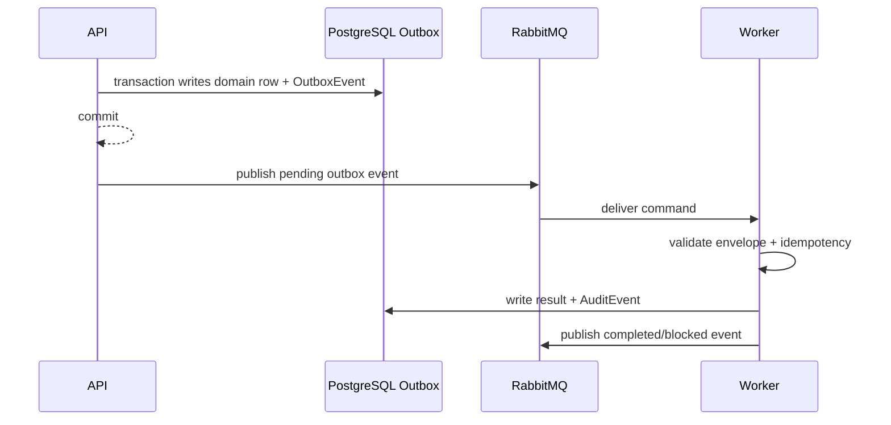

# 07 RabbitMQ Build Spec

## 1. Purpose

Define the canonical RabbitMQ topology, command/event envelope, retry, DLQ and idempotency rules used by all LCSP controlled MVP prototype workers.

## 2. Runtime Ownership

| Concern | Owner |
|---|---|
| Service name | Queue Runtime |
| Module name | `queue` / `outbox` |
| NestJS module | `apps/api/src/modules/outbox/outbox.module.ts` |
| Worker name | `apps/worker/src/queues/rabbitmq.consumer.ts` |
| Database ownership | `OutboxEvent`, `AuditEvent` |
| Queue ownership | all `lcsp.*.v1` exchanges and queues |

## 3. Exact Libraries

| Library | Version strategy | Purpose | Why selected | Alternatives rejected |
|---|---|---|---|---|
| RabbitMQ | local/prod version pinned by runtime docs | Broker | Canonical queue technology | Redis/BullMQ for core workflows |
| `amqplib` or Nest adapter | pinned npm lockfile | publish/consume | Mature RabbitMQ client | HTTP polling |
| Zod | pinned npm lockfile | envelope validation | rejects bad payloads before processing | untyped JSON |
| Prisma | pinned npm lockfile | transactional outbox | command publication after DB commit | direct publish inside transaction |

## 4. Folder Structure

```text
apps/api/src/modules/outbox/
  outbox.module.ts        transactional outbox provider
  outbox.service.ts       append and publish pending commands
  outbox.repository.ts    Prisma access
  dto/                    outbox DTOs
apps/worker/src/queues/
  rabbitmq.consumer.ts    queue binding and dispatch
  retry-policy.ts         retry/DLQ classification
  event-envelope.schema.ts
packages/contracts/src/events/
  envelope.ts
  scan.events.ts
  ai-usage-flow.events.ts
  reconciliation.events.ts
  classification.events.ts
  gap-analysis.events.ts
  document.events.ts
```

## 5. DTO Contracts

### EventEnvelopeDto

```json
{
  "eventId": "018f0000-0000-7000-8000-000000001001",
  "eventType": "command.scan.requested.v1",
  "schemaVersion": 1,
  "occurredAt": "2026-06-20T00:00:00.000Z",
  "correlationId": "018f0000-0000-7000-8000-000000001002",
  "causationId": "018f0000-0000-7000-8000-000000001003",
  "aggregateType": "Assessment",
  "aggregateId": "018f0000-0000-7000-8000-000000000101",
  "producer": "apps/api",
  "payload": { "scanJobId": "018f0000-0000-7000-8000-000000000106" }
}
```

## 6. Database Models

| Model | Fields | Indexes | Unique constraints | Relationships |
|---|---|---|---|---|
| `OutboxEvent` | `id uuid`, `eventType`, `aggregateType`, `aggregateId`, `payload Json`, `status`, `retryCount`, `nextAttemptAt`, `publishedAt`, `correlationId`, `causationId` | `(status,nextAttemptAt)`, `(aggregateId,eventType)` | `id` | created by service transaction |
| `AuditEvent` | `id uuid`, `assessmentId`, `eventType`, `metadata Json`, `correlationId`, `timestamp` | `(assessmentId,eventType,timestamp)` | `id` | records state-changing outcomes |

Example record:

```json
{ "id": "018f0000-0000-7000-8000-000000001004", "eventType": "command.scan.requested.v1", "status": "PENDING", "retryCount": 0, "payload": { "scanJobId": "018f0000-0000-7000-8000-000000000106" } }
```

## 7. RabbitMQ Contracts

| Exchange | Type | Purpose |
|---|---|---|
| `lcsp.commands.v1` | topic | API/outbox commands to workers |
| `lcsp.events.v1` | topic | workflow/domain events |
| `lcsp.deadletter.v1` | topic | messages after retry exhaustion |

| Queue | Routing key | Producer | Consumer | Retry | DLQ |
|---|---|---|---|---|---|
| `lcsp.scan-worker.v1` | `command.scan.requested.v1` | API ScanService | Scan worker | 3 transient | `lcsp.scan-worker.dlq.v1` |
| `lcsp.ai-usage-flow-worker.v1` | `command.ai-usage-flow.requested.v1` | Evidence/API | AIUsageFlow worker | 3 transient | `lcsp.ai-usage-flow-worker.dlq.v1` |
| `lcsp.reconciliation-worker.v1` | `command.reconciliation.requested.v1` | API/worker | Reconciliation worker | 3 transient | `lcsp.reconciliation-worker.dlq.v1` |
| `lcsp.classification-worker.v1` | `command.classification.requested.v1` | API Classification | Classification worker | 3 transient | `lcsp.classification-worker.dlq.v1` |
| `lcsp.gap-analysis-worker.v1` | `command.gap-analysis.requested.v1` | API GapAnalysis | Gap worker | 3 transient | `lcsp.gap-analysis-worker.dlq.v1` |
| `lcsp.document-worker.v1` | `command.document.requested.v1` | API Document | Document worker | 3 transient | `lcsp.document-worker.dlq.v1` |



## 8. Algorithms

Input: committed outbox rows and worker messages.

Processing steps:

1. API service writes domain mutation and outbox row in one transaction.
2. Publisher polls `PENDING` outbox rows.
3. Publisher validates envelope and publishes to `lcsp.commands.v1`.
4. Worker validates envelope and idempotency by `eventId`.
5. Worker classifies error as retryable or non-retryable.
6. Retryable failure is nacked/requeued by policy up to 3.
7. Exhausted retry goes to DLQ.
8. Non-retryable invariant failure becomes blocked state and audit event.

Pseudocode:

```text
for outbox in pendingEvents:
  publish(outbox.exchange, outbox.routingKey, outbox.payload)
  markPublished(outbox.id)

onMessage(msg):
  envelope = validate(msg)
  if alreadyProcessed(envelope.eventId): ack
  try process(envelope)
  catch e if retryable and attempts < 3: retry
  catch e if retryable: deadLetter
  catch e: persistBlockedState; ack
```

## 9. Failure Handling

| Error code | Reason | Recovery strategy |
|---|---|---|
| `EVENT_SCHEMA_INVALID` | bad envelope/payload | reject to DLQ; audit if aggregate known |
| `DUPLICATE_EVENT` | event already processed | ack and no-op |
| `QUEUE_PUBLISH_FAILED` | broker unavailable | keep outbox pending and retry publisher |
| `WORKER_TRANSIENT_FAILURE` | temporary DB/storage/provider issue | retry 3 then DLQ |
| `WORKER_INVARIANT_BLOCKED` | missing prerequisite | persist blocked state; ack |

## 10. Verification

| Command | Expected output | Success criteria |
|---|---|---|
| `npm run test:integration --workspace @lcsp/api` | outbox tests pass | command written and publishable after commit |
| `npm run worker --workspace @lcsp/worker` | `worker.ready` | all queues bound |
| RabbitMQ management UI | queues visible | no DLQ messages on happy path |


## Acceptance Criteria

- Given valid inputs, the component produces the documented DTO, database state, or event.
- Given invalid permissions, state, evidence, citation, or payload schema, the component fails closed with the documented error.
- Given transient infrastructure failure, retry/DLQ or blocked-state behavior follows RabbitMQ and audit contracts.
- Given any output, no raw source, secrets, full prompts, full AST bodies, or unsupported production/legal claims are emitted.
