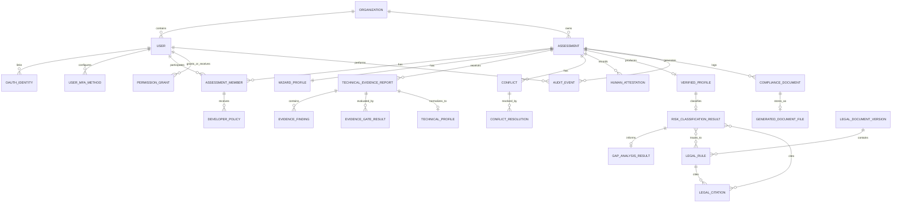

# LCSP ERD / Logical Data Relationship

## Purpose

Tài liệu này mô tả ERD logical/conceptual cho LCSP trước implementation. Không phải physical DB schema, không tạo Prisma schema và không khóa database implementation.

## ERD Scope

ERD bao phủ authentication/MFA, organization, assessment, WizardProfile, technical evidence, reconciliation, classification, document, audit và legal corpus/citation.

## Entity List

| Entity | Purpose | Validation Dependency |
| --- | --- | --- |
| User | Người dùng hệ thống thuộc organization | None |
| OAuthIdentity | Linked OAuth/OIDC identity của user | None |
| UserMfaMethod | Authenticator App MFA method của user | Open Question for recovery |
| Organization | Tenant boundary | None |
| Assessment | Assessment owned by Manager | None |
| AssessmentMember | User membership trong assessment với role Manager/Developer | None |
| DeveloperPolicy | Policy/task scope Manager cấp cho Developer | A3 |
| PermissionGrant | Post-MVP scoped delegated permission grant | A3/Post-MVP |
| WizardProfile | Business/legal truth do Manager submit | A1 |
| TechnicalEvidenceReport | MVP evidence report do GitHub Repository Scan / Scanner tạo; Local/CI/manual source types là Deferred/Future | None |
| EvidenceFinding | Finding kỹ thuật trong report | None |
| EvidenceGateResult | Schema/privacy/quality gate result | A1 |
| TechnicalProfile | Normalized technical truth | None |
| Conflict | Mâu thuẫn giữa WizardProfile và TechnicalProfile | A1/A3 |
| ConflictResolution | Resolution/confirmation cho conflict | A3 |
| HumanAttestation | Structured human attestation | A3 |
| VerifiedProfile | Profile đã reconcile, đủ điều kiện classification | A1/A3 |
| RiskClassificationResult | Risk result có legal rule/citation trace | A2 |
| GapAnalysisResult | Gap analysis dựa trên classification | A2 |
| ComplianceDocument | Report/export metadata | A2/A3 |
| GeneratedDocumentFile | File artifact trong object storage | None |
| AuditEvent | Append-oriented audit event | A3 |
| LegalDocumentVersion | Version của legal corpus/document | A2 |
| LegalRule | Rule có rule_id/source/citation/version | A2 |
| LegalCitation | Citation cụ thể được classification/report dùng | A2 |

## Mermaid ERD

## Entity Descriptions

| Entity | Key Fields | Owner Module | Lifecycle | Important Constraints |
| --- | --- | --- | --- | --- |
| User | id, organization_id, email, display_name, role flags, mfa_enabled, mfa_enabled_at, last_mfa_verified_at, failed_mfa_attempts, locked_until | Authentication | Registered/invited -> active -> disabled | Password/MFA secrets not exposed; user belongs to organization |
| OAuthIdentity | id, user_id, oauth_provider, provider_subject, provider_email, email_verified_at, linked_at, last_login_at, token_metadata_reference | Authentication | linked -> active -> unlinked | No raw provider access token; OAuth login does not grant GitHub repository access |
| UserMfaMethod | id, user_id, method_type=`AUTHENTICATOR_APP`, secret_reference or mfa_secret_encrypted, enabled, enabled_at, last_verified_at | Authentication | setup_started -> enabled -> disabled/reset | Secret not stored plaintext; reset audited |
| Organization | id, name, status | Organization | created -> active -> archived | Tenant boundary |
| Assessment | id, organization_id, owner_manager_id, status, current_state | Assessment | created -> wizard -> evidence -> reconciliation -> classification/report | Manager owns assessment and can complete MVP flow without Developer |
| AssessmentMember | id, assessment_id, user_id, role | Role/Permission | invited -> active -> revoked | MVP exposed roles: Manager, Developer |
| DeveloperPolicy | id, assessment_member_id, policy_code, granted_by, granted_at, revoked_at | Role/Permission | granted -> active -> revoked | Developer only acts within policy |
| PermissionGrant | id, granted_by_manager_id, grantee_user_id, scope_type, scope_id, permission_code, status, expires_at, revoked_at | Role/Permission | granted -> active -> revoked/expired | Delegation never removes Manager permissions; audited |
| WizardProfile | id, assessment_id, purpose, sector, data_type, user_group, user_impact, decision_role, human_oversight, external_llm_usage, submitted_at | Wizard | draft -> submitted -> superseded | A1 validation may change fields/questions |
| TechnicalEvidenceReport | id, assessment_id, source_type=`GITHUB_REPOSITORY_SCAN`, scan_job_id, repository_id, branch, commit_sha, scanner_version, ruleset_version, scan_started_at, scan_completed_at, scan_status, privacy_flags, report_hash | Evidence | repository scan completed -> rejected/insufficient/ready | Required metadata cannot be replaced by attestation; Local/CI/manual source types are Deferred/Future |
| EvidenceFinding | id, report_id, finding_type, severity, confidence, evidence_ref, redaction_status | Evidence | generated/uploaded -> reviewed | No long raw source snippets |
| EvidenceGateResult | id, report_id, gate_type, status, reason, evaluated_at | Evidence Gate | created per gate | Schema rejects; quality may mark insufficient |
| TechnicalProfile | id, report_id, normalized_claims, generated_at | Evidence/Technical Profile | generated from accepted evidence | Input to reconciliation |
| Conflict | id, assessment_id, conflict_type, severity, conflict_score, status | Reconciliation | created -> routed -> resolved/blocked | Material/critical conflict blocks workflow |
| ConflictResolution | id, conflict_id, actor_id, role, resolution_type, claim, reason, confirmed_at | Reconciliation | submitted -> accepted/rejected | Dual confirmation for material/critical |
| HumanAttestation | id, assessment_id, actor_id, role, claim, reason, scope, timestamp, status | Attestation | submitted -> accepted/rejected/used | Cannot replace machine metadata |
| VerifiedProfile | id, assessment_id, source_profile_refs, confirmation_refs, created_at, approved_at | Reconciliation | ready -> approved/superseded | Required before classification |
| RiskClassificationResult | id, verified_profile_id, result, status, rule_trace, legal_corpus_version | Classification | blocked/degraded/final | Requires legal citation trace |
| GapAnalysisResult | id, classification_id, gaps, obligations, status | Gap Analysis | generated -> superseded | Requires valid classification |
| ComplianceDocument | id, assessment_id, document_type, status, version, generated_at | Document | requested -> generated/blocked/failed | Final blocked by unresolved material/critical conflict |
| GeneratedDocumentFile | id, document_id, object_storage_ref, content_hash, retention_class | Document | stored -> retained/expired | Stores generated docs, not raw source |
| AuditEvent | id, assessment_id, actor_id, event_type, object_type, object_id, timestamp, metadata | Audit | appended | Append-oriented; no raw source |
| LegalDocumentVersion | id, source_name, version, effective_date, loaded_at | Legal Corpus | loaded -> active/superseded | A2 validation required |
| LegalRule | id, rule_id, legal_document_version_id, applicability, classification_mapping | Legal Corpus | active/superseded | Critical rule must have citation |
| LegalCitation | id, legal_rule_id, citation_text_ref, source_url_or_ref, section_ref | Legal Corpus | active/superseded | Classification output traces to citation |

## Relationship Descriptions

- Organization has many Users and Assessments.
- Assessment has one current WizardProfile and may have many TechnicalEvidenceReports.
- TechnicalEvidenceReport has many EvidenceFindings and EvidenceGateResults, and may produce one TechnicalProfile.
- Assessment has many Conflicts, ConflictResolutions and HumanAttestations.
- Assessment produces one active VerifiedProfile after gates and reconciliation pass.
- VerifiedProfile produces RiskClassificationResult, then GapAnalysisResult and ComplianceDocument.
- RiskClassificationResult references LegalRules and LegalCitations for traceability.
- Assessment and User produce AuditEvents for material actions.

## Data Ownership by Module

| Module | Owned Data |
| --- | --- |
| M01 Authentication & Account Security | User auth fields, UserMfaMethod, auth AuditEvents |
| M02 Organization & Role Management | Organization, AssessmentMember, DeveloperPolicy |
| M03 Assessment Setup & Web Wizard | Assessment, WizardProfile |
| M04/M05 Evidence | TechnicalEvidenceReport, EvidenceFinding, EvidenceGateResult, TechnicalProfile |
| M06 Reconciliation | Conflict, ConflictResolution, VerifiedProfile |
| M07 Risk/Legal | RiskClassificationResult, LegalDocumentVersion, LegalRule, LegalCitation |
| M08 Document | GapAnalysisResult, ComplianceDocument, GeneratedDocumentFile |
| M09 Audit | AuditEvent |
| M10 Security/Privacy | Privacy flags, redaction metadata, source cleanup audit metadata |

## Security / Retention Notes

- `mfa_secret_reference` or `mfa_secret_encrypted` must not be plaintext.
- Raw source code is not modeled as persistent entity.
- Evidence stores metadata, findings, refs and hashes, not raw source.
- Audit events include metadata and hashes, not raw source or secret values.
- GeneratedDocumentFile stores generated documents and non-source artifacts only.

## Open Data Model Questions

| Question | Dependency |
| --- | --- |
| Whether MFA recovery needs a separate support/admin actor/entity in MVP | Open Question |
| Final WizardProfile field list and enum values | A1 |
| Final LegalRule/LegalCitation shape and corpus versioning model | A2 |
| Final HumanAttestation critical claim catalog | A3 |

## Validation Dependencies

| Assumption | Affected Entities |
| --- | --- |
| A1 | WizardProfile, EvidenceGateResult, Conflict, VerifiedProfile |
| A2 | LegalDocumentVersion, LegalRule, LegalCitation, RiskClassificationResult, GapAnalysisResult, ComplianceDocument |
| A3 | DeveloperPolicy, ConflictResolution, HumanAttestation, AuditEvent |
