# LCSP Flowchart Documentation

## Purpose

Tài liệu này mô tả các flow chính của LCSP ở mức analysis/design. Flowchart dùng Mermaid, không phải implementation plan.

## Overall Assessment Flow

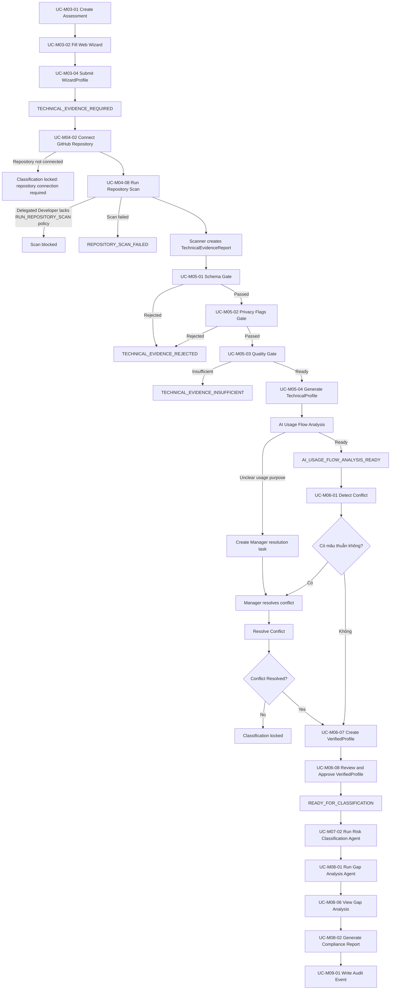

## Login With MFA Flow

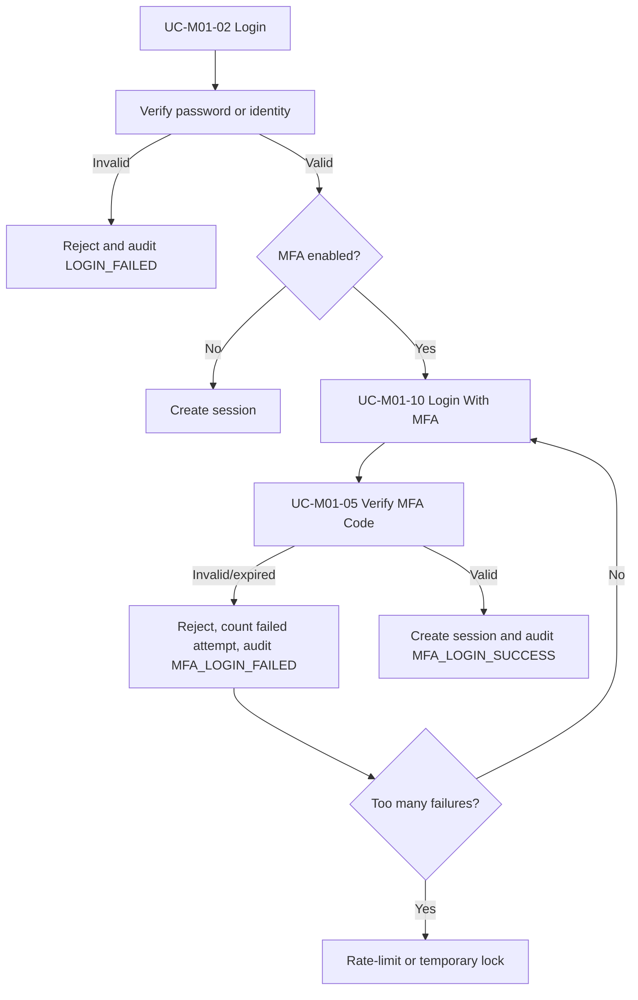

## Setup MFA Using Authenticator App Flow

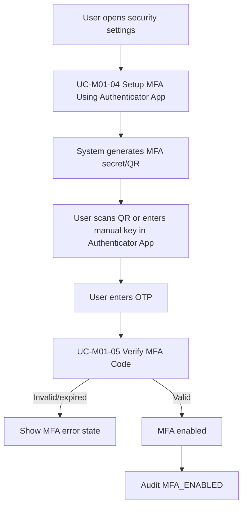

## Manager Wizard Flow

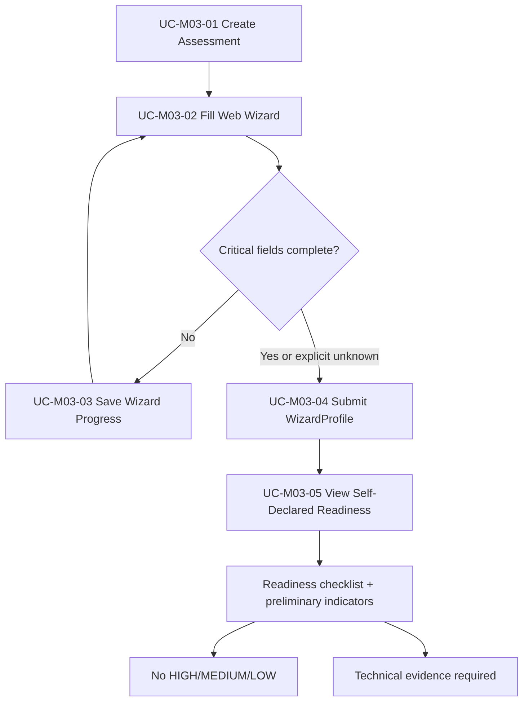

## Manager Repository Scan Flow

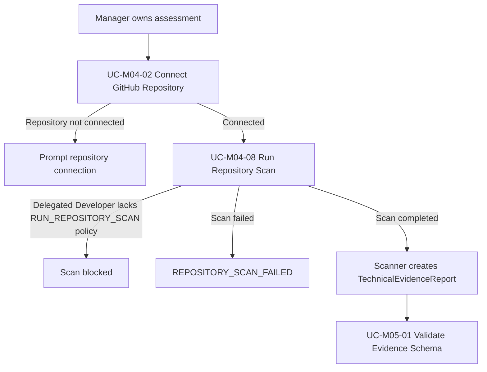

Developer may use the same scan flow only when Manager delegates repository/scan permission. MVP completion does not require Developer invitation.

## Static Analysis Scanner Subsystem Flow

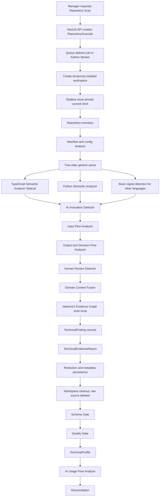

Static-analysis safety: scanner reads/parses source only. It must not execute customer code, run installs/builds/tests/Docker/CI/scripts, probe APIs, persist raw source/full AST/full prompts/secrets, or send raw source/full prompts/secrets to LLM.

## Evidence Gate Flow

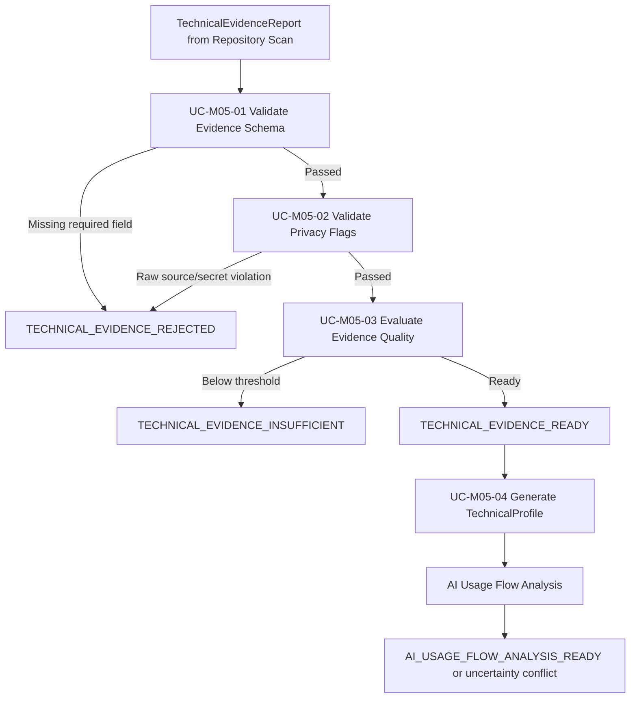

## Deferred / Future Evidence Flow

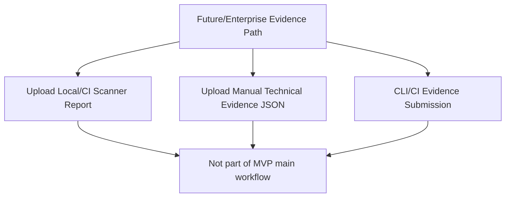

## Reconciliation Flow

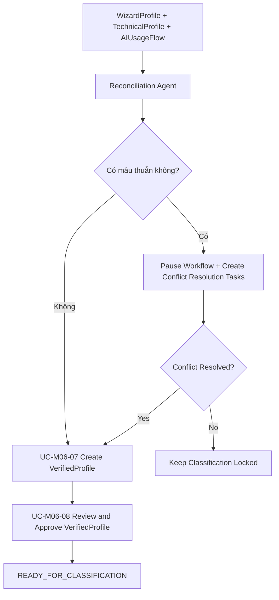

## Risk Classification Flow

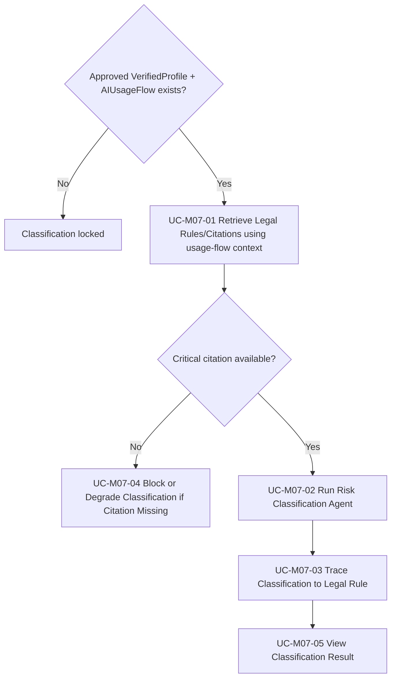

## AI Usage Flow Analysis Flow

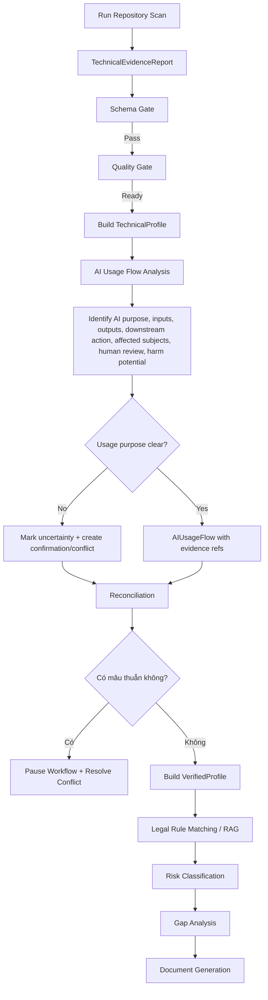

## Report Generation Flow

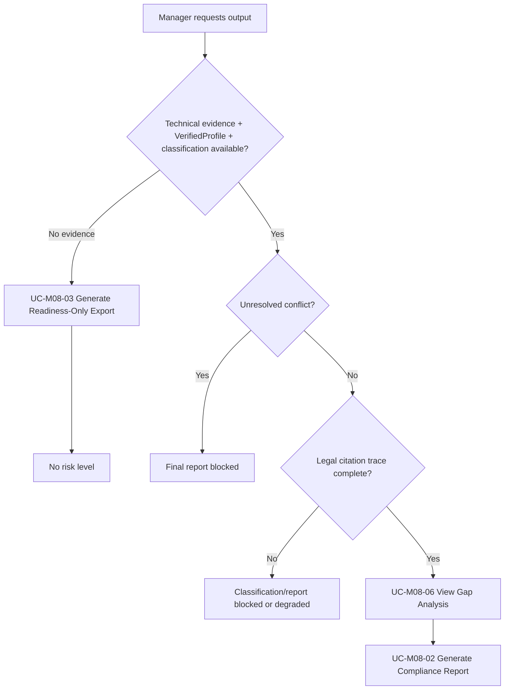

## Human Attestation Flow

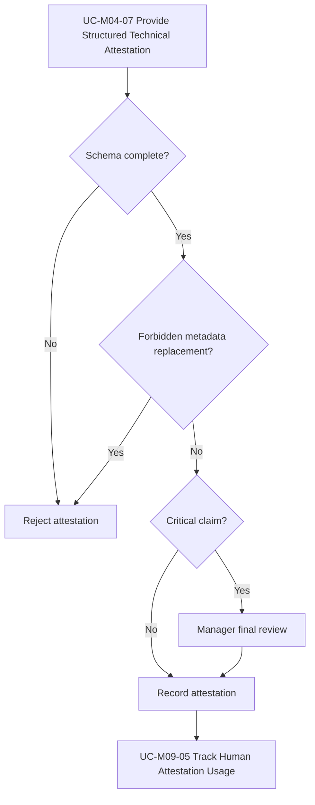

## Blocked State Flow

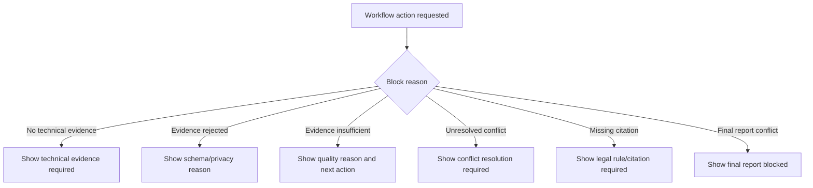

## Validation Dependencies

| Assumption | Affected Flowcharts |
| --- | --- |
| A1 | Manager Wizard Flow, Evidence Gate Flow, Reconciliation Flow, Blocked State Flow |
| A2 | AI Usage Flow Analysis Flow, Risk Classification Flow, Report Generation Flow |
| A3 | Reconciliation Flow, Human Attestation Flow, Report Generation Flow |
