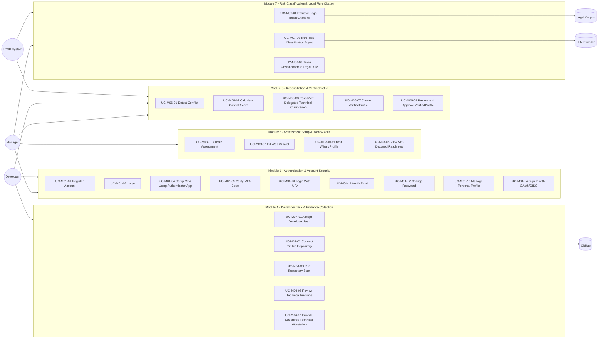

# LCSP Use Case Specification

## Purpose

Tài liệu này chuẩn hóa use case cho LCSP theo module lớn trước implementation. Mỗi use case dùng format Use Case Definition dạng bảng để dễ trace sang FR, BR, UX, flowchart và sequence diagram. Đây là tài liệu analysis/design, không phải backlog và không tạo implementation task.

Trạng thái hiện tại:

```text
PRODUCT_READY_FOR_VALIDATION
READY_FOR_ARCHITECTURE_REVIEW
VALIDATION_READY
IMPLEMENTATION_BACKLOG_BLOCKED
IMPLEMENTATION_NOT_READY
```

## Actor List

| Actor | Vai trò |
| --- | --- |
| Manager | Required and sufficient MVP role; assessment owner; owns business/legal truth; can connect repository, run scan, review technical evidence, resolve all MVP conflicts, approve VerifiedProfile and generate report when gates pass |
| Developer | Optional technical collaborator; receives scoped delegated task/policy from Manager; not required for MVP success path |
| LCSP System | Điều phối workflow, evidence gates, reconciliation, scoring, audit, classification/document jobs |
| GitHub | External repo provider cho GitHub App read-only scan |
| Local/CI Scanner Environment | Deferred/Future enterprise evidence environment, không thuộc MVP main flow |
| LLM Provider | Chỉ nhận VerifiedProfile/normalized evidence/legal context, không nhận raw source code |
| Legal Corpus | Nguồn legal rule/citation có version và traceability |

## Use Case Diagram



## Use Case Summary Table

| Module | Use Case ID | Use Case Name | Primary Roles | Validation Dependency |
| --- | --- | --- | --- | --- |
| M01 | UC-M01-01 | Register Account | Manager/Developer, LCSP System | None |
| M01 | UC-M01-02 | Login | Manager/Developer, LCSP System | None |
| M01 | UC-M01-03 | Logout | Manager/Developer, LCSP System | None |
| M01 | UC-M01-04 | Setup MFA Using Authenticator App | Manager/Developer, LCSP System | None |
| M01 | UC-M01-05 | Verify MFA Code | Manager/Developer, LCSP System | None |
| M01 | UC-M01-06 | Disable MFA | Manager/Developer, LCSP System | None |
| M01 | UC-M01-07 | Reset MFA | Manager/Developer, LCSP System | Open Question |
| M01 | UC-M01-08 | Manage Session | Manager/Developer, LCSP System | None |
| M01 | UC-M01-09 | Reset Password | Manager/Developer, LCSP System | Open Question |
| M01 | UC-M01-10 | Login With MFA | Manager/Developer, LCSP System | None |
| M01 | UC-M01-11 | Verify Email | Manager/Developer, LCSP System | None |
| M01 | UC-M01-12 | Change Password | Manager/Developer, LCSP System | Open Question |
| M01 | UC-M01-13 | Manage Personal Profile | Manager/Developer, LCSP System | Open Question |
| M01 | UC-M01-14 | Sign In with OAuth/OIDC | Manager/Developer, OAuth/OIDC Provider, LCSP System | None |
| M02 | UC-M02-01 | Create Organization | Manager, LCSP System | None |
| M02 | UC-M02-02 | Manage Organization Members | Manager, LCSP System | None |
| M02 | UC-M02-03 | Assign Manager Role | Manager, LCSP System | None |
| M02 | UC-M02-04 | Invite Developer | Manager, Developer, LCSP System | None |
| M02 | UC-M02-05 | Assign Developer Policy | Manager, Developer, LCSP System | A3 |
| M02 | UC-M02-06 | Revoke Developer Access | Manager, LCSP System | A3 |
| M03 | UC-M03-01 | Create Assessment | Manager, LCSP System | None |
| M03 | UC-M03-02 | Fill Web Wizard | Manager, LCSP System | A1 |
| M03 | UC-M03-03 | Save Wizard Progress | Manager, LCSP System | A1 |
| M03 | UC-M03-04 | Submit WizardProfile | Manager, LCSP System | A1 |
| M03 | UC-M03-05 | View Self-Declared Readiness | Manager, LCSP System | A1 |
| M03 | UC-M03-06 | View Preliminary Indicators | Manager, LCSP System | A1 |
| M04 | UC-M04-01 | Accept Developer Task | Developer, LCSP System | None |
| M04 | UC-M04-02 | Connect GitHub Repository | Manager; optional delegated Developer; GitHub; LCSP System | None |
| M04 | UC-M04-05 | Review Technical Findings | Manager; optional delegated Developer; LCSP System | None |
| M04 | UC-M04-06 | Confirm Technical Truth | Developer, LCSP System | A3 |
| M04 | UC-M04-07 | Provide Structured Technical Attestation | Developer, LCSP System | A3 |
| M04 | UC-M04-08 | Run Repository Scan | Manager; optional delegated Developer; LCSP System | None |
| M05 | UC-M05-01 | Validate Evidence Schema | LCSP System | None |
| M05 | UC-M05-02 | Validate Privacy Flags | LCSP System | None |
| M05 | UC-M05-03 | Evaluate Evidence Quality | LCSP System | A1 |
| M05 | UC-M05-04 | Generate TechnicalProfile | LCSP System | None |
| M05 | UC-M05-05 | Mark Evidence as Rejected, Insufficient, or Ready | LCSP System | A1 |
| M06 | UC-M06-01 | Detect Conflict | LCSP System | A1/A3 |
| M06 | UC-M06-02 | Calculate Conflict Score | LCSP System | A1/A3 |
| M06 | UC-M06-03 | Route Conflict to Manager | LCSP System; Manager | A3 |
| M06 | UC-M06-04 | Resolve Technical Conflict | Manager; optional delegated Developer input; LCSP System | A3 |
| M06 | UC-M06-05 | Resolve Business/Legal Conflict | Manager, LCSP System | A3 |
| M06 | UC-M06-06 | Post-MVP Delegated Technical Clarification | Manager, optional Developer, LCSP System | A3/Post-MVP |
| M06 | UC-M06-07 | Create VerifiedProfile | LCSP System | A1/A3 |
| M06 | UC-M06-08 | Review and Approve VerifiedProfile | Manager, LCSP System | A1/A3 |
| M07 | UC-M07-01 | Retrieve Legal Rules/Citations | LCSP System, Legal Corpus | A2 |
| M07 | UC-M07-02 | Run Risk Classification Agent | LCSP System, LLM Provider | A2 |
| M07 | UC-M07-03 | Trace Classification to Legal Rule | LCSP System, Legal Corpus | A2 |
| M07 | UC-M07-04 | Block or Degrade Classification if Citation Missing | LCSP System, Legal Corpus | A2 |
| M07 | UC-M07-05 | View Classification Result | Manager, LCSP System | A2 |
| M08 | UC-M08-01 | Run Gap Analysis Agent | LCSP System | A2 |
| M08 | UC-M08-02 | Generate Compliance Report | Manager, LCSP System | A2/A3 |
| M08 | UC-M08-03 | Generate Readiness-Only Export | Manager, LCSP System | A1 |
| M08 | UC-M08-04 | View Document Status | Manager, LCSP System | None |
| M08 | UC-M08-05 | Download Generated Document | Manager, LCSP System | None |
| M08 | UC-M08-06 | View Gap Analysis | Manager, LCSP System | A2 |
| M09 | UC-M09-01 | Write Audit Event | LCSP System | A3 |
| M09 | UC-M09-02 | View Audit Trail | Manager, LCSP System | A3 |
| M09 | UC-M09-03 | Export Audit Trail | Manager, LCSP System | A3 |
| M09 | UC-M09-04 | Track Evidence, Report, and Document Version | LCSP System | A2/A3 |
| M09 | UC-M09-05 | Track Human Attestation Usage | LCSP System | A3 |
| M10 | UC-M10-01 | Enforce Source Code Privacy Policy | LCSP System | None |
| M10 | UC-M10-02 | Redact Secrets | LCSP System | None |
| M10 | UC-M10-03 | Clean Temporary Workspace | LCSP System | None |
| M10 | UC-M10-04 | Enforce No Raw Source to LLM | LCSP System | None |
| M10 | UC-M10-05 | Enforce No Long-Term Raw Source Storage | LCSP System | None |

## Module 1 — Authentication & Account Security

# Use Case: `UC-M01-01 — Register Account`

| Field | Content |
| --- | --- |
| Description | Người dùng tạo tài khoản LCSP qua signup hoặc invite path được phép. Tài khoản chỉ được tạo khi danh tính và organization/invite context hợp lệ. |
| Primary Roles | Manager/Developer; LCSP System |
| Pre-Conditions | Email hoặc identity chưa bị trùng trong scope áp dụng; organization/invite path hợp lệ; password auth hoặc enterprise identity path đã được cấu hình. |
| Trigger | Người dùng mở trang đăng ký hoặc nhận invite vào LCSP. |

## Basic Flow

| Step | Interaction |
| --- | --- |
| 1 | Người dùng nhập email/identity, thông tin hồ sơ tối thiểu và mật khẩu nếu password auth được dùng. |
| 2 | LCSP System kiểm tra identity, invite/organization context và password policy nếu áp dụng. |
| 3 | LCSP System tạo User ở trạng thái phù hợp với verification policy. |
| 4 | LCSP System ghi audit event `USER_REGISTERED`. |

## Alternative / Exception Flow

| Step | Interaction |
| --- | --- |
| 1A | Nếu email/identity đã tồn tại, LCSP System gợi ý đăng nhập hoặc reset password. |
| 2A | Nếu password yếu hoặc invite invalid, LCSP System từ chối tạo tài khoản và hiển thị lỗi cụ thể. |

## Post-Conditions

| Type | Content |
| --- | --- |
| Success | User account được tạo và có thể tiếp tục verification/login theo policy. |
| Failure / Exception | Account không được tạo nếu identity, invite hoặc password policy không hợp lệ. |
| Audit | `USER_REGISTERED` được ghi khi account được tạo. |

# Use Case: `UC-M01-02 — Login`

| Field | Content |
| --- | --- |
| Description | Người dùng xác thực bằng password hoặc enterprise identity path. Nếu account bật MFA, use case chuyển sang `UC-M01-10 — Login With MFA`. |
| Primary Roles | Manager/Developer; LCSP System |
| Pre-Conditions | Account tồn tại và chưa bị khóa; authentication method được cấu hình. |
| Trigger | Người dùng gửi thông tin đăng nhập. |

## Basic Flow

| Step | Interaction |
| --- | --- |
| 1 | Người dùng nhập credentials hoặc hoàn tất enterprise identity step. |
| 2 | LCSP System xác thực identity và kiểm tra trạng thái account/session policy. |
| 3 | Nếu MFA chưa bật, LCSP System tạo session hợp lệ. |
| 4 | LCSP System ghi audit event `LOGIN_SUCCESS`. |

## Alternative / Exception Flow

| Step | Interaction |
| --- | --- |
| 1A | Nếu credentials sai, LCSP System từ chối login, tăng failed attempt và ghi `LOGIN_FAILED`. |
| 2A | Nếu MFA đã bật, LCSP System tạo MFA challenge và chuyển sang `UC-M01-10 — Login With MFA`. |

## Post-Conditions

| Type | Content |
| --- | --- |
| Success | Session được tạo nếu authentication hoàn tất và không cần MFA. |
| Failure / Exception | Login bị từ chối hoặc bị rate-limit/temporary lock nếu thất bại nhiều lần. |
| Audit | `LOGIN_SUCCESS` hoặc `LOGIN_FAILED` được ghi. |

# Use Case: `UC-M01-03 — Logout`

| Field | Content |
| --- | --- |
| Description | Người dùng kết thúc session hiện tại để rời khỏi LCSP Workspace. |
| Primary Roles | Manager/Developer; LCSP System |
| Pre-Conditions | Session đang active hoặc token còn hiệu lực. |
| Trigger | Người dùng chọn logout hoặc session bị revoke. |

## Basic Flow

| Step | Interaction |
| --- | --- |
| 1 | Người dùng chọn logout. |
| 2 | LCSP System invalidates session/token hiện tại. |
| 3 | LCSP System đưa người dùng về trạng thái chưa authenticated. |
| 4 | LCSP System ghi audit event `LOGOUT`. |

## Alternative / Exception Flow

| Step | Interaction |
| --- | --- |
| 1A | Nếu session đã hết hạn, LCSP System xử lý idempotent và không tạo quyền truy cập mới. |
| 2A | Nếu revoke token thất bại tạm thời, LCSP System ghi lỗi vận hành và không cho tiếp tục protected action. |

## Post-Conditions

| Type | Content |
| --- | --- |
| Success | Session bị kết thúc và protected endpoints yêu cầu login lại. |
| Failure / Exception | Session không được gia hạn hoặc tái sử dụng nếu logout/revoke không hoàn tất rõ ràng. |
| Audit | `LOGOUT` hoặc session security event được ghi. |

# Use Case: `UC-M01-04 — Setup MFA Using Authenticator App`

| Field | Content |
| --- | --- |
| Description | Người dùng bắt đầu thiết lập Authenticator App MFA bằng app tương thích TOTP như Google Authenticator, Microsoft Authenticator, 1Password hoặc Authy. MFA chưa được bật cho đến khi OTP được verify. |
| Primary Roles | Manager/Developer; LCSP System |
| Pre-Conditions | Người dùng đã authenticated; account chưa bị khóa; MFA setup policy cho phép bật Authenticator App MFA. |
| Trigger | Người dùng mở Security Settings và chọn setup Authenticator App MFA. |

## Basic Flow

| Step | Interaction |
| --- | --- |
| 1 | Người dùng chọn setup Authenticator App MFA. |
| 2 | LCSP System tạo MFA setup secret/QR code và manual key dùng một lần cho enrollment. |
| 3 | Người dùng scan QR hoặc nhập manual key vào Authenticator App. |
| 4 | LCSP System ghi audit event `MFA_SETUP_STARTED`. |

## Alternative / Exception Flow

| Step | Interaction |
| --- | --- |
| 1A | Nếu người dùng hủy setup trước khi verify OTP, LCSP System giữ MFA ở trạng thái chưa bật. |
| 2A | Nếu không tạo được setup secret/QR, LCSP System không lưu MFA method và hiển thị lỗi. |

## Post-Conditions

| Type | Content |
| --- | --- |
| Success | MFA setup ở trạng thái pending verification, chờ `UC-M01-05 — Verify MFA Code`. |
| Failure / Exception | MFA không được bật nếu setup chưa có OTP hợp lệ. |
| Audit | `MFA_SETUP_STARTED` được ghi. |

# Use Case: `UC-M01-05 — Verify MFA Code`

| Field | Content |
| --- | --- |
| Description | LCSP xác thực OTP TOTP từ Authenticator App cho setup hoặc login MFA. Use case này không dùng SMS-based OTP. |
| Primary Roles | Manager/Developer; LCSP System |
| Pre-Conditions | Có MFA setup pending hoặc MFA login challenge pending; người dùng có Authenticator App đã enroll/scan secret. |
| Trigger | Người dùng nhập OTP từ Authenticator App. |

## Basic Flow

| Step | Interaction |
| --- | --- |
| 1 | Người dùng nhập mã OTP hiện tại từ Authenticator App. |
| 2 | LCSP System kiểm tra OTP theo TOTP validity window và replay policy. |
| 3 | Nếu OTP hợp lệ cho setup, LCSP System bật MFA cho account. |
| 4 | LCSP System ghi `MFA_ENABLED` hoặc `MFA_LOGIN_SUCCESS` tùy context. |

## Alternative / Exception Flow

| Step | Interaction |
| --- | --- |
| 1A | Nếu OTP sai hoặc hết hạn, LCSP System từ chối và ghi `MFA_LOGIN_FAILED`. |
| 2A | Nếu sai nhiều lần, LCSP System rate-limit hoặc khóa tạm thời theo policy. |

## Post-Conditions

| Type | Content |
| --- | --- |
| Success | MFA được bật hoặc login MFA được hoàn tất. |
| Failure / Exception | MFA không được bật/session không được tạo nếu OTP không hợp lệ. |
| Audit | `MFA_ENABLED`, `MFA_LOGIN_SUCCESS` hoặc `MFA_LOGIN_FAILED` được ghi. |

# Use Case: `UC-M01-06 — Disable MFA`

| Field | Content |
| --- | --- |
| Description | Người dùng tắt Authenticator App MFA sau khi re-authentication và OTP confirmation thành công. |
| Primary Roles | Manager/Developer; LCSP System |
| Pre-Conditions | Account đã bật MFA; user có active session; re-authentication policy khả dụng. |
| Trigger | Người dùng yêu cầu disable MFA trong Security Settings. |

## Basic Flow

| Step | Interaction |
| --- | --- |
| 1 | Người dùng chọn disable MFA. |
| 2 | LCSP System yêu cầu re-authentication và OTP từ Authenticator App. |
| 3 | LCSP System xác thực re-authentication/OTP và disable MFA method. |
| 4 | LCSP System ghi audit event `MFA_DISABLED`. |

## Alternative / Exception Flow

| Step | Interaction |
| --- | --- |
| 1A | Nếu re-authentication thiếu hoặc OTP sai, LCSP System từ chối disable MFA. |
| 2A | Nếu user mất Authenticator App, LCSP System chuyển sang recovery flow `UC-M01-07 — Reset MFA`. |

## Post-Conditions

| Type | Content |
| --- | --- |
| Success | MFA method bị disable và lần login sau không yêu cầu Authenticator App OTP trừ khi bật lại. |
| Failure / Exception | MFA vẫn bật nếu re-authentication hoặc OTP không hợp lệ. |
| Audit | `MFA_DISABLED` được ghi khi disable thành công; failure event được ghi nếu cần. |

# Use Case: `UC-M01-07 — Reset MFA`

| Field | Content |
| --- | --- |
| Description | Người dùng yêu cầu reset Authenticator App MFA khi không còn truy cập được app/code. Recovery không được bypass authentication policy. |
| Primary Roles | Manager/Developer; LCSP System; Support/Admin policy |
| Pre-Conditions | MFA đang bật; recovery policy đã được định nghĩa; identity verification path khả dụng. |
| Trigger | Người dùng yêu cầu reset MFA. |

## Basic Flow

| Step | Interaction |
| --- | --- |
| 1 | Người dùng gửi yêu cầu reset MFA. |
| 2 | LCSP System tạo recovery case hoặc yêu cầu support/admin verification theo policy. |
| 3 | Recovery authority xác minh danh tính và phê duyệt reset nếu hợp lệ. |
| 4 | LCSP System reset MFA method và ghi `MFA_RESET_COMPLETED`. |

## Alternative / Exception Flow

| Step | Interaction |
| --- | --- |
| 1A | Nếu verification fail, LCSP System từ chối reset và giữ MFA hiện tại. |
| 2A | Nếu recovery owner chưa được chốt cho MVP, use case giữ trạng thái Open Question trước backlog. |

## Post-Conditions

| Type | Content |
| --- | --- |
| Success | MFA method được reset theo recovery policy; user cần setup MFA lại nếu policy yêu cầu. |
| Failure / Exception | MFA không bị reset nếu verification không đạt hoặc recovery policy chưa hợp lệ. |
| Audit | `MFA_RESET_REQUESTED` và `MFA_RESET_COMPLETED` được ghi khi tương ứng. |

# Use Case: `UC-M01-08 — Manage Session`

| Field | Content |
| --- | --- |
| Description | LCSP quản lý session lifetime, refresh và expiration cho Manager/Developer. |
| Primary Roles | Manager/Developer; LCSP System |
| Pre-Conditions | User có session active hoặc refreshable. |
| Trigger | Người dùng tiếp tục sử dụng app, refresh session hoặc session hết hạn. |

## Basic Flow

| Step | Interaction |
| --- | --- |
| 1 | Người dùng gọi protected action. |
| 2 | LCSP System kiểm tra session validity, expiration và revoked status. |
| 3 | LCSP System refresh session nếu policy cho phép. |
| 4 | LCSP System ghi session security event nếu session refresh/expire/revoke. |

## Alternative / Exception Flow

| Step | Interaction |
| --- | --- |
| 1A | Nếu session hết hạn, LCSP System yêu cầu login lại. |
| 2A | Nếu user bật MFA nhưng chưa pass OTP cho session hiện tại, LCSP System yêu cầu MFA verification. |

## Post-Conditions

| Type | Content |
| --- | --- |
| Success | Session hợp lệ được tiếp tục hoặc refresh theo policy. |
| Failure / Exception | Protected action bị từ chối nếu session invalid/expired/revoked. |
| Audit | `SESSION_REFRESHED`, `SESSION_EXPIRED` hoặc security event tương ứng được ghi khi cần. |

# Use Case: `UC-M01-09 — Reset Password`

| Field | Content |
| --- | --- |
| Description | User reset password cho password-auth account khi quên hoặc cần đổi credential. |
| Primary Roles | Manager/Developer; LCSP System |
| Pre-Conditions | Password auth nằm trong scope; email/identity tồn tại; reset service khả dụng. |
| Trigger | User chọn reset password. |

## Basic Flow

| Step | Interaction |
| --- | --- |
| 1 | User gửi yêu cầu reset password. |
| 2 | LCSP System tạo reset token ngắn hạn và gửi recovery instruction. |
| 3 | User đặt password mới đạt policy. |
| 4 | LCSP System cập nhật password và ghi `PASSWORD_RESET_COMPLETED`. |

## Alternative / Exception Flow

| Step | Interaction |
| --- | --- |
| 1A | Nếu token hết hạn hoặc đã dùng, LCSP System từ chối reset. |
| 2A | Nếu account dùng SSO, LCSP System chuyển hướng về IdP thay vì reset nội bộ. |

## Post-Conditions

| Type | Content |
| --- | --- |
| Success | Password được cập nhật và các session cũ có thể bị revoke theo policy. |
| Failure / Exception | Password không đổi nếu token hoặc password mới không hợp lệ. |
| Audit | `PASSWORD_RESET_REQUESTED` và `PASSWORD_RESET_COMPLETED` được ghi. |

# Use Case: `UC-M01-10 — Login With MFA`

| Field | Content |
| --- | --- |
| Description | Người dùng có MFA enabled hoàn tất bước đăng nhập bằng OTP từ Authenticator App/TOTP sau khi password hoặc identity step đã pass. |
| Primary Roles | Manager/Developer; LCSP System |
| Pre-Conditions | Account tồn tại, password/identity đã được xác thực, MFA enabled và MFA challenge pending. |
| Trigger | LCSP System yêu cầu Authenticator App code sau bước login đầu tiên. |

## Basic Flow

| Step | Interaction |
| --- | --- |
| 1 | Người dùng nhập OTP hiện tại từ Authenticator App. |
| 2 | LCSP System verify OTP theo TOTP window, replay prevention và failed attempt policy. |
| 3 | LCSP System tạo session nếu OTP hợp lệ. |
| 4 | LCSP System ghi audit event `MFA_LOGIN_SUCCESS`. |

## Alternative / Exception Flow

| Step | Interaction |
| --- | --- |
| 1A | Nếu OTP sai hoặc hết hạn, LCSP System từ chối session và ghi `MFA_LOGIN_FAILED`. |
| 2A | Nếu sai nhiều lần, LCSP System rate-limit hoặc temporary lock account/session challenge. |

## Post-Conditions

| Type | Content |
| --- | --- |
| Success | Authenticated session được tạo sau khi OTP hợp lệ. |
| Failure / Exception | Session không được tạo nếu OTP không hợp lệ hoặc challenge hết hạn. |
| Audit | `MFA_LOGIN_SUCCESS` hoặc `MFA_LOGIN_FAILED` được ghi. |

# Use Case: `UC-M01-11 — Verify Email`

| Field | Content |
| --- | --- |
| Description | Người dùng xác thực email sau khi đăng ký hoặc khi email được thay đổi. Use case này hoàn tất identity verification tối thiểu cho password-auth account. |
| Primary Roles | Manager/Developer; LCSP System |
| Pre-Conditions | Tài khoản đang ở trạng thái chờ xác thực email; verification token còn hiệu lực. |
| Trigger | Người dùng mở verification link hoặc nhập verification token. |

## Basic Flow

| Step | Interaction |
| --- | --- |
| 1 | Người dùng mở verification link từ email. |
| 2 | LCSP System kiểm tra token, email và account state. |
| 3 | LCSP System đánh dấu email verified nếu token hợp lệ. |
| 4 | LCSP System ghi `EMAIL_VERIFIED`. |

## Alternative / Exception Flow

| Step | Interaction |
| --- | --- |
| 1A | Nếu token hết hạn hoặc đã dùng, LCSP System yêu cầu gửi lại email xác thực. |
| 2A | Nếu email/account không khớp token, LCSP System từ chối verification. |

## Post-Conditions

| Type | Content |
| --- | --- |
| Success | Email được verified và account có thể tiếp tục onboarding trong scope được phép. |
| Failure / Exception | Account vẫn ở trạng thái chờ xác thực nếu token invalid/expired. |
| Audit | `EMAIL_VERIFIED` hoặc `EMAIL_VERIFICATION_FAILED` được ghi. |

# Use Case: `UC-M01-12 — Change Password`

| Field | Content |
| --- | --- |
| Description | Người dùng password-auth đổi mật khẩu khi đã đăng nhập và vượt qua re-authentication nếu policy yêu cầu. |
| Primary Roles | Manager/Developer; LCSP System |
| Pre-Conditions | User có password-auth account; session hợp lệ; current password hoặc re-authentication hợp lệ. |
| Trigger | User mở security settings và chọn Change Password. |

## Basic Flow

| Step | Interaction |
| --- | --- |
| 1 | User nhập current password, new password và password confirmation. |
| 2 | LCSP System kiểm tra current password/re-authentication. |
| 3 | LCSP System kiểm tra new password đạt policy và không mismatch confirmation. |
| 4 | LCSP System cập nhật password credential và ghi `PASSWORD_CHANGED`. |

## Alternative / Exception Flow

| Step | Interaction |
| --- | --- |
| 1A | Nếu current password sai, LCSP System reject và count failed attempt theo policy. |
| 2A | Nếu new password yếu hoặc confirmation mismatch, LCSP System hiển thị lỗi cụ thể. |
| 3A | Nếu account do enterprise identity provider quản lý, LCSP System chuyển user về IdP flow thay vì đổi local password. |

## Post-Conditions

| Type | Content |
| --- | --- |
| Success | Password được đổi và session/security policy được cập nhật theo cấu hình. |
| Failure / Exception | Password không đổi nếu re-authentication hoặc password policy fail. |
| Audit | `PASSWORD_CHANGED` hoặc `PASSWORD_CHANGE_FAILED` được ghi. |

# Use Case: `UC-M01-13 — Manage Personal Profile`

| Field | Content |
| --- | --- |
| Description | User quản lý thông tin hồ sơ cá nhân tối thiểu như tên hiển thị và timezone, không thay đổi role/policy/assessment ownership. |
| Primary Roles | Manager/Developer; LCSP System |
| Pre-Conditions | User đã đăng nhập; session hợp lệ. |
| Trigger | User mở personal profile settings. |

## Basic Flow

| Step | Interaction |
| --- | --- |
| 1 | User mở profile settings. |
| 2 | User cập nhật allowed profile fields. |
| 3 | LCSP System validate field format và ownership. |
| 4 | LCSP System lưu thay đổi và ghi `PROFILE_UPDATED`. |

## Alternative / Exception Flow

| Step | Interaction |
| --- | --- |
| 1A | Nếu user cố đổi email, LCSP System chuyển sang email verification flow nếu email change được scope. |
| 2A | Nếu user cố đổi role/organization/assessment permissions từ profile, LCSP System reject. |

## Post-Conditions

| Type | Content |
| --- | --- |
| Success | Allowed profile fields được cập nhật. |
| Failure / Exception | Không thay đổi role, policy hoặc ownership từ profile screen. |
| Audit | `PROFILE_UPDATED` hoặc `PROFILE_UPDATE_REJECTED` được ghi. |

# Use Case: `UC-M01-14 — Sign In with OAuth/OIDC`

| Field | Content |
| --- | --- |
| Description | User đăng nhập LCSP bằng OAuth/OIDC provider được cấu hình. OAuth/OIDC xác thực identity vào LCSP, không kết nối GitHub repository và không cấp repository scan permission. |
| Primary Roles | Manager/Developer; OAuth/OIDC Provider; LCSP System |
| Pre-Conditions | OAuth/OIDC provider đã được cấu hình; redirect URI hợp lệ; user chưa bị khóa; LCSP session policy active. |
| Trigger | User chọn Sign in with OAuth/OIDC trên login screen. |

## Basic Flow

| Step | Interaction |
| --- | --- |
| 1 | User chọn OAuth/OIDC provider. |
| 2 | LCSP System tạo authorization request dùng authorization code flow with PKCE, `state` và `nonce`. |
| 3 | LCSP System redirect user đến provider. |
| 4 | Provider xác thực user và redirect callback về LCSP. |
| 5 | LCSP System validate callback, redirect URI, `state`, `nonce`, issuer, audience và token expiry theo provider policy. |
| 6 | LCSP System tìm hoặc tạo linked LCSP account theo account-linking policy, không link chỉ dựa trên email chưa verified. |
| 7 | Nếu user có TOTP MFA enabled trong LCSP, LCSP System chuyển sang MFA challenge trước khi tạo session. |
| 8 | LCSP System tạo LCSP session theo session/security policy và ghi audit event. |

## Alternative / Exception Flow

| Step | Interaction |
| --- | --- |
| 1A | Nếu provider chưa cấu hình, LCSP System không hiển thị hoặc reject login method. |
| 4A | Nếu callback thiếu/sai `state`, `nonce`, issuer, audience hoặc token expiry, LCSP System reject và ghi `OAUTH_CALLBACK_VALIDATION_FAILED`. |
| 5A | Nếu account linking không an toàn hoặc email chưa verified, LCSP System yêu cầu linking policy/verification thay vì auto-link. |
| 6A | Nếu MFA enabled nhưng OTP invalid/expired, LCSP System không tạo session. |
| 7A | OAuth/OIDC login không tự tạo GitHub App connection, không cấp `CONNECT_REPOSITORY` hoặc `RUN_REPOSITORY_SCAN`. |

## Post-Conditions

| Type | Content |
| --- | --- |
| Success | LCSP session được tạo sau khi identity, linking policy, session policy và MFA policy nếu có đều pass. |
| Failure / Exception | Session không được tạo nếu callback invalid, account linking unsafe hoặc MFA fail. |
| Audit | `OAUTH_LOGIN_SUCCESS`, `OAUTH_LOGIN_FAILED`, `OAUTH_ACCOUNT_LINKED` hoặc `OAUTH_CALLBACK_VALIDATION_FAILED` được ghi, không log raw provider token. |

## Module 2 — Organization & Role Management

# Use Case: `UC-M02-01 — Create Organization`

| Field | Content |
| --- | --- |
| Description | Manager tạo organization làm tenant boundary cho users và assessments. |
| Primary Roles | Manager; LCSP System |
| Pre-Conditions | Manager đã authenticated; user chưa bị khóa; organization creation policy cho phép. |
| Trigger | Manager bắt đầu tenant setup hoặc tạo organization mới. |

## Basic Flow

| Step | Interaction |
| --- | --- |
| 1 | Manager nhập thông tin organization. |
| 2 | LCSP System kiểm tra uniqueness và tenant policy. |
| 3 | LCSP System tạo Organization và liên kết Manager. |
| 4 | LCSP System ghi `ORGANIZATION_CREATED`. |

## Alternative / Exception Flow

| Step | Interaction |
| --- | --- |
| 1A | Nếu organization đã tồn tại, LCSP System từ chối hoặc đề xuất join/invite path. |
| 2A | Nếu user không có quyền tạo tenant, LCSP System chặn action. |

## Post-Conditions

| Type | Content |
| --- | --- |
| Success | Organization tồn tại và Manager thuộc organization. |
| Failure / Exception | Organization không được tạo nếu invalid hoặc unauthorized. |
| Audit | `ORGANIZATION_CREATED` được ghi. |

# Use Case: `UC-M02-02 — Manage Organization Members`

| Field | Content |
| --- | --- |
| Description | Manager quản lý member trong organization trong phạm vi MVP cho phép. |
| Primary Roles | Manager; LCSP System |
| Pre-Conditions | Manager thuộc organization và có quyền quản lý member. |
| Trigger | Manager mở member management. |

## Basic Flow

| Step | Interaction |
| --- | --- |
| 1 | Manager xem danh sách member organization. |
| 2 | Manager thêm, cập nhật hoặc remove member theo policy. |
| 3 | LCSP System áp dụng organization boundary và cập nhật membership. |
| 4 | LCSP System ghi `ORG_MEMBER_UPDATED`. |

## Alternative / Exception Flow

| Step | Interaction |
| --- | --- |
| 1A | Nếu target user ngoài organization boundary, LCSP System từ chối. |
| 2A | Nếu member đang liên quan assessment active, LCSP System có thể yêu cầu revoke assessment access trước. |

## Post-Conditions

| Type | Content |
| --- | --- |
| Success | Membership được cập nhật trong organization boundary. |
| Failure / Exception | Không có thay đổi nếu action unauthorized hoặc vi phạm boundary. |
| Audit | `ORG_MEMBER_UPDATED` được ghi. |

# Use Case: `UC-M02-03 — Assign Manager Role`

| Field | Content |
| --- | --- |
| Description | Manager role được gán cho organization member để người đó có thể sở hữu assessment. |
| Primary Roles | Manager; LCSP System |
| Pre-Conditions | Target user là organization member hợp lệ; role assignment policy cho phép. |
| Trigger | Manager/admin authority gán Manager role. |

## Basic Flow

| Step | Interaction |
| --- | --- |
| 1 | Actor có quyền chọn organization member. |
| 2 | LCSP System kiểm tra membership và role policy. |
| 3 | LCSP System gán Manager role. |
| 4 | LCSP System ghi `ROLE_ASSIGNED`. |

## Alternative / Exception Flow

| Step | Interaction |
| --- | --- |
| 1A | Nếu user không thuộc organization, LCSP System từ chối. |
| 2A | Nếu actor không có quyền role assignment, LCSP System chặn action. |

## Post-Conditions

| Type | Content |
| --- | --- |
| Success | User có Manager role trong organization/assessment scope phù hợp. |
| Failure / Exception | Role không đổi nếu membership hoặc permission không hợp lệ. |
| Audit | `ROLE_ASSIGNED` được ghi. |

# Use Case: `UC-M02-04 — Invite Developer`

| Field | Content |
| --- | --- |
| Description | Manager mời Developer vào một assessment cụ thể để thực hiện technical task. |
| Primary Roles | Manager; Developer; LCSP System |
| Pre-Conditions | Assessment tồn tại; Manager owns assessment; technical evidence hoặc task cần Developer. |
| Trigger | Manager chọn invite Developer. |

## Basic Flow

| Step | Interaction |
| --- | --- |
| 1 | Manager nhập Developer identity/email. |
| 2 | LCSP System tạo assessment-scoped invitation. |
| 3 | LCSP System gửi invite/task cho Developer. |
| 4 | LCSP System ghi `DEVELOPER_INVITED`. |

## Alternative / Exception Flow

| Step | Interaction |
| --- | --- |
| 1A | Nếu email invalid hoặc ngoài organization policy, LCSP System từ chối. |
| 2A | Nếu Developer đã được invite, LCSP System cho phép resend hoặc giữ invitation hiện tại. |

## Post-Conditions

| Type | Content |
| --- | --- |
| Success | Developer được invite vào assessment nhưng chưa có Manager permissions. |
| Failure / Exception | Không tạo invitation nếu Manager không sở hữu assessment hoặc identity invalid. |
| Audit | `DEVELOPER_INVITED` được ghi. |

# Use Case: `UC-M02-05 — Assign Developer Policy`

| Field | Content |
| --- | --- |
| Description | Manager cấp policy/task scope cho Developer để Developer chỉ làm việc trong technical scope được giao. |
| Primary Roles | Manager; Developer; LCSP System |
| Pre-Conditions | Developer đã được invite hoặc là assessment member; Manager owns assessment. |
| Trigger | Manager chọn một hoặc nhiều Developer policy. |

## Basic Flow

| Step | Interaction |
| --- | --- |
| 1 | Manager chọn policies như connect repo, run repository scan, view findings, confirm findings hoặc attest technical claims. |
| 2 | LCSP System kiểm tra policy hợp lệ và không cấp Manager permissions. |
| 3 | LCSP System lưu DeveloperPolicy cho assessment member. |
| 4 | LCSP System ghi `DEVELOPER_POLICY_ASSIGNED`. |

## Alternative / Exception Flow

| Step | Interaction |
| --- | --- |
| 1A | Nếu policy không hợp lệ hoặc vượt MVP scope, LCSP System từ chối. |
| 2A | Nếu policy liên quan classification-relevant attestation, LCSP System đánh dấu A3 dependency và Manager final-review guard. |

## Post-Conditions

| Type | Content |
| --- | --- |
| Success | Developer chỉ thấy và làm được task trong policy được cấp. |
| Failure / Exception | Policy không được cập nhật nếu vượt quyền hoặc invalid. |
| Audit | `DEVELOPER_POLICY_ASSIGNED` được ghi. |

# Use Case: `UC-M02-06 — Revoke Developer Access`

| Field | Content |
| --- | --- |
| Description | Manager revoke Developer access/policy khỏi assessment khi không còn cần hoặc có rủi ro access. |
| Primary Roles | Manager; LCSP System |
| Pre-Conditions | Developer có assessment membership hoặc active policy; Manager owns assessment. |
| Trigger | Manager chọn revoke access hoặc policy. |

## Basic Flow

| Step | Interaction |
| --- | --- |
| 1 | Manager chọn Developer hoặc policy cần revoke. |
| 2 | LCSP System kiểm tra ownership và active task/job liên quan. |
| 3 | LCSP System revoke access cho các action mới. |
| 4 | LCSP System ghi `DEVELOPER_ACCESS_REVOKED`. |

## Alternative / Exception Flow

| Step | Interaction |
| --- | --- |
| 1A | Nếu có job đang chạy, LCSP System chặn action mới và xử lý job theo policy còn mở. |
| 2A | Nếu Manager không sở hữu assessment, LCSP System từ chối. |

## Post-Conditions

| Type | Content |
| --- | --- |
| Success | Developer không còn thực hiện được action mới trong assessment/policy bị revoke. |
| Failure / Exception | Access không đổi nếu action unauthorized hoặc policy conflict chưa xử lý. |
| Audit | `DEVELOPER_ACCESS_REVOKED` được ghi. |

## Module 3 — Assessment Setup & Web Wizard

# Use Case: `UC-M03-01 — Create Assessment`

| Field | Content |
| --- | --- |
| Description | Manager tạo assessment mới để bắt đầu LCSP workflow. Assessment được Manager sở hữu. |
| Primary Roles | Manager; LCSP System |
| Pre-Conditions | Manager authenticated, thuộc organization và có quyền tạo assessment. |
| Trigger | Manager chọn Create Assessment. |

## Basic Flow

| Step | Interaction |
| --- | --- |
| 1 | Manager nhập thông tin hệ thống cần assessment. |
| 2 | LCSP System tạo Assessment trong organization. |
| 3 | LCSP System đặt state ban đầu `WIZARD_IN_PROGRESS`. |
| 4 | LCSP System ghi `ASSESSMENT_CREATED`. |

## Alternative / Exception Flow

| Step | Interaction |
| --- | --- |
| 1A | Nếu organization invalid hoặc Manager không có quyền, LCSP System từ chối. |
| 2A | Nếu thông tin thiếu, LCSP System cho phép save incomplete assessment nếu scope cho phép. |

## Post-Conditions

| Type | Content |
| --- | --- |
| Success | Assessment được tạo và sẵn sàng cho Web Wizard. |
| Failure / Exception | Assessment không được tạo nếu Manager/organization invalid. |
| Audit | `ASSESSMENT_CREATED` được ghi. |

# Use Case: `UC-M03-02 — Fill Web Wizard`

| Field | Content |
| --- | --- |
| Description | Manager trả lời Wizard bằng ngôn ngữ nghiệp vụ để capture business/legal truth. Đây là use case chịu A1 validation. |
| Primary Roles | Manager; LCSP System |
| Pre-Conditions | Assessment tồn tại ở `WIZARD_IN_PROGRESS`; Manager owns assessment. |
| Trigger | Manager mở Web Wizard. |

## Basic Flow

| Step | Interaction |
| --- | --- |
| 1 | Manager trả lời Wizard questions về purpose, sector, data type, user group, user impact, decision role, human oversight và external LLM usage. |
| 2 | LCSP System hiển thị progressive disclosure và ví dụ cho câu hỏi khó. |
| 3 | LCSP System validate câu trả lời ở mức form/business logic. |
| 4 | LCSP System ghi `WIZARD_PROGRESS_SAVED` khi progress được lưu. |

## Alternative / Exception Flow

| Step | Interaction |
| --- | --- |
| 1A | Nếu Manager không hiểu câu hỏi, Wizard hiển thị help/example thay vì thuật ngữ code. |
| 2A | Nếu thiếu critical field, LCSP System đánh dấu gap và chưa cho submit WizardProfile. |

## Post-Conditions

| Type | Content |
| --- | --- |
| Success | Wizard answers được lưu và có thể submit khi đủ critical fields hoặc explicit unknown. |
| Failure / Exception | WizardProfile chưa được submit nếu critical field thiếu/invalid. |
| Audit | `WIZARD_PROGRESS_SAVED` được ghi khi lưu progress. |

# Use Case: `UC-M03-03 — Save Wizard Progress`

| Field | Content |
| --- | --- |
| Description | Manager lưu Wizard draft trước khi submit. Draft không tạo risk level. |
| Primary Roles | Manager; LCSP System |
| Pre-Conditions | Assessment tồn tại; Manager đang ở Wizard. |
| Trigger | Manager chọn save hoặc autosave xảy ra. |

## Basic Flow

| Step | Interaction |
| --- | --- |
| 1 | Manager nhập hoặc chỉnh sửa Wizard answers. |
| 2 | LCSP System validate format cơ bản. |
| 3 | LCSP System lưu draft Wizard answers. |
| 4 | LCSP System ghi `WIZARD_PROGRESS_SAVED`. |

## Alternative / Exception Flow

| Step | Interaction |
| --- | --- |
| 1A | Nếu field invalid, LCSP System lưu phần hợp lệ và hiển thị lỗi field. |
| 2A | Nếu save fail tạm thời, LCSP System hiển thị retry state. |

## Post-Conditions

| Type | Content |
| --- | --- |
| Success | Draft Wizard progress được lưu. |
| Failure / Exception | Draft không được update nếu lỗi persistence. |
| Audit | `WIZARD_PROGRESS_SAVED` được ghi nếu save thành công. |

# Use Case: `UC-M03-04 — Submit WizardProfile`

| Field | Content |
| --- | --- |
| Description | Manager submit Wizard answers thành WizardProfile có cấu trúc. WizardProfile là business/legal input cho reconciliation. |
| Primary Roles | Manager; LCSP System |
| Pre-Conditions | Critical Wizard fields đã complete hoặc marked unknown; Manager owns assessment. |
| Trigger | Manager chọn Submit Wizard. |

## Basic Flow

| Step | Interaction |
| --- | --- |
| 1 | Manager review Wizard answers và chọn submit. |
| 2 | LCSP System kiểm tra critical fields và mapping sang WizardProfile fields. |
| 3 | LCSP System tạo/submits WizardProfile và chuyển assessment sang technical evidence required. |
| 4 | LCSP System ghi `WIZARD_PROFILE_SUBMITTED`. |

## Alternative / Exception Flow

| Step | Interaction |
| --- | --- |
| 1A | Nếu thiếu critical field, LCSP System chặn submit và highlight field. |
| 2A | Nếu một field marked unknown, LCSP System tạo readiness gap để xử lý sau. |

## Post-Conditions

| Type | Content |
| --- | --- |
| Success | WizardProfile submitted; assessment cần technical evidence trước classification. |
| Failure / Exception | WizardProfile không được submit nếu critical validation fail. |
| Audit | `WIZARD_PROFILE_SUBMITTED` được ghi. |

# Use Case: `UC-M03-05 — View Self-Declared Readiness`

| Field | Content |
| --- | --- |
| Description | Manager xem `SELF_DECLARED_READINESS` khi mới có WizardProfile nhưng chưa có technical evidence. Không có risk level trong use case này. |
| Primary Roles | Manager; LCSP System |
| Pre-Conditions | WizardProfile submitted; chưa có technical evidence ready. |
| Trigger | Manager mở readiness view sau Wizard submit. |

## Basic Flow

| Step | Interaction |
| --- | --- |
| 1 | Manager mở assessment readiness view. |
| 2 | LCSP System hiển thị `SELF_DECLARED_READINESS`, readiness checklist và evidence-required status. |
| 3 | LCSP System ẩn/chặn mọi HIGH/MEDIUM/LOW risk label. |
| 4 | LCSP System ghi `READINESS_VIEWED` nếu audit policy yêu cầu. |

## Alternative / Exception Flow

| Step | Interaction |
| --- | --- |
| 1A | Nếu technical evidence đã ready, LCSP System điều hướng sang reconciliation/classification readiness state. |
| 2A | Nếu WizardProfile thiếu field, LCSP System hiển thị readiness gap thay vì risk output. |

## Post-Conditions

| Type | Content |
| --- | --- |
| Success | Manager thấy readiness checklist và biết cần technical evidence. |
| Failure / Exception | Không hiển thị risk level nếu evidence chưa ready. |
| Audit | `READINESS_VIEWED` nếu được cấu hình. |

# Use Case: `UC-M03-06 — View Preliminary Indicators`

| Field | Content |
| --- | --- |
| Description | Manager xem preliminary indicators dựa trên WizardProfile. Indicators không phải risk classification. |
| Primary Roles | Manager; LCSP System |
| Pre-Conditions | WizardProfile exists; classification chưa unlocked. |
| Trigger | Manager mở preliminary indicators panel. |

## Basic Flow

| Step | Interaction |
| --- | --- |
| 1 | Manager mở indicators view. |
| 2 | LCSP System tính/hiển thị indicators ở mức readiness/preliminary. |
| 3 | LCSP System giải thích cần technical evidence trước risk classification. |
| 4 | LCSP System ghi `PRELIMINARY_INDICATORS_VIEWED` nếu cần. |

## Alternative / Exception Flow

| Step | Interaction |
| --- | --- |
| 1A | Nếu user tìm HIGH/MEDIUM/LOW, LCSP System giữ locked-state copy và không hiển thị risk label. |
| 2A | Nếu WizardProfile incomplete, indicators hiển thị gap/unknown. |

## Post-Conditions

| Type | Content |
| --- | --- |
| Success | Preliminary indicators hiển thị không kèm risk level. |
| Failure / Exception | Indicators không hiển thị nếu không đủ WizardProfile tối thiểu. |
| Audit | `PRELIMINARY_INDICATORS_VIEWED` nếu được cấu hình. |

## Module 4 — Developer Task & Evidence Collection

# Use Case: `UC-M04-01 — Accept Developer Task`

| Field | Content |
| --- | --- |
| Description | Developer nhận và accept task được Manager giao trong assessment. |
| Primary Roles | Developer; LCSP System |
| Pre-Conditions | Developer đã được invite và có task/policy scope. |
| Trigger | Developer mở task inbox hoặc invite link. |

## Basic Flow

| Step | Interaction |
| --- | --- |
| 1 | Developer mở assigned task. |
| 2 | LCSP System hiển thị limited assessment context và assigned policies. |
| 3 | Developer accept task. |
| 4 | LCSP System ghi `DEVELOPER_TASK_ACCEPTED`. |

## Alternative / Exception Flow

| Step | Interaction |
| --- | --- |
| 1A | Nếu invite expired/revoked, LCSP System từ chối access. |
| 2A | Nếu Developer decline task, LCSP System notify Manager nếu notification scope được bật. |

## Post-Conditions

| Type | Content |
| --- | --- |
| Success | Developer task active trong scope được cấp. |
| Failure / Exception | Developer không thấy assessment nếu invite/policy không hợp lệ. |
| Audit | `DEVELOPER_TASK_ACCEPTED` được ghi. |

# Use Case: `UC-M04-02 — Connect GitHub Repository`

| Field | Content |
| --- | --- |
| Description | Developer kết nối GitHub repository để LCSP chạy read-only scan theo default MVP evidence path. |
| Primary Roles | Developer; GitHub; LCSP System |
| Pre-Conditions | Manager owns assessment hoặc Developer có delegated `CONNECT_REPOSITORY`/`RUN_REPOSITORY_SCAN` policy; assessment cần technical evidence. |
| Trigger | Developer chọn GitHub evidence path. |

## Basic Flow

| Step | Interaction |
| --- | --- |
| 1 | Developer chọn repo, branch và commit/scope cần scan. |
| 2 | LCSP System yêu cầu GitHub App read-only selected repo access. |
| 3 | LCSP System lưu repository/branch/commit scope để Developer chạy Repository Scan. |
| 4 | LCSP System ghi `GITHUB_REPOSITORY_CONNECTED`. |

## Alternative / Exception Flow

| Step | Interaction |
| --- | --- |
| 1A | Nếu GitHub permission fail, LCSP System giữ classification locked và yêu cầu sửa kết nối repository. |
| 2A | Nếu policy thiếu, LCSP System chặn connect action. |

## Post-Conditions

| Type | Content |
| --- | --- |
| Success | Repository được kết nối và sẵn sàng cho `Run Repository Scan`. |
| Failure / Exception | Không queue scan nếu permission/policy invalid. |
| Audit | `GITHUB_REPOSITORY_CONNECTED` được ghi. |

## Deferred / Future Evidence Use Cases

Các use case sau không thuộc MVP main workflow. Chúng được giữ lại để trace roadmap Future / Enterprise, không được dùng làm active MVP requirement hoặc main architecture path.

# Use Case: `UC-M04-03 — Upload Local/CI Scanner Report`

| Field | Content |
| --- | --- |
| Description | Deferred/Future enterprise path: Developer upload report do Local/CI scanner tạo để giữ source trong môi trường enterprise. Không thuộc MVP main flow. |
| Primary Roles | Developer; Local/CI Scanner Environment; LCSP System |
| Pre-Conditions | Future/Enterprise scope được bật; Developer có `UPLOAD_EVIDENCE` policy; report đã được tạo theo contract. |
| Trigger | Developer chọn upload Local/CI report. |

## Basic Flow

| Step | Interaction |
| --- | --- |
| 1 | Developer upload scanner report. |
| 2 | LCSP System nhận report và metadata/provenance. |
| 3 | LCSP System gửi report vào schema/privacy gate. |
| 4 | LCSP System ghi `EVIDENCE_REPORT_UPLOADED`. |

## Alternative / Exception Flow

| Step | Interaction |
| --- | --- |
| 1A | Nếu file invalid, LCSP System từ chối upload trước gate. |
| 2A | Nếu report stale hoặc duplicate, LCSP System yêu cầu xác nhận replace/version. |

## Post-Conditions

| Type | Content |
| --- | --- |
| Success | Deferred evidence report received và chờ gate processing nếu future path được bật. |
| Failure / Exception | Report không được accepted nếu upload invalid. |
| Audit | `EVIDENCE_REPORT_UPLOADED` được ghi. |

# Use Case: `UC-M04-04 — Upload Manual Technical Evidence JSON`

| Field | Content |
| --- | --- |
| Description | Deferred/Future path: Developer upload manual technical evidence JSON có cấu trúc. Free text không được unlock classification. Không thuộc MVP main flow. |
| Primary Roles | Developer; LCSP System |
| Pre-Conditions | Future/Enterprise scope được bật; Developer có `UPLOAD_EVIDENCE` policy; manual JSON follows evidence schema. |
| Trigger | Developer chọn manual technical evidence JSON upload. |

## Basic Flow

| Step | Interaction |
| --- | --- |
| 1 | Developer upload structured JSON. |
| 2 | LCSP System validate format tối thiểu trước khi nhận. |
| 3 | LCSP System gửi JSON vào evidence gates như các evidence mode khác. |
| 4 | LCSP System ghi `MANUAL_EVIDENCE_UPLOADED`. |

## Alternative / Exception Flow

| Step | Interaction |
| --- | --- |
| 1A | Nếu JSON không đúng schema, LCSP System reject và hiển thị schema guidance. |
| 2A | Nếu JSON chứa claim giống attestation, LCSP System áp dụng A3 guardrail. |

## Post-Conditions

| Type | Content |
| --- | --- |
| Success | Deferred manual evidence được queued cho evidence gates nếu future path được bật. |
| Failure / Exception | Free text hoặc invalid JSON không được dùng để unlock classification. |
| Audit | `MANUAL_EVIDENCE_UPLOADED` được ghi. |

# Use Case: `UC-M04-05 — Review Technical Findings`

| Field | Content |
| --- | --- |
| Description | Developer review findings, confidence và evidence refs để hiểu technical evidence. |
| Primary Roles | Developer; LCSP System |
| Pre-Conditions | Findings available; Developer có `VIEW_TECHNICAL_FINDINGS` policy. |
| Trigger | Developer mở technical findings review. |

## Basic Flow

| Step | Interaction |
| --- | --- |
| 1 | Developer mở findings list. |
| 2 | LCSP System hiển thị findings, confidence và refs không chứa raw source dài. |
| 3 | Developer mark review state hoặc request rescan nếu cần. |
| 4 | LCSP System ghi `TECHNICAL_FINDINGS_REVIEWED`. |

## Alternative / Exception Flow

| Step | Interaction |
| --- | --- |
| 1A | Nếu policy thiếu, LCSP System ẩn findings. |
| 2A | Nếu finding thiếu ref, Developer có thể request evidence correction/rescan. |

## Post-Conditions

| Type | Content |
| --- | --- |
| Success | Review state/finding notes được lưu. |
| Failure / Exception | Không có access nếu Developer không được cấp policy. |
| Audit | `TECHNICAL_FINDINGS_REVIEWED` được ghi nếu review state thay đổi. |

# Use Case: `UC-M04-06 — Confirm Technical Truth`

| Field | Content |
| --- | --- |
| Description | Developer confirm technical truth cho finding/conflict trong scope được cấp. Developer không xác nhận business/legal meaning. |
| Primary Roles | Developer; LCSP System |
| Pre-Conditions | Developer có `CONFIRM_FINDINGS` policy; finding/conflict cần technical confirmation. |
| Trigger | LCSP System hoặc Manager task yêu cầu technical confirmation. |

## Basic Flow

| Step | Interaction |
| --- | --- |
| 1 | Developer mở technical confirmation task. |
| 2 | Developer xác nhận true/false/unknown kèm reason/scope nếu cần. |
| 3 | LCSP System validate role-bound claim và cập nhật conflict/finding state. |
| 4 | LCSP System ghi `TECHNICAL_TRUTH_CONFIRMED`. |

## Alternative / Exception Flow

| Step | Interaction |
| --- | --- |
| 1A | Nếu claim là classification-relevant, LCSP System yêu cầu Manager final review. |
| 2A | Nếu Developer cố xác nhận business/legal meaning, LCSP System reject. |

## Post-Conditions

| Type | Content |
| --- | --- |
| Success | Technical truth confirmation được lưu. |
| Failure / Exception | Claim bị reject nếu sai role hoặc vượt policy. |
| Audit | `TECHNICAL_TRUTH_CONFIRMED` được ghi. |

# Use Case: `UC-M04-07 — Provide Structured Technical Attestation`

| Field | Content |
| --- | --- |
| Description | Developer cung cấp human technical attestation như controlled evidence supplement. Attestation không thay thế machine-generated metadata. |
| Primary Roles | Developer; LCSP System |
| Pre-Conditions | Developer có `ATTEST_TECHNICAL_CLAIMS` policy; attestation schema available. |
| Trigger | Evidence insufficient, conflict cần technical claim hoặc Manager/LCSP yêu cầu attestation. |

## Basic Flow

| Step | Interaction |
| --- | --- |
| 1 | Developer nhập role-bound claim, reason, scope và timestamp. |
| 2 | LCSP System validate schema, role và forbidden metadata replacement. |
| 3 | LCSP System record attestation hoặc route Manager final review nếu classification-relevant. |
| 4 | LCSP System ghi `HUMAN_ATTESTATION_SUBMITTED`. |

## Alternative / Exception Flow

| Step | Interaction |
| --- | --- |
| 1A | Nếu attestation thiếu reason/scope/timestamp, LCSP System reject. |
| 2A | Nếu attestation cố thay scanner_version/report_hash/ruleset_version, LCSP System reject và audit. |

## Post-Conditions

| Type | Content |
| --- | --- |
| Success | Attestation được lưu với status accepted/pending theo rule. |
| Failure / Exception | Attestation bị reject nếu schema/role/metadata guardrail fail. |
| Audit | `HUMAN_ATTESTATION_SUBMITTED` hoặc `ATTESTATION_REJECTED` được ghi. |

# Use Case: `UC-M04-08 — Run Repository Scan`

| Field | Content |
| --- | --- |
| Description | Manager hoặc optional delegated Developer kích hoạt scanner để quét repository/branch/commit đã chọn nhằm tạo technical evidence report. |
| Primary Roles | Manager; optional delegated Developer; LCSP System |
| Pre-Conditions | Manager owns assessment hoặc Developer đã được Manager gán policy `RUN_REPOSITORY_SCAN`; GitHub repository đã được kết nối; assessment đang ở trạng thái cần technical evidence. |
| Trigger | Manager hoặc delegated Developer chọn Run Scan hoặc Re-scan. |

## Basic Flow

| Step | Interaction |
| --- | --- |
| 1 | Actor chọn repository, branch và commit cần scan. |
| 2 | Actor nhấn Run Scan hoặc Re-scan. |
| 3 | LCSP System kiểm tra actor là Manager owner hoặc delegated Developer có policy `RUN_REPOSITORY_SCAN`. |
| 4 | LCSP System tạo scan job và chuyển evidence collection vào trạng thái in progress. |
| 5 | Scanner chạy trong boundary bảo mật, không gửi raw source code cho LLM và không lưu raw source dài hạn. |
| 6 | Scanner tạo `TechnicalEvidenceReport` theo evidence report contract. |
| 7 | LCSP System ghi `REPOSITORY_SCAN_STARTED` và `REPOSITORY_SCAN_COMPLETED` nếu scan thành công. |

## Alternative / Exception Flow

| Step | Interaction |
| --- | --- |
| 1A | Nếu delegated Developer thiếu policy `RUN_REPOSITORY_SCAN`, LCSP System chặn action và ghi `UNAUTHORIZED_ACTION_BLOCKED`. |
| 2A | Nếu repository chưa kết nối, LCSP System yêu cầu connect GitHub repository trước khi scan. |
| 3A | Nếu branch/commit không hợp lệ, LCSP System reject scan request. |
| 4A | Nếu scan thất bại, LCSP System giữ evidence status không ready và hiển thị failure reason. |
| 5A | Nếu evidence report thiếu schema, LCSP System chuyển report sang schema gate rejection path. |
| 6A | Nếu phát hiện source privacy violation, LCSP System block evidence và ghi privacy violation audit event. |

## Post-Conditions

| Type | Content |
| --- | --- |
| Success | Scan job được tạo và `TechnicalEvidenceReport` được generated nếu scan hoàn tất. |
| Failure / Exception | Evidence status không chuyển sang ready nếu scan/gate/privacy fail. |
| Audit | `REPOSITORY_SCAN_STARTED`, `REPOSITORY_SCAN_COMPLETED`, `REPOSITORY_SCAN_FAILED` hoặc `SOURCE_PRIVACY_VIOLATION_DETECTED` được ghi. |

## Module 5 — Evidence Gates & Technical Profile

# Use Case: `UC-M05-01 — Validate Evidence Schema`

| Field | Content |
| --- | --- |
| Description | LCSP validate evidence report contract để accept/reject ở schema completeness gate. |
| Primary Roles | LCSP System |
| Pre-Conditions | `TechnicalEvidenceReport` đã được scanner generated từ Repository Scan. |
| Trigger | Repository scan completed và report được generated. |

## Basic Flow

| Step | Interaction |
| --- | --- |
| 1 | LCSP System đọc report metadata và required field groups. |
| 2 | LCSP System validate assessment_id, source_type, provenance, scanner/ruleset metadata, timestamp, scope, privacy_flags, technical_profile/findings và report_hash. |
| 3 | LCSP System tạo EvidenceGateResult cho schema gate. |
| 4 | LCSP System ghi `EVIDENCE_SCHEMA_VALIDATED`. |

## Alternative / Exception Flow

| Step | Interaction |
| --- | --- |
| 1A | Nếu thiếu required field, LCSP System set `TECHNICAL_EVIDENCE_REJECTED`. |
| 2A | Nếu chỉ thiếu optional detail, LCSP System ghi warning/reason nhưng có thể tiếp tục gate tiếp theo. |

## Post-Conditions

| Type | Content |
| --- | --- |
| Success | Schema gate passed và evidence chuyển sang privacy/quality validation. |
| Failure / Exception | Evidence rejected nếu required schema không đủ. |
| Audit | `EVIDENCE_SCHEMA_VALIDATED` được ghi. |

# Use Case: `UC-M05-02 — Validate Privacy Flags`

| Field | Content |
| --- | --- |
| Description | LCSP validate privacy flags để đảm bảo no raw source to LLM và no long-term raw source storage. |
| Primary Roles | LCSP System |
| Pre-Conditions | Evidence report exists; schema validation có đủ privacy fields để kiểm tra. |
| Trigger | Schema gate passed hoặc report cần privacy validation. |

## Basic Flow

| Step | Interaction |
| --- | --- |
| 1 | LCSP System kiểm tra privacy_flags và source handling metadata. |
| 2 | LCSP System kiểm tra secret redaction và raw-source storage/LLM flags. |
| 3 | LCSP System ghi privacy validation result. |
| 4 | LCSP System ghi `PRIVACY_FLAGS_VALIDATED`. |

## Alternative / Exception Flow

| Step | Interaction |
| --- | --- |
| 1A | Nếu raw source/secret exposure được phát hiện, LCSP System reject evidence. |
| 2A | Nếu privacy flag không rõ, LCSP System route review hoặc mark insufficient theo policy. |

## Post-Conditions

| Type | Content |
| --- | --- |
| Success | Evidence pass privacy validation và có thể vào quality gate. |
| Failure / Exception | Evidence rejected nếu vi phạm source/privacy guardrail. |
| Audit | `PRIVACY_FLAGS_VALIDATED` được ghi. |

# Use Case: `UC-M05-03 — Evaluate Evidence Quality`

| Field | Content |
| --- | --- |
| Description | LCSP đánh giá quality threshold của evidence theo Wizard context. Threshold còn phụ thuộc A1 validation. |
| Primary Roles | LCSP System |
| Pre-Conditions | Schema/privacy gates đã pass; WizardProfile context available. |
| Trigger | Evidence report đủ điều kiện quality evaluation. |

## Basic Flow

| Step | Interaction |
| --- | --- |
| 1 | LCSP System lấy WizardProfile context và evidence signals. |
| 2 | LCSP System đánh giá completeness, provenance, confidence và signal coverage. |
| 3 | LCSP System set evidence status ready hoặc insufficient. |
| 4 | LCSP System ghi `EVIDENCE_QUALITY_EVALUATED`. |

## Alternative / Exception Flow

| Step | Interaction |
| --- | --- |
| 1A | Nếu quality dưới threshold, LCSP System set `TECHNICAL_EVIDENCE_INSUFFICIENT`. |
| 2A | Nếu Wizard context thiếu do A1 issue, LCSP System route open validation/review item. |

## Post-Conditions

| Type | Content |
| --- | --- |
| Success | Evidence đạt `TECHNICAL_EVIDENCE_READY`. |
| Failure / Exception | Evidence insufficient và classification vẫn locked. |
| Audit | `EVIDENCE_QUALITY_EVALUATED` được ghi. |

# Use Case: `UC-M05-04 — Generate TechnicalProfile`

| Field | Content |
| --- | --- |
| Description | LCSP tạo TechnicalProfile từ normalized technical evidence đã pass gates. |
| Primary Roles | LCSP System |
| Pre-Conditions | Evidence status `TECHNICAL_EVIDENCE_READY`; normalized evidence available. |
| Trigger | Quality gate pass. |

## Basic Flow

| Step | Interaction |
| --- | --- |
| 1 | LCSP System lấy accepted evidence signals. |
| 2 | LCSP System normalize technical claims thành TechnicalProfile. |
| 3 | LCSP System lưu TechnicalProfile làm input reconciliation. |
| 4 | LCSP System ghi `TECHNICAL_PROFILE_GENERATED`. |

## Alternative / Exception Flow

| Step | Interaction |
| --- | --- |
| 1A | Nếu evidence inconsistent, LCSP System tạo review/conflict item. |
| 2A | Nếu signal unknown, LCSP System giữ value unknown thay vì suy đoán. |

## Post-Conditions

| Type | Content |
| --- | --- |
| Success | TechnicalProfile sẵn sàng cho reconciliation. |
| Failure / Exception | TechnicalProfile không tạo nếu evidence chưa ready. |
| Audit | `TECHNICAL_PROFILE_GENERATED` được ghi. |

# Use Case: `UC-M05-05 — Mark Evidence as Rejected, Insufficient, or Ready`

| Field | Content |
| --- | --- |
| Description | LCSP cập nhật trạng thái evidence theo kết quả schema/privacy/quality gates. |
| Primary Roles | LCSP System |
| Pre-Conditions | Gate result exists. |
| Trigger | Một evidence gate hoàn tất. |

## Basic Flow

| Step | Interaction |
| --- | --- |
| 1 | LCSP System tổng hợp gate result. |
| 2 | LCSP System set status `TECHNICAL_EVIDENCE_REJECTED`, `TECHNICAL_EVIDENCE_INSUFFICIENT` hoặc `TECHNICAL_EVIDENCE_READY`. |
| 3 | LCSP System lưu reason/actionable next step. |
| 4 | LCSP System ghi `EVIDENCE_STATUS_CHANGED`. |

## Alternative / Exception Flow

| Step | Interaction |
| --- | --- |
| 1A | Nếu transition invalid, LCSP System giữ trạng thái hiện tại và ghi error. |
| 2A | Nếu evidence ready, LCSP System trigger reconciliation. |

## Post-Conditions

| Type | Content |
| --- | --- |
| Success | Evidence status phản ánh đúng gate result. |
| Failure / Exception | State không đổi nếu transition không hợp lệ. |
| Audit | `EVIDENCE_STATUS_CHANGED` được ghi. |

## Module 6 — Reconciliation & VerifiedProfile

# Use Case: `UC-M06-01 — Detect Conflict`

| Field | Content |
| --- | --- |
| Description | LCSP so sánh WizardProfile và TechnicalProfile để phát hiện conflict hoặc missing critical data. |
| Primary Roles | LCSP System |
| Pre-Conditions | WizardProfile submitted; TechnicalProfile available; evidence ready. |
| Trigger | Reconciliation bắt đầu sau evidence ready. |

## Basic Flow

| Step | Interaction |
| --- | --- |
| 1 | LCSP System đọc WizardProfile và TechnicalProfile. |
| 2 | LCSP System so sánh các field critical và related claims. |
| 3 | LCSP System tạo Conflict records nếu có mismatch/material gap. |
| 4 | LCSP System ghi `CONFLICT_CREATED` nếu conflict được tạo. |

## Alternative / Exception Flow

| Step | Interaction |
| --- | --- |
| 1A | Nếu không có conflict, LCSP System tiếp tục VerifiedProfile creation path. |
| 2A | Nếu thiếu critical data, LCSP System tạo review item thay vì suy đoán. |

## Post-Conditions

| Type | Content |
| --- | --- |
| Success | Conflict list được tạo hoặc xác nhận no-conflict. |
| Failure / Exception | Reconciliation không hoàn tất nếu input profile thiếu bắt buộc. |
| Audit | `CONFLICT_CREATED` được ghi khi có conflict. |

# Use Case: `UC-M06-02 — Calculate Conflict Score`

| Field | Content |
| --- | --- |
| Description | LCSP tính Conflict Score cho conflict. Đây là score duy nhất có thể block workflow. |
| Primary Roles | LCSP System |
| Pre-Conditions | Conflict exists hoặc reconciliation có mismatch cần scoring. |
| Trigger | Conflict được tạo hoặc cập nhật. |

## Basic Flow

| Step | Interaction |
| --- | --- |
| 1 | LCSP System lấy conflict severity, field criticality và evidence context. |
| 2 | LCSP System tính Conflict Score. |
| 3 | LCSP System set block state nếu score/severity material hoặc critical. |
| 4 | LCSP System ghi `CONFLICT_SCORE_CALCULATED`. |

## Alternative / Exception Flow

| Step | Interaction |
| --- | --- |
| 1A | Nếu input score invalid, LCSP System reject calculation và giữ conflict unresolved. |
| 2A | Nếu conflict được resolve, LCSP System recalculate/unblock nếu đủ confirmation. |

## Post-Conditions

| Type | Content |
| --- | --- |
| Success | Conflict Score được lưu và workflow block được xác định. |
| Failure / Exception | Conflict vẫn unresolved nếu score không tính được. |
| Audit | `CONFLICT_SCORE_CALCULATED` được ghi. |

# Use Case: `UC-M06-03 — Route Conflict to Manager or Developer`

| Field | Content |
| --- | --- |
| Description | LCSP route mọi MVP conflict thành Manager conflict resolution task. Developer technical clarification chỉ là optional post-MVP/delegated input. |
| Primary Roles | LCSP System; Manager; optional delegated Developer |
| Pre-Conditions | Conflict exists. |
| Trigger | Conflict cần resolution. |

## Basic Flow

| Step | Interaction |
| --- | --- |
| 1 | LCSP System tạo Manager conflict resolution task. |
| 2 | LCSP System hiển thị WizardProfile, TechnicalProfile, AIUsageFlow, evidence refs và conflicting fields cho Manager. |
| 3 | Nếu Manager cần technical clarification post-MVP, LCSP System có thể tạo optional delegated task cho Developer. |
| 4 | LCSP System ghi `CONFLICT_ROUTED`. |

## Alternative / Exception Flow

| Step | Interaction |
| --- | --- |
| 1A | Nếu chưa có Developer, workflow vẫn tiếp tục với Manager conflict resolution; không yêu cầu invite/assign policy. |
| 2A | Nếu optional Developer clarification không có hoặc chậm, Manager vẫn có thể resolve dựa trên evidence hiện có hoặc yêu cầu re-scan/correction. |

## Post-Conditions

| Type | Content |
| --- | --- |
| Success | Manager conflict resolution task được tạo. |
| Failure / Exception | Conflict giữ blocked cho tới khi Manager resolve; không blocked chỉ vì thiếu Developer. |
| Audit | `CONFLICT_ROUTED` được ghi. |

# Use Case: `UC-M06-04 — Resolve Technical Conflict`

| Field | Content |
| --- | --- |
| Description | Manager xử lý technical conflict trong MVP bằng cách review scanner findings, TechnicalProfile và AIUsageFlow. Optional delegated Developer có thể cung cấp clarification nhưng không finalize conflict. |
| Primary Roles | Manager; optional delegated Developer; LCSP System |
| Pre-Conditions | Technical conflict exists; Manager owns assessment. |
| Trigger | Manager mở conflict resolution task. |

## Basic Flow

| Step | Interaction |
| --- | --- |
| 1 | Manager review technical evidence/finding liên quan. |
| 2 | Manager resolve, mark unknown, request re-scan/correction hoặc optionally delegate clarification. |
| 3 | LCSP System validate resolution reason, evidence refs và Manager ownership. |
| 4 | LCSP System ghi `TECHNICAL_CONFLICT_RESOLVED_BY_MANAGER`. |

## Alternative / Exception Flow

| Step | Interaction |
| --- | --- |
| 1A | Nếu Manager chọn unknown/needs rescan, conflict vẫn unresolved và classification locked. |
| 2A | Nếu optional Developer cố finalize conflict, LCSP System reject vì Manager là final resolver. |

## Post-Conditions

| Type | Content |
| --- | --- |
| Success | Technical conflict được Manager resolved hoặc marked unknown with next action. |
| Failure / Exception | Conflict vẫn blocked nếu Manager resolution invalid hoặc evidence/correction chưa đủ. |
| Audit | `TECHNICAL_CONFLICT_RESOLVED_BY_MANAGER` được ghi. |

# Use Case: `UC-M06-05 — Resolve Business/Legal Conflict`

| Field | Content |
| --- | --- |
| Description | Manager xử lý business/legal meaning của conflict và là final resolver cho mọi MVP conflict. |
| Primary Roles | Manager; LCSP System |
| Pre-Conditions | Business/legal conflict assigned; Manager owns assessment. |
| Trigger | Manager mở reconciliation review. |

## Basic Flow

| Step | Interaction |
| --- | --- |
| 1 | Manager review conflict bằng ngôn ngữ nghiệp vụ. |
| 2 | Manager confirm hoặc chỉnh business/legal meaning. |
| 3 | LCSP System validate Manager scope và lưu resolution. |
| 4 | LCSP System ghi `BUSINESS_CONFLICT_RESOLVED`. |

## Alternative / Exception Flow

| Step | Interaction |
| --- | --- |
| 1A | Nếu Manager cần technical input, LCSP System có thể tạo optional delegated clarification task cho Developer post-MVP. |
| 2A | Nếu evidence chưa đủ, Manager yêu cầu re-scan/correction thay vì overclaiming technical certainty. |

## Post-Conditions

| Type | Content |
| --- | --- |
| Success | Business/legal side được resolved hoặc marked unknown. |
| Failure / Exception | Conflict vẫn blocked nếu Manager resolution invalid hoặc evidence/correction chưa đủ. |
| Audit | `BUSINESS_CONFLICT_RESOLVED` được ghi. |

# Use Case: `UC-M06-06 — Post-MVP Delegated Technical Clarification`

| Field | Content |
| --- | --- |
| Description | Post-MVP optional flow cho Manager delegate technical clarification task cho Developer. Developer input không tự finalize conflict; Manager vẫn là final resolver. |
| Primary Roles | Manager; optional Developer; LCSP System |
| Pre-Conditions | Manager owns assessment; conflict hoặc technical clarification need exists; Developer được invite/delegated nếu dùng flow này. |
| Trigger | Manager chọn delegate technical clarification. |

## Basic Flow

| Step | Interaction |
| --- | --- |
| 1 | Manager chọn scope, question và evidence refs cần clarification. |
| 2 | LCSP System tạo scoped Developer task nếu Developer được assign. |
| 3 | Developer submit clarification/attestation trong scope được cấp. |
| 4 | Manager review input và finalize conflict resolution nếu phù hợp. |
| 5 | LCSP System ghi delegation và resolution audit events. |

## Alternative / Exception Flow

| Step | Interaction |
| --- | --- |
| 1A | Nếu chưa có Developer được delegated, Manager vẫn có thể tự resolve hoặc yêu cầu re-scan/correction. |
| 2A | Nếu Developer clarification vượt scope hoặc cố finalize conflict, LCSP System reject và giữ Manager là final resolver. |

## Post-Conditions

| Type | Content |
| --- | --- |
| Success | Developer clarification được ghi nhận và Manager có thể dùng làm input cho final resolution. |
| Failure / Exception | Workflow vẫn blocked cho tới khi Manager resolve conflict hoặc chọn recovery action. |
| Audit | `DEVELOPER_CLARIFICATION_REQUESTED`, `DEVELOPER_CLARIFICATION_SUBMITTED` và Manager resolution event được ghi. |

# Use Case: `UC-M06-07 — Create VerifiedProfile`

| Field | Content |
| --- | --- |
| Description | LCSP tạo VerifiedProfile từ WizardProfile, TechnicalProfile, AIUsageFlow và Manager conflict resolutions. Risk Classification chỉ được chạy sau bước này. |
| Primary Roles | LCSP System |
| Pre-Conditions | Evidence ready; AIUsageFlow ready; reconciliation complete; không còn unresolved conflict. |
| Trigger | Reconciliation đủ điều kiện tạo VerifiedProfile. |

## Basic Flow

| Step | Interaction |
| --- | --- |
| 1 | LCSP System kiểm tra evidence gates và conflict status. |
| 2 | LCSP System compose verified facts từ source profiles, AIUsageFlow và Manager resolutions. |
| 3 | LCSP System tạo VerifiedProfile và set `VERIFIED_PROFILE_READY`. |
| 4 | LCSP System ghi `VERIFIED_PROFILE_CREATED`. |

## Alternative / Exception Flow

| Step | Interaction |
| --- | --- |
| 1A | Nếu còn conflict unresolved, LCSP System không tạo VerifiedProfile. |
| 2A | Nếu evidence bị superseded, LCSP System yêu cầu reconciliation lại. |

## Post-Conditions

| Type | Content |
| --- | --- |
| Success | VerifiedProfile ready và có thể unlock classification gate. |
| Failure / Exception | Classification vẫn locked nếu VerifiedProfile chưa tạo. |
| Audit | `VERIFIED_PROFILE_CREATED` được ghi. |

# Use Case: `UC-M06-08 — Review and Approve VerifiedProfile`

| Field | Content |
| --- | --- |
| Description | Manager review VerifiedProfile candidate sau reconciliation và approve khi business/legal meaning đã đúng, evidence đủ điều kiện và không còn material/critical conflict unresolved. |
| Primary Roles | Manager; LCSP System |
| Pre-Conditions | VerifiedProfile candidate exists; evidence gates passed; Manager conflict resolutions đã có nếu conflict từng tồn tại. |
| Trigger | LCSP System hiển thị VerifiedProfile ready for Manager review. |

## Basic Flow

| Step | Interaction |
| --- | --- |
| 1 | LCSP System hiển thị VerifiedProfile candidate cho Manager. |
| 2 | Manager xem các field đã reconciled, evidence summary và conflict resolution history. |
| 3 | Manager xác nhận business/legal meaning và kiểm tra không còn material/critical conflict unresolved. |
| 4 | Manager approve VerifiedProfile. |
| 5 | LCSP System chuyển assessment sang `READY_FOR_CLASSIFICATION`. |
| 6 | LCSP System ghi `VERIFIED_PROFILE_APPROVED`. |

## Alternative / Exception Flow

| Step | Interaction |
| --- | --- |
| 1A | Nếu VerifiedProfile chưa sẵn sàng, LCSP System không cho approve. |
| 2A | Nếu còn unresolved material/critical conflict, LCSP System block approval và route conflict lại. |
| 3A | Nếu Manager resolution còn thiếu cho technical/business conflict, LCSP System giữ trạng thái `CONFLICT_RESOLUTION_REQUIRED`. |
| 4A | Nếu Manager reject, LCSP System yêu cầu sửa Wizard, bổ sung evidence hoặc reconciliation lại. |
| 5A | Nếu Manager cố xác nhận technical truth một mình, LCSP System reject theo role-bound rule. |

## Post-Conditions

| Type | Content |
| --- | --- |
| Success | VerifiedProfile được approved và assessment chuyển sang `READY_FOR_CLASSIFICATION`. |
| Failure / Exception | Risk Classification vẫn locked nếu approval/gate/conflict requirements chưa đạt. |
| Audit | `VERIFIED_PROFILE_APPROVED` hoặc `VERIFIED_PROFILE_APPROVAL_BLOCKED` được ghi. |

## Module 7 — Risk Classification & Legal Rule Citation

# Use Case: `UC-M07-01 — Retrieve Legal Rules/Citations`

| Field | Content |
| --- | --- |
| Description | LCSP retrieve versioned legal rules/citations làm căn cứ cho classification. |
| Primary Roles | LCSP System; Legal Corpus |
| Pre-Conditions | VerifiedProfile exists; legal corpus configured. |
| Trigger | Classification được request hoặc scheduled. |

## Basic Flow

| Step | Interaction |
| --- | --- |
| 1 | LCSP System lấy facts cần classify từ VerifiedProfile. |
| 2 | LCSP System retrieve applicable LegalRules và LegalCitations. |
| 3 | LCSP System attach rule_id, version và citation refs vào classification context. |
| 4 | LCSP System ghi `LEGAL_RULES_RETRIEVED`. |

## Alternative / Exception Flow

| Step | Interaction |
| --- | --- |
| 1A | Nếu thiếu non-critical citation, output có thể degraded. |
| 2A | Nếu thiếu critical citation/rule, classification final bị blocked. |

## Post-Conditions

| Type | Content |
| --- | --- |
| Success | Legal context có rule/citation trace cho classification. |
| Failure / Exception | Classification blocked/degraded nếu legal basis thiếu. |
| Audit | `LEGAL_RULES_RETRIEVED` được ghi. |

# Use Case: `UC-M07-02 — Run Risk Classification Agent`

| Field | Content |
| --- | --- |
| Description | Risk Classification Agent chạy trên VerifiedProfile và retrieved legal rules/citations. Agent không nhận raw source code. |
| Primary Roles | LCSP System; LLM Provider |
| Pre-Conditions | VerifiedProfile exists; legal rules/citations đủ điều kiện; no unresolved material/critical conflict. |
| Trigger | Manager/System request classification. |

## Basic Flow

| Step | Interaction |
| --- | --- |
| 1 | LCSP System kiểm tra classification unlock conditions. |
| 2 | LCSP System gửi VerifiedProfile, normalized evidence và legal context vào agent boundary. |
| 3 | Agent tạo classification output kèm rule trace. |
| 4 | LCSP System ghi `RISK_CLASSIFICATION_RUN`. |

## Alternative / Exception Flow

| Step | Interaction |
| --- | --- |
| 1A | Nếu VerifiedProfile chưa có, LCSP System reject request. |
| 2A | Nếu agent output không có legal rule trace, LCSP System reject/block output. |

## Post-Conditions

| Type | Content |
| --- | --- |
| Success | RiskClassificationResult được tạo với legal trace. |
| Failure / Exception | Classification không final nếu thiếu VerifiedProfile hoặc legal basis. |
| Audit | `RISK_CLASSIFICATION_RUN` hoặc blocked/degraded event được ghi. |

# Use Case: `UC-M07-03 — Trace Classification to Legal Rule`

| Field | Content |
| --- | --- |
| Description | LCSP trace mỗi critical classification output về LegalRule và LegalCitation. |
| Primary Roles | LCSP System; Legal Corpus |
| Pre-Conditions | Classification output generated; rule refs available. |
| Trigger | Classification output cần validation/recording. |

## Basic Flow

| Step | Interaction |
| --- | --- |
| 1 | LCSP System đọc classification claims. |
| 2 | LCSP System map critical claim về rule_id, citation, version và effective date nếu có. |
| 3 | LCSP System lưu trace trong RiskClassificationResult. |
| 4 | LCSP System ghi `CLASSIFICATION_TRACE_RECORDED`. |

## Alternative / Exception Flow

| Step | Interaction |
| --- | --- |
| 1A | Nếu critical claim thiếu rule trace, LCSP System block final classification. |
| 2A | Nếu optional advisory thiếu trace, LCSP System mark degraded. |

## Post-Conditions

| Type | Content |
| --- | --- |
| Success | Classification output traceable về legal source. |
| Failure / Exception | Output bị blocked/degraded nếu trace thiếu. |
| Audit | `CLASSIFICATION_TRACE_RECORDED` được ghi. |

# Use Case: `UC-M07-04 — Block or Degrade Classification if Citation Missing`

| Field | Content |
| --- | --- |
| Description | LCSP block hoặc degrade classification khi legal rule/citation thiếu. LLM không được tự suy luận luật không có retrieved citation. |
| Primary Roles | LCSP System; Legal Corpus |
| Pre-Conditions | Classification attempt exists; citation/rule gap detected. |
| Trigger | Legal trace validation fail hoặc legal corpus thiếu rule. |

## Basic Flow

| Step | Interaction |
| --- | --- |
| 1 | LCSP System xác định citation/rule gap và criticality. |
| 2 | LCSP System block final classification nếu gap critical. |
| 3 | LCSP System mark degraded nếu gap non-critical/advisory. |
| 4 | LCSP System ghi `CLASSIFICATION_BLOCKED_OR_DEGRADED`. |

## Alternative / Exception Flow

| Step | Interaction |
| --- | --- |
| 1A | Nếu LLM output chứa unsupported legal conclusion, LCSP System reject output. |
| 2A | Nếu legal corpus được cập nhật, LCSP System yêu cầu rerun classification với version mới. |

## Post-Conditions

| Type | Content |
| --- | --- |
| Success | Classification status phản ánh blocked/degraded/final theo legal basis. |
| Failure / Exception | Không có final classification nếu critical legal citation missing. |
| Audit | `CLASSIFICATION_BLOCKED_OR_DEGRADED` được ghi. |

# Use Case: `UC-M07-05 — View Classification Result`

| Field | Content |
| --- | --- |
| Description | Manager xem classification result, legal citation trace và caveats sau khi classification đủ điều kiện. |
| Primary Roles | Manager; LCSP System |
| Pre-Conditions | Classification completed hoặc explicitly degraded; Manager owns assessment. |
| Trigger | Manager mở classification result view. |

## Basic Flow

| Step | Interaction |
| --- | --- |
| 1 | Manager mở classification result. |
| 2 | LCSP System hiển thị result, rule trace, evidence basis và caveats. |
| 3 | LCSP System hiển thị locked/degraded reason nếu chưa final. |
| 4 | LCSP System ghi `CLASSIFICATION_VIEWED` nếu audit policy yêu cầu. |

## Alternative / Exception Flow

| Step | Interaction |
| --- | --- |
| 1A | Nếu Wizard-only, LCSP System không hiển thị HIGH/MEDIUM/LOW. |
| 2A | Nếu unresolved conflict xuất hiện lại, LCSP System lock classification view/action. |

## Post-Conditions

| Type | Content |
| --- | --- |
| Success | Manager thấy classification và legal trace hợp lệ. |
| Failure / Exception | Result không hiển thị final nếu classification chưa unlock/final. |
| Audit | `CLASSIFICATION_VIEWED` nếu được cấu hình. |

## Module 8 — Gap Analysis & Document Generation

# Use Case: `UC-M08-01 — Run Gap Analysis Agent`

| Field | Content |
| --- | --- |
| Description | LCSP tạo gap analysis từ valid RiskClassificationResult. Gap analysis không chạy từ Wizard-only readiness. |
| Primary Roles | LCSP System |
| Pre-Conditions | Classification completed với legal trace hợp lệ hoặc degraded rõ ràng. |
| Trigger | Classification completed hoặc Manager request gap analysis. |

## Basic Flow

| Step | Interaction |
| --- | --- |
| 1 | LCSP System lấy classification result và legal obligations. |
| 2 | LCSP System tạo gaps, obligations và suggested next steps. |
| 3 | LCSP System lưu GapAnalysisResult. |
| 4 | LCSP System ghi `GAP_ANALYSIS_RUN`. |

## Alternative / Exception Flow

| Step | Interaction |
| --- | --- |
| 1A | Nếu classification chưa valid, LCSP System block gap analysis. |
| 2A | Nếu citation non-critical thiếu, LCSP System mark advisory degraded. |

## Post-Conditions

| Type | Content |
| --- | --- |
| Success | GapAnalysisResult được tạo từ classification hợp lệ. |
| Failure / Exception | Gap analysis không tạo nếu thiếu classification. |
| Audit | `GAP_ANALYSIS_RUN` được ghi. |

# Use Case: `UC-M08-02 — Generate Compliance Report`

| Field | Content |
| --- | --- |
| Description | Manager generate final compliance report khi evidence, VerifiedProfile, classification, gap analysis và conflict gates đều pass. |
| Primary Roles | Manager; LCSP System |
| Pre-Conditions | Valid classification/gap exists; no unresolved material/critical conflict; legal citation trace available. |
| Trigger | Manager chọn Generate Compliance Report. |

## Basic Flow

| Step | Interaction |
| --- | --- |
| 1 | Manager request final report. |
| 2 | LCSP System kiểm tra report gates và unresolved conflict. |
| 3 | LCSP System render report kèm evidence source, legal basis và attestation usage nếu có. |
| 4 | LCSP System ghi `COMPLIANCE_REPORT_GENERATED`. |

## Alternative / Exception Flow

| Step | Interaction |
| --- | --- |
| 1A | Nếu còn unresolved material/critical conflict, LCSP System block final report. |
| 2A | Nếu legal citation missing critical, LCSP System block final report hoặc yêu cầu classification rerun. |

## Post-Conditions

| Type | Content |
| --- | --- |
| Success | Compliance report ready/downloadable với traceability. |
| Failure / Exception | Final report không generate nếu gates fail. |
| Audit | `COMPLIANCE_REPORT_GENERATED` hoặc report blocked event được ghi. |

# Use Case: `UC-M08-03 — Generate Readiness-Only Export`

| Field | Content |
| --- | --- |
| Description | Manager generate readiness-only export khi chỉ có WizardProfile hoặc chưa đủ technical evidence. Export không chứa risk level. |
| Primary Roles | Manager; LCSP System |
| Pre-Conditions | WizardProfile exists; technical evidence/classification chưa đủ cho final report. |
| Trigger | Manager chọn readiness-only export. |

## Basic Flow

| Step | Interaction |
| --- | --- |
| 1 | Manager request readiness-only export. |
| 2 | LCSP System kiểm tra output type chỉ là readiness/preliminary. |
| 3 | LCSP System render export không có HIGH/MEDIUM/LOW hoặc final classification. |
| 4 | LCSP System ghi `READINESS_EXPORT_GENERATED`. |

## Alternative / Exception Flow

| Step | Interaction |
| --- | --- |
| 1A | Nếu Manager request final report khi chưa đủ gates, LCSP System chuyển sang blocked final report state. |
| 2A | Nếu WizardProfile chưa submitted, LCSP System yêu cầu submit Wizard trước. |

## Post-Conditions

| Type | Content |
| --- | --- |
| Success | Readiness-only export được tạo. |
| Failure / Exception | Export không tạo nếu chưa có WizardProfile tối thiểu. |
| Audit | `READINESS_EXPORT_GENERATED` được ghi. |

# Use Case: `UC-M08-04 — View Document Status`

| Field | Content |
| --- | --- |
| Description | Manager xem trạng thái document generation job và lý do pending/blocked/failed. |
| Primary Roles | Manager; LCSP System |
| Pre-Conditions | Document job hoặc report/export request exists. |
| Trigger | Manager mở document status view. |

## Basic Flow

| Step | Interaction |
| --- | --- |
| 1 | Manager mở document status. |
| 2 | LCSP System hiển thị pending/ready/blocked/failed. |
| 3 | LCSP System hiển thị blocked reason nếu có. |
| 4 | LCSP System ghi `DOCUMENT_STATUS_VIEWED` nếu cần. |

## Alternative / Exception Flow

| Step | Interaction |
| --- | --- |
| 1A | Nếu document không tồn tại, LCSP System hiển thị empty state. |
| 2A | Nếu document failed, LCSP System hiển thị retry/action guidance nếu scope cho phép. |

## Post-Conditions

| Type | Content |
| --- | --- |
| Success | Manager hiểu trạng thái document và next action. |
| Failure / Exception | Không expose document nếu Manager không sở hữu assessment. |
| Audit | `DOCUMENT_STATUS_VIEWED` nếu được cấu hình. |

# Use Case: `UC-M08-05 — Download Generated Document`

| Field | Content |
| --- | --- |
| Description | Manager download generated document khi document ready và permission hợp lệ. |
| Primary Roles | Manager; LCSP System |
| Pre-Conditions | Document status ready; Manager owns assessment; file ref valid. |
| Trigger | Manager chọn Download. |

## Basic Flow

| Step | Interaction |
| --- | --- |
| 1 | Manager request download. |
| 2 | LCSP System kiểm tra permission và document status. |
| 3 | LCSP System tạo download response/link theo storage policy. |
| 4 | LCSP System ghi `DOCUMENT_DOWNLOADED`. |

## Alternative / Exception Flow

| Step | Interaction |
| --- | --- |
| 1A | Nếu file link expired, LCSP System regenerate link nếu policy cho phép. |
| 2A | Nếu permission invalid, LCSP System từ chối download. |

## Post-Conditions

| Type | Content |
| --- | --- |
| Success | Manager tải được generated document. |
| Failure / Exception | Document không được tải nếu status/permission invalid. |
| Audit | `DOCUMENT_DOWNLOADED` được ghi. |

# Use Case: `UC-M08-06 — View Gap Analysis`

| Field | Content |
| --- | --- |
| Description | Manager xem GapAnalysisResult sau khi Gap Analysis Agent chạy. Màn hình này không thay thế final report và không được hiển thị nếu gap analysis chưa có căn cứ classification hợp lệ. |
| Primary Roles | Manager; LCSP System |
| Pre-Conditions | GapAnalysisResult exists; Manager owns assessment; classification result hợp lệ hoặc degraded rõ ràng theo rule/citation basis. |
| Trigger | Manager mở Gap Analysis view trong Manager Workspace. |

## Basic Flow

| Step | Interaction |
| --- | --- |
| 1 | Manager mở Gap Analysis view. |
| 2 | LCSP System hiển thị gaps, priority, evidence basis và legal citation/rule trace. |
| 3 | LCSP System phân biệt rõ gap analysis result với final compliance report. |
| 4 | LCSP System ghi `GAP_ANALYSIS_VIEWED` nếu audit policy yêu cầu tracking view. |

## Alternative / Exception Flow

| Step | Interaction |
| --- | --- |
| 1A | Nếu GapAnalysisResult chưa có, LCSP System hiển thị locked/empty state và next action. |
| 2A | Nếu classification missing critical citation, LCSP System không hiển thị final gap analysis và yêu cầu classification rerun/degraded handling. |
| 3A | Nếu Manager không sở hữu assessment, LCSP System từ chối access. |

## Post-Conditions

| Type | Content |
| --- | --- |
| Success | Manager xem được gap analysis với priority, evidence basis và legal citation trace. |
| Failure / Exception | Gap analysis không hiển thị như final output nếu prerequisite thiếu. |
| Audit | `GAP_ANALYSIS_VIEWED` hoặc `GAP_ANALYSIS_VIEW_BLOCKED` được ghi nếu configured. |

## Module 9 — Audit Trail & Compliance Monitoring

# Use Case: `UC-M09-01 — Write Audit Event`

| Field | Content |
| --- | --- |
| Description | LCSP ghi append-oriented audit event cho material actions trong workflow. |
| Primary Roles | LCSP System |
| Pre-Conditions | Material event payload exists. |
| Trigger | Một action cần audit xảy ra. |

## Basic Flow

| Step | Interaction |
| --- | --- |
| 1 | Domain module gửi audit event payload. |
| 2 | LCSP System validate actor, action, object, timestamp và metadata. |
| 3 | LCSP System append AuditEvent. |
| 4 | LCSP System trả audit write result cho module gọi. |

## Alternative / Exception Flow

| Step | Interaction |
| --- | --- |
| 1A | Nếu audit write fail tạm thời, LCSP System retry hoặc ghi operational failure theo policy. |
| 2A | Nếu payload chứa raw source/secret, LCSP System reject/redact theo policy. |

## Post-Conditions

| Type | Content |
| --- | --- |
| Success | AuditEvent được ghi append-only. |
| Failure / Exception | Material action có thể bị blocked nếu audit bắt buộc nhưng không ghi được. |
| Audit | Chính use case này tạo AuditEvent tương ứng. |

# Use Case: `UC-M09-02 — View Audit Trail`

| Field | Content |
| --- | --- |
| Description | Manager xem audit trail của assessment để kiểm tra lifecycle, evidence, conflict, attestation, classification và document events. |
| Primary Roles | Manager; LCSP System |
| Pre-Conditions | Assessment exists; Manager owns assessment. |
| Trigger | Manager mở audit trail view. |

## Basic Flow

| Step | Interaction |
| --- | --- |
| 1 | Manager mở Audit Trail. |
| 2 | LCSP System kiểm tra permission. |
| 3 | LCSP System hiển thị audit events metadata-only. |
| 4 | LCSP System ghi `AUDIT_TRAIL_VIEWED` nếu policy yêu cầu. |

## Alternative / Exception Flow

| Step | Interaction |
| --- | --- |
| 1A | Nếu user không phải Manager owner, LCSP System từ chối. |
| 2A | Nếu event chứa sensitive metadata, LCSP System redact theo policy. |

## Post-Conditions

| Type | Content |
| --- | --- |
| Success | Manager xem được audit trail không chứa raw source. |
| Failure / Exception | Audit trail không hiển thị nếu unauthorized. |
| Audit | `AUDIT_TRAIL_VIEWED` nếu được cấu hình. |

# Use Case: `UC-M09-03 — Export Audit Trail`

| Field | Content |
| --- | --- |
| Description | Manager export audit trail metadata cho compliance review. Export không chứa raw source code. |
| Primary Roles | Manager; LCSP System |
| Pre-Conditions | Assessment exists; Manager owns assessment; export policy allows. |
| Trigger | Manager chọn Export Audit Trail. |

## Basic Flow

| Step | Interaction |
| --- | --- |
| 1 | Manager chọn filters và request export. |
| 2 | LCSP System kiểm tra permission và redact sensitive data. |
| 3 | LCSP System tạo audit export metadata-only. |
| 4 | LCSP System ghi `AUDIT_TRAIL_EXPORTED`. |

## Alternative / Exception Flow

| Step | Interaction |
| --- | --- |
| 1A | Nếu export quá lớn, LCSP System tạo async export job. |
| 2A | Nếu unauthorized, LCSP System từ chối và ghi security event. |

## Post-Conditions

| Type | Content |
| --- | --- |
| Success | Audit export ready/downloadable. |
| Failure / Exception | Không export nếu permission invalid. |
| Audit | `AUDIT_TRAIL_EXPORTED` được ghi. |

# Use Case: `UC-M09-04 — Track Evidence, Report, and Document Version`

| Field | Content |
| --- | --- |
| Description | LCSP track version/hash/source của evidence, report, generated document và legal corpus để đảm bảo traceability. |
| Primary Roles | LCSP System |
| Pre-Conditions | Versioned artifact hoặc legal corpus version exists. |
| Trigger | Artifact được accepted/generated/superseded. |

## Basic Flow

| Step | Interaction |
| --- | --- |
| 1 | LCSP System nhận artifact metadata. |
| 2 | LCSP System lưu hash/version/source refs. |
| 3 | LCSP System liên kết artifact với assessment/classification/report. |
| 4 | LCSP System ghi `ARTIFACT_VERSION_RECORDED`. |

## Alternative / Exception Flow

| Step | Interaction |
| --- | --- |
| 1A | Nếu required hash/version thiếu, LCSP System block accepted/final status. |
| 2A | Nếu artifact superseded, LCSP System giữ trace metadata cũ. |

## Post-Conditions

| Type | Content |
| --- | --- |
| Success | Artifact version trace available. |
| Failure / Exception | Artifact không được accepted/final nếu thiếu required version metadata. |
| Audit | `ARTIFACT_VERSION_RECORDED` được ghi. |

# Use Case: `UC-M09-05 — Track Human Attestation Usage`

| Field | Content |
| --- | --- |
| Description | LCSP ghi nhận khi classification/report sử dụng human attestation. Đây là A3 guardrail quan trọng. |
| Primary Roles | LCSP System |
| Pre-Conditions | HumanAttestation exists và được dùng trong classification/report context. |
| Trigger | Classification/report pipeline tham chiếu attestation. |

## Basic Flow

| Step | Interaction |
| --- | --- |
| 1 | LCSP System phát hiện attestation được dùng làm evidence supplement. |
| 2 | LCSP System validate attestation status, role và scope. |
| 3 | LCSP System ghi usage trace để report/audit disclosure. |
| 4 | LCSP System ghi `ATTESTATION_USAGE_RECORDED`. |

## Alternative / Exception Flow

| Step | Interaction |
| --- | --- |
| 1A | Nếu attestation chưa accepted hoặc thiếu Manager final review, LCSP System block usage. |
| 2A | Nếu attestation cố thay machine metadata, LCSP System reject usage. |

## Post-Conditions

| Type | Content |
| --- | --- |
| Success | Attestation usage trace available for report/audit. |
| Failure / Exception | Classification/report không dùng attestation invalid. |
| Audit | `ATTESTATION_USAGE_RECORDED` được ghi. |

## Module 10 — Security & Privacy Controls

# Use Case: `UC-M10-01 — Enforce Source Code Privacy Policy`

| Field | Content |
| --- | --- |
| Description | LCSP enforce source code privacy policy trên evidence/scanner/agent boundaries. |
| Primary Roles | LCSP System |
| Pre-Conditions | Source scan hoặc evidence processing job exists. |
| Trigger | Job chuẩn bị access source/evidence. |

## Basic Flow

| Step | Interaction |
| --- | --- |
| 1 | LCSP System xác định source handling mode. |
| 2 | LCSP System áp dụng no raw source to LLM và no long-term raw source storage rules. |
| 3 | LCSP System chỉ persist metadata/evidence refs/hashes. |
| 4 | LCSP System ghi `SOURCE_PRIVACY_POLICY_ENFORCED`. |

## Alternative / Exception Flow

| Step | Interaction |
| --- | --- |
| 1A | Nếu policy violation detected, LCSP System reject evidence/job. |
| 2A | Nếu enterprise chọn Local/CI path, raw source nằm ngoài LCSP runtime. |

## Post-Conditions

| Type | Content |
| --- | --- |
| Success | Source privacy boundary được enforce. |
| Failure / Exception | Job/evidence bị reject nếu vi phạm privacy policy. |
| Audit | `SOURCE_PRIVACY_POLICY_ENFORCED` được ghi. |

# Use Case: `UC-M10-02 — Redact Secrets`

| Field | Content |
| --- | --- |
| Description | LCSP redact secrets trước khi findings/logs/reports/audit persistence. |
| Primary Roles | LCSP System |
| Pre-Conditions | Scanner/evidence output có thể chứa secret-like values. |
| Trigger | Finding/log/evidence output được tạo. |

## Basic Flow

| Step | Interaction |
| --- | --- |
| 1 | LCSP System scan output để phát hiện secrets. |
| 2 | LCSP System redact secret values và giữ metadata/ref an toàn. |
| 3 | LCSP System persist redacted output. |
| 4 | LCSP System ghi `SECRET_REDACTION_COMPLETED`. |

## Alternative / Exception Flow

| Step | Interaction |
| --- | --- |
| 1A | Nếu secret không thể redact an toàn, LCSP System reject output. |
| 2A | Nếu redaction tool fail, LCSP System block persistence và audit failure. |

## Post-Conditions

| Type | Content |
| --- | --- |
| Success | Persisted artifacts không chứa secret values. |
| Failure / Exception | Output không persist nếu secret redaction không đạt. |
| Audit | `SECRET_REDACTION_COMPLETED` hoặc security failure event được ghi. |

# Use Case: `UC-M10-03 — Clean Temporary Workspace`

| Field | Content |
| --- | --- |
| Description | LCSP xóa temporary scanner workspace sau scan success/failure để tránh long-term raw source storage. |
| Primary Roles | LCSP System |
| Pre-Conditions | Temporary workspace exists for scan job. |
| Trigger | Scan job kết thúc, fail hoặc bị hủy. |

## Basic Flow

| Step | Interaction |
| --- | --- |
| 1 | Worker nhận job completion/failure event. |
| 2 | LCSP System xóa temporary workspace. |
| 3 | LCSP System verify cleanup result. |
| 4 | LCSP System ghi `TEMP_WORKSPACE_CLEANED`. |

## Alternative / Exception Flow

| Step | Interaction |
| --- | --- |
| 1A | Nếu cleanup fail, LCSP System retry và ghi security/ops event. |
| 2A | Nếu workspace không tồn tại, LCSP System ghi idempotent cleanup result. |

## Post-Conditions

| Type | Content |
| --- | --- |
| Success | Temporary workspace removed. |
| Failure / Exception | Cleanup failure được audit và không bị bỏ qua. |
| Audit | `TEMP_WORKSPACE_CLEANED` hoặc cleanup failure event được ghi. |

# Use Case: `UC-M10-04 — Enforce No Raw Source to LLM`

| Field | Content |
| --- | --- |
| Description | LCSP đảm bảo LLM Provider chỉ nhận normalized evidence, VerifiedProfile và legal context, không nhận raw source code. |
| Primary Roles | LCSP System |
| Pre-Conditions | Agent job prepared; normalized evidence/profile available. |
| Trigger | Classification/gap/document agent context được build. |

## Basic Flow

| Step | Interaction |
| --- | --- |
| 1 | LCSP System build agent input context. |
| 2 | LCSP System kiểm tra prompt/context không chứa raw source hoặc long source snippets. |
| 3 | LCSP System gửi normalized context tới agent/LLM boundary. |
| 4 | LCSP System ghi `LLM_INPUT_GUARD_APPLIED`. |

## Alternative / Exception Flow

| Step | Interaction |
| --- | --- |
| 1A | Nếu raw source detected trong context, LCSP System block agent job. |
| 2A | Nếu context cần evidence detail, LCSP System dùng evidence refs/metadata thay vì code. |

## Post-Conditions

| Type | Content |
| --- | --- |
| Success | Agent job chạy với normalized context không chứa raw source. |
| Failure / Exception | Agent job bị block nếu source boundary fail. |
| Audit | `LLM_INPUT_GUARD_APPLIED` hoặc guard failure event được ghi. |

# Use Case: `UC-M10-05 — Enforce No Long-Term Raw Source Storage`

| Field | Content |
| --- | --- |
| Description | LCSP không lưu raw source code dài hạn trong DB/object storage/audit. |
| Primary Roles | LCSP System |
| Pre-Conditions | Evidence/scanner artifact chuẩn bị persist. |
| Trigger | Persistence layer nhận artifact/metadata. |

## Basic Flow

| Step | Interaction |
| --- | --- |
| 1 | LCSP System phân loại artifact chuẩn bị lưu. |
| 2 | LCSP System chỉ cho phép metadata, report hash, evidence refs, findings metadata và generated documents không chứa raw source. |
| 3 | LCSP System reject raw source repository snapshots/long snippets. |
| 4 | LCSP System ghi `RAW_SOURCE_STORAGE_GUARD_APPLIED`. |

## Alternative / Exception Flow

| Step | Interaction |
| --- | --- |
| 1A | Nếu raw source detected, LCSP System reject persistence và trigger cleanup. |
| 2A | Nếu short-lived temp workspace cần tồn tại trong scan, LCSP System enforce cleanup lifecycle. |

## Post-Conditions

| Type | Content |
| --- | --- |
| Success | Persistent storage không chứa raw source code. |
| Failure / Exception | Artifact không persist nếu vi phạm source storage rule. |
| Audit | `RAW_SOURCE_STORAGE_GUARD_APPLIED` hoặc violation event được ghi. |

## Use Case Dependencies

| Dependency | Meaning |
| --- | --- |
| UC-M01-10 depends on UC-M01-02 | Login With MFA starts only after password/identity verification succeeds |
| UC-M01-11 depends on UC-M01-01 | Verify Email starts after account registration or email change |
| UC-M01-12 depends on authenticated session | Change Password requires session and re-authentication/current password |
| UC-M03-05 depends on UC-M03-04 | Self-declared readiness requires submitted WizardProfile |
| UC-M04-02/08 depend on UC-M02-05 | MVP Developer evidence work requires assigned policy |
| UC-M04-08 depends on UC-M04-02 | Repository scan requires connected GitHub repository |
| UC-M05-03 depends on UC-M05-01 and UC-M05-02 | Evidence quality only runs after schema/privacy validation |
| UC-M06-07 depends on UC-M05-05 and UC-M06-01..06 | VerifiedProfile candidate requires ready evidence and resolved conflicts |
| UC-M06-08 depends on UC-M06-07 | Manager approval starts after VerifiedProfile candidate exists |
| UC-M07-02 depends on UC-M06-08 and UC-M07-01 | Risk Classification requires approved VerifiedProfile and legal citations |
| UC-M08-06 depends on UC-M08-01 | Manager can view Gap Analysis after GapAnalysisResult exists |
| UC-M08-02 depends on UC-M07-02, UC-M08-01 and UC-M06-08 | Final report requires approved VerifiedProfile, valid classification and gap analysis |
| UC-M10-04 applies to UC-M07-02 and UC-M08-01 | Agents never receive raw source code |

## Deferred / Out of MVP Use Cases from Source A

| Source A Use Case | Decision | Reason |
| --- | --- | --- |
| UC-LCSP-04 - Đăng nhập bằng enterprise identity legacy | Partially Active / Split | OAuth/OIDC user login is active MVP as `UC-M01-14`. Enterprise SSO/SAML/directory federation is tracked as future enterprise identity scope. |
| UC-LCSP-13 - Cấu hình chính sách bảo mật tổ chức | Deferred / Out of MVP | MVP chỉ expose Manager và Developer; organization security admin policy is not an exposed role workflow. |
| UC-LCSP-29 - Cài đặt & cấu hình CLI | Deferred / Out of MVP | CLI is future/enterprise path; MVP active evidence path is GitHub Repository Scan only. |
| UC-LCSP-30 - Chạy đánh giá tuân thủ qua CLI | Deferred / Out of MVP | CLI evidence submission is future/enterprise, not the MVP evidence path. |
| UC-LCSP-31 - Cấu hình CI/CD compliance gate | Deferred / Out of MVP | CI/CD gate is future/enterprise automation, not current Manager-led MVP flow. |
| UC-LCSP-32 - Kiểm tra tự động trên push/PR | Deferred / Out of MVP | Push/PR automation adds parallel state and notification complexity outside current MVP. |
| UC-LCSP-33 - Nạp văn bản pháp luật vào corpus | Deferred / Out of MVP | Legal corpus operations are not exposed to Manager/Developer in MVP. |
| UC-LCSP-34 - QA & kích hoạt phiên bản corpus | Deferred / Out of MVP | A2 requires corpus reliability, but legal corpus admin UX is not in 2-role MVP. |
| UC-LCSP-35 - Tạo quy tắc tuân thủ mới | Deferred / Out of MVP | Rule authoring is legal/admin ops, not Manager/Developer MVP workflow. |
| UC-LCSP-36 - Bảo trì & cập nhật quy tắc hiện có | Deferred / Out of MVP | Rule maintenance remains architecture/legal-ops concern before validation. |
| UC-LCSP-37 - Chạy đánh giá chất lượng hệ thống | Deferred / Out of MVP | Evaluation workflow is not user-facing MVP scope. |
| UC-LCSP-38 - Theo dõi cập nhật luật & gắn cờ | Deferred / Out of MVP | Legal update monitoring is future compliance maintenance scope. |
| UC-LCSP-39 - Đánh giá lại assessment đã gắn cờ | Deferred / Out of MVP | Reassessment after legal update depends on future legal maintenance workflow. |
| UC-LCSP-40 - Xem lịch sử phiên bản đánh giá | Deferred / Out of MVP | Current MVP tracks artifact versions; user-facing assessment version history can be future scope. |

## Use Case Constraints

- Wizard-only must never show HIGH/MEDIUM/LOW or provisional risk label.
- Risk Classification must not run before VerifiedProfile.
- Final report must not be generated while material/critical conflict remains unresolved.
- Developer only sees assigned technical tasks and limited assessment context; Developer is optional for MVP success path.
- Human attestation cannot replace machine-generated metadata.
- Raw source code must not be sent to LLM and must not be stored long-term.
- Authenticator App MFA uses TOTP-compatible apps; SMS-based OTP is not MVP scope.

## Use Case Open Questions

| Area | Open Question | Validation Dependency |
| --- | --- | --- |
| Wizard design | Which exact Wizard questions are simple enough for Manager and complete enough for reconciliation? | A1 |
| Legal corpus | What is the final rule/citation format and coverage for each scenario? | A2 |
| MFA recovery | Who owns recovery/admin verification in MVP if no separate admin role is exposed? | Open Question |
| Attestation | Which claims require Manager final review, delegated clarification, or stricter blocking after A3? | A3 |

## Validation Dependencies A1-A3

| Assumption | Affected Use Cases |
| --- | --- |
| A1 - Wizard simplicity vs completeness | UC-M03-02, UC-M03-03, UC-M03-04, UC-M03-05, UC-M03-06, UC-M05-03, UC-M06-01, UC-M06-07, UC-M06-08 |
| A2 - Legal corpus / rule reliability | UC-M07-01, UC-M07-02, UC-M07-03, UC-M07-04, UC-M07-05, UC-M08-01, UC-M08-02, UC-M08-06 |
| A3 - Human attestation abuse risk | UC-M02-05, UC-M02-06, UC-M04-06, UC-M04-07, UC-M04-08, UC-M06-03, UC-M06-04, UC-M06-05, UC-M06-06, UC-M06-08, UC-M09-01, UC-M09-05 |
