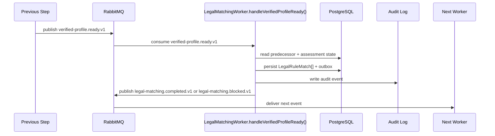

# Legal Matching Developer Execution Blueprint

# Business Purpose

Retrieve and attach citation-backed legal rules for VerifiedProfile claims.

## Research Basis

This blueprint format is adapted from:

- C4 Dynamic Diagram practice: document how static model elements collaborate at runtime for a feature/use case.
- EventStorming: model commands, domain events, aggregates, policies, and external systems explicitly.
- Domain Storytelling: describe who does what with which work object in business language before code detail.
- Service Blueprinting: separate user action, visible API action, backstage service work, support processes, and fail points.
- Execution trace documentation: make each request, handler, object, event, and worker transition explicit.


## Mandatory Invariants

- Manager can complete the active MVP flow without Developer participation.
- OAuth/OIDC login is separate from GitHub App repository authorization.
- Repository Scan is the only active MVP technical-evidence path.
- Scanner is static-analysis only and never executes customer source.
- Raw source, secrets, full prompts, and full AST bodies must not enter LLM, ordinary audit logs, or long-term persistence.
- Classification cannot run before VerifiedProfile.
- Provider/model/framework detection alone does not determine legal risk.


# Trigger

Worker consumes `verified-profile.ready.v1` after predecessor object is persisted.

# Input Objects

```json
{
  "eventId": "evt_001",
  "correlationId": "corr_assess_001",
  "assessmentId": "assess_001",
  "inputType": "VerifiedProfileReadyPayload",
  "repositorySnapshotId": "snap_001",
  "technicalEvidenceReportId": "ter_001",
  "technicalProfileId": "tp_001",
  "aiUsageFlowId": "auf_001",
  "verifiedProfileId": "vp_001"
}
```

# Output Objects

```json
{
  "assessmentId": "assess_001",
  "outputType": "LegalRuleMatch[]",
  "status": "CREATED",
  "evidenceRefs": ["ev_001", "ev_002"],
  "nextEvent": "legal-matching.completed.v1 or legal-matching.blocked.v1"
}
```

# Execution Trace

| Step | Runtime Hop | Handler | DB Read | DB Write | Queue/Event | Output |
|---:|---|---|---|---|---|---|
| 1 | Input received | `LegalRuleMatchingService.matchRules()` | Required predecessor records | None | Consumes `verified-profile.ready.v1` or API trigger | Validated input DTO |
| 2 | Preconditions checked | `LegalRuleMatchingService.matchRules()` | `Assessment`, actor/state, source object | None | None | Guard pass or blocked error |
| 3 | Domain transform runs | `LegalRuleMatchingService.matchRules()` | Evidence/source rows | Draft output object | None | `LegalRuleMatch[]` draft |
| 4 | Transaction commits | Repository layer | Existing object versions | `LegalRuleMatch[]`, `AuditEvent`, `OutboxEvent` | staged `legal-matching.completed.v1 or legal-matching.blocked.v1` | Persisted `LegalRuleMatch[]` |
| 5 | Event published | Outbox publisher | `OutboxEvent` | published marker | `legal-matching.completed.v1 or legal-matching.blocked.v1` | Next worker input |
| 6 | Next worker consumes | downstream worker | `LegalRuleMatch[]` | downstream object or blocked state | next event | Workflow advances |

# Object Lifecycle

```text
VerifiedProfile -> QueryClaims -> RetrievedRuleChunks -> LegalRuleMatch[]
```

# Domain Walkthrough

Fixture: `F-RAG-01 Correct legal rule / citation case`

```text
Loan approval claim retrieves citation-backed financial/high-impact rule family.
```

# Rule Execution Walkthrough

| Input | Rule / Policy | Output |
|---|---|---|
| Valid predecessor object exists | State precondition rule | Continue. |
| Missing predecessor object | Guard rule | Persist blocked state; do not emit success event. |
| Material claim has evidence refs | Evidence traceability rule | Claim may be used downstream. |
| Material claim lacks evidence refs | Evidence traceability rule | Block or degrade downstream output. |

# Queue Choreography

| Producer | Exchange | Routing Key | Consumer |
|---|---|---|---|
| Current predecessor | `lcsp.events` / `lcsp.commands` | `verified-profile.ready.v1` | `LegalMatchingWorker.handleVerifiedProfileReady()` |
| `LegalMatchingWorker.handleVerifiedProfileReady()` | `lcsp.events` | `legal-matching.completed.v1 or legal-matching.blocked.v1` | Next workflow worker |

# Database Journey

| Operation | Models |
|---|---|
| Read | `Assessment`, predecessor object, `AuditEvent` context |
| Create | `LegalRuleMatch[]`, `AuditEvent`, `OutboxEvent` |
| Update | `Assessment.state`, predecessor status if applicable |
| Deny write | Raw source, full prompt, secrets, full AST bodies |

# Failure Scenarios

| Input | Failure Point | Output |
|---|---|---|
| Invalid state | Precondition guard | `WORKFLOW_STATE_DENIED`; no event emitted. |
| Missing evidence | Domain transform | Blocked output with reason. |
| Queue publish fails | Outbox publisher | Outbox remains pending; transaction is not lost. |
| Worker retry exhausted | Worker handler | DLQ message and audit event. |

# Sequence Diagram



# Developer Mental Model

Implement `Legal Matching` as a deterministic object transformer. It receives one canonical input object, reads only the predecessor records it needs, creates exactly one canonical output object or a blocked state, writes an audit event, and emits the next event through outbox. Hidden synchronous jumps to later workflow stages are forbidden.

# Anti-Patterns

- Creating downstream objects before `LegalRuleMatch[]` is persisted.
- Emitting `legal-matching.completed.v1 or legal-matching.blocked.v1` before DB commit.
- Swallowing uncertainty instead of creating blocked/degraded output.
- Inferring legal risk from provider/framework detection alone.
- Mutating scanner evidence or Manager declarations in place.

# Local Simulation

1. Seed predecessor records for `VerifiedProfileReadyPayload`.
2. Insert or publish `verified-profile.ready.v1` with correlation id `corr_assess_001`.
3. Run `LegalMatchingWorker.handleVerifiedProfileReady()` locally against fixture `F-RAG-01 Correct legal rule / citation case`.
4. Verify `LegalRuleMatch[]` row exists.
5. Verify `AuditEvent` and `OutboxEvent` exist.
6. Verify no forbidden raw source/secret/full prompt data was persisted.

# Test Fixture Journey

| Input Fixture | Expected Output Fixture |
|---|---|
| `F-RAG-01 Correct legal rule / citation case` | `LegalRuleMatch[]` with expected status and evidence refs. |
| Missing predecessor fixture | Blocked state, no success event. |
| Duplicate message fixture | Idempotent no-op after first successful write. |
