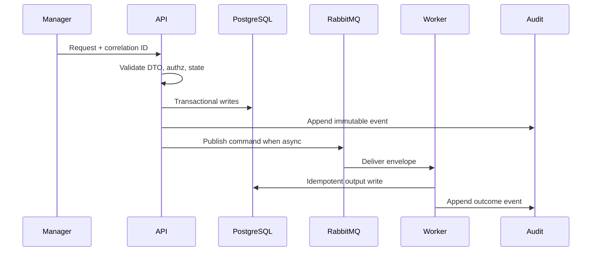

# 01 GitHub App Playbook

## Purpose

Connect a Manager-authorized GitHub App installation to an assessment and repository without conflating OAuth/OIDC login with repository authorization.

## Why This Component Exists

OAuth/OIDC proves user identity; GitHub App authorization proves repository access. Installation tokens stay server-side and never enter UI, logs, queues, audit, or persistence.

Bounded context: controlled MVP prototype only. It must not change canonical architecture, create production claims, or bypass Manager/evidence/citation guardrails.

## Runtime Ownership

| Concern | Owner |
|---|---|
| Service | GitHub Integration Service |
| NestJS module | `GitHubIntegrationModule` |
| Worker | none for connection |
| Database | `GitHubRepositoryConnection`, `RepositorySnapshot` |
| Queue | scan command only after snapshot selection |

## Exact npm Packages

| `@octokit/app` | GitHub App JWT and installation flow. | Official GitHub App SDK. | OAuth token repository access. |
| `@octokit/rest` | Repository/branch/commit API calls. | Official REST client. | Raw fetch calls. |
| Package name | Purpose | Reason selected | Alternative rejected |
|---|---|---|---|
| `zod` | DTO and event validation. | Shared TypeScript-first runtime validation. | Ad hoc validators. |
| `uuid` | UUIDv7 IDs. | Stable cross-service identity and correlation. | Sequential IDs. |
| `pino` | Structured JSON logs. | Redaction and correlation support. | Console logs only. |

## Folder Structure

```text
apps/api/src/modules/github/
  github-integration.module.ts
  github-installation.controller.ts
  github-repository.controller.ts
  services/github-app.service.ts
  services/repository-authorization.service.ts
  services/repository-selection.service.ts
  repositories/github-repository-connection.repository.ts
  dto/connect-github-repository.dto.ts
  dto/select-repository-commit.dto.ts
packages/contracts/src/github/
```
Each folder owns one boundary: DTO contracts, services, repositories, events, workers, and verification targets.

## Configuration

| Key | Secret? | Purpose |
|---|---|---|
| `DATABASE_URL` | Yes | PostgreSQL connection. |
| `RABBITMQ_URL` | Yes | RabbitMQ broker. |
| `LCSP_ENV` | No | Runtime environment. |
| `LCSP_LOG_LEVEL` | No | Logging level. |

## Inputs

| Input | Source | Validation | Example |
|---|---|---|---|
| Installation ID | GitHub App flow | installation belongs to org | `{ "githubInstallationId":"123456" }` |
| Repository ID | GitHub API | available under installation | `{ "githubRepositoryId":"987654" }` |
| Branch/commit | Manager | commit resolves under repo | `{ "branchName":"main","commitSha":"abc123" }` |

## Outputs

| Output | Destination | Example |
|---|---|---|
| Repository connection | PostgreSQL/API | `{ "repositoryConnectionId":"uuidv7","repositoryFullName":"org/repo" }` |
| Audit | AuditEvent | `audit.github.repository.connected.v1` |

## Step-by-Step Processing

1. Validate Manager permission `github.connect`.
2. Verify GitHub App installation and repository access.
3. Store metadata only, never token.
4. Resolve branch to commit SHA.
5. Persist snapshot metadata.
6. Audit connection and selection.

## Internal Data Structures

```json
{ "ConnectGitHubRepositoryRequestDto": { "githubInstallationId":"123456", "githubRepositoryId":"987654" }, "GitHubRepositoryConnectionDto": { "repositoryConnectionId":"uuidv7", "assessmentId":"uuidv7", "repositoryFullName":"org/repo" } }
```

## Database Usage

| Table | Reads/Writes | Constraints |
|---|---|---|
| `GitHubRepositoryConnection` | write connection metadata | unique installation/repository per org |
| `RepositorySnapshot` | write selected commit | indexed assessment/commit |
| `AuditEvent` | append events | immutable |

## Queue Usage

| Exchange | Routing key | Usage |
|---|---|---|
| none | none | Connection is synchronous; scan command is later. |

## APIs

| Endpoint | Method | Request DTO | Response DTO | Status |
|---|---|---|---|---|
| `/api/v1/assessments/:assessmentId/github/repository-connections` | POST | `ConnectGitHubRepositoryRequestDto` | `GitHubRepositoryConnectionDto` | 201/403/422 |
| `/api/v1/assessments/:assessmentId/github/repository-snapshots` | POST | `SelectRepositoryCommitRequestDto` | `RepositorySnapshotDto` | 201/403/422 |

## Sequence Diagram



## Failure Handling

| Error code | Reason | Recovery strategy | Audit expectation |
|---|---|---|---|
| `VALIDATION_FAILED` | DTO/schema invalid. | Do not retry; return 400 or block job. | Audit attempted state change. |
| `PERMISSION_DENIED` | Actor lacks permission. | Do not retry. | `audit.permission.denied.v1`. |
| `STATE_TRANSITION_BLOCKED` | Predecessor state missing. | Wait for valid state. | `audit.state.transition.blocked.v1`. |
| `INVARIANT_VIOLATION` | Guardrail would be bypassed. | Fail closed. | Component blocked audit. |
| `TRANSIENT_DEPENDENCY_FAILURE` | External dependency failed. | Retry then DLQ/blocked state. | Retry/failure audit. |

## Observability

- Structured JSON logs with `correlationId`, no raw source, no secrets, no full prompts.
- Metrics for request count, latency, blocked states, retries, DLQ, audit failures.
- Traces across HTTP, DB transaction, outbox publish, worker consume.
- Alerts for repeated guardrail blocks and DLQ growth.

## Manual Verification

1. Start local API, PostgreSQL, RabbitMQ, and workers.
2. Send the documented request or command with a fresh correlation ID.
3. Verify DB records, queue event, and audit event.
4. Confirm logs/queues/audit contain no raw source, secrets, or full prompts.

## Acceptance Criteria

- Manager can connect/select repository.
- Developer cannot connect/select repository.
- Tokens are never persisted or logged.
- OAuth/OIDC login is never used as repository authorization.
