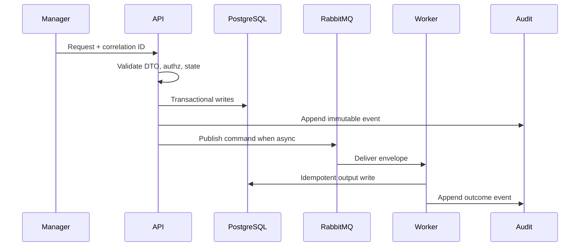

# 02 Repository Snapshot Playbook

## Purpose

Build a commit-pinned repository snapshot manifest for scanning while raw source remains temporary workspace-only.

## Why This Component Exists

Scanner determinism requires immutable commit SHA, file inventory, file hashes, coverage limits, and verified cleanup.

Bounded context: controlled MVP prototype only. It must not change canonical architecture, create production claims, or bypass Manager/evidence/citation guardrails.

## Runtime Ownership

| Concern | Owner |
|---|---|
| Service | Repository Snapshot Service |
| NestJS module | `RepositorySnapshotModule` |
| Worker | `RepositorySnapshotBuilder` inside scan worker |
| Database | `RepositorySnapshot`, `RepositoryScanJob` metadata |
| Queue | part of `command.scan.requested.v1` |

## Exact npm Packages

| `@octokit/rest` | Commit tree/archive retrieval. | Official GitHub REST client. | GitHub OAuth repo access. |
| `fast-glob` | Workspace file inventory. | Deterministic include/exclude. | manual traversal. |
| `ignore` | `.gitignore`/LCSP ignore processing. | Matches repository conventions. | custom ignore parser. |
| Package name | Purpose | Reason selected | Alternative rejected |
|---|---|---|---|
| `zod` | DTO and event validation. | Shared TypeScript-first runtime validation. | Ad hoc validators. |
| `uuid` | UUIDv7 IDs. | Stable cross-service identity and correlation. | Sequential IDs. |
| `pino` | Structured JSON logs. | Redaction and correlation support. | Console logs only. |

## Folder Structure

```text
packages/scanner/src/snapshot/
  repository-snapshot-builder.ts
  workspace-manager.ts
  file-inventory.ts
  cleanup-verifier.ts
apps/api/src/modules/repository-snapshot/
```
Each folder owns one boundary: DTO contracts, services, repositories, events, workers, and verification targets.

## Configuration

| Key | Secret? | Purpose |
|---|---|---|
| `DATABASE_URL` | Yes | PostgreSQL connection. |
| `RABBITMQ_URL` | Yes | RabbitMQ broker. |
| `LCSP_ENV` | No | Runtime environment. |
| `LCSP_LOG_LEVEL` | No | Logging level. |

## Inputs

| Input | Source | Validation | Example |
|---|---|---|---|
| Repository connection | DB | belongs to assessment | `{ "repositoryConnectionId":"uuidv7" }` |
| Commit SHA | GitHub | accessible immutable SHA | `{ "commitSha":"abc123" }` |

## Outputs

| Output | Destination | Example |
|---|---|---|
| Snapshot manifest | scanner memory/metadata | `{ "snapshotId":"uuidv7","fileCount":120,"fileHashes":[] }` |
| Cleanup result | audit/log | `{ "workspaceDeleted":true }` |

## Step-by-Step Processing

1. Load connection and selected commit.
2. Mint GitHub installation token in memory.
3. Download exact commit snapshot into isolated workspace.
4. Apply ignore/size/language policy.
5. Hash included files.
6. Produce manifest.
7. Pass manifest to scanner.
8. Delete workspace after terminal state.

## Internal Data Structures

```json
{ "RepositorySnapshotManifestDto": { "snapshotId":"uuidv7", "commitSha":"abc123", "supportedFileCount":94, "languageSummary":{"typescript":80}, "coverageLimitations":[] } }
```

## Database Usage

| Table | Usage | Constraints |
|---|---|---|
| `RepositorySnapshot` | selected commit metadata | unique connection/commit |
| `RepositoryScanJob` | links snapshot to scan | idempotency key |

## Queue Usage

| Exchange | Routing key | Producer | Consumer |
|---|---|---|---|
| `lcsp.commands.v1` | `command.scan.requested.v1` | API | ScanWorker snapshot builder |

## APIs

| Endpoint | Method | Request DTO | Response DTO | Status |
|---|---|---|---|---|
| `/api/v1/assessments/:assessmentId/github/repository-snapshots` | POST | `SelectRepositoryCommitRequestDto` | `RepositorySnapshotDto` | 201/403/422 |

## Sequence Diagram



## Failure Handling

| Error code | Reason | Recovery strategy | Audit expectation |
|---|---|---|---|
| `VALIDATION_FAILED` | DTO/schema invalid. | Do not retry; return 400 or block job. | Audit attempted state change. |
| `PERMISSION_DENIED` | Actor lacks permission. | Do not retry. | `audit.permission.denied.v1`. |
| `STATE_TRANSITION_BLOCKED` | Predecessor state missing. | Wait for valid state. | `audit.state.transition.blocked.v1`. |
| `INVARIANT_VIOLATION` | Guardrail would be bypassed. | Fail closed. | Component blocked audit. |
| `TRANSIENT_DEPENDENCY_FAILURE` | External dependency failed. | Retry then DLQ/blocked state. | Retry/failure audit. |

## Observability

- Structured JSON logs with `correlationId`, no raw source, no secrets, no full prompts.
- Metrics for request count, latency, blocked states, retries, DLQ, audit failures.
- Traces across HTTP, DB transaction, outbox publish, worker consume.
- Alerts for repeated guardrail blocks and DLQ growth.

## Manual Verification

1. Start local API, PostgreSQL, RabbitMQ, and workers.
2. Send the documented request or command with a fresh correlation ID.
3. Verify DB records, queue event, and audit event.
4. Confirm logs/queues/audit contain no raw source, secrets, or full prompts.

## Acceptance Criteria

- Manifest includes commit, counts, hashes, and limitations.
- Workspace source is deleted after scan terminal state.
- Raw source is never persisted long-term.
