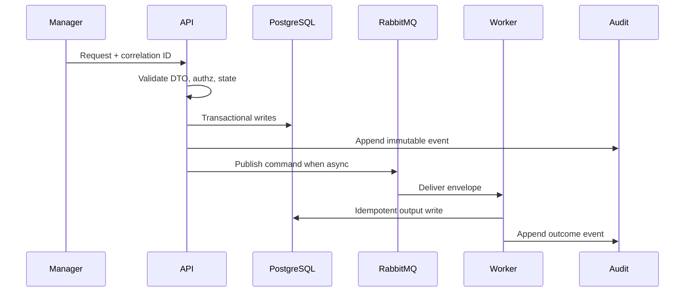

# 03 RabbitMQ Playbook

## Purpose

Define canonical asynchronous transport for scan, AIUsageFlow, reconciliation, classification, gap, document, and audit workflows.

## Why This Component Exists

Long-running gated workflows require outbox-backed commands, idempotent consumers, retries, and DLQs.

Bounded context: controlled MVP prototype only. It must not change canonical architecture, create production claims, or bypass Manager/evidence/citation guardrails.

## Runtime Ownership

| Concern | Owner |
|---|---|
| Service | Messaging Infrastructure |
| NestJS module | `MessagingModule`, `OutboxModule` |
| Worker | all consumers |
| Database | `OutboxEvent`, `WorkflowRun` |
| Queue | `lcsp.commands.v1`, `lcsp.events.v1`, `lcsp.deadletter.v1` |

## Exact npm Packages

| `amqplib` | AMQP connection, channels, publish/consume. | Direct RabbitMQ protocol support. | In-memory queues. |
| `@golevelup/nestjs-rabbitmq` | NestJS RabbitMQ module integration. | Declarative consumers/publishers. | Hand-rolled singleton connections. |
| Package name | Purpose | Reason selected | Alternative rejected |
|---|---|---|---|
| `zod` | DTO and event validation. | Shared TypeScript-first runtime validation. | Ad hoc validators. |
| `uuid` | UUIDv7 IDs. | Stable cross-service identity and correlation. | Sequential IDs. |
| `pino` | Structured JSON logs. | Redaction and correlation support. | Console logs only. |

## Folder Structure

```text
packages/messaging/src/
  envelope/message-envelope.ts
  rabbitmq/rabbitmq.publisher.ts
  rabbitmq/rabbitmq.consumer.ts
  outbox/outbox-dispatcher.ts
  retry/retry-policy.ts
packages/contracts/src/events/
```
Each folder owns one boundary: DTO contracts, services, repositories, events, workers, and verification targets.

## Configuration

| Key | Secret? | Purpose |
|---|---|---|
| `DATABASE_URL` | Yes | PostgreSQL connection. |
| `RABBITMQ_URL` | Yes | RabbitMQ broker. |
| `LCSP_ENV` | No | Runtime environment. |
| `LCSP_LOG_LEVEL` | No | Logging level. |

## Inputs

| Input | Source | Validation | Example |
|---|---|---|---|
| Message envelope | API/worker | UUIDv7 IDs and schemaVersion=1 | `{ "eventId":"uuidv7","eventType":"command.scan.requested.v1","payload":{} }` |

## Outputs

| Output | Destination | Example |
|---|---|---|
| Command | worker queue | `command.scan.requested.v1` |
| Event | event exchange | `event.scan.completed.v1` |
| DLQ message | DLX | original envelope + failure metadata |

## Step-by-Step Processing

1. Write outbox row in domain transaction.
2. Dispatcher validates envelope.
3. Publish to command/event exchange.
4. Worker validates payload and idempotency.
5. Retry transient failures three times.
6. Dead-letter exhausted messages.
7. Convert non-retryable gate failures to blocked states.

## Internal Data Structures

```json
{ "MessageEnvelope": { "eventId":"uuidv7", "eventType":"command.scan.requested.v1", "schemaVersion":1, "correlationId":"uuidv7", "causationId":"uuidv7", "aggregateType":"Assessment", "aggregateId":"uuidv7", "producer":"apps/api", "payload":{"scanJobId":"uuidv7"} } }
```

## Database Usage

| Table | Usage | Constraints |
|---|---|---|
| `OutboxEvent` | publish buffer | unique eventId, status index |
| `WorkflowRun` | long-running state | assessment/status index |

## Queue Usage

| Exchange | Queue | Routing key | Retry | DLQ |
|---|---|---|---|---|
| `lcsp.commands.v1` | `lcsp.scan-worker.v1` | `command.scan.requested.v1` | 3 | `lcsp.scan-worker.dlq.v1` |
| `lcsp.commands.v1` | `lcsp.ai-usage-flow-worker.v1` | `command.ai-usage-flow.requested.v1` | 3 | `lcsp.ai-usage-flow-worker.dlq.v1` |
| `lcsp.commands.v1` | `lcsp.reconciliation-worker.v1` | `command.reconciliation.requested.v1` | 3 | `lcsp.reconciliation-worker.dlq.v1` |
| `lcsp.commands.v1` | `lcsp.classification-worker.v1` | `command.classification.requested.v1` | 3 | `lcsp.classification-worker.dlq.v1` |
| `lcsp.commands.v1` | `lcsp.gap-analysis-worker.v1` | `command.gap-analysis.requested.v1` | 3 | `lcsp.gap-analysis-worker.dlq.v1` |
| `lcsp.commands.v1` | `lcsp.document-worker.v1` | `command.document.requested.v1` | 3 | `lcsp.document-worker.dlq.v1` |

## APIs

| Endpoint | Method | Request DTO | Response DTO | Status |
|---|---|---|---|---|
| none | n/a | n/a | n/a | internal only |

## Sequence Diagram



## Failure Handling

| Error code | Reason | Recovery strategy | Audit expectation |
|---|---|---|---|
| `VALIDATION_FAILED` | DTO/schema invalid. | Do not retry; return 400 or block job. | Audit attempted state change. |
| `PERMISSION_DENIED` | Actor lacks permission. | Do not retry. | `audit.permission.denied.v1`. |
| `STATE_TRANSITION_BLOCKED` | Predecessor state missing. | Wait for valid state. | `audit.state.transition.blocked.v1`. |
| `INVARIANT_VIOLATION` | Guardrail would be bypassed. | Fail closed. | Component blocked audit. |
| `TRANSIENT_DEPENDENCY_FAILURE` | External dependency failed. | Retry then DLQ/blocked state. | Retry/failure audit. |

## Observability

- Structured JSON logs with `correlationId`, no raw source, no secrets, no full prompts.
- Metrics for request count, latency, blocked states, retries, DLQ, audit failures.
- Traces across HTTP, DB transaction, outbox publish, worker consume.
- Alerts for repeated guardrail blocks and DLQ growth.

## Manual Verification

1. Start local API, PostgreSQL, RabbitMQ, and workers.
2. Send the documented request or command with a fresh correlation ID.
3. Verify DB records, queue event, and audit event.
4. Confirm logs/queues/audit contain no raw source, secrets, or full prompts.

## Acceptance Criteria

- Every async action creates outbox event transactionally.
- Payloads contain references only.
- Retry/DLQ is deterministic and idempotent.
- Non-retryable gate failures do not loop.
