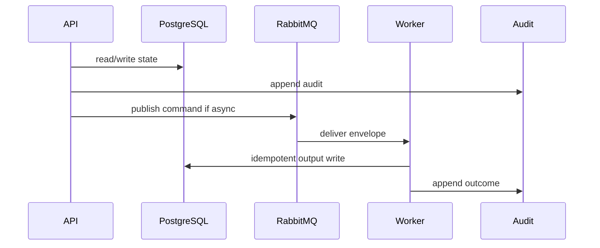

# 04 Scanner Playbook

## Purpose

Produce static-only TechnicalEvidenceReport records from commit-pinned repository snapshots without executing customer code.

## Why This Component Exists

Repository Scan is the only active MVP technical-evidence path. The scanner must parse, analyze, generate evidence refs, and clean up workspace while preserving privacy boundaries.

Scope is controlled MVP prototype only. No production, formal legal reliability, runtime scanner accuracy, or A2-b2 completion claim is created.

## Runtime Ownership

| Concern | Owner |
|---|---|
| Service | Scanner Service |
| Module | `packages/scanner` |
| Worker | `ScanWorker` |
| Database | scan, evidence, graph, finding models |
| Queue | scan command/completed/failed events |

## Exact npm Packages

| Package name | Purpose | Reason selected | Alternative rejected |
|---|---|---|---|
| `tree-sitter` | AST parsing. | Static multi-language parsing. | Regex parsing. |
| `tree-sitter-typescript` | TS/TSX grammar. | MVP TS coverage. | Babel-only parsing. |
| `tree-sitter-javascript` | JS grammar. | MVP JS coverage. | Acorn-only parsing. |
| `tree-sitter-python` | Python syntax grammar. | Syntax-only Python coverage. | Python runtime execution. |
| `ts-morph` | TS semantic wrapper. | Easier source/symbol/type APIs over TS compiler. | Raw TS compiler API. |
| `typescript` | Compiler engine. | Required by ts-morph. | none. |
| `fast-glob` | File enumeration. | Deterministic include/exclude. | manual traversal. |
| `ignore` | ignore policy. | `.gitignore` semantics. | custom parser. |
| `graphology` | Dependency/evidence graph. | Lightweight TS graph. | NetworkX for TS-first prototype. |
| `zod` | Report/finding validation. | Schema gate. | unchecked objects. |

## Folder Structure

```text
packages/scanner/src/
  parsers/
  semantic/
  analyzers/
  graph/
  evidence/
  findings/
  reports/
  persistence/
  events/
  workers/
```

## Configuration

| Key | Secret? | Purpose |
|---|---|---|
| `DATABASE_URL` | Yes | PostgreSQL connection. |
| `RABBITMQ_URL` | Yes | RabbitMQ broker. |
| `LCSP_ENV` | No | Environment. |
| `LCSP_LOG_LEVEL` | No | Logging level. |
| `SCANNER_WORKSPACE_ROOT` | No | Temporary source workspace. |
| `SCANNER_MAX_FILES` | No | Repository limit. |
| `SCANNER_RULESET_VERSION` | No | Detector version. |

## Inputs

| Input | Source | Validation | Example |
|---|---|---|---|
| Scan command | RabbitMQ | UUIDv7, idempotency, state | `{ "scanJobId":"uuidv7","repositorySnapshotId":"uuidv7","commitSha":"abc123" }` |
| Snapshot manifest | DB/workspace | commit hash matches | `{ "snapshotId":"uuidv7","fileCount":125 }` |

## Outputs

| Output | Destination | Example |
|---|---|---|
| TechnicalEvidenceReport | DB | `{ "technicalEvidenceReportId":"uuidv7","reportHash":"sha256:..." }` |
| Findings | DB | `{ "findingType":"AI_MODEL_INVOCATION","evidenceRef":"ev-001" }` |
| Events | RabbitMQ | `event.scan.completed.v1` / `event.scan.failed.v1` |

## Step-by-Step Processing

1. Consume scan command.
2. Lock scan job.
3. Build/load snapshot workspace.
4. Apply ignore/size/language policy.
5. Parse manifests and dependencies.
6. Parse AST with Tree-sitter.
7. Run TS/JS semantic pass with ts-morph.
8. Build dependency/evidence graph.
9. Detect AI usage signals.
10. Generate findings/evidence refs/report hash.
11. Persist metadata only.
12. Delete workspace.
13. Publish completion or failure.

## Internal Data Structures

```json
{ "TechnicalEvidenceReportDto": { "technicalEvidenceReportId":"uuidv7", "scanJobId":"uuidv7", "scannerVersion":"scanner-v0.1", "rulesetVersion":"scanner-rules-v0.1", "reportHash":"sha256:..." } }
```

## Database Usage

| Table | Usage | Constraint |
|---|---|---|
| `RepositoryScanJob` | status and idempotency | terminal state idempotent |
| `TechnicalEvidenceReport` | report metadata | unique scanJobId |
| `TechnicalFinding` | normalized findings | evidenceRef required |
| `EvidenceReference` | file hash/span/signal ref | no raw source body |
| `CodeGraphNode/Edge` | normalized graph | no full AST body |

## Queue Usage

| Exchange | Queue | Routing key | Retry/DLQ |
|---|---|---|---|
| `lcsp.commands.v1` | `lcsp.scan-worker.v1` | `command.scan.requested.v1` | 3 then `lcsp.scan-worker.dlq.v1` |
| `lcsp.events.v1` | downstream | `event.scan.completed.v1` | reference-only payload |

## APIs

| Endpoint | Method | DTO | Status |
|---|---|---|---|
| `/api/v1/assessments/:id/scans` | POST | `StartRepositoryScanRequestDto` | 202/403/409/422 |
| `/api/v1/assessments/:id/scans/:scanJobId` | GET | `RepositoryScanStatusDto` | 200/404 |

## Sequence Diagram



## Failure Handling

| Error code | Reason | Recovery | Audit |
|---|---|---|---|
| `VALIDATION_FAILED` | DTO invalid. | Return 400 or block job. | attempted action audit. |
| `PERMISSION_DENIED` | Actor lacks permission. | Do not retry. | `audit.permission.denied.v1`. |
| `STATE_TRANSITION_BLOCKED` | Missing predecessor state. | Wait for valid state. | `audit.state.transition.blocked.v1`. |
| `GATE_PRECONDITION_FAILED` | Evidence/profile/citation gate missing. | Fail closed. | component blocked audit. |
| `TRANSIENT_DEPENDENCY_FAILURE` | Dependency unavailable. | Retry then DLQ/blocked. | retry/failure audit. |

## Observability

- JSON logs with correlation IDs and redaction.
- Metrics for latency, retries, blocks, failures, DLQ.
- Traces through HTTP, DB, outbox, worker.
- Alerts on guardrail block spikes, DLQ growth, audit write failure.

## Manual Verification

1. Start local dependencies.
2. Send documented request/command.
3. Verify DB state, queue event, audit event.
4. Confirm no raw source, secrets, full prompts, or full AST bodies appear.

## Acceptance Criteria

- Static-only scan completes with schema-valid report.
- Provider dependency alone never creates legal-risk conclusion.
- Unsupported/dynamic source emits limitation/abstention.
- Workspace cleanup is verified and audited.


## Tree-sitter

Installation packages: `tree-sitter`, `tree-sitter-typescript`, `tree-sitter-javascript`, `tree-sitter-python`.

Initialization and lifecycle:

1. Create one parser registry per worker process.
2. Map extensions to grammar: `.ts/.tsx` to TypeScript, `.js/.jsx/.mjs/.cjs` to JavaScript, `.py` to Python.
3. Parse ephemeral workspace file text.
4. Extract normalized facts: node type, identifier/call/import categories, file hash, line span, parent/child relation.
5. Discard source text and full AST body before persistence.

Output structure:

```json
{ "filePath":"src/loan.ts", "fileHash":"sha256:...", "language":"typescript", "nodes":[{"type":"call_expression","name":"openai.chat.completions.create","startLine":42,"endLine":47}], "coverageLimitations":[] }
```

## ts-morph

Use `ts-morph` over TypeScript Compiler API. Create an in-memory project with `noEmit`, `allowJs`, `skipLibCheck`, and no command execution. Load TS/JS files from the snapshot manifest, resolve imports, provider symbols, wrapper calls, property-access chains, and static type hints. Unresolved dynamic imports produce `IMPORT_RESOLUTION_LIMITATION`.

## Dependency Graph

Selected library: `graphology`.

Node structure: `{ "nodeId":"uuidv7", "nodeType":"AI_INVOCATION", "filePath":"src/loan.ts", "evidenceRef":"ev-001" }`.

Edge structure: `{ "edgeId":"uuidv7", "edgeType":"OUTPUT_FEEDS_DECISION", "fromNodeId":"uuidv7", "toNodeId":"uuidv7", "confidence":0.82 }`.

Persist normalized `CodeGraphNode` and `CodeGraphEdge` only; no full AST or raw source body.

## AI Usage Signal Detection

| Detector | Input | Processing | Output |
|---|---|---|---|
| OpenAI SDK | manifests/imports/calls | Match `openai`, `OpenAI`, `chat.completions.create`, `responses.create`; follow bounded wrappers. | provider dependency/invocation findings. |
| Anthropic SDK | manifests/imports/calls | Match `@anthropic-ai/sdk`, `Anthropic`, `messages.create`. | provider invocation finding. |
| Gemini SDK | manifests/imports/calls | Match `@google/generative-ai`, `google.generativeai`, `generateContent`. | provider invocation finding. |
| LangChain | manifests/imports/classes/calls | Match `langchain`, `@langchain/*`, `invoke`, `call`, `stream`. | framework and invocation findings only when call path exists. |
| Vercel AI SDK | manifests/imports/calls | Match `ai`, `generateText`, `streamText`, `generateObject`. | framework/output hints. |
| Custom wrappers | import graph/symbols | Follow local imports to provider calls; abstain if unresolved. | wrapper detected or unresolved limitation. |

Provider/model/framework detection alone never proves legal risk.

## Technical Findings

```json
{ "findingId":"uuidv7", "scanJobId":"uuidv7", "findingType":"AI_MODEL_INVOCATION", "confidence":0.86, "filePath":"src/services/loan.ts", "evidenceRef":"ev-001" }
```

