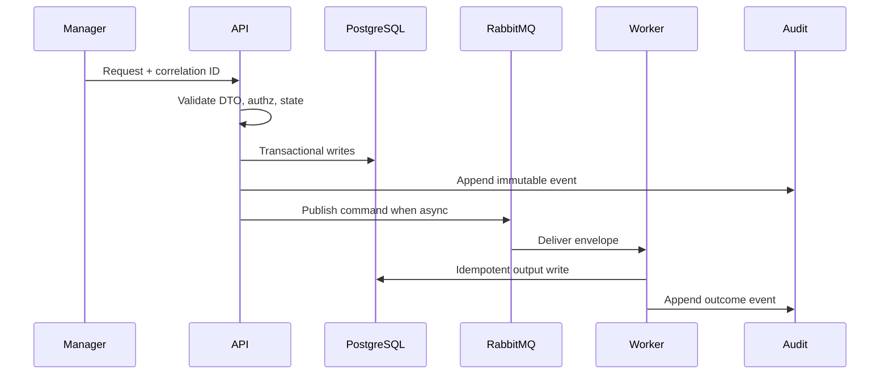

# 05 TypeScript Semantic Analysis Playbook

## Purpose

Resolve imports, symbols, local wrappers, call expressions, and bounded type hints for TS/JS files without executing source.

## Why This Component Exists

Tree-sitter syntax is insufficient for wrapper and import resolution. `ts-morph` provides a developer-friendly wrapper over the TypeScript Compiler API for the controlled prototype.

Bounded context: controlled MVP prototype only. It must not change canonical architecture, create production claims, or bypass Manager/evidence/citation guardrails.

## Runtime Ownership

| Concern | Owner |
|---|---|
| Service | TypeScript Semantic Analyzer |
| Module | scanner package internal |
| Worker | ScanWorker |
| Database | normalized graph/evidence only |
| Queue | none directly |

## Exact npm Packages

| Package name | Purpose | Reason selected | Alternative rejected |
|---|---|---|---|
| `zod` | DTO and event validation. | Shared TypeScript-first runtime validation. | Ad hoc validators. |
| `uuid` | UUIDv7 IDs. | Stable cross-service identity and correlation. | Sequential IDs. |
| `pino` | Structured JSON logs. | Redaction and correlation support. | Console logs only. |

## Folder Structure

```text
packages/scanner/src/semantic/
  typescript-project.ts
  source-loader.ts
  import-resolver.ts
  symbol-resolver.ts
  type-resolver.ts
  wrapper-resolver.ts
```
Each folder owns one boundary: DTO contracts, services, repositories, events, workers, and verification targets.

## Configuration

| Key | Secret? | Purpose |
|---|---|---|
| `DATABASE_URL` | Yes | PostgreSQL connection. |
| `RABBITMQ_URL` | Yes | RabbitMQ broker. |
| `LCSP_ENV` | No | Runtime environment. |
| `LCSP_LOG_LEVEL` | No | Logging level. |

## Inputs

| Input | Source | Validation | Example |
|---|---|---|---|
| TS/JS files | snapshot | path under workspace | `{ "files":["src/loan.ts"] }` |
| AST facts | Tree-sitter | hash/path match manifest | `{ "imports":[{"module":"openai"}] }` |

## Outputs

| Output | Destination | Example |
|---|---|---|
| Semantic facts | graph builder | `{ "callTarget":"OpenAI.chat.completions.create","resolved":true }` |
| Limitation | finding | `IMPORT_RESOLUTION_LIMITATION` |

## Step-by-Step Processing

1. Create `ts-morph` Project with `noEmit`, `allowJs`, no command execution.
2. Add TS/JS files from snapshot.
3. Resolve import declarations.
4. Resolve provider client symbols.
5. Follow bounded local wrappers.
6. Extract call and property chains.
7. Emit facts/limitations.

## Internal Data Structures

```json
{ "SemanticCallFact": { "filePath":"src/loan.ts", "symbolName":"scoreApplicant", "callTarget":"OpenAI.chat.completions.create", "evidenceRef":"ev-001" } }
```

## Database Usage

| Table | Usage | Constraints |
|---|---|---|
| `CodeGraphNode` | symbols/calls/imports | no full AST body |
| `CodeGraphEdge` | import/call/data-flow edges | evidence refs required |

## Queue Usage

| Exchange | Routing key | Usage |
|---|---|---|
| none | none | internal scanner function |

## APIs

| Endpoint | Method | Request DTO | Response DTO | Status |
|---|---|---|---|---|
| none | n/a | n/a | n/a | package internal |

## Sequence Diagram



## Failure Handling

| Error code | Reason | Recovery strategy | Audit expectation |
|---|---|---|---|
| `VALIDATION_FAILED` | DTO/schema invalid. | Do not retry; return 400 or block job. | Audit attempted state change. |
| `PERMISSION_DENIED` | Actor lacks permission. | Do not retry. | `audit.permission.denied.v1`. |
| `STATE_TRANSITION_BLOCKED` | Predecessor state missing. | Wait for valid state. | `audit.state.transition.blocked.v1`. |
| `INVARIANT_VIOLATION` | Guardrail would be bypassed. | Fail closed. | Component blocked audit. |
| `TRANSIENT_DEPENDENCY_FAILURE` | External dependency failed. | Retry then DLQ/blocked state. | Retry/failure audit. |

## Observability

- Structured JSON logs with `correlationId`, no raw source, no secrets, no full prompts.
- Metrics for request count, latency, blocked states, retries, DLQ, audit failures.
- Traces across HTTP, DB transaction, outbox publish, worker consume.
- Alerts for repeated guardrail blocks and DLQ growth.

## Manual Verification

1. Start local API, PostgreSQL, RabbitMQ, and workers.
2. Send the documented request or command with a fresh correlation ID.
3. Verify DB records, queue event, and audit event.
4. Confirm logs/queues/audit contain no raw source, secrets, or full prompts.

## Acceptance Criteria

- Resolves bounded provider wrapper calls.
- Emits limitations for unresolved dynamic imports.
- Does not execute code, install deps, or claim runtime accuracy.
