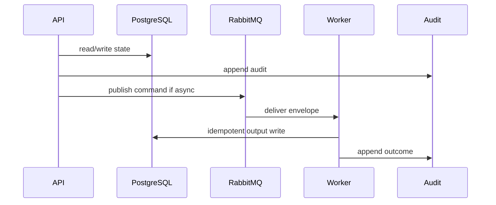

# 06 AI Usage Flow Playbook

## Purpose

Convert WizardProfile, TechnicalProfile, and TechnicalFindings into evidence-backed AIUsageFlow claims with confidence and uncertainty.

## Why This Component Exists

AIUsageFlow prevents provider/model/framework detection from being treated as legal-risk proof. It creates explainable claims for reconciliation and legal eligibility.

Scope is controlled MVP prototype only. No production, formal legal reliability, runtime scanner accuracy, or A2-b2 completion claim is created.

## Runtime Ownership

| Concern | Owner |
|---|---|
| Service | AIUsageFlow Service |
| Module | `AIUsageFlowModule`, `packages/ai-usage-flow` |
| Worker | `AIUsageFlowWorker` |
| Database | `AIUsageFlow`, `AIUsageFlowClaim` |
| Queue | AIUsageFlow command/completed event |

## Exact npm Packages

| Package name | Purpose | Reason selected | Alternative rejected |
|---|---|---|---|
| `zod` | DTO/event validation. | Shared TypeScript-first contracts. | Ad hoc validation. |
| `uuid` | UUIDv7 IDs. | Cross-service identity and idempotency. | Sequential IDs. |
| `pino` | Structured logs. | Redaction/correlation. | Console logs only. |
| `json-rules-engine` | Deterministic rule engine. | Versioned inspectable rules. | LLM-only claim generation. |

## Folder Structure

```text
packages/ai-usage-flow/src/
  claims/
  evidence/
  rules/
  confidence/
  abstention/
  persistence/
  events/
  workers/
```

## Configuration

| Key | Secret? | Purpose |
|---|---|---|
| `DATABASE_URL` | Yes | PostgreSQL connection. |
| `RABBITMQ_URL` | Yes | RabbitMQ broker. |
| `LCSP_ENV` | No | Environment. |
| `LCSP_LOG_LEVEL` | No | Logging level. |

## Inputs

| Input | Source | Validation | Example |
|---|---|---|---|
| WizardProfile | DB | submitted | `{ "businessProcess":"loan approval" }` |
| TechnicalProfile | DB | built after gates | `{ "usageSignals":["MODEL_INVOCATION"] }` |
| Findings | DB | evidence refs present | `{ "findingType":"OUTPUT_FEEDS_DECISION","evidenceRef":"ev-001" }` |

## Outputs

| Output | Destination | Example |
|---|---|---|
| AIUsageFlow | DB | `{ "aiUsageFlowId":"uuidv7","status":"READY_WITH_UNCERTAINTY" }` |
| Claims | DB | `{ "claimType":"automation_level","value":"AUTOMATED_DECISION","evidenceRefs":["ev-001"],"confidence":0.84 }` |

## Step-by-Step Processing

1. Consume request.
2. Load wizard/profile/report/findings.
3. Validate gates and evidence refs.
4. Ingest candidate claims.
5. Run deterministic rules.
6. Score confidence.
7. Apply abstention/coverage limitations.
8. Persist flow/claims.
9. Emit completed event.

## Internal Data Structures

```json
{ "AIUsageFlowClaimDto": { "claimType":"human_review", "value":"UNCLEAR", "evidenceRefs":[], "confidence":0.41, "uncertaintyReasons":["HUMAN_REVIEW_NOT_PROVEN"] } }
```

## Database Usage

| Table | Usage | Constraint |
|---|---|---|
| `AIUsageFlow` | flow header/status | active version per assessment |
| `AIUsageFlowClaim` | claim values | material claim needs refs or uncertainty |

## Queue Usage

| Exchange | Queue | Routing key | Retry/DLQ |
|---|---|---|---|
| `lcsp.commands.v1` | `lcsp.ai-usage-flow-worker.v1` | `command.ai-usage-flow.requested.v1` | 3 then DLQ |
| `lcsp.events.v1` | downstream | `event.ai-usage-flow.completed.v1` | reference-only |

## APIs

| Endpoint | Method | DTO | Status |
|---|---|---|---|
| `/api/v1/assessments/:id/ai-usage-flow` | POST | `BuildAIUsageFlowRequestDto` | 202/422 |
| `/api/v1/assessments/:id/ai-usage-flow/latest` | GET | `AIUsageFlowDto` | 200/404 |

## Sequence Diagram



## Failure Handling

| Error code | Reason | Recovery | Audit |
|---|---|---|---|
| `VALIDATION_FAILED` | DTO invalid. | Return 400 or block job. | attempted action audit. |
| `PERMISSION_DENIED` | Actor lacks permission. | Do not retry. | `audit.permission.denied.v1`. |
| `STATE_TRANSITION_BLOCKED` | Missing predecessor state. | Wait for valid state. | `audit.state.transition.blocked.v1`. |
| `GATE_PRECONDITION_FAILED` | Evidence/profile/citation gate missing. | Fail closed. | component blocked audit. |
| `TRANSIENT_DEPENDENCY_FAILURE` | Dependency unavailable. | Retry then DLQ/blocked. | retry/failure audit. |

## Observability

- JSON logs with correlation IDs and redaction.
- Metrics for latency, retries, blocks, failures, DLQ.
- Traces through HTTP, DB, outbox, worker.
- Alerts on guardrail block spikes, DLQ growth, audit write failure.

## Manual Verification

1. Start local dependencies.
2. Send documented request/command.
3. Verify DB state, queue event, audit event.
4. Confirm no raw source, secrets, full prompts, or full AST bodies appear.

## Acceptance Criteria

- Material claims require evidence refs or explicit uncertainty.
- SDK-only detection produces unknown/abstain, not high risk.
- Dynamic/unsupported paths create limitations.
- Output is eligible for reconciliation only with claim status/uncertainty explicit.


## AIUsageFlow Rule Engine and Pseudocode

Claim ingestion: load WizardProfile declarations, TechnicalProfile summaries, TechnicalFindings, EvidenceReferences, and coverage limitations.

Evidence validation: every material claim used for reconciliation or legal matching must have `evidence_refs`; missing refs mark claim blocked.

Rule execution:

| Rule | Signals | Output |
|---|---|---|
| `AUTOMATED_DECISION_PATH` | `MODEL_INVOCATION` + `OUTPUT_USED_IN_IF` + `STATUS_UPDATE` | `automation_level=AUTOMATED_DECISION` |
| `HUMAN_REVIEW_PRESENT` | model output routed to Manager/reviewer before final action | `human_review=PRESENT` |
| `SDK_ONLY_ABSTAIN` | SDK dependency only, no invocation | `ai_usage=UNKNOWN` |
| `DYNAMIC_RUNTIME_LIMIT` | runtime prompt/config/remote behavior | coverage limitation and abstention |

Confidence scoring: start with weighted finding confidence, add support for independent evidence refs, subtract for partial path, unclear human review, dynamic source, or unsupported language boundary; clamp 0..1.

Pseudocode:

```text
load wizard, technicalProfile, report, findings
assert report.schemaGate passed and qualityGate not failed
claims = ingest candidate claims
for each material claim: require evidence_refs or mark blocked
ruleResults = run deterministic rules
scored = apply confidence formula
finalClaims = apply abstention and coverage limitations
persist AIUsageFlow and claims
emit event.ai-usage-flow.completed.v1
```

