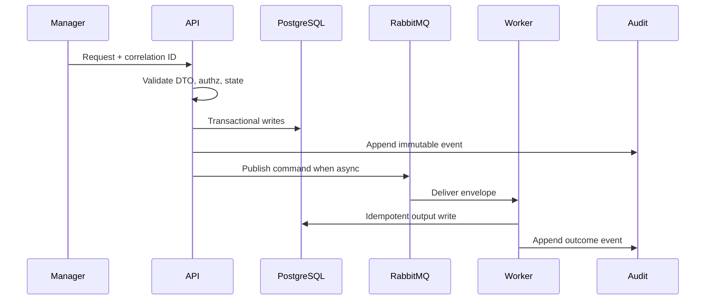

# 07 Technical Profile Playbook

## Purpose

Aggregate schema-gated and quality-gated scanner output into a TechnicalProfile for AIUsageFlow and reconciliation.

## Why This Component Exists

Downstream components require stable profile facts, not raw findings. TechnicalProfile is evidence summary, not legal conclusion.

Bounded context: controlled MVP prototype only. It must not change canonical architecture, create production claims, or bypass Manager/evidence/citation guardrails.

## Runtime Ownership

| Concern | Owner |
|---|---|
| Service | Technical Profile Service |
| NestJS module | `EvidenceModule` |
| Worker | profile builder after scan |
| Database | `TechnicalProfile`, `EvidenceGateResult` |
| Queue | may request AIUsageFlow |

## Exact npm Packages

| Package name | Purpose | Reason selected | Alternative rejected |
|---|---|---|---|
| `zod` | DTO and event validation. | Shared TypeScript-first runtime validation. | Ad hoc validators. |
| `uuid` | UUIDv7 IDs. | Stable cross-service identity and correlation. | Sequential IDs. |
| `pino` | Structured JSON logs. | Redaction and correlation support. | Console logs only. |

## Folder Structure

```text
packages/technical-profile/src/
  evidence-gates.ts
  profile-builder.ts
  dto/technical-profile.dto.ts
  persistence/technical-profile.repository.ts
```
Each folder owns one boundary: DTO contracts, services, repositories, events, workers, and verification targets.

## Configuration

| Key | Secret? | Purpose |
|---|---|---|
| `DATABASE_URL` | Yes | PostgreSQL connection. |
| `RABBITMQ_URL` | Yes | RabbitMQ broker. |
| `LCSP_ENV` | No | Runtime environment. |
| `LCSP_LOG_LEVEL` | No | Logging level. |

## Inputs

| Input | Source | Validation | Example |
|---|---|---|---|
| TechnicalEvidenceReport | scanner | schema gate passed | `{ "technicalEvidenceReportId":"uuidv7" }` |
| Findings | scanner | evidence refs exist | `{ "findingType":"AI_MODEL_INVOCATION" }` |

## Outputs

| Output | Destination | Example |
|---|---|---|
| TechnicalProfile | DB/API | `{ "providers":["openai"],"usageSignals":["MODEL_INVOCATION"] }` |
| Gate results | DB | `{ "gate":"QUALITY","result":"PASSED_WITH_LIMITATIONS" }` |

## Step-by-Step Processing

1. Load report/findings.
2. Run schema gate.
3. Run quality gate.
4. Aggregate providers, frameworks, usage, human-review, downstream signals, limitations.
5. Persist profile/gates.
6. Publish AIUsageFlow request only when gates permit.

## Internal Data Structures

```json
{ "TechnicalProfileDto": { "technicalProfileId":"uuidv7", "detectedProviders":["openai"], "usageSignals":["MODEL_INVOCATION"], "coverageLimitations":[] } }
```

## Database Usage

| Table | Usage | Constraints |
|---|---|---|
| `EvidenceGateResult` | schema/quality result | unique report/gate |
| `TechnicalProfile` | profile summary | unique report |

## Queue Usage

| Exchange | Routing key | Producer | Consumer |
|---|---|---|---|
| `lcsp.events.v1` | `event.scan.completed.v1` | scanner | profile builder |
| `lcsp.commands.v1` | `command.ai-usage-flow.requested.v1` | profile builder | AIUsageFlowWorker |

## APIs

| Endpoint | Method | Request DTO | Response DTO | Status |
|---|---|---|---|---|
| `/api/v1/assessments/:assessmentId/technical-profile/latest` | GET | path | `TechnicalProfileDto` | 200/403/404 |

## Sequence Diagram



## Failure Handling

| Error code | Reason | Recovery strategy | Audit expectation |
|---|---|---|---|
| `VALIDATION_FAILED` | DTO/schema invalid. | Do not retry; return 400 or block job. | Audit attempted state change. |
| `PERMISSION_DENIED` | Actor lacks permission. | Do not retry. | `audit.permission.denied.v1`. |
| `STATE_TRANSITION_BLOCKED` | Predecessor state missing. | Wait for valid state. | `audit.state.transition.blocked.v1`. |
| `INVARIANT_VIOLATION` | Guardrail would be bypassed. | Fail closed. | Component blocked audit. |
| `TRANSIENT_DEPENDENCY_FAILURE` | External dependency failed. | Retry then DLQ/blocked state. | Retry/failure audit. |

## Observability

- Structured JSON logs with `correlationId`, no raw source, no secrets, no full prompts.
- Metrics for request count, latency, blocked states, retries, DLQ, audit failures.
- Traces across HTTP, DB transaction, outbox publish, worker consume.
- Alerts for repeated guardrail blocks and DLQ growth.

## Manual Verification

1. Start local API, PostgreSQL, RabbitMQ, and workers.
2. Send the documented request or command with a fresh correlation ID.
3. Verify DB records, queue event, and audit event.
4. Confirm logs/queues/audit contain no raw source, secrets, or full prompts.

## Acceptance Criteria

- No profile if schema gate fails.
- Insufficient quality blocks downstream classification.
- Profile includes limitations and no legal conclusion.
