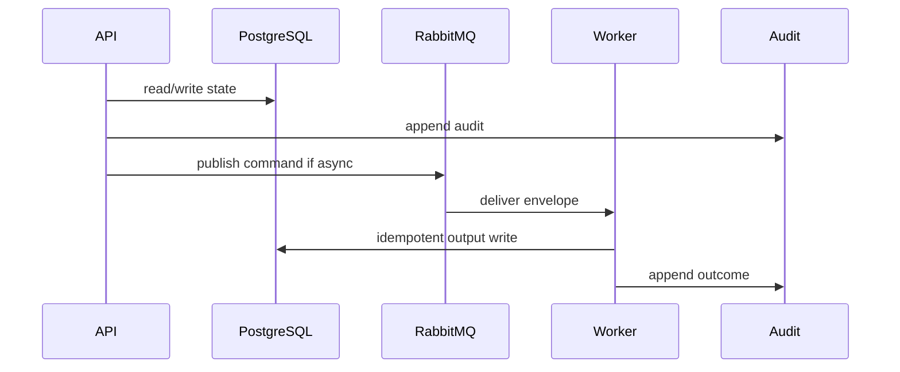

# 08 Reconciliation Playbook

## Purpose

Compare WizardProfile declarations with AIUsageFlow and TechnicalProfile to create conflicts or VerifiedProfile.

## Why This Component Exists

Manager declarations and scanner evidence can disagree. Conflicts must be explicit; Manager resolution is auditable and never overwrites scanner evidence.

Scope is controlled MVP prototype only. No production, formal legal reliability, runtime scanner accuracy, or A2-b2 completion claim is created.

## Runtime Ownership

| Concern | Owner |
|---|---|
| Service | Reconciliation Service |
| Module | `ReconciliationModule`, `packages/reconciliation` |
| Worker | `ReconciliationWorker` |
| Database | `ConflictRecord`, `ConflictResolution`, `VerifiedProfile` |
| Queue | reconciliation command/events |

## Exact npm Packages

| Package name | Purpose | Reason selected | Alternative rejected |
|---|---|---|---|
| `zod` | DTO/event validation. | Shared TypeScript-first contracts. | Ad hoc validation. |
| `uuid` | UUIDv7 IDs. | Cross-service identity and idempotency. | Sequential IDs. |
| `pino` | Structured logs. | Redaction/correlation. | Console logs only. |
| `json-rules-engine` | Versioned reconciliation rules. | Inspectable deterministic rule execution. | nested hard-coded conditionals. |

## Folder Structure

```text
packages/reconciliation/src/
  comparator/
  conflicts/
  verified-profile/
  persistence/
apps/api/src/modules/reconciliation/
```

## Configuration

| Key | Secret? | Purpose |
|---|---|---|
| `DATABASE_URL` | Yes | PostgreSQL connection. |
| `RABBITMQ_URL` | Yes | RabbitMQ broker. |
| `LCSP_ENV` | No | Environment. |
| `LCSP_LOG_LEVEL` | No | Logging level. |

## Inputs

| Input | Source | Validation | Example |
|---|---|---|---|
| WizardProfile | DB | submitted | `{ "declaredAiUse":"assistive" }` |
| AIUsageFlow | DB | claims evaluated | `{ "automation_level":"AUTOMATED_DECISION" }` |
| Manager resolution | API | Manager only, rationale | `{ "resolutionType":"MANAGER_CONFIRMATION" }` |

## Outputs

| Output | Destination | Example |
|---|---|---|
| ConflictRecord | DB/API | `{ "conflictType":"WIZARD_TECHNICAL_MISMATCH","status":"UNRESOLVED" }` |
| VerifiedProfile | DB | `{ "verifiedProfileId":"uuidv7" }` |

## Step-by-Step Processing

1. Load wizard/profile/flow.
2. Compare material fields.
3. Create conflicts for mismatch/unknown critical purpose.
4. If no conflicts, create VerifiedProfile.
5. Store Manager resolutions separately.
6. Rerun reconciliation after changes.

## Internal Data Structures

```json
{ "ConflictRecordDto": { "conflictId":"uuidv7", "wizardClaim":"assistive", "technicalClaim":"automated_decision", "evidenceRefs":["ev-001"] } }
```

## Database Usage

| Table | Usage | Constraint |
|---|---|---|
| `ConflictRecord` | conflict state | index assessment/status |
| `ConflictResolution` | Manager rationale | immutable |
| `VerifiedProfile` | classification precondition | no unresolved conflicts |

## Queue Usage

| Exchange | Queue | Routing key |
|---|---|---|
| `lcsp.commands.v1` | `lcsp.reconciliation-worker.v1` | `command.reconciliation.requested.v1` |
| `lcsp.events.v1` | downstream | `event.reconciliation.verified-profile-created.v1` |

## APIs

| Endpoint | Method | DTO | Status |
|---|---|---|---|
| `/api/v1/assessments/:id/reconciliation` | POST | `RunReconciliationRequestDto` | 202/422 |
| `/api/v1/assessments/:id/reconciliation/conflicts/:conflictId/resolution` | POST | `ResolveConflictRequestDto` | 200/409/422 |

## Sequence Diagram



## Failure Handling

| Error code | Reason | Recovery | Audit |
|---|---|---|---|
| `VALIDATION_FAILED` | DTO invalid. | Return 400 or block job. | attempted action audit. |
| `PERMISSION_DENIED` | Actor lacks permission. | Do not retry. | `audit.permission.denied.v1`. |
| `STATE_TRANSITION_BLOCKED` | Missing predecessor state. | Wait for valid state. | `audit.state.transition.blocked.v1`. |
| `GATE_PRECONDITION_FAILED` | Evidence/profile/citation gate missing. | Fail closed. | component blocked audit. |
| `TRANSIENT_DEPENDENCY_FAILURE` | Dependency unavailable. | Retry then DLQ/blocked. | retry/failure audit. |

## Observability

- JSON logs with correlation IDs and redaction.
- Metrics for latency, retries, blocks, failures, DLQ.
- Traces through HTTP, DB, outbox, worker.
- Alerts on guardrail block spikes, DLQ growth, audit write failure.

## Manual Verification

1. Start local dependencies.
2. Send documented request/command.
3. Verify DB state, queue event, audit event.
4. Confirm no raw source, secrets, full prompts, or full AST bodies appear.

## Acceptance Criteria

- Unresolved conflict blocks classification.
- Manager resolution does not mutate scanner evidence.
- VerifiedProfile only exists after conflicts resolved.
