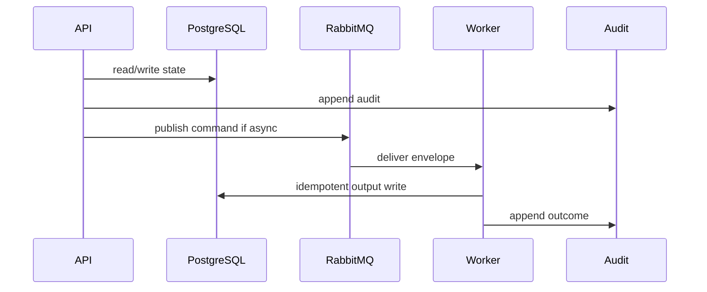

# 09 Legal RAG Playbook

## Purpose

Retrieve citation-linked legal rule candidates from controlled corpus for classification, gap, and documents.

## Why This Component Exists

Legal output requires citation traceability; RAG returns candidates and guardrail decisions, not formal legal reliability validation.

Scope is controlled MVP prototype only. No production, formal legal reliability, runtime scanner accuracy, or A2-b2 completion claim is created.

## Runtime Ownership

| Concern | Owner |
|---|---|
| Service | Legal RAG Service |
| Module | `LegalCorpusModule`, `packages/legal-rag` |
| Worker | called inside classification/gap/document workers |
| Database | `LegalDocumentVersion`, `LegalRule`, `LegalCitation` |
| Queue | no public queue in prototype |

## Exact npm Packages

| Package name | Purpose | Reason selected | Alternative rejected |
|---|---|---|---|
| `zod` | DTO/event validation. | Shared TypeScript-first contracts. | Ad hoc validation. |
| `uuid` | UUIDv7 IDs. | Cross-service identity and idempotency. | Sequential IDs. |
| `pino` | Structured logs. | Redaction/correlation. | Console logs only. |
| `chromadb` | ChromaDB collection and retrieval client. | Matches prototype vector store decision. | Unspecified vector DB client. |

## Folder Structure

```text
packages/legal-rag/src/
  corpus/
  chunking/
  retrieval/
  citation/
  persistence/
```

## Configuration

| Key | Secret? | Purpose |
|---|---|---|
| `DATABASE_URL` | Yes | PostgreSQL connection. |
| `RABBITMQ_URL` | Yes | RabbitMQ broker. |
| `LCSP_ENV` | No | Environment. |
| `LCSP_LOG_LEVEL` | No | Logging level. |

## Inputs

| Input | Source | Validation | Example |
|---|---|---|---|
| Corpus metadata | internal corpus | title/source/hash/version | `{ "documentId":"law-134" }` |
| Retrieval request | worker | VerifiedProfile required | `{ "verifiedProfileId":"uuidv7" }` |

## Outputs

| Output | Destination | Example |
|---|---|---|
| LegalRuleMatch | worker/DB | `{ "ruleId":"uuidv7","article":"12","citationCoverage":"SUFFICIENT" }` |
| LegalCitation | DB | `{ "citationId":"uuidv7","chunkId":"law-134-a12" }` |

## Step-by-Step Processing

1. Load pinned corpus metadata.
2. Chunk legal rules by article/clause.
3. Index in ChromaDB by corpus version.
4. Verify VerifiedProfile.
5. Retrieve candidate rules.
6. Validate citation metadata.
7. Block when citation missing.

## Internal Data Structures

```json
{ "LegalRuleMatchDto": { "ruleId":"uuidv7", "documentId":"law-134", "article":"12", "clause":"3", "chunkId":"law-134-a12-c3", "citationCoverage":"SUFFICIENT" } }
```

## Database Usage

| Table | Usage | Constraint |
|---|---|---|
| `LegalDocumentVersion` | provenance | unique doc/version |
| `LegalRule` | article/clause chunks | indexed article/clause |
| `LegalCitation` | output trace | FK to rule/version |

## Queue Usage

| Exchange | Routing key | Usage |
|---|---|---|
| none | none | called synchronously inside workers for prototype |

## APIs

| Endpoint | Method | DTO | Status |
|---|---|---|---|
| `/api/v1/legal-corpus/versions` | GET | query | 200/403 |
| `/api/v1/legal-corpus/retrieve` | POST | `LegalRetrievalRequestDto` | 200/422 |

## Sequence Diagram



## Failure Handling

| Error code | Reason | Recovery | Audit |
|---|---|---|---|
| `VALIDATION_FAILED` | DTO invalid. | Return 400 or block job. | attempted action audit. |
| `PERMISSION_DENIED` | Actor lacks permission. | Do not retry. | `audit.permission.denied.v1`. |
| `STATE_TRANSITION_BLOCKED` | Missing predecessor state. | Wait for valid state. | `audit.state.transition.blocked.v1`. |
| `GATE_PRECONDITION_FAILED` | Evidence/profile/citation gate missing. | Fail closed. | component blocked audit. |
| `TRANSIENT_DEPENDENCY_FAILURE` | Dependency unavailable. | Retry then DLQ/blocked. | retry/failure audit. |

## Observability

- JSON logs with correlation IDs and redaction.
- Metrics for latency, retries, blocks, failures, DLQ.
- Traces through HTTP, DB, outbox, worker.
- Alerts on guardrail block spikes, DLQ growth, audit write failure.

## Manual Verification

1. Start local dependencies.
2. Send documented request/command.
3. Verify DB state, queue event, audit event.
4. Confirm no raw source, secrets, full prompts, or full AST bodies appear.

## Acceptance Criteria

- Retrieval requires VerifiedProfile.
- Missing citation blocks/degrades output.
- Policy-only source is not standalone mandatory obligation.
