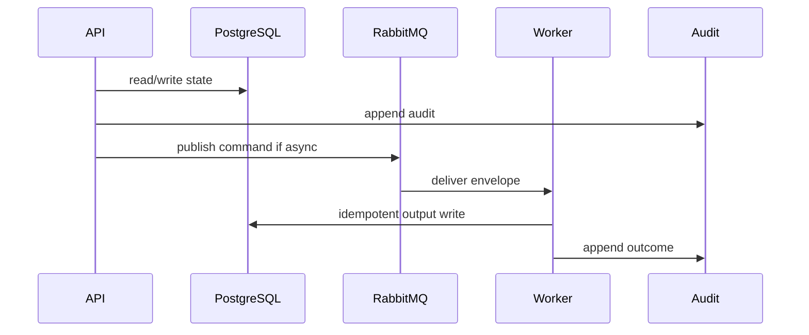

# 10 Classification Playbook

## Purpose

Produce RiskClassificationResult or blocked state after VerifiedProfile and Citation Guardrail pass.

## Why This Component Exists

Classification must not run on unverified, conflicted, insufficient, unknown, or uncited evidence.

Scope is controlled MVP prototype only. No production, formal legal reliability, runtime scanner accuracy, or A2-b2 completion claim is created.

## Runtime Ownership

| Concern | Owner |
|---|---|
| Service | Classification Service |
| Module | `ClassificationModule`, `packages/classification` |
| Worker | `ClassificationWorker` |
| Database | `ClassificationRun`, `RiskClassificationResult` |
| Queue | classification command/events |

## Exact npm Packages

| Package name | Purpose | Reason selected | Alternative rejected |
|---|---|---|---|
| `zod` | DTO/event validation. | Shared TypeScript-first contracts. | Ad hoc validation. |
| `uuid` | UUIDv7 IDs. | Cross-service identity and idempotency. | Sequential IDs. |
| `pino` | Structured logs. | Redaction/correlation. | Console logs only. |
| `json-rules-engine` | Risk gate and classification rules. | Deterministic/versioned rule evaluation. | LLM-only classification. |

## Folder Structure

```text
packages/classification/src/
  gates/
  rules/
  scoring/
  persistence/
apps/worker/src/handlers/classification/
```

## Configuration

| Key | Secret? | Purpose |
|---|---|---|
| `DATABASE_URL` | Yes | PostgreSQL connection. |
| `RABBITMQ_URL` | Yes | RabbitMQ broker. |
| `LCSP_ENV` | No | Environment. |
| `LCSP_LOG_LEVEL` | No | Logging level. |

## Inputs

| Input | Source | Validation | Example |
|---|---|---|---|
| VerifiedProfile | DB | active, no conflict | `{ "verifiedProfileId":"uuidv7" }` |
| Legal matches | Legal RAG | citation coverage sufficient | `{ "citationCoverage":"SUFFICIENT" }` |

## Outputs

| Output | Destination | Example |
|---|---|---|
| RiskClassificationResult | DB/API | `{ "riskLevel":"HIGH_IMPACT_REVIEW_REQUIRED","confidence":0.78 }` |
| Blocked event | MQ | `{ "reason":"CITATION_REQUIRED" }` |

## Step-by-Step Processing

1. Load VerifiedProfile.
2. Check conflict/evidence/purpose gates.
3. Retrieve legal rules.
4. Validate citations.
5. Run deterministic rules.
6. Score confidence.
7. Persist result or blocked state.
8. Audit and publish event.

## Internal Data Structures

```json
{ "RiskClassificationResultDto": { "classificationId":"uuidv7", "riskLevel":"HIGH_IMPACT_REVIEW_REQUIRED", "legalCitationIds":["uuidv7"], "limitations":[] } }
```

## Database Usage

| Table | Usage | Constraint |
|---|---|---|
| `ClassificationRun` | run metadata | assessment/status index |
| `RiskClassificationResult` | result/blocked state | FK VerifiedProfile and citations |

## Queue Usage

| Exchange | Queue | Routing key |
|---|---|---|
| `lcsp.commands.v1` | `lcsp.classification-worker.v1` | `command.classification.requested.v1` |
| `lcsp.events.v1` | downstream | `event.classification.completed.v1` / `event.classification.blocked.v1` |

## APIs

| Endpoint | Method | DTO | Status |
|---|---|---|---|
| `/api/v1/assessments/:id/classification` | POST | `RequestClassificationDto` | 202/422 |
| `/api/v1/assessments/:id/classification/latest` | GET | `RiskClassificationResultDto` | 200/404 |

## Sequence Diagram



## Failure Handling

| Error code | Reason | Recovery | Audit |
|---|---|---|---|
| `VALIDATION_FAILED` | DTO invalid. | Return 400 or block job. | attempted action audit. |
| `PERMISSION_DENIED` | Actor lacks permission. | Do not retry. | `audit.permission.denied.v1`. |
| `STATE_TRANSITION_BLOCKED` | Missing predecessor state. | Wait for valid state. | `audit.state.transition.blocked.v1`. |
| `GATE_PRECONDITION_FAILED` | Evidence/profile/citation gate missing. | Fail closed. | component blocked audit. |
| `TRANSIENT_DEPENDENCY_FAILURE` | Dependency unavailable. | Retry then DLQ/blocked. | retry/failure audit. |

## Observability

- JSON logs with correlation IDs and redaction.
- Metrics for latency, retries, blocks, failures, DLQ.
- Traces through HTTP, DB, outbox, worker.
- Alerts on guardrail block spikes, DLQ growth, audit write failure.

## Manual Verification

1. Start local dependencies.
2. Send documented request/command.
3. Verify DB state, queue event, audit event.
4. Confirm no raw source, secrets, full prompts, or full AST bodies appear.

## Acceptance Criteria

- VerifiedProfile is mandatory.
- Provider/model/framework alone never classifies.
- Missing citation or unknown critical purpose blocks/degrades output.
