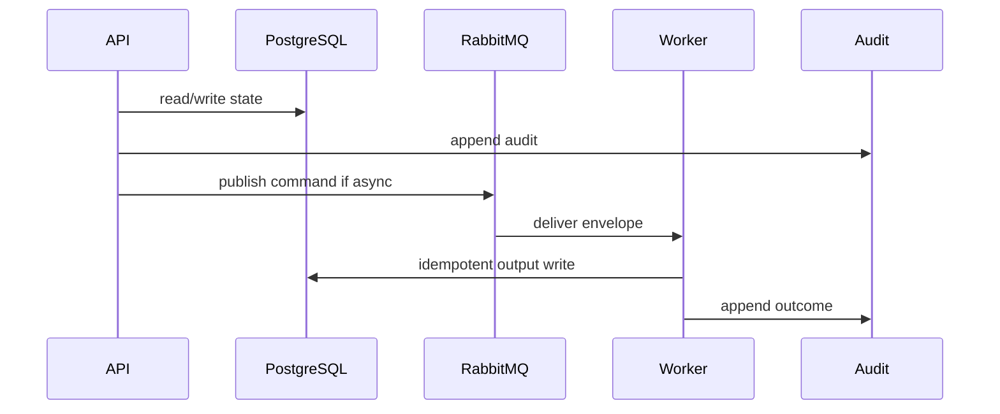

# 11 Document Generation Playbook

## Purpose

Generate prototype gap and document artifacts only after classification, citation, reconciliation, and output guardrails pass.

## Why This Component Exists

Document output must remain citation-traceable and prototype-limited, without production legal document or compliance certification claims.

Scope is controlled MVP prototype only. No production, formal legal reliability, runtime scanner accuracy, or A2-b2 completion claim is created.

## Runtime Ownership

| Concern | Owner |
|---|---|
| Service | Document/Gap Service |
| Module | `DocumentModule`, `GapAnalysisModule` |
| Worker | `DocumentWorker`, `GapAnalysisWorker` |
| Database | `GapAnalysisResult`, `ComplianceDocument`, `GeneratedDocumentFile` |
| Queue | gap/document commands/events |

## Exact npm Packages

| Package name | Purpose | Reason selected | Alternative rejected |
|---|---|---|---|
| `zod` | DTO/event validation. | Shared TypeScript-first contracts. | Ad hoc validation. |
| `uuid` | UUIDv7 IDs. | Cross-service identity and idempotency. | Sequential IDs. |
| `pino` | Structured logs. | Redaction/correlation. | Console logs only. |
| `handlebars` | Template rendering. | Simple deterministic document templates. | LLM-only document drafting. |
| `puppeteer` | HTML-to-PDF rendering for local prototype. | Mature PDF rendering from HTML. | Browserless manual export. |
| `minio` | S3-compatible object storage client. | Matches local MinIO/S3-compatible artifact storage. | local filesystem-only storage. |

## Folder Structure

```text
packages/document-generation/src/
  templates/
  renderer/
  guardrails/
  persistence/
apps/worker/src/handlers/document/
```

## Configuration

| Key | Secret? | Purpose |
|---|---|---|
| `DATABASE_URL` | Yes | PostgreSQL connection. |
| `RABBITMQ_URL` | Yes | RabbitMQ broker. |
| `LCSP_ENV` | No | Environment. |
| `LCSP_LOG_LEVEL` | No | Logging level. |

## Inputs

| Input | Source | Validation | Example |
|---|---|---|---|
| Classification | DB | valid, citation-backed | `{ "classificationId":"uuidv7" }` |
| Document request | API | Manager, doc type allowed | `{ "documentType":"prototype_summary" }` |

## Outputs

| Output | Destination | Example |
|---|---|---|
| GapAnalysisResult | DB/API | `{ "gaps":[{"priority":"HIGH"}] }` |
| GeneratedDocumentFile | DB/object storage | `{ "fileId":"uuidv7","storageKey":"documents/uuid.pdf" }` |

## Step-by-Step Processing

1. Verify profile/classification/citations/no conflict.
2. Generate gap list and priority.
3. Select template.
4. Render content with citation appendix and prototype notice.
5. Run Output Guardrail.
6. Store artifact metadata.
7. Audit and publish event.

## Internal Data Structures

```json
{ "DocumentGenerationRequestDto": { "classificationId":"uuidv7", "documentType":"prototype_summary", "format":"pdf" } }
```

## Database Usage

| Table | Usage | Constraint |
|---|---|---|
| `GapAnalysisResult` | gap output | FK classification |
| `ComplianceDocument` | document metadata | guardrail status |
| `GeneratedDocumentFile` | storage ref/hash | no raw source |

## Queue Usage

| Exchange | Queue | Routing key |
|---|---|---|
| `lcsp.commands.v1` | `lcsp.gap-analysis-worker.v1` | `command.gap-analysis.requested.v1` |
| `lcsp.commands.v1` | `lcsp.document-worker.v1` | `command.document.requested.v1` |

## APIs

| Endpoint | Method | DTO | Status |
|---|---|---|---|
| `/api/v1/assessments/:id/gap-analysis` | POST | `RequestGapAnalysisDto` | 202/422 |
| `/api/v1/assessments/:id/documents` | POST | `DocumentGenerationRequestDto` | 202/422 |

## Sequence Diagram



## Failure Handling

| Error code | Reason | Recovery | Audit |
|---|---|---|---|
| `VALIDATION_FAILED` | DTO invalid. | Return 400 or block job. | attempted action audit. |
| `PERMISSION_DENIED` | Actor lacks permission. | Do not retry. | `audit.permission.denied.v1`. |
| `STATE_TRANSITION_BLOCKED` | Missing predecessor state. | Wait for valid state. | `audit.state.transition.blocked.v1`. |
| `GATE_PRECONDITION_FAILED` | Evidence/profile/citation gate missing. | Fail closed. | component blocked audit. |
| `TRANSIENT_DEPENDENCY_FAILURE` | Dependency unavailable. | Retry then DLQ/blocked. | retry/failure audit. |

## Observability

- JSON logs with correlation IDs and redaction.
- Metrics for latency, retries, blocks, failures, DLQ.
- Traces through HTTP, DB, outbox, worker.
- Alerts on guardrail block spikes, DLQ growth, audit write failure.

## Manual Verification

1. Start local dependencies.
2. Send documented request/command.
3. Verify DB state, queue event, audit event.
4. Confirm no raw source, secrets, full prompts, or full AST bodies appear.

## Acceptance Criteria

- Missing citation blocks/degrades final output.
- Unresolved conflict blocks generation.
- Generated artifact includes prototype limitation and citation trace.
