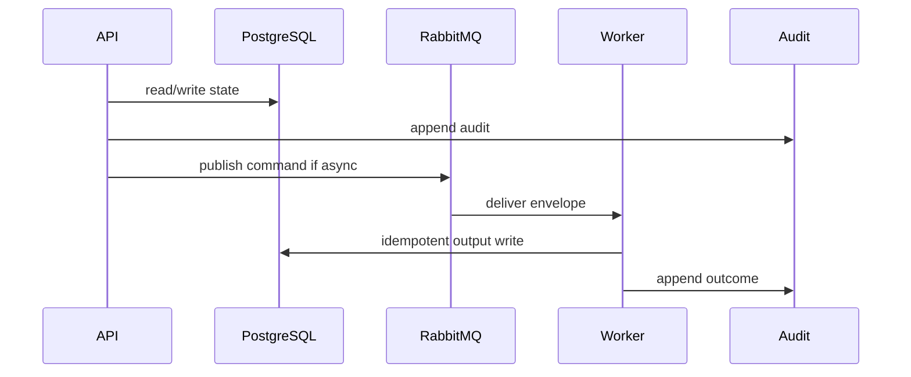

# 12 Audit Playbook

## Purpose

Append immutable audit records for critical auth, repository, scan, evidence, reconciliation, classification, document, and failure events.

## Why This Component Exists

Compliance-sensitive workflows require reconstruction by correlation ID without storing secrets, raw source, full prompts, or full AST bodies.

Scope is controlled MVP prototype only. No production, formal legal reliability, runtime scanner accuracy, or A2-b2 completion claim is created.

## Runtime Ownership

| Concern | Owner |
|---|---|
| Service | Audit Service |
| Module | `AuditModule`, `packages/audit` |
| Worker | `AuditProjector` optional |
| Database | `AuditEvent` |
| Queue | optional `event.audit.created.v1` |

## Exact npm Packages

| Package name | Purpose | Reason selected | Alternative rejected |
|---|---|---|---|
| `zod` | DTO/event validation. | Shared TypeScript-first contracts. | Ad hoc validation. |
| `uuid` | UUIDv7 IDs. | Cross-service identity and idempotency. | Sequential IDs. |
| `pino` | Structured logs. | Redaction/correlation. | Console logs only. |

## Folder Structure

```text
packages/audit/src/
  audit-event.dto.ts
  audit-redactor.ts
  audit.repository.ts
  audit.service.ts
apps/api/src/modules/audit/
```

## Configuration

| Key | Secret? | Purpose |
|---|---|---|
| `DATABASE_URL` | Yes | PostgreSQL connection. |
| `RABBITMQ_URL` | Yes | RabbitMQ broker. |
| `LCSP_ENV` | No | Environment. |
| `LCSP_LOG_LEVEL` | No | Logging level. |

## Inputs

| Input | Source | Validation | Example |
|---|---|---|---|
| Audit append request | services/workers | event allow-list and redaction | `{ "eventType":"audit.scan.completed.v1" }` |

## Outputs

| Output | Destination | Example |
|---|---|---|
| AuditEvent | DB/API | `{ "auditEventId":"uuidv7","correlationId":"uuidv7" }` |

## Step-by-Step Processing

1. Validate audit event type/actor/aggregate.
2. Redact forbidden fields recursively.
3. Insert immutable row.
4. Reject update/delete.
5. Expose scoped read API.

## Internal Data Structures

```json
{ "AuditEventDto": { "eventType":"audit.classification.blocked.v1", "actorType":"SYSTEM_WORKER", "metadata":{"reason":"CITATION_REQUIRED"} } }
```

## Database Usage

| Table | Usage | Constraint |
|---|---|---|
| `AuditEvent` | append-only trail | indexes assessment/time, correlationId, eventType |

## Queue Usage

| Exchange | Queue | Routing key |
|---|---|---|
| `lcsp.events.v1` | `lcsp.audit-projector.v1` | `event.audit.created.v1` |

## APIs

| Endpoint | Method | DTO | Status |
|---|---|---|---|
| `/api/v1/assessments/:id/audit-events` | GET | `AuditEventListDto` | 200/403 |

## Sequence Diagram



## Failure Handling

| Error code | Reason | Recovery | Audit |
|---|---|---|---|
| `VALIDATION_FAILED` | DTO invalid. | Return 400 or block job. | attempted action audit. |
| `PERMISSION_DENIED` | Actor lacks permission. | Do not retry. | `audit.permission.denied.v1`. |
| `STATE_TRANSITION_BLOCKED` | Missing predecessor state. | Wait for valid state. | `audit.state.transition.blocked.v1`. |
| `GATE_PRECONDITION_FAILED` | Evidence/profile/citation gate missing. | Fail closed. | component blocked audit. |
| `TRANSIENT_DEPENDENCY_FAILURE` | Dependency unavailable. | Retry then DLQ/blocked. | retry/failure audit. |

## Observability

- JSON logs with correlation IDs and redaction.
- Metrics for latency, retries, blocks, failures, DLQ.
- Traces through HTTP, DB, outbox, worker.
- Alerts on guardrail block spikes, DLQ growth, audit write failure.

## Manual Verification

1. Start local dependencies.
2. Send documented request/command.
3. Verify DB state, queue event, audit event.
4. Confirm no raw source, secrets, full prompts, or full AST bodies appear.

## Acceptance Criteria

- Every state-changing action writes audit.
- Forbidden data is redacted.
- Audit rows are immutable.
