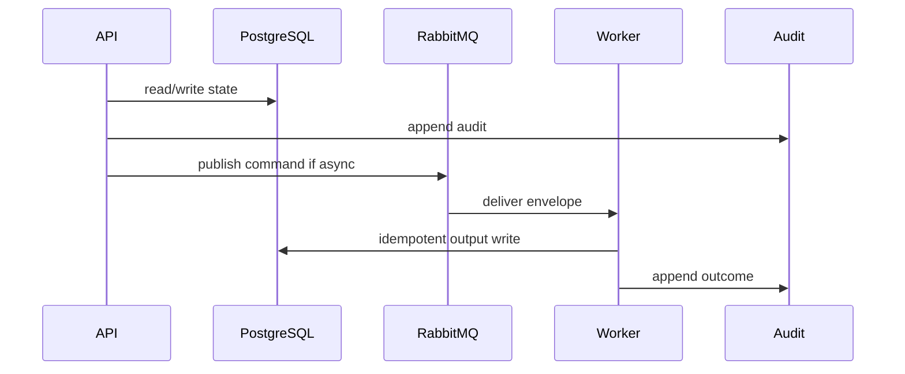

# 13 PostgreSQL Playbook

## Purpose

Define Prisma/PostgreSQL model ownership, relationships, indexes, migration order, outbox, audit, and retention.

## Why This Component Exists

PostgreSQL is the durable source of truth for identities, assessments, metadata, workflow states, citations, outbox, and audit.

Scope is controlled MVP prototype only. No production, formal legal reliability, runtime scanner accuracy, or A2-b2 completion claim is created.

## Runtime Ownership

| Concern | Owner |
|---|---|
| Service | Persistence Layer |
| Module | `PrismaModule` |
| Worker | all workers via repositories |
| Database | all canonical Prisma models |
| Queue | `OutboxEvent` bridge |

## Exact npm Packages

| Package name | Purpose | Reason selected | Alternative rejected |
|---|---|---|---|
| `zod` | DTO/event validation. | Shared TypeScript-first contracts. | Ad hoc validation. |
| `uuid` | UUIDv7 IDs. | Cross-service identity and idempotency. | Sequential IDs. |
| `pino` | Structured logs. | Redaction/correlation. | Console logs only. |
| `prisma` | Migration and client generation CLI. | Canonical ORM tooling. | Handwritten migration-only workflow. |
| `@prisma/client` | Typed database client. | NestJS repository integration. | Raw SQL-only access. |

## Folder Structure

```text
packages/database/
  prisma/schema.prisma
  prisma/migrations/
  src/prisma.module.ts
  src/repositories/
```

## Configuration

| Key | Secret? | Purpose |
|---|---|---|
| `DATABASE_URL` | Yes | PostgreSQL connection. |
| `RABBITMQ_URL` | Yes | RabbitMQ broker. |
| `LCSP_ENV` | No | Environment. |
| `LCSP_LOG_LEVEL` | No | Logging level. |

## Inputs

| Input | Source | Validation | Example |
|---|---|---|---|
| Domain DTO | services | validated before transaction | `{ "assessmentId":"uuidv7" }` |
| Migration | developer | ordered plan | `npm run db:migrate` |

## Outputs

| Output | Destination | Example |
|---|---|---|
| Prisma records | PostgreSQL | `{ "id":"uuidv7" }` |
| Outbox rows | PostgreSQL | envelope with status pending |

## Step-by-Step Processing

1. Generate Prisma client.
2. Apply migrations in dependency order.
3. Use repositories, not controllers.
4. Wrap domain + audit + outbox writes in transaction.
5. Enforce tenant scope.
6. Store refs/hashes, not raw source/secrets.

## Internal Data Structures

```json
{ "ModelConvention": { "id":"uuidv7", "organizationId":"uuidv7", "assessmentId":"uuidv7", "createdAt":"DateTime", "version":1 } }
```

## Database Usage

| Model group | Models | Key constraints |
|---|---|---|
| Identity | `User`, `OAuthIdentity`, `UserMfaMethod`, `Session` | provider subject/session hash unique |
| Assessment | `Organization`, `Assessment`, `WizardProfile` | org/assessment indexes |
| GitHub/scan | `GitHubRepositoryConnection`, `RepositorySnapshot`, `RepositoryScanJob` | connection/commit/idempotency unique |
| Evidence | `TechnicalEvidenceReport`, `TechnicalFinding`, `EvidenceReference`, `CodeGraphNode`, `CodeGraphEdge`, `TechnicalProfile` | report hash/evidence refs |
| Flow | `AIUsageFlow`, `AIUsageFlowClaim`, `ConflictRecord`, `ConflictResolution`, `VerifiedProfile` | active version/conflict status |
| Legal/output | `LegalDocumentVersion`, `LegalRule`, `LegalCitation`, `ClassificationRun`, `RiskClassificationResult`, `GapAnalysisResult`, `ComplianceDocument`, `GeneratedDocumentFile` | citation FKs |
| Ops | `WorkflowRun`, `OutboxEvent`, `AuditEvent` | outbox/audit indexes |

## Queue Usage

| Exchange | Routing key | DB bridge |
|---|---|---|
| all | all | `OutboxEvent` stores envelope before publish |

## APIs

| Endpoint | Method | DTO | Status |
|---|---|---|---|
| none | n/a | repositories only | n/a |

## Sequence Diagram



## Failure Handling

| Error code | Reason | Recovery | Audit |
|---|---|---|---|
| `VALIDATION_FAILED` | DTO invalid. | Return 400 or block job. | attempted action audit. |
| `PERMISSION_DENIED` | Actor lacks permission. | Do not retry. | `audit.permission.denied.v1`. |
| `STATE_TRANSITION_BLOCKED` | Missing predecessor state. | Wait for valid state. | `audit.state.transition.blocked.v1`. |
| `GATE_PRECONDITION_FAILED` | Evidence/profile/citation gate missing. | Fail closed. | component blocked audit. |
| `TRANSIENT_DEPENDENCY_FAILURE` | Dependency unavailable. | Retry then DLQ/blocked. | retry/failure audit. |

## Observability

- JSON logs with correlation IDs and redaction.
- Metrics for latency, retries, blocks, failures, DLQ.
- Traces through HTTP, DB, outbox, worker.
- Alerts on guardrail block spikes, DLQ growth, audit write failure.

## Manual Verification

1. Start local dependencies.
2. Send documented request/command.
3. Verify DB state, queue event, audit event.
4. Confirm no raw source, secrets, full prompts, or full AST bodies appear.

## Acceptance Criteria

- Transactions include state, audit, outbox where needed.
- Tenant scope enforced on reads/writes.
- No long-term raw source or secret fields exist.

Migration order: identity, tenant/assessment, GitHub/snapshot, scan/evidence, profile/AIUsageFlow, reconciliation, legal/classification, gap/document, ops.
