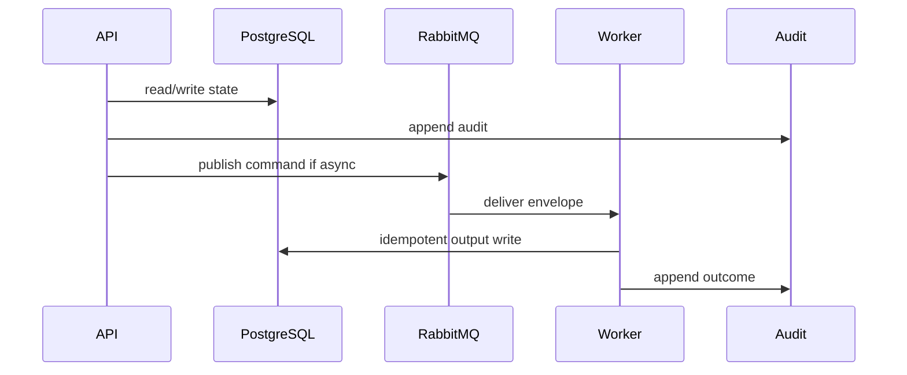

# 14 API Gateway Playbook

## Purpose

Expose REST JSON APIs with NestJS guards, DTO validation, OpenAPI metadata, transaction boundaries, audit, and outbox.

## Why This Component Exists

The API enforces OAuth/OIDC session, Manager super-role, organization/assessment scope, state-machine preconditions, and sync-vs-async boundaries.

Scope is controlled MVP prototype only. No production, formal legal reliability, runtime scanner accuracy, or A2-b2 completion claim is created.

## Runtime Ownership

| Concern | Owner |
|---|---|
| Service | LCSP API |
| Module | active MVP NestJS modules |
| Worker | none in API |
| Database | command-originating records/outbox/audit |
| Queue | publishes commands via outbox |

## Exact npm Packages

| Package name | Purpose | Reason selected | Alternative rejected |
|---|---|---|---|
| `zod` | DTO/event validation. | Shared TypeScript-first contracts. | Ad hoc validation. |
| `uuid` | UUIDv7 IDs. | Cross-service identity and idempotency. | Sequential IDs. |
| `pino` | Structured logs. | Redaction/correlation. | Console logs only. |
| `@nestjs/common` | NestJS controllers, guards, providers. | Canonical backend framework. | Express-only API. |
| `@nestjs/swagger` | OpenAPI generation. | Keeps NestJS DTO/controller contracts inspectable. | Separate hand-written OpenAPI. |
| `cookie` | Session cookie parsing/serialization. | Explicit backend-verifiable session boundary. | frontend-managed OAuth tokens. |

## Folder Structure

```text
apps/api/src/
  common/guards/
  common/filters/
  modules/auth/
  modules/assessments/
  modules/github/
  modules/scans/
  modules/evidence/
  modules/ai-usage-flow/
  modules/reconciliation/
  modules/classification/
  modules/gap-analysis/
  modules/documents/
  modules/audit/
```

## Configuration

| Key | Secret? | Purpose |
|---|---|---|
| `DATABASE_URL` | Yes | PostgreSQL connection. |
| `RABBITMQ_URL` | Yes | RabbitMQ broker. |
| `LCSP_ENV` | No | Environment. |
| `LCSP_LOG_LEVEL` | No | Logging level. |

## Inputs

| Input | Source | Validation | Example |
|---|---|---|---|
| HTTP request | UI | DTO, auth, scope, permission, state | `{ "assessmentId":"uuidv7" }` |

## Outputs

| Output | Destination | Example |
|---|---|---|
| JSON response | UI | `{ "status":"REQUESTED" }` |
| Error response | UI | `{ "error":{"code":"STATE_TRANSITION_BLOCKED"} }` |

## Step-by-Step Processing

1. Correlation interceptor.
2. Auth guard.
3. Organization scope guard.
4. Permission guard.
5. State transition guard.
6. DTO validation.
7. Transactional service.
8. Audit/outbox.
9. Error filter mapping.

## Internal Data Structures

```json
{ "ErrorResponseDto": { "error": { "code":"GATE_PRECONDITION_FAILED", "message":"VerifiedProfile is required", "correlationId":"uuidv7" } } }
```

## Database Usage

| Table | Usage | Constraint |
|---|---|---|
| `Session` | auth | token hash index |
| `AuditEvent` | every accepted/blocked action | immutable |
| `OutboxEvent` | async command | unique eventId |

## Queue Usage

| Exchange | Routing key | Producer | Consumer |
|---|---|---|---|
| `lcsp.commands.v1` | command.*.v1 | API outbox | domain workers |

## APIs

| Endpoint group | Examples | Guard |
|---|---|---|
| Auth | `/api/v1/auth/oauth/callback` | callback validation |
| Assessment/Wizard | `/api/v1/assessments`, `/wizard-profile` | Manager |
| GitHub/Scan | repository connection/snapshot/scans | Manager |
| Reconciliation/Classify/Docs | workflow endpoints | Manager + gates |

## Sequence Diagram



## Failure Handling

| Error code | Reason | Recovery | Audit |
|---|---|---|---|
| `VALIDATION_FAILED` | DTO invalid. | Return 400 or block job. | attempted action audit. |
| `PERMISSION_DENIED` | Actor lacks permission. | Do not retry. | `audit.permission.denied.v1`. |
| `STATE_TRANSITION_BLOCKED` | Missing predecessor state. | Wait for valid state. | `audit.state.transition.blocked.v1`. |
| `GATE_PRECONDITION_FAILED` | Evidence/profile/citation gate missing. | Fail closed. | component blocked audit. |
| `TRANSIENT_DEPENDENCY_FAILURE` | Dependency unavailable. | Retry then DLQ/blocked. | retry/failure audit. |

## Observability

- JSON logs with correlation IDs and redaction.
- Metrics for latency, retries, blocks, failures, DLQ.
- Traces through HTTP, DB, outbox, worker.
- Alerts on guardrail block spikes, DLQ growth, audit write failure.

## Manual Verification

1. Start local dependencies.
2. Send documented request/command.
3. Verify DB state, queue event, audit event.
4. Confirm no raw source, secrets, full prompts, or full AST bodies appear.

## Acceptance Criteria

- Every response has correlation ID.
- Developer cannot perform Manager-only actions.
- Async requests return 202 after outbox write.
