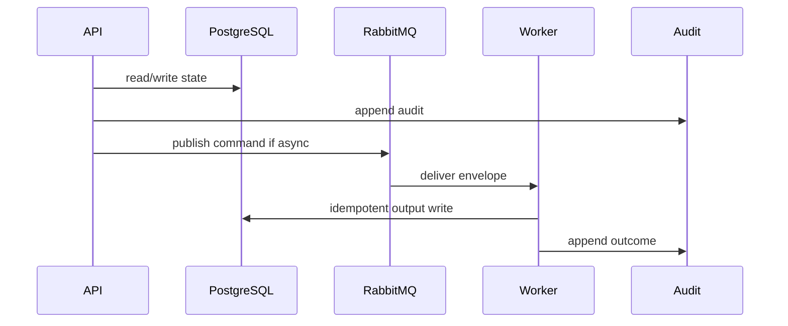

# 15 Local Development Playbook

## Purpose

Define repeatable local setup and verification without creating deployment artifacts.

## Why This Component Exists

Developers need local PostgreSQL, RabbitMQ, ChromaDB, MinIO, API, web, and workers to implement and verify controlled prototype behavior.

Scope is controlled MVP prototype only. No production, formal legal reliability, runtime scanner accuracy, or A2-b2 completion claim is created.

## Runtime Ownership

| Concern | Owner |
|---|---|
| Service | Local Prototype Runtime |
| Module | all modules |
| Worker | all workers |
| Database | local PostgreSQL |
| Queue | local RabbitMQ |

## Exact npm Packages

| Package name | Purpose | Reason selected | Alternative rejected |
|---|---|---|---|
| `zod` | DTO/event validation. | Shared TypeScript-first contracts. | Ad hoc validation. |
| `uuid` | UUIDv7 IDs. | Cross-service identity and idempotency. | Sequential IDs. |
| `pino` | Structured logs. | Redaction/correlation. | Console logs only. |
| `npm-run-all` | Parallel local service scripts when implemented. | Developer-friendly workspace orchestration. | Manual multi-terminal instructions only. |

## Folder Structure

```text
apps/web/
apps/api/
apps/worker/
packages/contracts/
packages/database/
packages/scanner/
packages/ai-usage-flow/
packages/reconciliation/
packages/legal-rag/
packages/audit/
legal-corpus/
fixtures/
```

## Configuration

| Key | Secret? | Purpose |
|---|---|---|
| `DATABASE_URL` | Yes | PostgreSQL connection. |
| `RABBITMQ_URL` | Yes | RabbitMQ broker. |
| `LCSP_ENV` | No | Environment. |
| `LCSP_LOG_LEVEL` | No | Logging level. |

## Inputs

| Input | Source | Validation | Example |
|---|---|---|---|
| Environment variables | developer | no committed secrets | `DATABASE_URL=...` |
| npm command | terminal | workspace scripts exist | `npm run dev` |

## Outputs

| Output | Destination | Example |
|---|---|---|
| Running services | local | `{ "status":"ok" }` |

## Step-by-Step Processing

1. Install npm workspace dependencies.
2. Start local PostgreSQL/RabbitMQ/ChromaDB/MinIO by approved local mechanism.
3. Configure env values.
4. Run Prisma generate/migrate/seed.
5. Start API, worker, web.
6. Execute Manager golden path with synthetic fixtures.

## Internal Data Structures

```json
{ "LocalSmokeResult": { "apiHealth":"ok", "rabbitmq":"connected", "postgres":"connected", "worker":"ready" } }
```

## Database Usage

| Table | Usage | Constraint |
|---|---|---|
| all canonical tables | local prototype | synthetic data only |

## Queue Usage

| Exchange | Routing key | Usage |
|---|---|---|
| all canonical exchanges | all keys | local async verification |

## APIs

| Endpoint | Method | DTO | Status |
|---|---|---|---|
| `/api/v1/health` | GET | none | 200 |
| `/api/v1/assessments` | POST | `CreateAssessmentRequestDto` | 201 |

## Sequence Diagram



## Failure Handling

| Error code | Reason | Recovery | Audit |
|---|---|---|---|
| `VALIDATION_FAILED` | DTO invalid. | Return 400 or block job. | attempted action audit. |
| `PERMISSION_DENIED` | Actor lacks permission. | Do not retry. | `audit.permission.denied.v1`. |
| `STATE_TRANSITION_BLOCKED` | Missing predecessor state. | Wait for valid state. | `audit.state.transition.blocked.v1`. |
| `GATE_PRECONDITION_FAILED` | Evidence/profile/citation gate missing. | Fail closed. | component blocked audit. |
| `TRANSIENT_DEPENDENCY_FAILURE` | Dependency unavailable. | Retry then DLQ/blocked. | retry/failure audit. |

## Observability

- JSON logs with correlation IDs and redaction.
- Metrics for latency, retries, blocks, failures, DLQ.
- Traces through HTTP, DB, outbox, worker.
- Alerts on guardrail block spikes, DLQ growth, audit write failure.

## Manual Verification

1. Start local dependencies.
2. Send documented request/command.
3. Verify DB state, queue event, audit event.
4. Confirm no raw source, secrets, full prompts, or full AST bodies appear.

## Acceptance Criteria

- Fresh clone can install, migrate, seed, start API/worker/web.
- Smoke path works or produces documented blocked state.
- Logs contain no secrets/raw source/full prompts.
