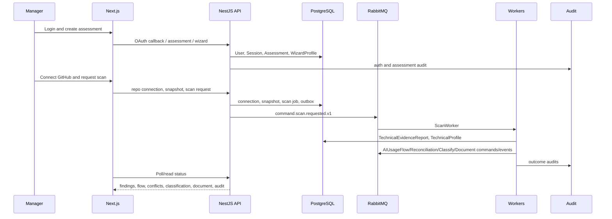

# 16 Manager Golden Path Playbook

## Purpose

Provide the complete no-skipped-step controlled MVP prototype runtime from Manager OAuth/OIDC login to generated prototype document and audit review.

## Why This Component Exists

Manager is the MVP super-role and must complete every active MVP workflow without Developer assignment. This walkthrough connects UI, API, PostgreSQL, RabbitMQ, workers, audit, and user-visible state so implementation teams can build the system end to end without architectural clarification.

## Runtime Ownership

| Concern | Owner |
|---|---|
| Service name | End-to-End Manager Workflow |
| NestJS module | auth, assessment, wizard, GitHub, scan, evidence, AIUsageFlow, reconciliation, classification, gap, document, audit modules |
| Worker name | scan, AIUsageFlow, reconciliation, classification, gap, document workers |
| Database ownership | all workflow records scoped by assessment |
| Queue ownership | all canonical command/event routes |

## Exact npm Packages

| Package name | Purpose | Reason selected | Alternative rejected |
|---|---|---|---|
| `zod` | UI/API/event DTO validation. | Shared validation contract. | Ad hoc validation. |
| `@tanstack/react-query` | Web server-state and polling. | Handles async workflow status. | Manual polling state. |
| `react-hook-form` | Wizard and Manager forms. | Structured form state. | Uncontrolled forms. |
| `@nestjs/swagger` | OpenAPI docs from controllers. | Keeps REST contract visible. | Separate hand-written OpenAPI. |
| `@prisma/client` | Persistence. | Canonical PostgreSQL ORM. | Raw SQL-only repositories. |
| `amqplib` | RabbitMQ transport. | Direct AMQP control. | In-memory queue. |

## Folder Structure

```text
apps/web/src/app/(app)/assessments/
apps/web/src/features/manager-workflow/
apps/api/src/modules/auth/
apps/api/src/modules/assessments/
apps/api/src/modules/github/
apps/api/src/modules/scans/
apps/api/src/modules/evidence/
apps/api/src/modules/ai-usage-flow/
apps/api/src/modules/reconciliation/
apps/api/src/modules/classification/
apps/api/src/modules/gap-analysis/
apps/api/src/modules/documents/
apps/api/src/modules/audit/
apps/worker/src/handlers/scan/
apps/worker/src/handlers/ai-usage-flow/
apps/worker/src/handlers/reconciliation/
apps/worker/src/handlers/classification/
apps/worker/src/handlers/gap-analysis/
apps/worker/src/handlers/document/
packages/contracts/src/
packages/database/prisma/
```

## Configuration

| Key | Secret? | Purpose |
|---|---|---|
| `DATABASE_URL` | Yes | PostgreSQL connection. |
| `RABBITMQ_URL` | Yes | RabbitMQ broker. |
| `OIDC_ISSUER` | No | OAuth/OIDC issuer. |
| `OIDC_CLIENT_ID` | No | OAuth/OIDC client ID. |
| `OIDC_CLIENT_SECRET` | Yes | OAuth/OIDC client secret. |
| `GITHUB_APP_ID` | No | GitHub App identifier. |
| `GITHUB_APP_PRIVATE_KEY` | Yes | Server-side installation-token signing. |
| `CHROMA_URL` | No | Local legal RAG vector store. |
| `OBJECT_STORAGE_ENDPOINT` | Yes | MinIO/S3-compatible generated artifact storage. |

## Inputs

| Input | Source | Validation | Example |
|---|---|---|---|
| OAuth callback | OIDC provider | state, nonce, issuer, audience, expiry | `{ "code":"oidc-code", "state":"opaque", "nonce":"nonce" }` |
| WizardProfile | Manager UI | required business fields | `{ "businessProcess":"loan approval", "declaredAiUse":"decision support" }` |
| GitHub repository selection | Manager UI/GitHub App | repository authorized by installation | `{ "githubRepositoryId":"987654" }` |
| Commit selection | GitHub API | commit SHA resolves under branch | `{ "branchName":"main", "commitSha":"abc123" }` |
| Conflict resolution | Manager UI | rationale required, scanner evidence immutable | `{ "resolutionType":"MANAGER_CONFIRMATION", "rationale":"..." }` |

## Outputs

| Output | Destination | Example |
|---|---|---|
| Session | DB/API/UI | `{ "sessionId":"uuidv7", "userId":"uuidv7" }` |
| TechnicalEvidenceReport | DB/API | `{ "technicalEvidenceReportId":"uuidv7", "reportHash":"sha256:..." }` |
| AIUsageFlow | DB/API | `{ "aiUsageFlowId":"uuidv7", "status":"READY_WITH_UNCERTAINTY" }` |
| VerifiedProfile | DB/API | `{ "verifiedProfileId":"uuidv7" }` |
| Classification result or blocked state | DB/API | `{ "status":"BLOCKED", "reason":"CITATION_REQUIRED" }` |
| Generated document metadata | DB/object storage | `{ "documentId":"uuidv7", "fileId":"uuidv7" }` |
| Audit timeline | DB/API | list of immutable audit events |

## Step-by-Step Processing

1. Manager logs in through OAuth/OIDC callback.
2. API validates callback and creates `User`, `OAuthIdentity`, and `Session`.
3. Manager creates assessment.
4. Manager completes WizardProfile.
5. Manager connects GitHub App repository.
6. Manager selects repository, branch, and immutable commit SHA.
7. Manager requests Repository Scan.
8. API creates `RepositoryScanJob`, audit event, and outbox command.
9. Scan worker builds snapshot, performs static scan, persists TechnicalEvidenceReport/TechnicalProfile, deletes workspace.
10. AIUsageFlow worker creates evidence-backed claims.
11. Reconciliation worker creates conflicts or VerifiedProfile.
12. Manager resolves conflicts when required; original scanner evidence remains immutable.
13. Classification worker runs only after VerifiedProfile and Citation Guardrail.
14. Gap analysis worker creates gap result after classification.
15. Document worker generates prototype output only after output guardrail.
16. Manager views audit history.

## Internal Data Structures

```json
{
  "GoldenPathState": {
    "assessmentId": "uuidv7",
    "managerUserId": "uuidv7",
    "repositoryConnectionId": "uuidv7",
    "repositorySnapshotId": "uuidv7",
    "scanJobId": "uuidv7",
    "technicalEvidenceReportId": "uuidv7",
    "technicalProfileId": "uuidv7",
    "aiUsageFlowId": "uuidv7",
    "verifiedProfileId": "uuidv7",
    "classificationId": "uuidv7",
    "gapAnalysisId": "uuidv7",
    "documentId": "uuidv7"
  }
}
```

## Database Usage

| Step | Database writes |
|---|---|
| Login | `User`, `OAuthIdentity`, `Session`, `AuditEvent` |
| Assessment/Wizard | `Assessment`, `WizardProfile`, `AuditEvent` |
| GitHub selection | `GitHubRepositoryConnection`, `RepositorySnapshot`, `AuditEvent` |
| Scan request | `RepositoryScanJob`, `OutboxEvent`, `AuditEvent` |
| Scan completion | `TechnicalEvidenceReport`, `TechnicalFinding`, `EvidenceReference`, `CodeGraphNode`, `CodeGraphEdge`, `TechnicalProfile`, `AuditEvent` |
| AIUsageFlow | `AIUsageFlow`, `AIUsageFlowClaim`, `AuditEvent` |
| Reconciliation | `ConflictRecord`, `ConflictResolution`, `VerifiedProfile`, `AuditEvent` |
| Classification | `ClassificationRun`, `RiskClassificationResult`, `LegalCitation`, `AuditEvent` |
| Gap/Document | `GapAnalysisResult`, `ComplianceDocument`, `GeneratedDocumentFile`, `AuditEvent` |

## Queue Usage

| Workflow | Routing key | Producer | Consumer |
|---|---|---|---|
| Scan | `command.scan.requested.v1` | API outbox | ScanWorker |
| AIUsageFlow | `command.ai-usage-flow.requested.v1` | profile builder/API | AIUsageFlowWorker |
| Reconciliation | `command.reconciliation.requested.v1` | API/AIUsageFlow | ReconciliationWorker |
| Classification | `command.classification.requested.v1` | API | ClassificationWorker |
| Gap analysis | `command.gap-analysis.requested.v1` | API | GapAnalysisWorker |
| Document | `command.document.requested.v1` | API | DocumentWorker |

## APIs

| Endpoint | Method | Purpose |
|---|---|---|
| `/api/v1/auth/oauth/callback` | POST | Login callback. |
| `/api/v1/assessments` | POST | Create assessment. |
| `/api/v1/assessments/:id/wizard-profile` | PUT | Submit WizardProfile. |
| `/api/v1/assessments/:id/github/repository-connections` | POST | Connect GitHub repository. |
| `/api/v1/assessments/:id/github/repository-snapshots` | POST | Select branch/commit. |
| `/api/v1/assessments/:id/scans` | POST | Request scan. |
| `/api/v1/assessments/:id/reconciliation/conflicts/:conflictId/resolution` | POST | Resolve conflict. |
| `/api/v1/assessments/:id/classification` | POST | Request classification. |
| `/api/v1/assessments/:id/gap-analysis` | POST | Request gap analysis. |
| `/api/v1/assessments/:id/documents` | POST | Request document. |
| `/api/v1/assessments/:id/audit-events` | GET | Audit history. |

## Sequence Diagram



## Failure Handling

| Condition | Result | User-visible state | Audit |
|---|---|---|---|
| Invalid OAuth callback | 400 `OAUTH_CALLBACK_INVALID` | login failed | `audit.auth.login_failed.v1` |
| Developer attempts Manager action | 403 `PERMISSION_DENIED` | action unavailable | `audit.permission.denied.v1` |
| Scan failure | failed scan state / DLQ if retry exhausted | scan failed with reason | `audit.scan.failed.v1` |
| Unresolved conflict | 409/422 blocked | conflict workspace required | `audit.state.transition.blocked.v1` |
| Missing citation | blocked/degraded output | citation required | `audit.citation_guardrail.blocked.v1` |

## Observability

- Dashboard status derives from persisted workflow state, not optimistic UI-only state.
- Correlation ID links UI action, API request, DB transaction, outbox event, worker processing, and audit events.
- Alerts cover scan failure, DLQ growth, citation missing rate, conflict age, and audit write failure.

## Manual Verification

1. Login as Manager.
2. Create assessment and WizardProfile.
3. Connect GitHub repository and select commit.
4. Request scan and verify `command.scan.requested.v1`.
5. Confirm evidence, AIUsageFlow, reconciliation, classification/gap/document states.
6. Confirm blocked paths show exact reason.
7. Confirm audit history includes every state transition.

## Acceptance Criteria

- Manager completes all active MVP transitions without Developer assignment.
- Developer absence never blocks the workflow.
- Repository Scan remains the only active MVP technical-evidence path.
- Classification cannot occur before VerifiedProfile.
- Unresolved conflict blocks classification.
- Missing citation blocks or degrades final legal output.
- Raw source, secrets, full prompts, and full AST bodies do not enter queues, logs, audit, LLM, or long-term persistence.

## Manager Super-Role Permission Matrix

| Action | Manager | Developer | System Worker | Allowed | Denied | Conditional |
|---|---|---|---|---|---|---|
| Repository connection | Yes | No | No | Manager | Developer/System Worker | GitHub App installation must authorize repository. |
| Repository scan | Yes | No | Processes only | Manager request, worker processing | Developer | Requires repository snapshot. |
| Conflict resolution | Yes | No | No | Manager | Developer/System Worker | Requires unresolved conflict; evidence immutable. |
| Classification approval/request | Yes | No | Processes only | Manager request, worker processing | Developer | Requires VerifiedProfile and citations. |
| Document generation | Yes | No | Processes only | Manager request, worker processing | Developer | Requires classification, gap/output guardrail. |
| Audit review | Yes | Read-only | Writes own events | Manager/Developer by scope | Unauthorized users | Scoped to organization/assessment. |
| Legal corpus management | Yes for prototype internal corpus | No | Retrieval processing only | Manager/System Worker where configured | Developer | Formal legal reliability not claimed. |

## Complete Runtime Walkthrough

| Step | Input | Processing | Output | Database writes | Queue events | Worker processing | Audit event | User-visible result |
|---:|---|---|---|---|---|---|---|---|
| 1 | OAuth code/state/nonce | Validate callback and create session. | `SessionDto` | `User`, `OAuthIdentity`, `Session` | none | none | `audit.auth.login_succeeded.v1` | Dashboard. |
| 2 | Org/name | Create assessment. | `AssessmentDto` | `Assessment` | none | none | `audit.assessment.created.v1` | Empty assessment. |
| 3 | Wizard fields | Validate declarations. | submitted wizard | `WizardProfile` | none | none | `audit.wizard.submitted.v1` | Scan required. |
| 4 | GitHub install/repo | Verify app authorization. | connection DTO | `GitHubRepositoryConnection` | none | none | `audit.github.repository.connected.v1` | Repo connected. |
| 5 | branch/commit | Resolve immutable commit. | snapshot DTO | `RepositorySnapshot` | none | none | `audit.github.repository_snapshot.selected.v1` | Commit selected. |
| 6 | snapshot/ruleset | Create scan job/outbox. | scan requested | `RepositoryScanJob`, `OutboxEvent` | `command.scan.requested.v1` | none | `audit.scan.requested.v1` | Progress starts. |
| 7 | scan command | Snapshot, static scan, cleanup. | evidence report | evidence/profile tables | `event.scan.completed.v1` | ScanWorker | `audit.scan.completed.v1` | Findings visible. |
| 8 | report/profile | Build claims. | AIUsageFlow | `AIUsageFlow`, `AIUsageFlowClaim` | `event.ai-usage-flow.completed.v1` | AIUsageFlowWorker | `audit.ai_usage_flow.created.v1` | Flow visible. |
| 9 | wizard + flow | Compare declarations/evidence. | conflict or VerifiedProfile | `ConflictRecord` or `VerifiedProfile` | reconciliation event | ReconciliationWorker | conflict/verified audit | Conflict or verified state. |
| 10 | Manager resolution | Store rationale and rerun. | resolved/verified | `ConflictResolution`, `VerifiedProfile` | `command.reconciliation.requested.v1` | ReconciliationWorker | `audit.conflict.resolved.v1` | Block cleared if resolved. |
| 11 | VerifiedProfile | Retrieve citations and classify. | classification/blocked | `ClassificationRun`, result/citations | classification event | ClassificationWorker | classification audit | Risk or block reason. |
| 12 | classification | Analyze gaps. | gaps | `GapAnalysisResult` | gap event | GapAnalysisWorker | gap audit | Gap list. |
| 13 | classification/gaps/citations | Render guarded document. | file metadata | `ComplianceDocument`, `GeneratedDocumentFile` | document event | DocumentWorker | document audit | Export link. |
| 14 | audit request | Scope audit events. | audit timeline | none | none | none | `audit.audit_history.viewed.v1` | Audit history. |
