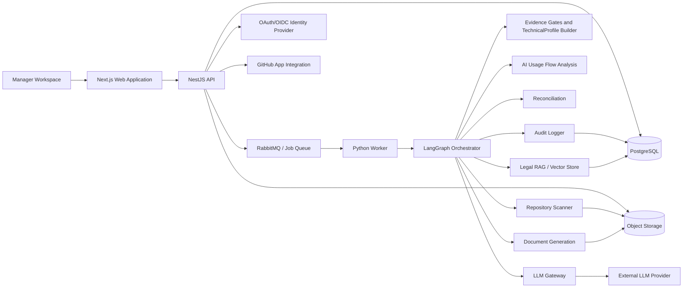
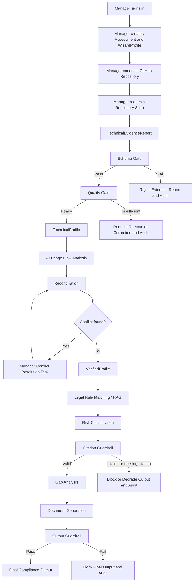

# LCSP System Runtime and Component Contracts

## Purpose

Tài liệu này mô tả runtime architecture và component contracts cho Phase 1 của nhánh Conditional Implementation Documentation. Đây là implementation design, không phải code hoặc deployment blueprint cuối cùng.

## Runtime Architecture Diagram



## Scanner Subsystem Runtime

```mermaid
flowchart LR
    Queue[Queue / RepositoryScanJob] --> Worker[Python Worker]
    Worker --> WS[Temporary Isolated Workspace\nraw source only here]
    WS --> Inv[Repository Inventory]
    Inv --> Man[Manifest and Config Analyzer]
    Man --> Tree[Tree-sitter Generic Parser]
    Tree --> TS[TypeScript Semantic Analyzer Sidecar]
    Tree --> Py[Python Semantic Analyzer]
    TS --> Detect[AI Invocation Detector]
    Py --> Detect
    Tree --> Detect
    Detect --> Input[Input Flow Analyzer]
    Input --> Output[Output and Decision Flow Analyzer]
    Output --> Review[Human Review Detector]
    Review --> Domain[Domain Context Fusion Engine]
    Domain --> Graph[NetworkX Evidence Graph\nscan-local]
    Graph --> Findings[TechnicalFinding Generator]
    Findings --> Report[TechnicalEvidenceReport]
    Report --> Redact[Redaction Controller]
    Redact --> Persist[(PostgreSQL metadata / refs / hashes / paths)]
    Redact --> Cleanup[Workspace Cleanup Controller]
    Cleanup --> Deleted[Raw source deleted]
```



Scanner subsystem runtime contracts:

| Component | Responsibility | Inputs | Outputs | Sync/Async | Owns Data? | Failure Boundary | Audit Requirement |
| --- | --- | --- | --- | --- | --- | --- | --- |
| Repository Fetcher and Workspace Manager | Obtain selected repository snapshot and prepare isolated workspace | Repository connection ref, branch/commit, scan job | Temporary workspace with pinned commit checkout | Async worker step | Temporary raw source only | Failure marks scan failed and keeps classification locked | Workspace created/failed, commit SHA, cleanup result |
| Repository Inventory Analyzer | Identify languages, manifests, configs, routes, schemas and skipped files | Temporary workspace | Inventory metadata and coverage limits | Async worker step | Inventory metadata | Missing/unsupported files produce coverage limitation | Inventory counts, skipped/unsupported reason |
| Manifest and Config Analyzer | Parse dependencies, config templates and database schema/migration signals | Manifest/config/schema files | Dependency/config/domain/data signals | Async worker step | Structured findings | Parse failures become finding/coverage limitations | Analyzer success/failure and finding counts |
| Tree-sitter Generic Parser | Provide generic syntax parse and fallback structure | Source files | AST-derived structural metadata | Async worker step | Temporary parse output only | Parse failure limits language/file coverage | Parser version, file coverage |
| TypeScript Semantic Analyzer Sidecar | Resolve TS/JS imports, symbols, controllers/services and calls using TypeScript Compiler API | TS/JS file refs and project metadata | TS/JS semantic graph fragments | Async isolated process/sidecar | Temporary analyzer output only | Sidecar failure limits TS/JS semantic coverage | Sidecar version, status, coverage |
| Python Semantic Analyzer | Resolve Python imports, calls, variable flow and model invocation candidates | Python file refs and module metadata | Python semantic graph fragments | Async worker step | Temporary analyzer output only | Analyzer failure limits Python semantic coverage | Analyzer status, coverage |
| AI Invocation Detector | Detect provider/framework/model invocation candidates | Parse/semantic graph fragments, scanner rulesets | AI invocation findings | Async worker step | Structured findings | Unmatched/dynamic invocation produces uncertainty | Rule ids, finding counts, confidence |
| Input Flow Analyzer | Trace input-to-AI categories with evidence fusion | Invocation findings, graph fragments, DTO/schema/entity signals | AI input findings and paths | Async worker step | Structured findings/paths | Unsupported flow emits `UNSUPPORTED_DYNAMIC_FLOW` | Paths analyzed, limitation reason |
| Output and Decision Flow Analyzer | Trace AI output type and downstream action | Invocation/output variables, graph paths, rulesets | Output/action/automation findings | Async worker step | Structured findings/paths | Unresolved output path emits uncertainty | Paths analyzed, decision/action signal |
| Human Review Detector | Detect review step evidence or bounded absent-review path | Decision/action paths, workflow/status signals | Human review finding: present/absent/unclear | Async worker step | Structured finding | Generic review naming alone cannot mark present | Review evidence refs and confidence |
| Domain Context Fusion Engine | Combine route/service/entity/prompt/input/output/action signals into usage context | Analyzer findings and graph metadata | Domain/business context signals | Async worker step | Structured findings | Weak signals produce low confidence/unknown | Signal sources and confidence |
| In-memory Evidence Graph Builder | Build scan-local NetworkX call/data/control/evidence graph | Analyzer fragments and findings | Graph paths and refs | Async worker step | Temporary graph only | Graph build failure blocks report or emits limitation by scope | Graph node/edge counts, graph hash/ref |
| TechnicalFinding Generator | Emit normalized findings for TechnicalEvidenceReport | Graph paths, ruleset matches, confidence | TechnicalFinding records | Async worker step | Finding metadata only | Invalid finding schema blocks report | Finding ids, output hash |
| Redaction Controller | Remove secrets/raw confidential values before persistence | Findings, metadata, prompt/config refs | Redacted findings and privacy flags | Async worker step | Redaction metadata | Redaction failure fails closed | Redaction result and flags |
| Workspace Cleanup Controller | Delete temporary raw source workspace | Workspace ref, scan result | Cleanup status | Async worker step | No persistent data | Cleanup failure is critical security event | Cleanup success/failure |

## Phase 1 Runtime Workflow Architecture



This route is Manager-owned for MVP. Developer is optional and never required to connect the repository, run scan, resolve conflict, unlock classification or generate final output.

## Phase 1 Component Contracts

| Component | Responsibility | Inputs | Outputs | Sync/Async | Owns Data? | Failure Boundary | Audit Requirement |
| --- | --- | --- | --- | --- | --- | --- | --- |
| Web Application | Render Manager Workspace and optional Developer collaborator UX; call API only | Browser session, API payloads, OAuth callback route state | User commands, rendered views, local UI status | Sync HTTP via API | No authoritative domain data | Displays API blocking reason; cannot retry worker directly | User action and UI-triggered command events are audited by API |
| NestJS API | Auth/session/RBAC, assessment state, repository connection, job creation, task/result APIs | Web requests, OAuth callbacks, GitHub App callbacks, worker result refs | API responses, persisted state, queue jobs | Sync request handling; async job enqueue | Users, sessions, assessments, task/state refs | Fails closed on auth, RBAC, state or invariant violation | Auth, repository connection, job creation, task creation and state changes |
| OAuth/OIDC Provider Boundary | Authenticate LCSP user identity | Authorization request, callback, provider claims | Validated identity claims to API | Sync external auth flow | Provider owns external identity; LCSP stores linked identity metadata | Invalid state/nonce/issuer/audience/expiry rejects login | Login success/failure, account link, callback validation failure |
| TOTP MFA Service Boundary | Enforce LCSP MFA policy after password/OAuth identity | User session challenge, TOTP code, MFA policy | MFA pass/fail, session continuation | Sync API flow | MFA secret metadata and recovery/reset state | Failed challenge blocks session continuation | MFA challenge, success, failure, setup, reset and disable |
| GitHub App Integration | Connect selected repository and provide read-only scan access | Manager repository selection, GitHub installation/callback metadata | RepositoryConnection, repo/branch/commit access context | Sync setup; async scan usage | Repository connection metadata and installation refs | Missing/invalid installation blocks scan | Repository connected/disconnected, access denied, scan authorization failure |
| PostgreSQL | Persist authoritative LCSP domain state and audit metadata | API/worker writes | Users, sessions, assessment state, profiles, conflicts, results, audit rows | Sync DB operations | Yes, except object binaries and raw source | Transaction failure rolls back state; critical audit failure fails closed | Stores audit events and state transition metadata |
| Queue | Decouple long-running jobs from API requests | Scan/classification/document job envelopes with refs | Delivered job, retry/dead-letter status | Async | Job envelope/status only | Timeout/retry/dead-letter according to policy | Job created, started, retried, failed, completed |
| Python Worker | Execute scanner and compliance workflow jobs | Queue jobs, DB refs, object refs, GitHub scan context | Node outputs, persisted results, audit events | Async | Temporary job state only | Job failure records blocking reason and audit | Worker job lifecycle and node-level events |
| LangGraph Orchestrator | Own workflow state transitions and deterministic node routing | Assessment state, job type, node outputs | Next node decision, pause/resume, blocking reason | Async inside worker | Workflow state refs/checkpoints | Invalid state/output fails closed | Node start/success/failure, state transition, pause/resume |
| Repository Scanner | Scan selected repo/branch/commit in isolated workspace | GitHub read-only access, scanner rulesets, scan job | TechnicalEvidenceReport, findings, report hash | Async | Temporary raw workspace only; output report refs | Scan failure keeps classification locked | Scan started/completed/failed, scanner version, report hash |
| Evidence Normalizer | Normalize scanner report into internal evidence structures | TechnicalEvidenceReport, findings, source metadata | Normalized evidence refs | Async | Normalized evidence metadata | Invalid/missing refs stop gates | Normalization success/failure |
| Schema Gate | Validate TechnicalEvidenceReport contract | Normalized evidence, evidence-report schema | Pass/fail with reasons | Async deterministic | Gate result | Fail rejects report and blocks downstream | Schema gate result and reason |
| Quality Gate | Validate sufficiency, freshness, relevance and privacy flags | Schema-passed evidence, quality rules | Ready/insufficient/rejected | Async deterministic | Gate result | Insufficient/rejected blocks TechnicalProfile and classification | Quality gate result and reason |
| TechnicalProfile Builder | Build technical facts from accepted evidence | Gate-passed findings and evidence refs | TechnicalProfile | Async deterministic | TechnicalProfile version/ref | Missing accepted evidence blocks build | TechnicalProfile created/failed |
| AI Usage Flow Analysis Node | Determine business purpose, input/output, downstream action, affected subjects and uncertainty | TechnicalProfile, TechnicalFindings, WizardProfile context, evidence refs | AIUsageFlow, uncertainty reasons, possible conflict signals | Async rule-first; optional LLM via gateway | AIUsageFlow object and evidence refs | Unclear critical fields block final classification or route conflict | AIUsageFlow generated/unclear/conflict-created |
| Reconciliation Node | Compare WizardProfile with TechnicalProfile and AIUsageFlow | WizardProfile, TechnicalProfile, AIUsageFlow, evidence refs | Conflict found/no conflict, conflict records | Async deterministic/rule-first | Conflict records and reconciliation state | Any unresolved conflict blocks classification/final output | Reconciliation started, conflict/no-conflict |
| Manager Conflict Resolution Task Router | Create and track Manager human-in-the-loop tasks | Conflict records, assessment state | Manager conflict-resolution task, resume signal | Async task creation; sync human update via API | Task/resolution metadata | No Manager resolution keeps workflow paused | Task created, resolved, updated, expired |
| VerifiedProfile Builder | Build canonical profile only after gates and conflict resolution pass | WizardProfile, TechnicalProfile, AIUsageFlow, Manager resolutions | VerifiedProfile | Async deterministic | VerifiedProfile version/ref | Missing prerequisite blocks classification | VerifiedProfile created/approved/blocked |
| Legal Retrieval / RAG Node | Retrieve legal rules/citations using VerifiedProfile and AIUsageFlow | VerifiedProfile, AIUsageFlow fields, corpus version | Rule chunks, rule_id, citation, corpus version | Async | Retrieval refs and corpus metadata | Missing relevant citation blocks/degrades output | Retrieval query, corpus version, citations returned/missing |
| Risk Classification Agent | Classify only from VerifiedProfile + AIUsageFlow + retrieved rules | VerifiedProfile, AIUsageFlow, legal rules/citations | RiskClassificationResult with trace | Async; LLM allowed only through gateway | Classification result/ref | Provider-only signal, missing VerifiedProfile or missing citation blocks/degrades | Classification started/completed/blocked/degraded |
| Citation Guardrail | Validate legal claims and citation trace | Classification/gap/doc legal claims, retrieved citation refs | Valid/invalid guardrail result | Async deterministic | Guardrail result | Invalid/missing citation blocks or degrades output | Citation validation result |
| Gap Analysis Agent | Identify compliance gaps from classification and obligations | Risk result, VerifiedProfile, AIUsageFlow, legal obligations | GapAnalysisResult | Async; LLM allowed only through gateway | Gap result/ref | Invalid classification basis blocks gap/final report | Gap analysis started/completed/blocked |
| Document Generation Agent | Draft allowed compliance report/readiness export | VerifiedProfile, classification, gaps, citations, audit refs | Generated document artifact metadata | Async; LLM allowed only through gateway | Document metadata/ref | Final report gate fail produces blocking reason or readiness-only output | Document generation started/completed/blocked |
| Output Guardrail | Validate generated report scope, citations, evidence disclosure and unsupported claims | Generated document draft, evidence/citation refs | Pass/fail/degraded output decision | Async deterministic plus validators | Output guardrail result | Fail blocks final output | Output validation result |
| Object Storage | Store generated documents and allowed artifacts | Document artifacts, allowed report objects | Storage refs, hashes, retention metadata | Sync from API/worker | Artifact binaries; no raw source long-term | Storage write/read failure blocks artifact availability | Artifact stored/read/deleted events |
| Audit Logger | Append audit metadata for critical transitions | API and worker events, node metadata, output hashes | AuditEvent records | Sync/async depending caller; critical events fail closed | Audit metadata | Critical audit write failure pauses/fails closed | Every critical transition listed in scope invariants |
| LLM Gateway | Sole boundary for external model calls | Sanitized structured input, prompt version, schema, model config | Schema-validated model output and metadata | Async external call | Model run metadata only | Timeout/schema invalid causes controlled retry/fail closed | Model/provider/version, prompt version, input ref, output hash |

## Runtime Boundary Requirements

- Web does not call Worker directly.
- API does not execute long-running scans, classifications, gap analysis or document generation synchronously.
- Worker receives jobs through Queue.
- Orchestrator owns workflow transitions, pause/resume and deterministic next-node decisions.
- LLM calls go only through LLM Gateway.
- Scanner raw source workspace is isolated and temporary.
- Repository Scanner is static-analysis only and must not run project code, installs, builds, tests, Docker, shell scripts, CI workflows or API probes.
- NetworkX graph is scan-local and temporary; PostgreSQL stores graph metadata, refs, hashes and paths only.
- OAuth/OIDC authenticates LCSP user identity only.
- GitHub App integration authorizes repository scan access only.
- Manager can complete the full MVP path without Developer assignment.
- Developer delegation is Post-MVP and cannot reduce Manager authority.

## Component Contracts

| Component | Responsibility | Inputs | Outputs | Sync / Async | Data Ownership | Failure Boundary | Security Boundary |
| --- | --- | --- | --- | --- | --- | --- | --- |
| Manager Workspace | Primary MVP UI for assessment completion | Manager actions, session state, assessment views | Wizard answers, repo connection actions, scan requests, conflict resolutions, report requests | Sync via Web/API | UI state only | Shows blocked reason; no direct worker recovery | Must enforce server-side authorization via API; no raw source/token storage |
| Optional Developer Workspace | Limited collaborator UI if delegation exists | Assigned task scope, delegated permissions | Clarification, attestation or delegated technical action | Sync via Web/API | UI state only | Cannot unlock classification by itself | Scoped RBAC; no Manager-only action |
| Next.js Web Application | Render UX and call API | Browser session, API responses | UI pages and user commands | Sync | No authoritative domain state | Displays API errors/status | Does not call Worker/LLM/GitHub directly |
| NestJS API | Auth, RBAC, assessment state, job creation, result retrieval | Web requests, OAuth callbacks, GitHub callbacks, worker result refs | State changes, job messages, API responses | Sync for requests; async job creation | Users, sessions, assessments, permissions, state refs | Fails closed on auth/RBAC/state gate failure | OAuth/OIDC is identity only; GitHub App is repository access only |
| OAuth/OIDC Identity Provider | External identity authentication | Auth request, callback | Identity claims/token response | Sync external flow | Provider-owned identity data | Callback validation failure prevents session | Validate redirect URI, state, nonce, issuer, audience, expiry, PKCE |
| GitHub App Integration | Repository read-only access for scan | Manager repository selection, GitHub App installation | Repository connection metadata, scan access context | Sync setup; async scan later | Repository connection metadata | Missing/invalid installation blocks scan | Least privilege selected repo; separate from OAuth/OIDC login |
| PostgreSQL | Persistent LCSP state | API/worker writes | Assessment, profile, evidence metadata, conflict, result, audit records | Sync DB operations | Authoritative business state | Transaction rollback on failure | No raw source, full prompt or secrets |
| Queue | Async job boundary | Scan/classification/document job messages | Job delivery/status | Async | Job envelope/status | Retry/dead-letter based on policy | No raw source payloads; use refs/hashes |
| Python Worker | Runtime for scanner and agent jobs | Queue jobs, DB refs, object refs | TechnicalEvidenceReport, profiles, results, documents, audit events | Async | Temporary job state | Job failure updates state/blocking reason | Temporary workspace cleanup; no raw source to LLM |
| LangGraph Orchestrator | Controlled state graph/DAG execution | Assessment state, job type, evidence refs | Node outputs and next-state decisions | Async within Worker | Workflow state refs | Fail closed on invalid state/output | LLM cannot choose arbitrary next node |
| Repository Scanner | Scan selected repo/branch/commit | GitHub read-only repo access, scanner ruleset | TechnicalEvidenceReport, findings, report hash | Async | Temporary source workspace; evidence output refs | Scan failure keeps classification locked | No legal conclusion; cleanup raw workspace |
| Evidence Normalization / Gates | Validate evidence contract and build TechnicalProfile | TechnicalEvidenceReport, findings, privacy flags | Gate result, TechnicalProfile | Async | Evidence metadata and gate status | Reject/insufficient blocks downstream | Schema/privacy/provenance/integrity checks |
| AI Usage Flow Analysis | Interpret AI usage purpose and impact | TechnicalProfile, findings, WizardProfile context, evidence refs | AIUsageFlow, uncertainty/conflict signals | Async | AIUsageFlow object and refs | Unclear critical fields route conflict/block final classification | Rule-first; no raw source/full prompt/secrets to LLM |
| Reconciliation | Compare WizardProfile, TechnicalProfile and AIUsageFlow | Profiles, AIUsageFlow, gate results | Conflict decision, Manager task, VerifiedProfile candidate | Async + Manager human step | Conflicts, conflict resolutions | Any unresolved conflict blocks classification/report | Manager final resolver in MVP |
| Legal RAG / Vector Store | Retrieve legal rules/citations | VerifiedProfile, AIUsageFlow fields, corpus version | Retrieved rules, citations, corpus refs | Async | Legal retrieval refs/corpus metadata | Missing citation blocks/degrades output | RAG retrieves; does not conclude risk alone |
| LLM Gateway | Controlled LLM provider access | Sanitized prompts, structured refs, prompt version | LLM inference output | Async call | Model run metadata | Timeout/schema invalid -> retry/fail closed | No raw source/full prompt/secrets; schema validation |
| Document Generation | Draft report/readiness export | VerifiedProfile, classification, gap, citations, audit refs | Document metadata, storage ref | Async | Generated document artifact metadata | Blocked if final report gate fails | Must show evidence/citation basis and no overclaim |
| Object Storage | Store generated docs and allowed artifacts | Generated documents, scanner report refs where allowed | Storage refs/hashes | Sync from API/Worker | Non-source artifacts | Storage failure blocks artifact availability | No long-term raw source storage |
| Audit Logger | Append-oriented audit metadata | Node/API/security events | AuditEvent records | Sync/async depending caller | Audit metadata | Audit write failure fails closed for critical events | No raw source, secrets, raw provider token |

## End-to-End Workflow Contract

| Step | Runtime Path | Gate / Guardrail | Audit |
| --- | --- | --- | --- |
| Manager login | Web -> API -> Password/OAuth/OIDC -> MFA if enabled | OAuth/OIDC does not grant GitHub access | Login/MFA/OAuth events |
| Assessment creation | Web -> API -> PostgreSQL | Manager owns assessment | `ASSESSMENT_CREATED` |
| Wizard submission | Web -> API -> PostgreSQL | Wizard-only cannot show risk level | `WIZARD_PROFILE_SUBMITTED` |
| GitHub App repository connection | Web -> API -> GitHub App -> PostgreSQL | GitHub App read-only selected repo; OAuth boundary separate | `GITHUB_REPOSITORY_CONNECTED` |
| Scan job | Web -> API -> Queue | Manager can run without Developer | `REPOSITORY_SCAN_STARTED` |
| Worker orchestration | Queue -> Worker -> Orchestrator | State graph controls order | Node start/success/failure |
| Repository scan | Orchestrator -> Scanner | Temporary workspace, no raw source persistence | scan completed/failed |
| Evidence gates | Orchestrator -> Evidence Node | Schema and quality gates pass before TechnicalProfile downstream | gate result |
| AIUsageFlow | Orchestrator -> AI Usage Flow Node | Purpose unclear blocks final classification or creates conflict | AIUsageFlow generated/unclear |
| Reconciliation | Orchestrator -> Reconciliation | Any conflict creates Manager task | conflict/no-conflict |
| Manager conflict resolution | API/Web human step | Manager final resolver; Developer optional only | conflict resolved |
| VerifiedProfile | Orchestrator/API | Requires no unresolved conflict | VerifiedProfile created/approved |
| Legal RAG/classification | Orchestrator -> RAG -> Risk Agent -> Guardrail | Requires rule/citation trace; no provider-only risk | classification completed/blocked/degraded |
| Gap analysis | Orchestrator -> Gap Node | Requires valid/degraded classification basis | gap generated |
| Document generation | Orchestrator -> Document Node -> Object Storage | No final report if conflict/citation/gate missing | document generated/blocked |

## Manager-only MVP Success Path

```text
Manager login
-> Assessment created
-> WizardProfile submitted
-> GitHub App repository connected
-> Repository Scan job queued
-> Worker runs scanner and gates
-> AIUsageFlow generated
-> Reconciliation finds no conflict or Manager resolves conflict
-> VerifiedProfile approved
-> Legal RAG retrieves rule/citation
-> Risk Classification completes or degrades with clear reason
-> Gap Analysis completes
-> Document Generation produces allowed output
```

Developer assignment is not required in this path.

## Failure Boundaries

| Failure | System Response |
| --- | --- |
| OAuth/OIDC callback invalid | Reject login, audit callback failure |
| GitHub App not connected | Block Repository Scan, show repository connection required |
| Repository scan failed | Keep classification locked, allow re-run |
| TechnicalEvidenceReport schema invalid | Reject report, keep classification locked |
| Evidence quality insufficient | Request re-scan/correction, keep classification locked |
| AIUsageFlow unclear | Record uncertainty, create Manager conflict/clarification path or block final classification |
| Conflict unresolved | Block classification and final document |
| Legal citation missing | Block/degrade classification/output |
| LLM timeout/invalid schema | Retry controlled or fail closed with audit |
| Audit write failure for critical transition | Fail closed until audit can be recorded or recovery policy is applied |

## Security Boundaries

- OAuth/OIDC Login authenticates LCSP identity only.
- GitHub App Connection grants repository read-only scan access only.
- Manager super-role is enforced server-side.
- Developer delegated permissions are post-MVP, scoped and revocable.
- Raw source code is temporary and must not enter LLM, DB, object storage long-term or audit logs.
- Full system prompts and secrets must not be stored by default.
- Legal conclusions require rule/citation trace.

## Open Runtime Decisions

| Decision | Current Constraint |
| --- | --- |
| Queue technology | Use RabbitMQ / Job Queue abstraction until final decision |
| Object storage provider | Use provider-neutral object storage contract |
| Vector store implementation | Use Legal RAG / Vector Store abstraction |
| OAuth/OIDC provider | Capability is MVP; provider selection remains config decision |
| AIUsageFlow confidence threshold | Requires A2-b validation |
| Legal rule coverage | Requires A2 validation |

## Traceability

| Concern | Reference |
| --- | --- |
| Scope/invariants | `docs/implementation/implementation-scope-and-invariants.md` |
| Module layout | `docs/implementation/repository-and-module-layout.md` |
| Canonical contract | `docs/specs/implementation-contract.md` |
| Multi-agent architecture | `docs/architecture/multi-agent-system-architecture.md` |
| Evidence contract | `docs/specs/evidence-report-contract.md` |
| AIUsageFlow spec | `docs/specs/ai-usage-flow-analysis-spec.md` |
| Reconciliation policy | `docs/specs/reconciliation-policy.md` |
| Legal citation contract | `docs/specs/legal-rule-citation-contract.md` |
