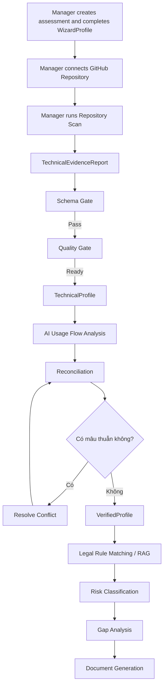
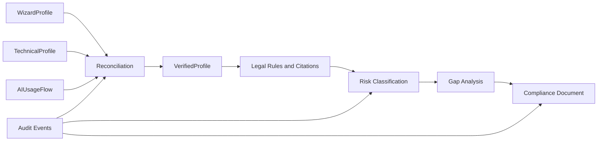

# LCSP Project Overview

## 1. Project Summary

LCSP (Legal Compliance Support Platform) is an evidence-based AI compliance support platform that helps organizations assess the legal and compliance risk of their AI systems by combining business declarations, repository-based technical evidence, AI usage flow analysis, legal rule retrieval, risk classification, gap analysis, and compliance document generation.

LCSP là nền tảng hỗ trợ doanh nghiệp đánh giá rủi ro pháp lý và mức độ tuân thủ khi sử dụng hệ thống trí tuệ nhân tạo, dựa trên khai báo nghiệp vụ, bằng chứng kỹ thuật từ repository scan, phân tích mục đích sử dụng AI trong luồng nghiệp vụ, truy xuất căn cứ pháp lý, phân loại rủi ro, phân tích khoảng trống và sinh tài liệu tuân thủ.

LCSP không phải là chatbot pháp lý thông thường, không phải checklist tự khai đơn giản, và cũng không phải hệ thống chỉ phát hiện AI framework/model/provider trong source code. Định vị cốt lõi của LCSP là: mọi kết luận rủi ro phải có bằng chứng, rule/citation trace và audit trail.

## 2. Problem Statement

Doanh nghiệp có thể đang dùng AI, LLM, ML framework, prompt, vector database hoặc AI workflow nhưng không nắm rõ nghĩa vụ compliance đi kèm. Một questionnaire hoặc self-declaration đơn thuần thường không đủ tin cậy, vì người trả lời có thể không biết hệ thống thật sự xử lý dữ liệu, gọi model, review output hoặc tự động hóa quyết định như thế nào.

Ngược lại, chỉ phát hiện repo có OpenAI, Gemini, LangChain, TensorFlow hoặc PyTorch cũng không đủ để xác định legal risk. Không thể đánh giá rủi ro chỉ vì "có AI", giống như không thể đánh giá rủi ro chỉ vì "có dao". Cần biết AI/dao được dùng để làm gì trong một luồng cụ thể.

Vì vậy LCSP cần phân tích:

- AI nhận input gì.
- AI tạo output gì.
- Output được dùng ở bước nào.
- Output có ảnh hưởng tới approve/reject/rank/recommend hay không.
- Ai bị ảnh hưởng.
- Có human review hay không.
- Có dữ liệu nhạy cảm hay không.
- Có harm potential nào.
- Rule/citation nào áp dụng.

## 3. Proposed Solution

LCSP kết hợp ba lớp thông tin chính:

1. Manager khai báo business/legal context qua WizardProfile.
2. Developer kết nối GitHub repository và chạy Repository Scan để tạo TechnicalEvidenceReport.
3. LCSP phân tích technical facts, AI usage flow, conflict, legal rules/citations và audit trail trước khi cho phép risk classification hoặc final report.

MVP được thiết kế theo workflow có gate rõ ràng:

- Wizard-only chỉ tạo `SELF_DECLARED_READINESS`, readiness checklist và preliminary indicators.
- Wizard-only không được hiển thị HIGH/MEDIUM/LOW hoặc draft risk level.
- Không có technical evidence thì không có risk level.
- Risk Classification chỉ chạy sau VerifiedProfile.
- Final report không được sinh nếu còn conflict chưa resolve hoặc thiếu căn cứ legal citation cần thiết.

## 4. Primary Users and Responsibilities

| Role | Responsibility |
| --- | --- |
| Manager | Required and sufficient MVP role. Owns assessment, business/legal truth, repository connection, repository scan, evidence review, conflict resolution, VerifiedProfile approval, classification trigger, gap/report workflow and audit review |
| Developer | Optional technical collaborator. May receive delegated technical permissions after Manager assignment, but is not required for the MVP success path |

Manager và Developer không gọi agent trực tiếp. Họ tương tác với LCSP qua UI/API. Orchestrator điều phối workflow phía backend, kiểm soát state, gates, agent routing, human-in-the-loop pauses và audit logging.

Trong MVP, Manager là superset role: Manager có thể thực hiện mọi active MVP action mà Developer có thể được giao. Không workflow nào được block chỉ vì chưa có Developer account hoặc Developer assignment.

## 5. MVP Scope

MVP technical evidence path chỉ giữ một luồng chính:

```text
Manager connects GitHub Repository
-> Manager runs Repository Scan
-> Scanner creates TechnicalEvidenceReport
-> Schema Gate
-> Quality Gate
-> TechnicalProfile
-> AI Usage Flow Analysis
-> Reconciliation
-> VerifiedProfile
-> Legal Rule Matching / RAG
-> Risk Classification
-> Gap Analysis
-> Document Generation
```

MVP không có generic "Submit Evidence". MVP chỉ có technical evidence path chính là `Run Repository Scan`, và Manager có thể tự chạy path này end-to-end. Developer có thể là optional collaborator nếu Manager delegation được bật, nhưng không là dependency bắt buộc. Local/CI upload, manual technical evidence JSON và CLI/CI evidence submission được giữ ngoài MVP main flow.

Authentication MVP gồm password/email login hiện có, Authenticator App/TOTP MFA khi enabled, và OAuth/OIDC user login. OAuth/OIDC login dùng để xác thực danh tính người dùng vào LCSP; GitHub App connection là boundary riêng để cấp quyền read-only scan repository. OAuth/OIDC login không tự kết nối repository và không cấp repository scan permission.

MVP scope gồm:

- Manager-led assessment workflow.
- Web Wizard cho business/legal declaration.
- Manager-owned GitHub repository connection và repository scan; Developer task/policy chỉ là optional collaboration path.
- Scanner-generated TechnicalEvidenceReport.
- Schema Gate và Quality Gate.
- TechnicalProfile và AIUsageFlow.
- Reconciliation và conflict resolution nhị phân.
- VerifiedProfile làm input bắt buộc cho classification.
- Legal Rule Matching/RAG có rule_id, citation, version.
- Risk Classification, Gap Analysis, Document Generation có guardrails.
- Audit trail cho lifecycle, evidence, conflict, classification và generated documents.

## 6. Why AI Usage Flow Analysis Matters

`TechnicalProfile` trả lời AI có mặt và vận hành như thế nào về mặt kỹ thuật. Ví dụ: có model API call, AI dependency, prompt template, vector database, parser hoặc decision-flow signal.

`AIUsageFlow` trả lời AI đang được sử dụng như thế nào trong business flow. Đây là cầu nối giữa technical evidence và legal rule matching. Legal Rule Matching phải dùng `AIUsageFlow`, không chỉ dùng provider/model presence.

| Field Group | Câu hỏi |
| --- | --- |
| Business Process | AI đang được dùng trong quy trình nào? |
| AI Purpose | AI dùng để summarize, chatbot, score, rank, recommend, approve/reject hay gì khác? |
| Inputs | AI nhận loại dữ liệu nào? |
| Outputs | AI tạo summary, score, recommendation, rank hay decision label? |
| Downstream Action | Output được display, recommend, rank, approve/reject hay escalate? |
| Affected Subjects | Customer, employee, student, patient, citizen hay internal staff? |
| Human Review | Có, không, hay chưa rõ? |
| Automation Level | Assistive, decision support, semi-automated, fully automated, unclear |
| Potential Harm | Privacy, financial loss, discrimination, denial of service, misinformation, health/safety risk |
| Evidence References | Claim này dựa vào scanner finding nào? |

Nếu usage purpose không rõ, LCSP không được overclaim risk. Hệ thống phải ghi uncertainty hoặc yêu cầu clarification/conflict resolution trước final classification.

## 7. Evidence-Based Decision Model

| Evidence Layer | Ví dụ | Vai trò |
| --- | --- | --- |
| Business Evidence | WizardProfile | Manager khai báo business/legal context |
| Technical Evidence | TechnicalEvidenceReport, TechnicalFindings | Scanner phát hiện technical facts |
| Usage Flow Evidence | AIUsageFlow | Kết nối technical facts với business purpose/impact |
| Reconciliation Evidence | ConflictRecord, ConflictResolution | Xử lý lệch nhau giữa khai báo và technical evidence |
| Legal Evidence | LegalRule, LegalCitation, LegalDocumentVersion | Căn cứ pháp lý/corpus |
| Output Evidence | RiskClassificationResult, GapAnalysisResult, ComplianceDocument | Kết quả compliance |
| Audit Evidence | AuditEvent, report hash, scanner version, model metadata | Truy vết workflow |

WizardProfile một mình không được tạo risk level. TechnicalEvidenceReport một mình cũng không đủ để kết luận legal risk. Risk Classification cần VerifiedProfile, AIUsageFlow và legal rules/citations.

## 8. Workflow Gates and Conflict Handling

| Control | Câu hỏi | Nếu fail |
| --- | --- | --- |
| Schema Gate | TechnicalEvidenceReport có đúng evidence contract không? | Reject report, classification locked |
| Quality Gate | Evidence có đủ dùng, đủ mới, đủ liên quan không? | Request re-scan/correction, classification locked |
| Reconciliation | WizardProfile có mâu thuẫn với TechnicalProfile + AIUsageFlow không? | Pause workflow, create conflict resolution tasks |
| Citation Guardrail | Legal conclusion có rule/citation trace không? | Block/degrade output |
| Final Report Gate | Evidence, conflict, classification, citation đã đủ chưa? | Block final report hoặc readiness-only output |

Conflict flow MVP là nhị phân:

```text
Có mâu thuẫn
-> Pause workflow + create Manager conflict resolution task
-> Manager resolves or confirms the conflict
-> Classification locked until resolved

Không có mâu thuẫn
-> Build VerifiedProfile
-> Continue to legal rule matching and classification
```

MVP không dùng severity-based routing hoặc Developer-required confirmation trong main flow. Nếu severity tồn tại trong data detail, nó chỉ là thông tin hỗ trợ review/audit, không tạo nhánh workflow riêng. Post-MVP có thể cho Manager delegate technical clarification cho Developer, nhưng Manager vẫn là final conflict resolver.

## 9. End-to-End MVP Flow





## 10. Legal Rule Matching and Risk Classification

Legal Rule Matching không được chỉ dựa vào model/provider. Ví dụ, repo có OpenAI API không đồng nghĩa high risk. LCSP phải xét business process, AI purpose, automation level, affected subjects, data types, downstream action, human review, harm potential và evidence refs.

Đúng:

```text
Repo có OpenAI API
+ AI dùng trong loan approval
+ AI output tạo risk score
+ score dùng để approve/reject customer
+ xử lý financial/personal data
-> retrieve legal rules liên quan automated decision / high-impact / financial service / affected person
```

Risk Classification Agent chỉ được chạy khi:

- WizardProfile đã submitted.
- Repository scan đã tạo TechnicalEvidenceReport hợp lệ.
- Schema Gate và Quality Gate đã pass.
- TechnicalProfile và AIUsageFlow đã sẵn sàng.
- Reconciliation không còn conflict unresolved.
- VerifiedProfile đã được tạo/approved.
- Legal rules/citations đã được retrieve.

Classification output phải trace được về `rule_id`, legal source, citation, version và assessment audit.

## 11. Multi-Agent and Orchestrator Model

LCSP uses an orchestrator-controlled, state-machine-driven multi-agent workflow. It does not use free-form autonomous agents or unrestricted handoffs in compliance-critical paths.

| Node | Main Responsibility |
| --- | --- |
| Repository Scan / Evidence Normalization | Tạo technical evidence đã chuẩn hóa |
| Schema Gate | Validate evidence contract |
| Quality Gate | Validate evidence sufficiency |
| AI Usage Flow Analysis Node | Hiểu AI được dùng vào mục đích gì trong business flow |
| Reconciliation Agent | So sánh business declaration với technical/usage evidence |
| VerifiedProfile Builder | Tạo profile được phép dùng cho classification |
| Legal Retrieval / RAG | Retrieve legal rules/citations |
| Risk Classification Agent | Classify based on VerifiedProfile + legal evidence |
| Citation Guardrail | Chặn legal conclusion không có citation |
| Gap Analysis Agent | Xác định obligation/gap |
| Document Generation Agent | Sinh tài liệu/report khi gate cho phép |
| Audit Logger | Lưu trace cho mỗi node |

Orchestrator quyết định bước tiếp theo. Agent/node thực hiện một nhiệm vụ giới hạn. LLM provider chỉ là inference backend. LLM không tự quyết định workflow, không tự chọn agent kế tiếp và không được tạo legal conclusion nếu thiếu retrieved legal rule/citation.

## 12. Security and Privacy Principles

LCSP giữ các nguyên tắc bảo mật và privacy sau:

- Raw source code không được gửi sang LLM.
- Raw source code không được lưu dài hạn.
- Full system prompt không được lưu mặc định.
- Prompt evidence chỉ nên lưu hash/category/redacted metadata khi cần.
- Scanner findings phải dùng evidence refs/hash/metadata.
- Secrets phải được redaction.
- GitHub access phải least privilege.
- Legal conclusion phải grounded trong legal corpus/citation.
- Agent output phải schema validate.
- Audit log không chứa raw source hoặc secret.

## 13. Deferred / Future / Enterprise Scope

Các phần sau không thuộc MVP main flow:

- Upload Local/CI Scanner Report.
- Manual Technical Evidence JSON.
- Generic manual evidence submission.
- CLI evidence submission.
- CI/CD compliance gate.
- Pull request / push-time enforcement.
- Enterprise SSO / SAML / Directory Federation.
- Domain-restricted login.
- Advanced organization identity policy.
- Legal corpus admin workflow.
- Rule authoring/maintenance workflow.
- Legal update monitoring.
- Automatic reassessment after legal update.

Các luồng này có thể quay lại sau như Future/Enterprise scope, nhưng không được dùng làm basis để tạo MVP implementation backlog hiện tại.

## 14. Current Readiness and Validation Status

Trạng thái hiện tại:

```text
PRODUCT_READY_FOR_VALIDATION
READY_FOR_ARCHITECTURE_REVIEW
VALIDATION_READY
IMPLEMENTATION_BACKLOG_BLOCKED
IMPLEMENTATION_NOT_READY
```

Implementation backlog vẫn blocked cho tới khi có real validation results cho:

| Validation | Nội dung |
| --- | --- |
| A1 | Wizard simplicity versus information completeness |
| A2 | Legal corpus and rule reliability |
| A2-b | Scanner + AI Usage Flow Analysis mapping accuracy |
| A3 | Human attestation abuse and governance risk |

A2-b phải chứng minh rằng scanner và AI Usage Flow Analysis có thể map usage purpose sang legal rule/corpus một cách đủ tin cậy, không classify high-risk chỉ vì phát hiện provider/model/framework.

Backlog chỉ được unblock khi:

1. A1, A2, A2-b và A3 có validation result thực tế.
2. Không còn unresolved critical FAIL.
3. PRD đã được cập nhật nếu validation làm thay đổi requirement.
4. Architecture/ADR đã được revisit nếu validation ảnh hưởng design.
5. Final sign-off hoàn tất.

## 15. References

Project Overview này tổng hợp từ các source of truth hiện tại:

- `LCSP_Technical_Specification.html`
- `docs/product/product-brief.md`
- `docs/product/prd.md`
- `docs/product/validation-plan.md`
- `docs/product/validation-execution-plan.md`
- `docs/architecture/architecture.md`
- `docs/architecture/multi-agent-system-architecture.md`
- `docs/architecture/architecture-decision-records.md`
- `docs/specs/domain-model.md`
- `docs/specs/evidence-report-contract.md`
- `docs/specs/ai-usage-flow-analysis-spec.md`
- `docs/specs/scanner-signal-taxonomy.md`
- `docs/specs/ai-usage-rule-mapping-spec.md`
- `docs/specs/reconciliation-policy.md`
- `docs/specs/legal-rule-citation-contract.md`
- `docs/specs/state-machine.md`
- `docs/design/use-case-specification.md`
- `docs/design/functional-requirements.md`
- `docs/design/flowcharts.md`
- `docs/design/sequence-diagrams.md`
- `docs/security/source-code-privacy-policy.md`
- `docs/security/threat-model.md`
- `docs/implementation-readiness.md`

`docs/specs/evidence-catalog.md` chưa tồn tại tại thời điểm tạo overview này.
