# LCSP Flowchart Documentation

## Purpose

Tài liệu này mô tả các flow chính của LCSP ở mức analysis/design. Flowchart dùng Mermaid, không phải implementation plan.

## Overall Assessment Flow

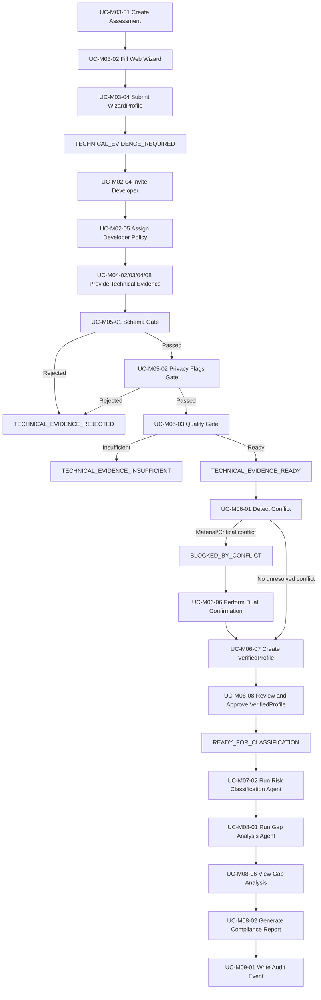

## Login With MFA Flow

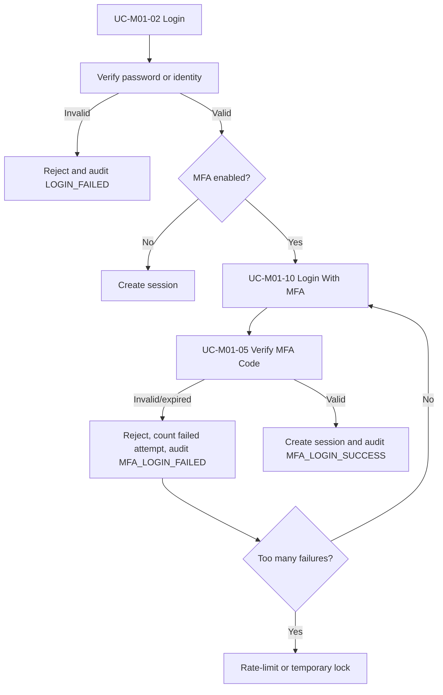

## Setup MFA Using Authenticator App Flow

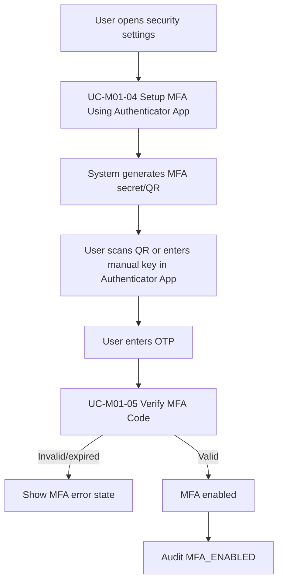

## Manager Wizard Flow

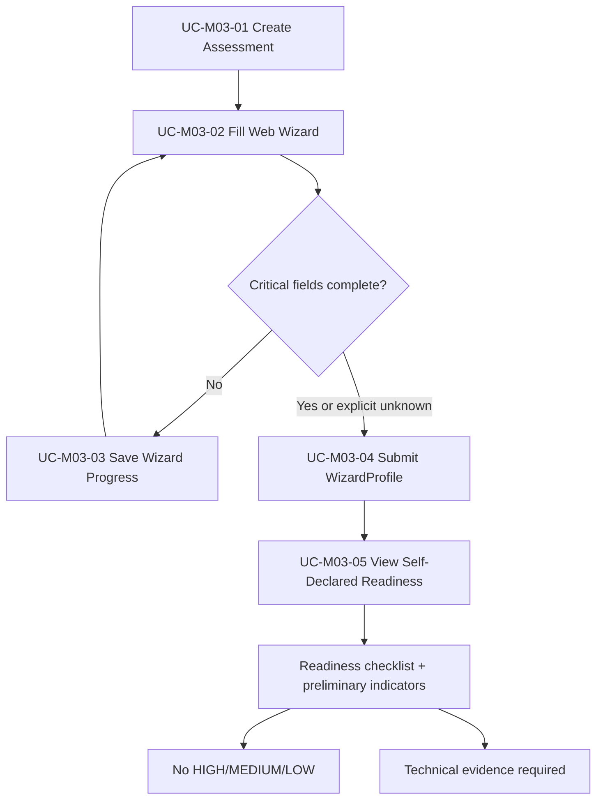

## Developer Evidence Flow

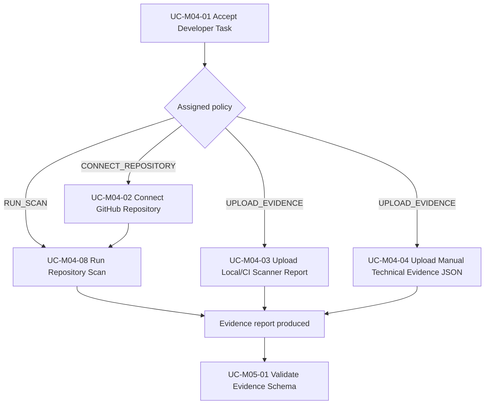

## Evidence Gate Flow

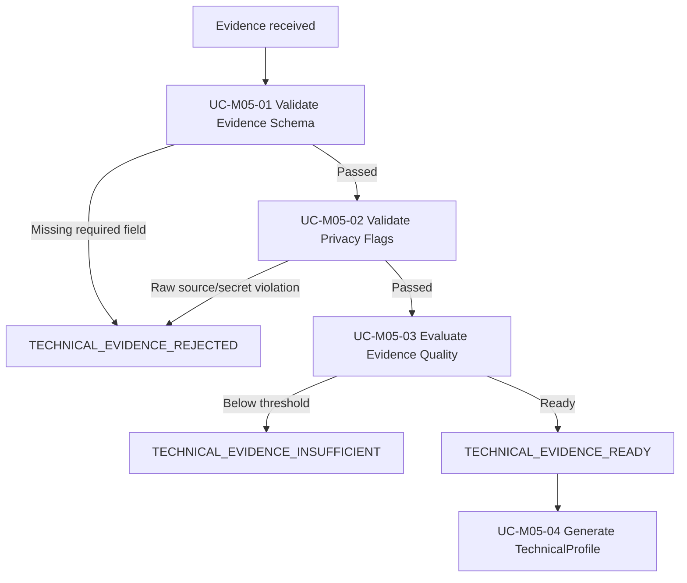

## Reconciliation Flow

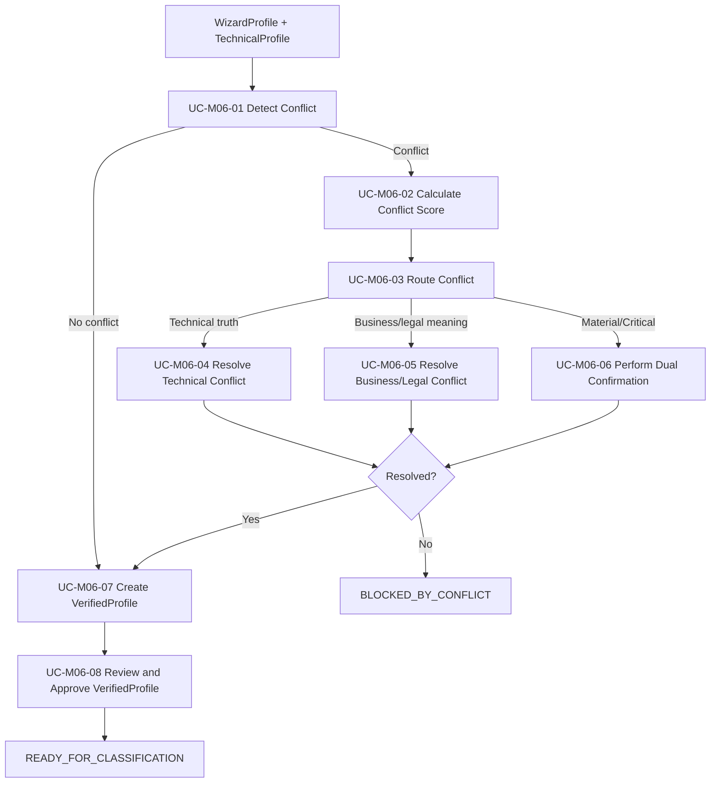

## Risk Classification Flow

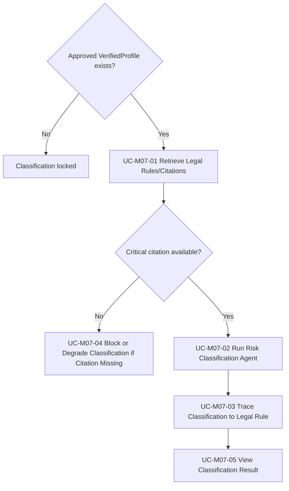

## Report Generation Flow

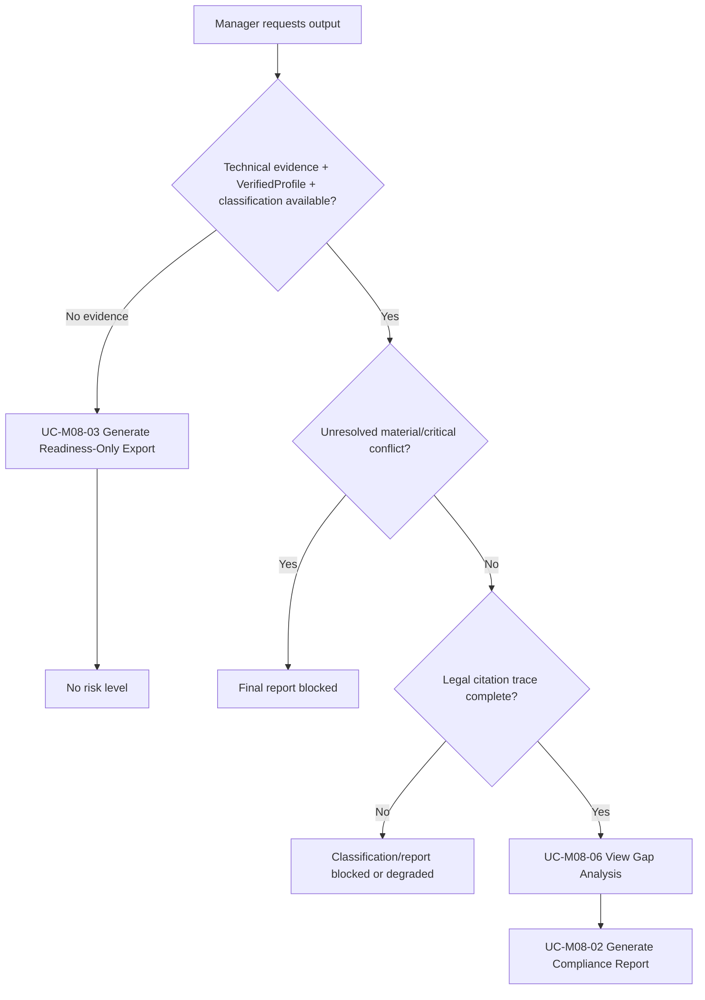

## Human Attestation Flow

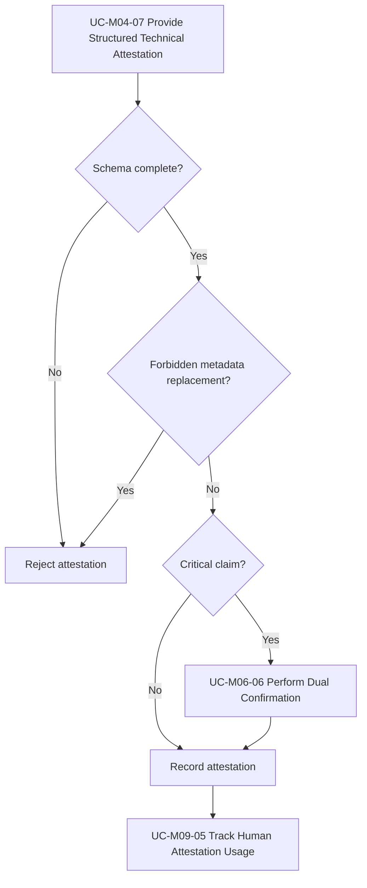

## Blocked State Flow

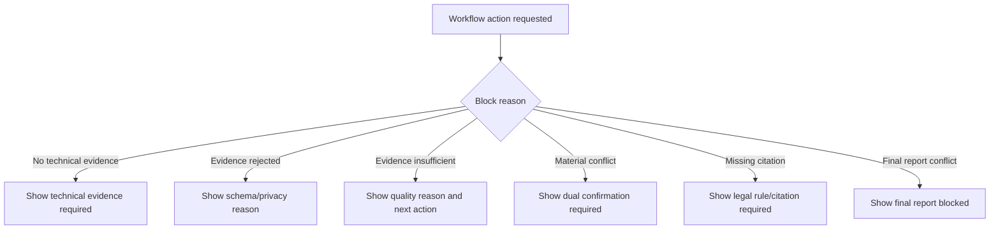

## Validation Dependencies

| Assumption | Affected Flowcharts |
| --- | --- |
| A1 | Manager Wizard Flow, Evidence Gate Flow, Reconciliation Flow, Blocked State Flow |
| A2 | Risk Classification Flow, Report Generation Flow |
| A3 | Reconciliation Flow, Human Attestation Flow, Report Generation Flow |
