# LCSP Sequence Diagrams

## Purpose

Tài liệu này mô tả sequence diagram cho các flow chính của LCSP. Tên use case và ID khớp với `docs/design/use-case-specification.md`.

Detailed multi-agent sequences for Evidence to VerifiedProfile, Human-in-the-loop Conflict Resolution, Risk Classification with Legal RAG and Document Generation are maintained in `docs/architecture/multi-agent-system-architecture.md`.

## Sequence Diagram List

| Sequence | Related Use Cases | Related Business Rules |
| --- | --- | --- |
| Register and Login | UC-M01-01, UC-M01-02 | BR-001, BR-003 |
| Setup MFA Using Authenticator App | UC-M01-04, UC-M01-05 | BR-006, BR-007, BR-011 |
| Login With MFA | UC-M01-02, UC-M01-10, UC-M01-05 | BR-008, BR-009 |
| Disable / Reset MFA | UC-M01-06, UC-M01-07 | BR-010, BR-012, BR-013 |
| Manager Creates Assessment | UC-M03-01 | BR-018, BR-023 |
| Manager Invites Developer | UC-M02-04, UC-M02-05 | BR-020, BR-021 |
| Developer Provides GitHub Evidence | UC-M04-02, UC-M04-08 | BR-032, BR-057, BR-058, BR-077 |
| Developer Uploads Local/CI Evidence | UC-M04-03 | BR-033 |
| Evidence Gate Processing | UC-M05-01, UC-M05-02, UC-M05-03, UC-M05-05 | BR-036, BR-037, BR-038, BR-040 |
| Reconciliation with Conflict | UC-M06-01..UC-M06-06 | BR-041..BR-048 |
| Human Attestation | UC-M04-07, UC-M09-05 | BR-052..BR-056, BR-070 |
| VerifiedProfile Creation and Approval | UC-M06-07, UC-M06-08 | BR-045, BR-078 |
| Risk Classification with Legal Citation | UC-M07-01..UC-M07-04 | BR-049..BR-051 |
| Document Generation | UC-M08-01..UC-M08-06 | BR-062..BR-066, BR-079 |
| Audit Event Recording | UC-M09-01 | BR-067 |

## Register and Login

Participants: User, Web Frontend, API Backend, Auth Module, Audit Module.

Preconditions: User has valid signup/invite path or existing account.

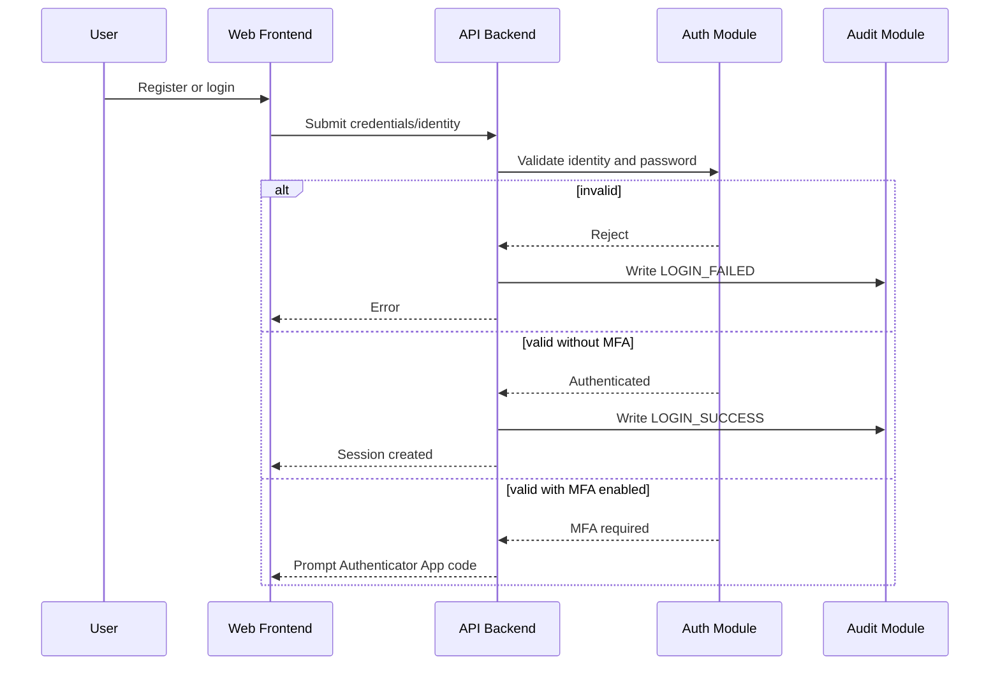

Alternative / failure path: invalid credentials are rate-limited. Audit event generated: `LOGIN_SUCCESS`, `LOGIN_FAILED`. Related use cases: UC-M01-01 Register Account, UC-M01-02 Login.

## Setup MFA Using Authenticator App

Participants: User, Web Frontend, API Backend, Auth Module, Audit Module.

Preconditions: User is authenticated.

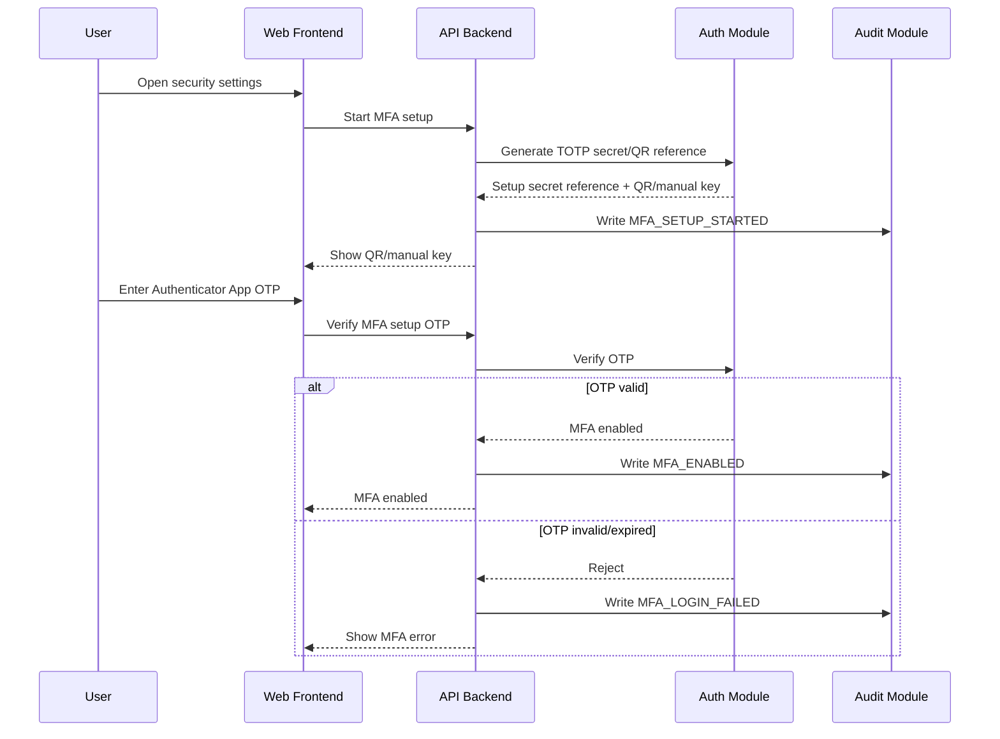

Alternative / failure path: setup remains pending if OTP fails. Audit event generated: `MFA_SETUP_STARTED`, `MFA_ENABLED`, `MFA_LOGIN_FAILED`. Related use cases: UC-M01-04 Setup MFA Using Authenticator App, UC-M01-05 Verify MFA Code.

## Login With MFA

Participants: User, Web Frontend, API Backend, Auth Module, Audit Module.

Preconditions: User account has MFA enabled.

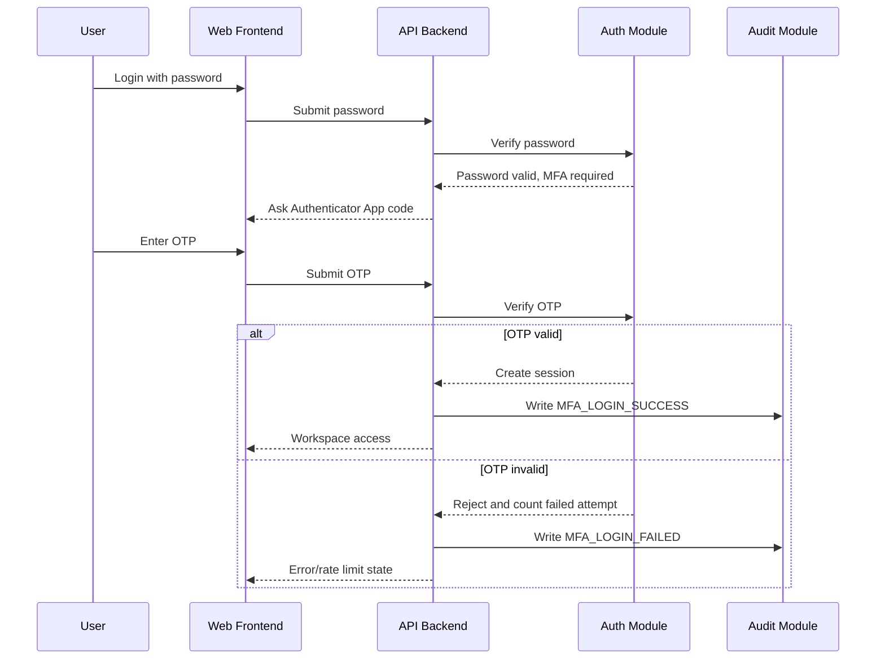

Audit event generated: `MFA_LOGIN_SUCCESS`, `MFA_LOGIN_FAILED`. Related use cases: UC-M01-02 Login, UC-M01-10 Login With MFA, UC-M01-05 Verify MFA Code.

## Disable / Reset MFA

Participants: User, Web Frontend, API Backend, Auth Module, Recovery Policy, Audit Module.

Preconditions: User has MFA enabled or recovery request.

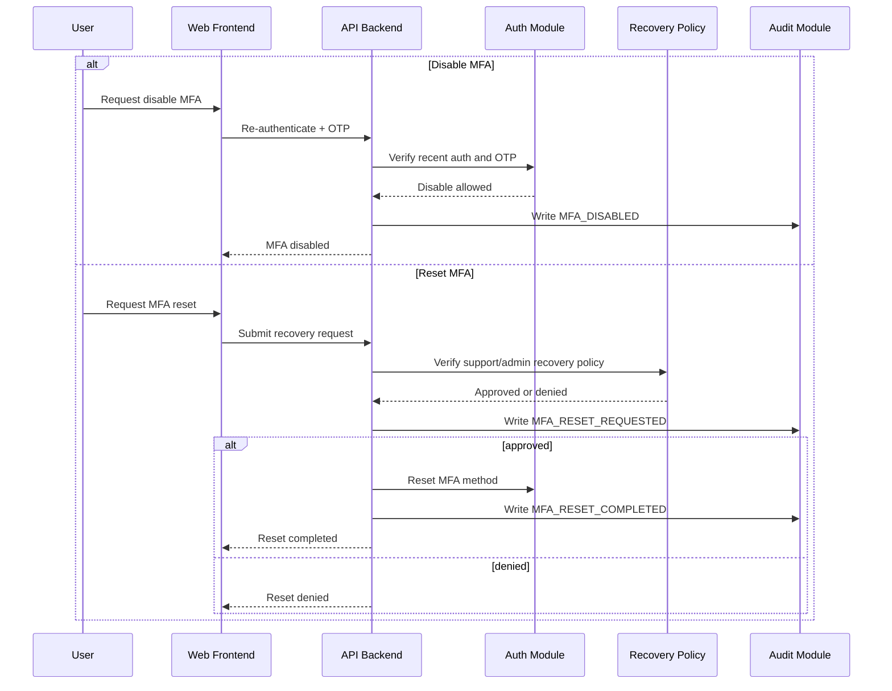

Failure path: recovery cannot bypass authentication policy. Related use cases: UC-M01-06 Disable MFA, UC-M01-07 Reset MFA.

## Manager Creates Assessment

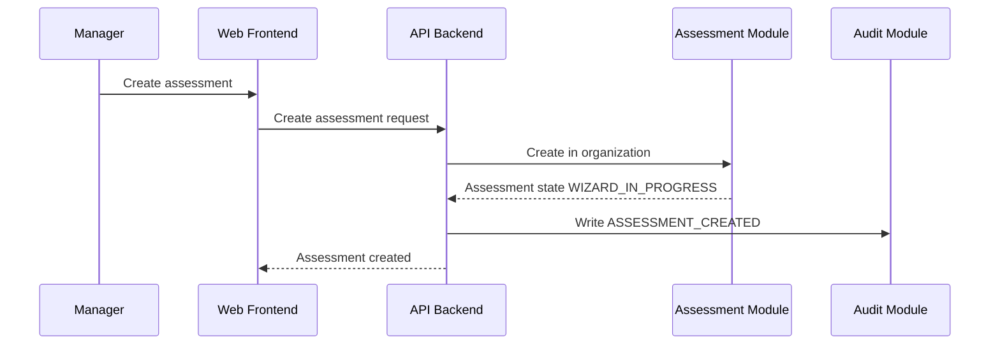

Preconditions: Manager authenticated and organization member. Related use case: UC-M03-01 Create Assessment.

## Manager Invites Developer

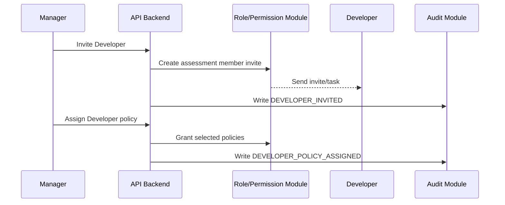

Failure path: Developer receives no Manager permissions. Related use cases: UC-M02-04 Invite Developer, UC-M02-05 Assign Developer Policy.

## Developer Provides GitHub Evidence

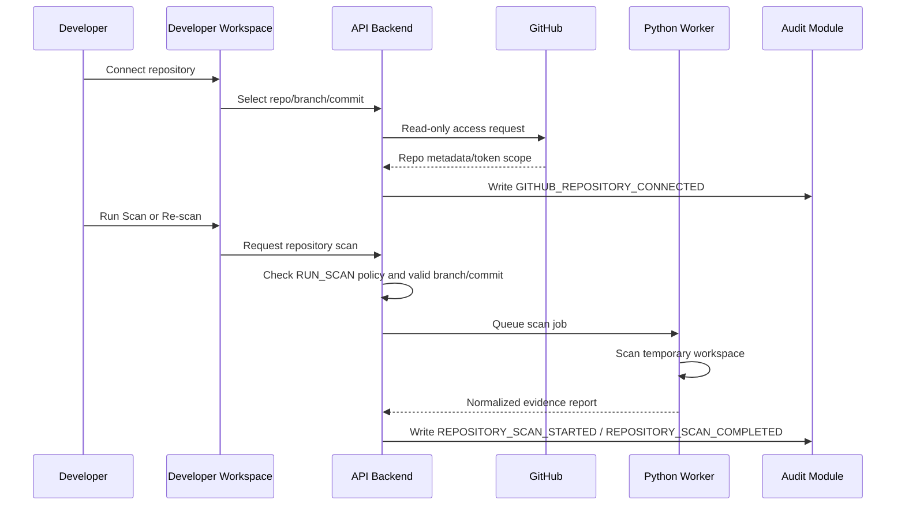

Failure path: missing `RUN_SCAN` policy, invalid branch/commit, scan failure or source privacy violation blocks evidence readiness. Raw source is not sent to LLM and not stored long-term. Related use cases: UC-M04-02 Connect GitHub Repository, UC-M04-08 Run Repository Scan.

## Developer Uploads Local/CI Evidence

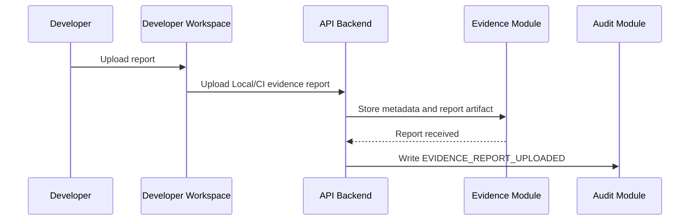

Failure path: missing required metadata leads to schema rejection. Related use case: UC-M04-03 Upload Local/CI Scanner Report.

## Evidence Gate Processing

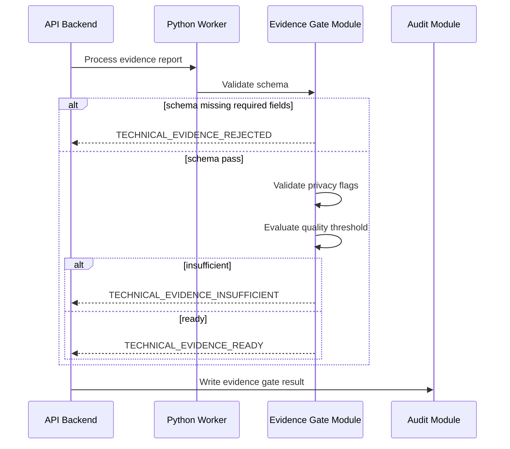

Related use cases: UC-M05-01 Validate Evidence Schema, UC-M05-02 Validate Privacy Flags, UC-M05-03 Evaluate Evidence Quality, UC-M05-05 Mark Evidence as Rejected, Insufficient, or Ready.

## Reconciliation with Conflict

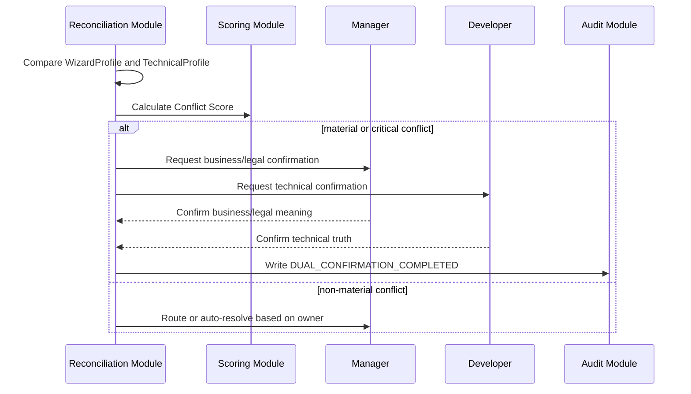

Failure path: unresolved material/critical conflict sets `BLOCKED_BY_CONFLICT`. Related use cases: UC-M06-01..UC-M06-06.

## Human Attestation

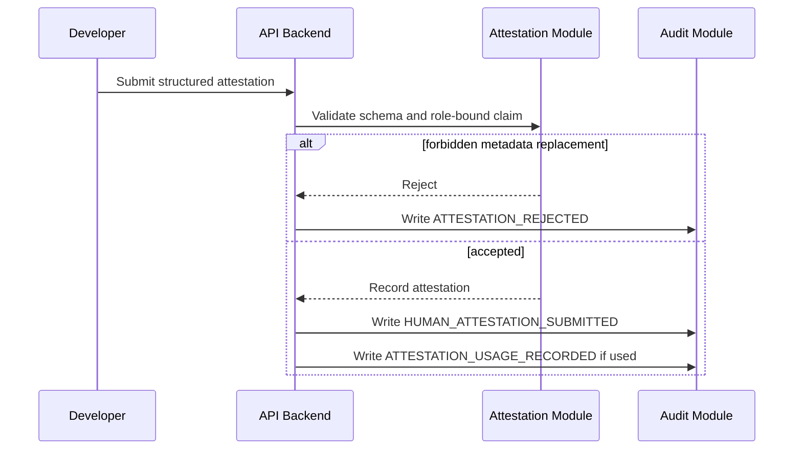

Related use cases: UC-M04-07 Provide Structured Technical Attestation, UC-M09-05 Track Human Attestation Usage.

## VerifiedProfile Creation and Approval

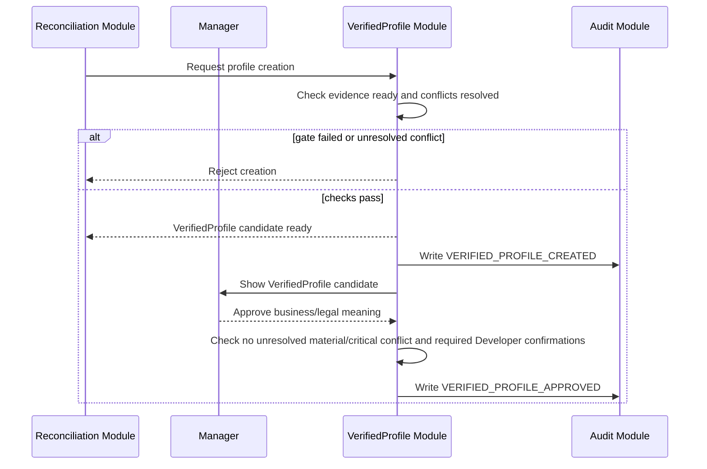

Failure path: approval is blocked if required Developer confirmation is missing or material/critical conflict remains unresolved. Related use cases: UC-M06-07 Create VerifiedProfile, UC-M06-08 Review and Approve VerifiedProfile.

## Risk Classification with Legal Citation

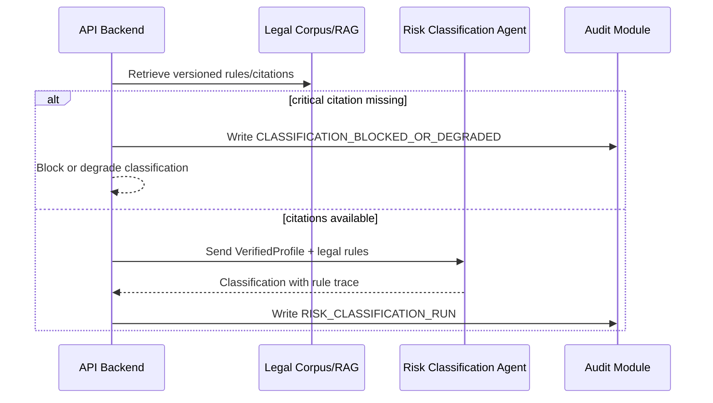

Failure path: LLM cannot create unsupported legal conclusion. Related use cases: UC-M07-01..UC-M07-04.

## Document Generation

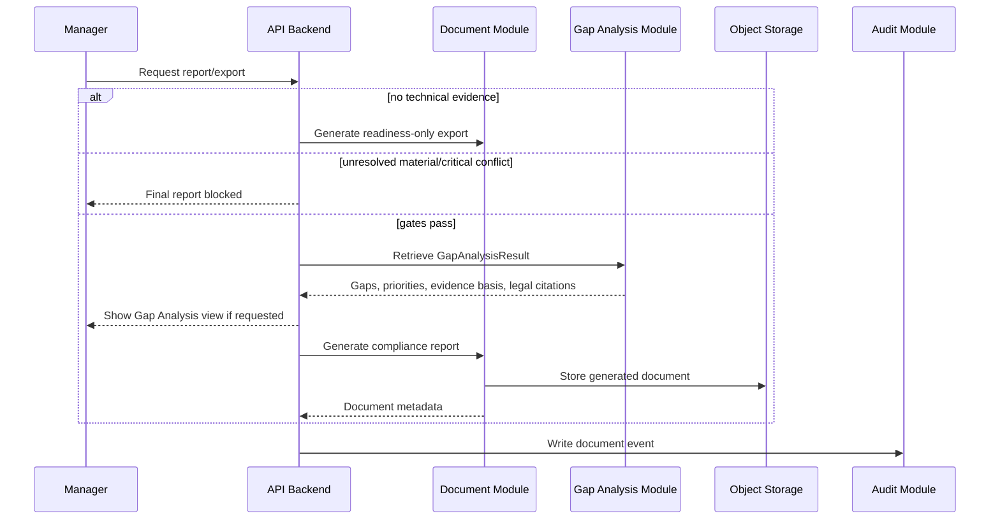

Related use cases: UC-M08-01..UC-M08-06.

## Audit Event Recording

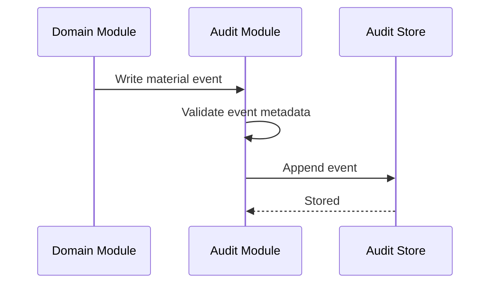

Related use case: UC-M09-01 Write Audit Event.

## Validation Dependencies

| Assumption | Affected Sequence Diagrams |
| --- | --- |
| A1 | Manager Creates Assessment, Evidence Gate Processing, Reconciliation with Conflict |
| A2 | Risk Classification with Legal Citation, Document Generation |
| A3 | Manager Invites Developer, Reconciliation with Conflict, Human Attestation, Audit Event Recording |
