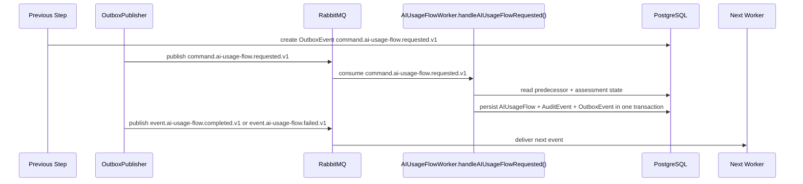

# AI Usage Flow Developer Execution Blueprint

# Business Purpose

Transform WizardProfile and TechnicalProfile evidence into claim-level business usage analysis.

## Research Basis

This blueprint format is adapted from:

- C4 Dynamic Diagram practice: document how static model elements collaborate at runtime for a feature/use case.
- EventStorming: model commands, domain events, aggregates, policies, and external systems explicitly.
- Domain Storytelling: describe who does what with which work object in business language before code detail.
- Service Blueprinting: separate user action, visible API action, backstage service work, support processes, and fail points.
- Execution trace documentation: make each request, handler, object, event, and worker transition explicit.


## Mandatory Invariants

- Manager can complete the active MVP flow without Developer participation.
- OAuth/OIDC login is separate from GitHub App repository authorization.
- Repository Scan is the only active MVP technical-evidence path.
- Scanner is static-analysis only and never executes customer source.
- Raw source, secrets, full prompts, and full AST bodies must not enter LLM, ordinary audit logs, or long-term persistence.
- Classification cannot run before VerifiedProfile.
- Provider/model/framework detection alone does not determine legal risk.


# Trigger

Worker consumes `command.ai-usage-flow.requested.v1` after `event.technical-profile.completed.v1` has been persisted and projected into the next command.

# Input Objects

```json
{
  "messageId": "018f0000-0000-7000-8000-000000000301",
  "correlationId": "018f0000-0000-7000-8000-000000000101",
  "assessmentId": "018f0000-0000-7000-8000-000000000001",
  "inputType": "AIUsageFlowRequestedPayload",
  "wizardProfileId": "018f0000-0000-7000-8000-000000000011",
  "technicalEvidenceReportId": "018f0000-0000-7000-8000-000000000211",
  "technicalProfileId": "018f0000-0000-7000-8000-000000000221"
}
```

# Output Objects

```json
{
  "assessmentId": "018f0000-0000-7000-8000-000000000001",
  "outputType": "AIUsageFlow",
  "aiUsageFlowId": "018f0000-0000-7000-8000-000000000231",
  "status": "READY",
  "summary": {
    "aiDetected": "confirmed",
    "businessProcess": "loan_approval",
    "automationLevel": "FULLY_AUTOMATED",
    "humanReview": "ABSENT_WITH_BOUNDED_PATH"
  },
  "claims": [
    {
      "claimId": "018f0000-0000-7000-8000-000000000232",
      "claimCategory": "AUTOMATED_DECISION",
      "claimField": "automation_level",
      "claimValue": "FULLY_AUTOMATED",
      "lifecycleState": "VALIDATED",
      "confidence": 0.88,
      "evidenceRefs": [
        "ev:018f0000-0000-7000-8000-000000000201:CALL:1",
        "ev:018f0000-0000-7000-8000-000000000201:DECISION_POINT:3"
      ],
      "confidenceBreakdown": {
        "base": 0.8,
        "requiredEvidenceBonus": 0.1,
        "optionalSupportBonus": 0,
        "coveragePenalty": 0.02,
        "conflictPenalty": 0,
        "missingRequiredEvidencePenalty": 0,
        "final": 0.88
      },
      "uncertaintyReasons": [],
      "conflictRefs": []
    }
  ],
  "nextEvent": "event.ai-usage-flow.completed.v1 or event.ai-usage-flow.failed.v1"
}
```

# Execution Trace

| Step | Runtime Hop | Handler | DB Read | DB Write | Queue/Event | Output |
|---:|---|---|---|---|---|---|
| 1 | Input received | `AIUsageFlowService.buildFromTechnicalProfile()` | Required predecessor records | None | Consumes `command.ai-usage-flow.requested.v1` | Validated input DTO |
| 2 | Preconditions checked | `AIUsageFlowService.buildFromTechnicalProfile()` | `Assessment`, actor/state, source object | None | None | Guard pass or blocked error |
| 3 | Domain transform runs | `AIUsageFlowService.buildFromTechnicalProfile()` | Evidence/source rows | Draft output object | None | `AIUsageFlow` draft |
| 4 | Transaction commits | Repository layer | Existing object versions | `AIUsageFlow`, `AuditEvent`, `OutboxEvent` | staged `event.ai-usage-flow.completed.v1` or `event.ai-usage-flow.failed.v1` | Persisted `AIUsageFlow` |
| 5 | Event published | Outbox publisher | `OutboxEvent` | published marker | `event.ai-usage-flow.completed.v1` or `event.ai-usage-flow.failed.v1` | Next worker trigger |
| 6 | Next worker consumes | downstream worker | `AIUsageFlow` | downstream object or blocked state | next event | Workflow advances |

# Object Lifecycle

```text
WizardProfile + TechnicalProfile + TechnicalFinding[] -> AIUsageFlowClaim[] -> AIUsageFlow
```

# Domain Walkthrough

Fixture: `F-SCAN-03 Loan approval / credit scoring`

```text
Loan score feeds approve/reject, producing automated decision usage claims.
```

# Rule Execution Walkthrough

| Input | Rule / Policy | Output |
|---|---|---|
| Valid predecessor object exists | State precondition rule | Continue. |
| Missing predecessor object | Guard rule | Persist blocked state; do not emit success event. |
| Material claim has evidence refs | Evidence traceability rule | Claim may be used downstream. |
| Material claim lacks evidence refs | Evidence traceability rule | Block or degrade downstream output. |

# Queue Choreography

| Producer | Exchange | Routing Key | Consumer |
|---|---|---|---|
| TechnicalProfile trigger | `lcsp.commands.v1` | `command.ai-usage-flow.requested.v1` | `AIUsageFlowWorker.handleAIUsageFlowRequested()` |
| `AIUsageFlowWorker.handleAIUsageFlowRequested()` | `lcsp.events.v1` | `event.ai-usage-flow.completed.v1` or `event.ai-usage-flow.failed.v1` | Reconciliation trigger / projection |

# Database Journey

| Operation | Models |
|---|---|
| Read | `Assessment`, `WizardProfile`, `TechnicalProfile`, `TechnicalEvidenceReport`, `TechnicalFinding`, `EvidenceReference` |
| Create | `AIUsageFlow`, `AIUsageFlowClaim`, `AIUsageFlowClaimEvidenceReference`, `AuditEvent`, `OutboxEvent` |
| Update | `Assessment.state`, predecessor status if applicable |
| Deny write | Raw source, full prompt, secrets, full AST bodies |

# Failure Scenarios

| Input | Failure Point | Output |
|---|---|---|
| Invalid state | Precondition guard | `WORKFLOW_STATE_DENIED`; no event emitted. |
| Missing evidence | Domain transform | Blocked output with reason. |
| Queue publish fails | Outbox publisher | Outbox remains pending; transaction is not lost. |
| Worker retry exhausted | Worker handler | DLQ message and audit event. |

# Sequence Diagram



# Developer Mental Model

Implement `AI Usage Flow` as a deterministic object transformer. It receives one canonical input object, reads only the predecessor records it needs, creates exactly one canonical output object or a blocked state, writes an audit event, and emits the next event through outbox. Hidden synchronous jumps to later workflow stages are forbidden.

# Anti-Patterns

- Creating downstream objects before `AIUsageFlow` is persisted.
- Emitting `event.ai-usage-flow.completed.v1` or `event.ai-usage-flow.failed.v1` before DB commit.
- Swallowing uncertainty instead of creating blocked/degraded output.
- Inferring legal risk from provider/framework detection alone.
- Mutating scanner evidence or Manager declarations in place.

# Local Simulation

1. Seed predecessor records for `TechnicalProfileReadyPayload`.
2. Insert or publish `command.ai-usage-flow.requested.v1` with correlation id `018f0000-0000-7000-8000-000000000101`.
3. Run `AIUsageFlowWorker.handleAIUsageFlowRequested()` locally against fixture `F-SCAN-03 Loan approval / credit scoring`.
4. Verify `AIUsageFlow` row exists.
5. Verify `AuditEvent` and `OutboxEvent` exist.
6. Verify no forbidden raw source/secret/full prompt data was persisted.

# Test Fixture Journey

| Input Fixture | Expected Output Fixture |
|---|---|
| `F-SCAN-03 Loan approval / credit scoring` | `AIUsageFlow` with expected status and evidence refs. |
| Missing predecessor fixture | Blocked state, no success event. |
| Duplicate message fixture | Idempotent no-op after first successful write. |
