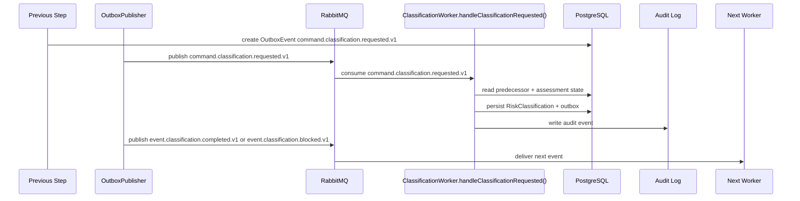

# Risk Classification Developer Execution Blueprint

# Business Purpose

Classify risk only after VerifiedProfile and citation-backed legal matching are available.

## Research Basis

This blueprint format is adapted from:

- C4 Dynamic Diagram practice: document how static model elements collaborate at runtime for a feature/use case.
- EventStorming: model commands, domain events, aggregates, policies, and external systems explicitly.
- Domain Storytelling: describe who does what with which work object in business language before code detail.
- Service Blueprinting: separate user action, visible API action, backstage service work, support processes, and fail points.
- Execution trace documentation: make each request, handler, object, event, and worker transition explicit.


## Mandatory Invariants

- Manager can complete the active MVP flow without Developer participation.
- OAuth/OIDC login is separate from GitHub App repository authorization.
- Repository Scan is the only active MVP technical-evidence path.
- Scanner is static-analysis only and never executes customer source.
- Raw source, secrets, full prompts, and full AST bodies must not enter LLM, ordinary audit logs, or long-term persistence.
- Classification cannot run before VerifiedProfile.
- Provider/model/framework detection alone does not determine legal risk.


# Trigger

Worker consumes `command.classification.requested.v1` after `event.legal-matching.completed.v1` has been persisted and projected into the next command.

# Input Objects

```json
{
  "messageId": "018f0000-0000-7000-8000-000000000601",
  "correlationId": "018f0000-0000-7000-8000-000000000101",
  "assessmentId": "018f0000-0000-7000-8000-000000000001",
  "inputType": "ClassificationRequestedPayload",
  "verifiedProfileId": "018f0000-0000-7000-8000-000000000411",
  "legalCorpusVersionId": "018f0000-0000-7000-8000-000000000511",
  "legalRuleMatchIds": [
    "018f0000-0000-7000-8000-000000000521",
    "018f0000-0000-7000-8000-000000000522"
  ]
}
```

# Output Objects

```json
{
  "assessmentId": "018f0000-0000-7000-8000-000000000001",
  "outputType": "RiskClassification",
  "riskClassificationId": "018f0000-0000-7000-8000-000000000611",
  "status": "COMPLETED",
  "riskLevel": "HIGH_IMPACT",
  "legalRuleMatchIds": [
    "018f0000-0000-7000-8000-000000000521",
    "018f0000-0000-7000-8000-000000000522"
  ],
  "citationCoverage": "COMPLETE_CITATION",
  "confidence": 0.86,
  "blockingReasons": [],
  "nextEvent": "event.classification.completed.v1 or event.classification.blocked.v1"
}
```

# Execution Trace

| Step | Runtime Hop | Handler | DB Read | DB Write | Queue/Event | Output |
|---:|---|---|---|---|---|---|
| 1 | Input received | `RiskClassificationService.classify()` | Required predecessor records | None | Consumes `command.classification.requested.v1` or API trigger | Validated input DTO |
| 2 | Preconditions checked | `RiskClassificationService.classify()` | `Assessment`, actor/state, source object | None | None | Guard pass or blocked error |
| 3 | Domain transform runs | `RiskClassificationService.classify()` | Evidence/source rows | Draft output object | None | `RiskClassification` draft |
| 4 | Transaction commits | Repository layer | Existing object versions | `RiskClassification`, `AuditEvent`, `OutboxEvent` | staged `event.classification.completed.v1` or `event.classification.blocked.v1` | Persisted `RiskClassification` |
| 5 | Event published | Outbox publisher | `OutboxEvent` | published marker | `event.classification.completed.v1` or `event.classification.blocked.v1` | Gap Analysis trigger or blocked projection |
| 6 | Next worker consumes | downstream worker | `RiskClassification` | downstream object or blocked state | next event | Workflow advances |

# Object Lifecycle

```text
VerifiedProfile + LegalRuleMatch[] -> RuleEvaluation[] -> RiskClassification
```

# Domain Walkthrough

Fixture: `F-RAG-02 Missing citation case`

```text
Classification blocks or degrades when citation is missing.
```

# Rule Execution Walkthrough

| Input | Rule / Policy | Output |
|---|---|---|
| Valid predecessor object exists | State precondition rule | Continue. |
| Missing predecessor object | Guard rule | Persist blocked state; do not emit success event. |
| Material claim has evidence refs | Evidence traceability rule | Claim may be used downstream. |
| Material claim lacks evidence refs | Evidence traceability rule | Block or degrade downstream output. |

# Queue Choreography

| Producer | Exchange | Routing Key | Consumer |
|---|---|---|---|
| LegalMatching trigger | `lcsp.commands.v1` | `command.classification.requested.v1` | `ClassificationWorker.handleClassificationRequested()` |
| `ClassificationWorker.handleClassificationRequested()` | `lcsp.events.v1` | `event.classification.completed.v1` | Gap Analysis trigger / projection |
| `ClassificationWorker.handleClassificationRequested()` | `lcsp.events.v1` | `event.classification.blocked.v1` | Manager UI projection / audit |

# Database Journey

| Operation | Models |
|---|---|
| Read | `Assessment`, `VerifiedProfile`, `LegalRuleMatch[]`, `LegalCorpusVersion`, `AuditEvent` context |
| Create | `RiskClassification`, `RiskClassificationLegalRuleMatch`, `AuditEvent`, `OutboxEvent` |
| Update | `Assessment.state`, predecessor status if applicable |
| Deny write | Raw source, full prompt, secrets, full AST bodies |

# Failure Scenarios

| Input | Failure Point | Output |
|---|---|---|
| Invalid state | Precondition guard | `WORKFLOW_STATE_DENIED`; no event emitted. |
| Missing evidence | Domain transform | Blocked output with reason. |
| Queue publish fails | Outbox publisher | Outbox remains pending; transaction is not lost. |
| Worker retry exhausted | Worker handler | DLQ message and audit event. |

# Sequence Diagram



# Developer Mental Model

Implement `Risk Classification` as a deterministic object transformer. It receives one canonical input object, reads only the predecessor records it needs, creates exactly one canonical output object or a blocked state, writes an audit event, and emits the next event through outbox. Hidden synchronous jumps to later workflow stages are forbidden.

# Anti-Patterns

- Creating downstream objects before `RiskClassification` is persisted.
- Emitting `event.classification.completed.v1` or `event.classification.blocked.v1` before DB commit.
- Swallowing uncertainty instead of creating blocked/degraded output.
- Inferring legal risk from provider/framework detection alone.
- Mutating scanner evidence or Manager declarations in place.

# Local Simulation

1. Seed predecessor records for `ClassificationRequestedPayload`.
2. Insert or publish `command.classification.requested.v1` with correlation id `018f0000-0000-7000-8000-000000000101`.
3. Run `ClassificationWorker.handleClassificationRequested()` locally against fixture `F-RAG-02 Missing citation case`.
4. Verify `RiskClassification` row exists.
5. Verify `AuditEvent` and `OutboxEvent` exist.
6. Verify no forbidden raw source/secret/full prompt data was persisted.

# Test Fixture Journey

| Input Fixture | Expected Output Fixture |
|---|---|
| `F-RAG-02 Missing citation case` | `RiskClassification` with expected status and evidence refs. |
| Missing predecessor fixture | Blocked state, no success event. |
| Duplicate message fixture | Idempotent no-op after first successful write. |
