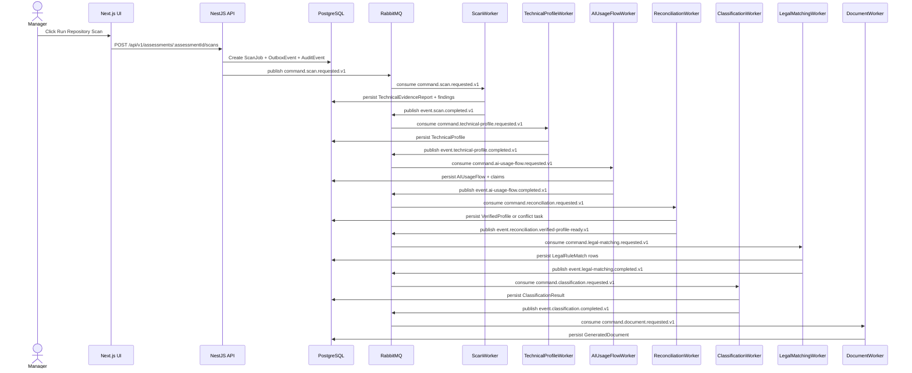

# LCSP End-to-End System Execution Blueprint

# Business Purpose

Show how one Manager action sequence becomes a full compliance assessment artifact: Repository Scan evidence, TechnicalProfile, AIUsageFlow, VerifiedProfile, Legal Matching, Risk Classification, Gap Analysis, and Document Generation.

## Research Basis

This blueprint format is adapted from:

- C4 Dynamic Diagram practice: document how static model elements collaborate at runtime for a feature/use case.
- EventStorming: model commands, domain events, aggregates, policies, and external systems explicitly.
- Domain Storytelling: describe who does what with which work object in business language before code detail.
- Service Blueprinting: separate user action, visible API action, backstage service work, support processes, and fail points.
- Execution trace documentation: make each request, handler, object, event, and worker transition explicit.


## Mandatory Invariants

- Manager can complete the active MVP flow without Developer participation.
- OAuth/OIDC login is separate from GitHub App repository authorization.
- Repository Scan is the only active MVP technical-evidence path.
- Scanner is static-analysis only and never executes customer source.
- Raw source, secrets, full prompts, and full AST bodies must not enter LLM, ordinary audit logs, or long-term persistence.
- Classification cannot run before VerifiedProfile.
- Provider/model/framework detection alone does not determine legal risk.


# Trigger

Manager opens assessment workspace and performs these UI actions:

1. Complete WizardProfile.
2. Connect GitHub repository through GitHub App.
3. Select repository, branch, and commit.
4. Click `Run Repository Scan`.
5. Resolve conflict if workflow pauses.
6. Request classification and document generation when allowed.

# Input Objects

```json
{
  "assessmentId": "assess_001",
  "managerUserId": "user_manager_001",
  "wizardProfileId": "wiz_001",
  "repositoryConnectionId": "repo_conn_001",
  "repositorySnapshotId": "snap_001",
  "repositoryFullName": "acme/loan-platform",
  "branchName": "main",
  "commitSha": "9fceb02a6d..."
}
```

# Output Objects

```json
{
  "assessmentId": "assess_001",
  "technicalEvidenceReportId": "ter_001",
  "technicalProfileId": "tp_001",
  "aiUsageFlowId": "auf_001",
  "verifiedProfileId": "vp_001",
  "classificationResultId": "risk_001",
  "gapAnalysisId": "gap_001",
  "documentId": "doc_001",
  "finalState": "DOCUMENT_GENERATED"
}
```

# Execution Trace

| Step | User / System Action | API / Service | DB Read | DB Write | Queue / Event | Worker | Output |
|---:|---|---|---|---|---|---|---|
| 1 | Manager saves Wizard | `POST /api/v1/assessments/:assessmentId/wizard-profile` -> `WizardService.save()` | `Assessment`, `UserRole` | `WizardProfile`, `AuditEvent` | None | None | `WizardProfileDto` |
| 2 | Manager connects repository | `POST /api/v1/assessments/:assessmentId/github/repository-connections` -> `RepositoryConnectionService.connect()` | `Assessment`, GitHub App installation metadata | `RepositoryConnection`, `AuditEvent` | None | None | `RepositoryConnectionDto` |
| 3 | Manager creates repository snapshot | `POST /api/v1/assessments/:assessmentId/repository-snapshots` -> `RepositorySnapshotService.createSnapshot()` | `RepositoryConnection`, GitHub commit metadata | `RepositorySnapshot`, `AuditEvent` | None | None | `RepositorySnapshotDto` |
| 4 | Manager starts scan | `POST /api/v1/assessments/:assessmentId/scans` -> `ScanJobService.startRepositoryScan()` | `Assessment`, `RepositorySnapshot` | `RepositoryScanJob`, `OutboxEvent`, `AuditEvent` | `command.scan.requested.v1` | None | `ScanJobDto` |
| 5 | Scan command consumed | RabbitMQ `lcsp.commands.v1` / `lcsp.scan-worker.v1` | `ScanWorker.handleScanRequested()` | `RepositoryScanJob`, `RepositorySnapshot` | `SourceFile`, `CodeGraphNode`, `CodeGraphEdge`, `TechnicalFinding`, `TechnicalEvidenceReport`, `OutboxEvent` | `event.scan.completed.v1` or `event.scan.failed.v1` | Scanner Worker | `TechnicalEvidenceReport` or explicit failure |
| 6 | Technical profile requested | Orchestrator / outbox projection | `TechnicalProfileTrigger.handleScanCompleted()` | `TechnicalEvidenceReport`, `TechnicalFinding[]` | `OutboxEvent` | `command.technical-profile.requested.v1` | None | TechnicalProfile command |
| 7 | Technical profile built | RabbitMQ `lcsp.commands.v1` / `lcsp.technical-profile-worker.v1` | `TechnicalProfileWorker.handleTechnicalProfileRequested()` | `TechnicalEvidenceReport`, `TechnicalFinding[]` | `TechnicalProfile`, `AuditEvent`, `OutboxEvent` | `event.technical-profile.completed.v1` or `event.technical-profile.failed.v1` | Technical Profile Worker | `TechnicalProfile` |
| 8 | AIUsageFlow built | RabbitMQ `lcsp.commands.v1` / `lcsp.ai-usage-flow-worker.v1` | `AIUsageFlowWorker.handleAIUsageFlowRequested()` | `WizardProfile`, `TechnicalProfile`, findings, evidence paths | `AIUsageFlow`, `AIUsageFlowClaim[]`, `AuditEvent`, `OutboxEvent` | `event.ai-usage-flow.completed.v1` or `event.ai-usage-flow.failed.v1` | AIUsageFlow Worker | `AIUsageFlow` |
| 9 | Reconciliation runs | RabbitMQ or Manager conflict-resolution API | `ReconciliationService.evaluate()` | `WizardProfile`, `TechnicalProfile`, `AIUsageFlow` | `VerifiedProfile` or `ReconciliationConflict`, `AuditEvent`, `OutboxEvent` | `event.reconciliation.verified-profile-ready.v1` or `event.reconciliation.conflict-detected.v1` | Reconciliation Worker | `VerifiedProfile` or conflict |
| 10 | Legal matching runs | RabbitMQ `lcsp.commands.v1` / `lcsp.legal-matching-worker.v1` | `LegalMatchingWorker.handleLegalMatchingRequested()` | `VerifiedProfile`, `LegalCorpusVersion` | `LegalRuleMatch[]`, `AuditEvent`, `OutboxEvent` | `event.legal-matching.completed.v1` or `event.legal-matching.failed.v1` | Legal Matching Worker | `LegalMatchingResult` |
| 11 | Classification runs | RabbitMQ `lcsp.commands.v1` / `lcsp.classification-worker.v1` | `ClassificationWorker.handleClassificationRequested()` | `VerifiedProfile`, `LegalRuleMatch[]` | `RiskClassification`, `AuditEvent`, `OutboxEvent` | `event.classification.completed.v1` or `event.classification.blocked.v1` | Classification Worker | `RiskClassification` or blocked reason |
| 12 | Document generated | RabbitMQ `lcsp.commands.v1` / `lcsp.document-worker.v1` | `DocumentWorker.handleDocumentRequested()` | `RiskClassification`, legal matches, citations, evidence appendix | `GeneratedDocument`, artifact metadata, `AuditEvent`, `OutboxEvent` | `event.document.generated.v1` or `event.document.blocked.v1` | Document Worker | `GeneratedDocument` or blocked reason |

# Object Lifecycle

```text
Assessment
  -> WizardProfile
  -> RepositoryConnection
  -> RepositorySnapshot
  -> ScanJob
  -> TechnicalEvidenceReport
  -> TechnicalFinding[]
  -> TechnicalProfile
  -> AIUsageFlowClaim[]
  -> AIUsageFlow
  -> VerifiedProfile
  -> LegalRuleMatch[]
  -> ClassificationResult
  -> GapAnalysis
  -> GeneratedDocument
```

# Domain Walkthrough

Loan approval repository:

```text
OpenAI call produces score
score feeds approve/reject branch
no human-review gate observed on bounded path
```

Expected path:

```text
TechnicalFinding(AI_PROVIDER_INVOCATION)
TechnicalFinding(AI_OUTPUT_TO_DECISION)
TechnicalFinding(AUTOMATED_DECISION_PATH)
AIUsageFlow(loan_approval, automated_decision, human_review absent_on_bounded_path)
VerifiedProfile
LegalRuleMatch(financial decision / affected customer)
ClassificationResult(blocked if citation missing, otherwise classified)
```

# Rule Execution Walkthrough

| Input | Rule | Output |
|---|---|---|
| Provider invocation only | `AUF-002` | Technical AI usage claim only; no legal risk. |
| AI output feeds reject action | `AUF-010`, `AUF-032` | `downstream_action=approve_reject`, `automation_level=AUTOMATED_DECISION`. |
| Loan domain evidence | `AUF-014`, `AUF-015` | `business_process=loan_approval`, potential financial harm. |
| No review gate on bounded path | `AUF-019` | `human_review=ABSENT_ON_BOUNDED_PATH`. |
| Material claim missing evidence | `AUF-042` | Claim blocked from legal matching. |

# Queue Choreography

| Producer | Exchange | Routing Key | Consumer |
|---|---|---|---|
| API outbox | `lcsp.commands.v1` | `command.scan.requested.v1` | `ScanWorker` |
| Scanner Worker outbox | `lcsp.events.v1` | `event.scan.completed.v1` | TechnicalProfile trigger / projection |
| TechnicalProfile trigger | `lcsp.commands.v1` | `command.technical-profile.requested.v1` | `TechnicalProfileWorker` |
| TechnicalProfile Worker outbox | `lcsp.events.v1` | `event.technical-profile.completed.v1` | AIUsageFlow trigger / projection |
| AIUsageFlow trigger | `lcsp.commands.v1` | `command.ai-usage-flow.requested.v1` | `AIUsageFlowWorker` |
| AIUsageFlow Worker outbox | `lcsp.events.v1` | `event.ai-usage-flow.completed.v1` | Reconciliation trigger / projection |
| Reconciliation trigger | `lcsp.commands.v1` | `command.reconciliation.requested.v1` | `ReconciliationWorker` |
| Reconciliation Worker outbox | `lcsp.events.v1` | `event.reconciliation.verified-profile-ready.v1` or `event.reconciliation.conflict-detected.v1` | LegalMatching trigger or Manager conflict projection |
| LegalMatching trigger | `lcsp.commands.v1` | `command.legal-matching.requested.v1` | `LegalMatchingWorker` |
| LegalMatching Worker outbox | `lcsp.events.v1` | `event.legal-matching.completed.v1` | Classification trigger / projection |
| Classification trigger | `lcsp.commands.v1` | `command.classification.requested.v1` | `ClassificationWorker` |
| Classification Worker outbox | `lcsp.events.v1` | `event.classification.completed.v1` or `event.classification.blocked.v1` | Document trigger or blocked projection |
| Document trigger | `lcsp.commands.v1` | `command.document.requested.v1` | `DocumentWorker` |
| Document Worker outbox | `lcsp.events.v1` | `event.document.generated.v1` or `event.document.blocked.v1` | Manager UI projection / audit |

# Database Journey

| Step | Rows Created | Rows Updated | Rows Read |
|---|---|---|---|
| Wizard | `WizardProfile`, `AuditEvent` | `Assessment.state` | `Assessment`, `UserRole` |
| GitHub | `RepositoryConnection`, `RepositorySnapshot`, `AuditEvent` | `Assessment.state` | `GitHubInstallation` |
| Scan start | `ScanJob`, `OutboxEvent`, `AuditEvent` | `Assessment.state` | `RepositorySnapshot` |
| Scanner | `SourceFile`, `CodeGraphNode`, `CodeGraphEdge`, `TechnicalFinding`, `TechnicalEvidenceReport` | `ScanJob.status` | `ScanJob`, `RepositorySnapshot` |
| AIUsageFlow | `AIUsageFlow`, `AIUsageFlowClaim`, `AuditEvent` | `Assessment.state` | `WizardProfile`, `TechnicalProfile`, findings |
| Document | `GeneratedDocument`, `AuditEvent` | `Assessment.state` | `GapAnalysis`, `ClassificationResult`, citations |

# Failure Scenarios

| Input | Failure Point | Output |
|---|---|---|
| `command.scan.requested.v1` | Repository snapshot unavailable | `RepositoryScanJob.FAILED_RETRYABLE`, retry message. |
| `TechnicalEvidenceReport` | Schema Gate fails | `TECHNICAL_EVIDENCE_REJECTED`, no TechnicalProfile. |
| `AIUsageFlow` | Conflict with WizardProfile | `ManagerConflictResolutionTask`, no classification. |
| `VerifiedProfile` | Missing citation | `ClassificationBlocked(MISSING_CITATION)`. |
| `GapAnalysis` | Output guardrail fails | `DOCUMENT_GENERATION_BLOCKED`. |

# Sequence Diagram



# Developer Mental Model

Implement the system as a chain of explicit object handoffs. A service does not “continue the workflow” by hidden calls. It persists its output object, writes an outbox event, and the next worker consumes the event. If the next object cannot be created safely, persist a blocked state with a reason.

# Anti-Patterns

- Calling classification directly from scan completion.
- Treating provider detection as risk classification.
- Storing raw source or full AST to make later steps easier.
- Letting Manager resolution overwrite scanner findings.
- Publishing queue messages before DB commit.

# Local Simulation

1. Seed `Assessment`, `WizardProfile`, `RepositorySnapshot` fixture records.
2. Insert a `RepositoryScanJob` and outbox row for `command.scan.requested.v1`.
3. Run Scanner fixture simulation using synthetic repository metadata.
4. Verify each output object appears before the next event is emitted.
5. Stop at any blocked state and confirm no downstream object is created.

# Test Fixture Journey

| Input Fixture | Expected Output Fixture |
|---|---|
| `F-SCAN-03 Loan approval / credit scoring` | `TechnicalEvidenceReport` with AI invocation and decision-flow findings. |
| `F-CONFLICT-01 Wizard says no decision but source has approve/reject` | `ManagerConflictResolutionTask`. |
| `F-RAG-02 Missing citation case` | `ClassificationBlocked(MISSING_CITATION)` or degraded document output. |
