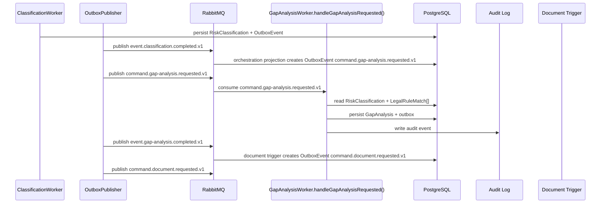

# Gap Analysis Developer Execution Blueprint

# Business Purpose

Transform a completed `RiskClassification` and citation-backed legal matches into a concrete list of compliance gaps, missing evidence, citation gaps, and remediation priorities before document generation.

# Trigger

Worker consumes `command.gap-analysis.requested.v1` after `event.classification.completed.v1` has been persisted and projected into the next command.

# Input Objects

```json
{
  "eventId": "018f2000-0000-7000-8000-000000000101",
  "correlationId": "018f2000-0000-7000-8000-000000000102",
  "assessmentId": "018f2000-0000-7000-8000-000000000201",
  "inputType": "GapAnalysisRequestedPayload",
  "riskClassificationId": "018f2000-0000-7000-8000-000000000301",
  "verifiedProfileId": "018f2000-0000-7000-8000-000000000401",
  "legalRuleMatchIds": ["018f2000-0000-7000-8000-000000000501"],
  "legalCorpusVersionId": "018f2000-0000-7000-8000-000000000601"
}
```

# Output Objects

```json
{
  "assessmentId": "018f2000-0000-7000-8000-000000000201",
  "outputType": "GapAnalysis",
  "gapAnalysisId": "018f2000-0000-7000-8000-000000000701",
  "status": "COMPLETED",
  "gapItems": [
    {
      "gapId": "018f2000-0000-7000-8000-000000000801",
      "category": "MISSING_EVIDENCE",
      "priority": "HIGH",
      "requiredAction": "Provide human-review process evidence",
      "evidenceRefs": ["018f2000-0000-7000-8000-000000000901"],
      "legalRuleMatchRefs": ["018f2000-0000-7000-8000-000000000501"]
    }
  ],
  "nextEvent": "event.gap-analysis.completed.v1"
}
```

# Execution Trace

| Step | Runtime Hop | Handler | DB Read | DB Write | Queue/Event | Output |
|---:|---|---|---|---|---|---|
| 1 | Input received | `GapAnalysisWorker.handleGapAnalysisRequested()` | `RiskClassification`, `LegalRuleMatch[]`, `VerifiedProfile` | None | Consumes `command.gap-analysis.requested.v1` | Validated input DTO |
| 2 | Preconditions checked | `GapAnalysisService.build()` | `Assessment`, `RiskClassification.status`, citation coverage | None | None | Guard pass or blocked result |
| 3 | Gap rules execute | `GapAnalysisService.build()` | classification rationale, legal matches, evidence refs | draft `GapAnalysis` | None | Gap items and priorities |
| 4 | Transaction commits | Repository layer | existing versions | `GapAnalysis`, `AuditEvent`, `OutboxEvent` | staged `event.gap-analysis.completed.v1`, `event.gap-analysis.blocked.v1`, or `event.gap-analysis.failed.v1` | Persisted `GapAnalysis` or blocked state |
| 5 | Event published | Outbox publisher | `OutboxEvent` | published marker | event routing key | Document trigger or blocked projection |

# Object Lifecycle

```text
RiskClassification + LegalRuleMatch[] + CitationCoverage
  -> GapRuleEvaluation[]
  -> GapItem[]
  -> GapAnalysis
  -> event.gap-analysis.completed.v1
  -> command.document.requested.v1
```

# Domain Walkthrough

Loan approval classification has citation coverage, but human-review process evidence is absent.

Expected path:

```text
RiskClassification(COMPLETED)
LegalRuleMatch(financial decision rule)
GapAnalysis(gap item: missing human-review evidence)
DocumentGeneration(input: RiskClassification + GapAnalysis + citations)
```

# Rule Execution Walkthrough

| Input | Rule / Policy | Output |
|---|---|---|
| Classification completed and citations complete | Gap eligibility rule | Continue. |
| Classification blocked | Gap precondition rule | `event.gap-analysis.blocked.v1`; no document command. |
| LegalRuleMatch has partial citation | Citation gap rule | Gap item `MISSING_CITATION_METADATA`. |
| VerifiedProfile says human review unclear | Evidence gap rule | Gap item `HUMAN_REVIEW_EVIDENCE_REQUIRED`. |
| Material AIUsageFlow claim lacks evidence refs | Evidence traceability rule | Gap item `MATERIAL_CLAIM_EVIDENCE_MISSING`. |

# Deterministic Gap Rule Catalog

| Rule ID | Condition | Priority Formula Input | Output |
|---|---|---|---|
| GAP-001 | `RiskClassification.status != COMPLETED` | terminal precondition | Block gap analysis and document generation. |
| GAP-002 | Any required `LegalRuleMatch` has partial citation coverage | materiality high + citation incomplete | Gap item `MISSING_CITATION_METADATA`. |
| GAP-003 | VerifiedProfile human review is `UNCLEAR` for an automated decision path | materiality high + evidence missing | Gap item `HUMAN_REVIEW_EVIDENCE_REQUIRED`. |
| GAP-004 | Material AIUsageFlow claim has no evidence refs | materiality high + trace missing | Gap item `MATERIAL_CLAIM_EVIDENCE_MISSING`. |
| GAP-005 | Classification has blocking reasons | materiality from blocking reason | Preserve blocking reason and prevent document command. |

Priority is deterministic:

```text
score =
  materialityWeight
  + citationGapWeight
  + evidenceGapWeight
  + automationWeight

priority =
  HIGH if score >= 0.75
  MEDIUM if score >= 0.40
  LOW otherwise
```

Weights:

- `materialityWeight`: `0.40` for classification-required fact, `0.20` for supporting fact.
- `citationGapWeight`: `0.25` for missing/partial citation, `0.00` for complete citation.
- `evidenceGapWeight`: `0.25` for missing material evidence ref, `0.10` for weak/partial evidence, `0.00` otherwise.
- `automationWeight`: `0.10` when automation level is fully or semi-automated.

# Queue Choreography

| Producer | Exchange | Routing Key | Consumer |
|---|---|---|---|
| Classification trigger | `lcsp.commands.v1` | `command.gap-analysis.requested.v1` | `GapAnalysisWorker.handleGapAnalysisRequested()` |
| `GapAnalysisWorker.handleGapAnalysisRequested()` | `lcsp.events.v1` | `event.gap-analysis.completed.v1` | Document trigger / projection |
| `GapAnalysisWorker.handleGapAnalysisRequested()` | `lcsp.events.v1` | `event.gap-analysis.blocked.v1` or `event.gap-analysis.failed.v1` | Manager UI projection / audit |

# Database Journey

| Operation | Models |
|---|---|
| Read | `Assessment`, `RiskClassification`, `VerifiedProfile`, `LegalRuleMatch`, `LegalCorpusVersion` |
| Create | `GapAnalysis`, `AuditEvent`, `OutboxEvent` |
| Update | `Assessment.state` projection |
| Deny write | Raw source, full prompt, secrets, full AST bodies |

# Failure Scenarios

| Input | Failure Point | Output |
|---|---|---|
| Classification is `BLOCKED` | Precondition guard | `event.gap-analysis.blocked.v1`; no document command. |
| Legal matches missing | DB read/precondition | `event.gap-analysis.blocked.v1`. |
| Worker exception | Worker handler | retry, then `event.gap-analysis.failed.v1` and DLQ after max attempts. |
| Duplicate command | Idempotency guard | Return existing `GapAnalysis` for same classification id. |

# Sequence Diagram



# Developer Mental Model

Implement Gap Analysis as a deterministic transformer between classification and document generation. It never reclassifies risk. It converts the classification basis into actionable gap items and blocks document generation when the classification/legal basis is not usable.

# Anti-Patterns

- Generating documents directly from `event.classification.completed.v1`.
- Re-running legal matching inside Gap Analysis.
- Treating partial citations as complete.
- Hiding evidence gaps in prose only instead of structured `GapAnalysis.gapItems`.
- Emitting `event.gap-analysis.completed.v1` before `GapAnalysis` is persisted.

# Local Simulation

1. Seed `RiskClassification`, `VerifiedProfile`, `LegalRuleMatch[]`, and citation coverage fixture records.
2. Insert or publish `command.gap-analysis.requested.v1`.
3. Run `GapAnalysisWorker.handleGapAnalysisRequested()` locally.
4. Verify `GapAnalysis` row exists.
5. Verify `AuditEvent` and `OutboxEvent` exist.
6. Verify `command.document.requested.v1` is created only after `event.gap-analysis.completed.v1`.

# Test Fixture Journey

| Input Fixture | Expected Output Fixture |
|---|---|
| Completed loan classification with missing human-review evidence | `GapAnalysis` with `HUMAN_REVIEW_EVIDENCE_REQUIRED`. |
| Classification blocked for missing citation | `event.gap-analysis.blocked.v1`, no document command. |
| Duplicate gap command | Idempotent no-op after first successful write. |
