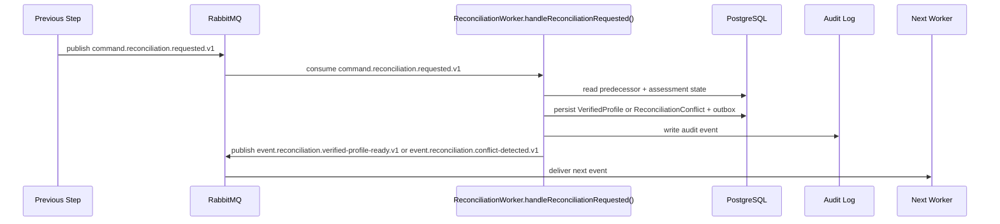

# Reconciliation Developer Execution Blueprint

# Business Purpose

Compare Manager declaration with technical evidence and pause for Manager resolution when conflict exists.

## Research Basis

This blueprint format is adapted from:

- C4 Dynamic Diagram practice: document how static model elements collaborate at runtime for a feature/use case.
- EventStorming: model commands, domain events, aggregates, policies, and external systems explicitly.
- Domain Storytelling: describe who does what with which work object in business language before code detail.
- Service Blueprinting: separate user action, visible API action, backstage service work, support processes, and fail points.
- Execution trace documentation: make each request, handler, object, event, and worker transition explicit.


## Mandatory Invariants

- Manager can complete the active MVP flow without Developer participation.
- OAuth/OIDC login is separate from GitHub App repository authorization.
- Repository Scan is the only active MVP technical-evidence path.
- Scanner is static-analysis only and never executes customer source.
- Raw source, secrets, full prompts, and full AST bodies must not enter LLM, ordinary audit logs, or long-term persistence.
- Classification cannot run before VerifiedProfile.
- Provider/model/framework detection alone does not determine legal risk.


# Trigger

Worker consumes `command.reconciliation.requested.v1` after `event.ai-usage-flow.completed.v1` has been persisted and projected into the next command.

# Input Objects

```json
{
  "eventId": "evt_001",
  "correlationId": "corr_assess_001",
  "assessmentId": "assess_001",
  "inputType": "ReconciliationRequestedPayload",
  "repositorySnapshotId": "snap_001",
  "technicalEvidenceReportId": "ter_001",
  "technicalProfileId": "tp_001",
  "aiUsageFlowId": "auf_001",
  "verifiedProfileId": "vp_001"
}
```

# Output Objects

```json
{
  "assessmentId": "assess_001",
  "outputType": "VerifiedProfile or ReconciliationConflict",
  "status": "CREATED",
  "evidenceRefs": ["ev_001", "ev_002"],
  "nextEvent": "event.reconciliation.verified-profile-ready.v1 or event.reconciliation.conflict-detected.v1"
}
```

# Execution Trace

| Step | Runtime Hop | Handler | DB Read | DB Write | Queue/Event | Output |
|---:|---|---|---|---|---|---|
| 1 | Input received | `ReconciliationService.evaluate()` | Required predecessor records | None | Consumes `command.reconciliation.requested.v1` or Manager conflict-resolution API trigger | Validated input DTO |
| 2 | Preconditions checked | `ReconciliationService.evaluate()` | `Assessment`, actor/state, source object | None | None | Guard pass or blocked error |
| 3 | Domain transform runs | `ReconciliationService.evaluate()` | Evidence/source rows | Draft output object | None | `VerifiedProfile` or `ReconciliationConflict` draft |
| 4 | Transaction commits | Repository layer | Existing object versions | `VerifiedProfile` or `ReconciliationConflict`, `AuditEvent`, `OutboxEvent` | staged `event.reconciliation.verified-profile-ready.v1` or `event.reconciliation.conflict-detected.v1` | Persisted `VerifiedProfile` or `ReconciliationConflict` |
| 5 | Event published | Outbox publisher | `OutboxEvent` | published marker | `event.reconciliation.verified-profile-ready.v1` or `event.reconciliation.conflict-detected.v1` | Next worker trigger or Manager conflict projection |
| 6 | Next worker consumes | downstream worker | `VerifiedProfile` or `ReconciliationConflict` | downstream object or blocked state | next event | Workflow advances or waits for Manager |

# Object Lifecycle

```text
WizardProfile + TechnicalProfile + AIUsageFlow -> ConflictSet -> VerifiedProfile
```

# Domain Walkthrough

Fixture: `F-CONFLICT-01 Wizard says no decision but source has approve/reject`

```text
Conflict task is created; scanner evidence remains immutable.
```

# Rule Execution Walkthrough

| Input | Rule / Policy | Output |
|---|---|---|
| Valid predecessor object exists | State precondition rule | Continue. |
| Missing predecessor object | Guard rule | Persist blocked state; do not emit success event. |
| Material claim has evidence refs | Evidence traceability rule | Claim may be used downstream. |
| Material claim lacks evidence refs | Evidence traceability rule | Block or degrade downstream output. |

# Queue Choreography

| Producer | Exchange | Routing Key | Consumer |
|---|---|---|---|
| AIUsageFlow trigger | `lcsp.commands.v1` | `command.reconciliation.requested.v1` | `ReconciliationWorker.handleReconciliationRequested()` |
| `ReconciliationWorker.handleReconciliationRequested()` | `lcsp.events.v1` | `event.reconciliation.verified-profile-ready.v1` or `event.reconciliation.conflict-detected.v1` | LegalMatching trigger or Manager conflict projection |

# Database Journey

| Operation | Models |
|---|---|
| Read | `Assessment`, predecessor object, `AuditEvent` context |
| Create | `VerifiedProfile or ManagerConflictResolutionTask`, `AuditEvent`, `OutboxEvent` |
| Update | `Assessment.state`, predecessor status if applicable |
| Deny write | Raw source, full prompt, secrets, full AST bodies |

# Failure Scenarios

| Input | Failure Point | Output |
|---|---|---|
| Invalid state | Precondition guard | `WORKFLOW_STATE_DENIED`; no event emitted. |
| Missing evidence | Domain transform | Blocked output with reason. |
| Queue publish fails | Outbox publisher | Outbox remains pending; transaction is not lost. |
| Worker retry exhausted | Worker handler | DLQ message and audit event. |

# Sequence Diagram



# Developer Mental Model

Implement `Reconciliation` as a deterministic object transformer. It receives one canonical input object, reads only the predecessor records it needs, creates exactly one canonical output object or conflict state, writes an audit event, and emits the next event through outbox. Hidden synchronous jumps to later workflow stages are forbidden.

# Anti-Patterns

- Creating downstream objects before `VerifiedProfile` or `ReconciliationConflict` is persisted.
- Emitting `event.reconciliation.verified-profile-ready.v1` or `event.reconciliation.conflict-detected.v1` before DB commit.
- Swallowing uncertainty instead of creating blocked/degraded output.
- Inferring legal risk from provider/framework detection alone.
- Mutating scanner evidence or Manager declarations in place.

# Local Simulation

1. Seed predecessor records for `AIUsageFlowReadyPayload`.
2. Insert or publish `command.reconciliation.requested.v1` with correlation id `corr_assess_001`.
3. Run `ReconciliationWorker.handleReconciliationRequested()` locally against fixture `F-CONFLICT-01 Wizard says no decision but source has approve/reject`.
4. Verify `VerifiedProfile` or `ReconciliationConflict` row exists.
5. Verify `AuditEvent` and `OutboxEvent` exist.
6. Verify no forbidden raw source/secret/full prompt data was persisted.

# Test Fixture Journey

| Input Fixture | Expected Output Fixture |
|---|---|
| `F-CONFLICT-01 Wizard says no decision but source has approve/reject` | `VerifiedProfile` or `ReconciliationConflict` with expected status and evidence refs. |
| Missing predecessor fixture | Blocked state, no success event. |
| Duplicate message fixture | Idempotent no-op after first successful write. |
