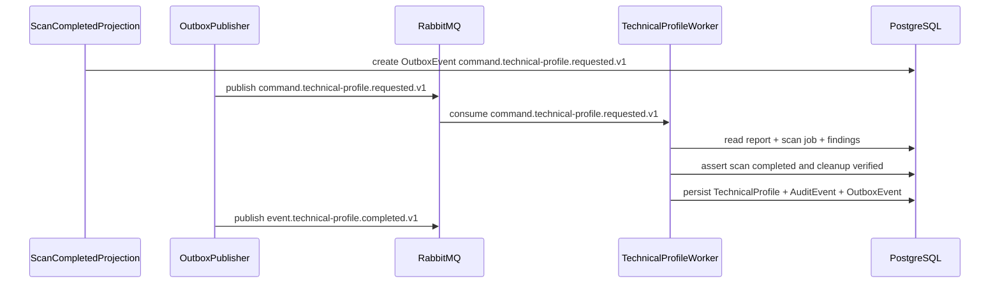

# TechnicalProfile Developer Execution Blueprint

# Business Purpose

Transform a cleanup-verified `TechnicalEvidenceReport` into a compact `TechnicalProfile` summary that downstream AIUsageFlow rules can consume without reading scanner internals.

# Trigger

`event.scan.completed.v1` is projected into `command.technical-profile.requested.v1` only after the scan job is `COMPLETED` and workspace cleanup is verified.

# Input Objects

```json
{
  "eventId": "018f1000-0000-7000-8000-000000000101",
  "correlationId": "018f1000-0000-7000-8000-000000000102",
  "assessmentId": "018f1000-0000-7000-8000-000000000201",
  "scanJobId": "018f1000-0000-7000-8000-000000000301",
  "technicalEvidenceReportId": "018f1000-0000-7000-8000-000000000401"
}
```

# Output Objects

```json
{
  "technicalProfileId": "018f1000-0000-7000-8000-000000000501",
  "assessmentId": "018f1000-0000-7000-8000-000000000201",
  "technicalEvidenceReportId": "018f1000-0000-7000-8000-000000000401",
  "source": "GITHUB_REPOSITORY_SCAN",
  "aiDetected": "confirmed",
  "providers": ["openai"],
  "frameworks": [],
  "modelInvocationCount": 1,
  "inputCategories": ["financial_data"],
  "outputCategories": ["score", "decision_label"],
  "decisionFlowSignals": ["approve_reject"],
  "humanReviewSignals": [],
  "sensitiveDataSignals": ["financial_data"],
  "domainSignals": ["loan_approval"],
  "coverageLimitations": [],
  "confidence": 0.86,
  "evidenceRefs": [
    {
      "evidenceRefId": "018f1000-0000-7000-8000-000000000601",
      "evidenceRef": "ev:018f1000-0000-7000-8000-000000000601:CALL:1",
      "sourceType": "STATIC_SCAN",
      "relativePath": "src/loan.ts",
      "evidenceHash": "sha256:metadata-only"
    }
  ]
}
```

# Execution Trace

| Step | Runtime Hop | Handler | DB Read | DB Write | Queue/Event | Output |
|---:|---|---|---|---|---|---|
| 1 | Command consumed | `TechnicalProfileWorker.handleTechnicalProfileRequested()` | `TechnicalEvidenceReport`, `RepositoryScanJob`, `TechnicalFinding[]`, `EvidenceReference[]` | None | consumes `command.technical-profile.requested.v1` | validated input |
| 2 | Guard checked | `TechnicalProfileService.assertPrerequisites()` | report status, scan job status, cleanup marker | None | None | pass or `event.technical-profile.failed.v1` |
| 3 | Aggregate findings | `TechnicalProfileService.buildProfile()` | finding taxonomy, confidence, coverage limitations | draft `TechnicalProfile` | None | derived dimensions |
| 4 | Commit result | repository layer | existing versions | `TechnicalProfile`, `AuditEvent`, `OutboxEvent` | staged `event.technical-profile.completed.v1` | persisted profile |
| 5 | Publish event | Outbox publisher | `OutboxEvent` | published marker | `event.technical-profile.completed.v1` | AIUsageFlow trigger |

# Object Lifecycle

```text
TechnicalEvidenceReport
  -> TechnicalFinding[]
  -> EvidenceReference[]
  -> TechnicalProfile
  -> event.technical-profile.completed.v1
  -> command.ai-usage-flow.requested.v1
```

# Rule Execution Walkthrough

| Input | Rule | Output |
|---|---|---|
| `AI_MODEL_INVOCATION` finding exists | AI detection aggregation | `aiDetected=confirmed`, increment `modelInvocationCount`. |
| Provider package only | Provider aggregation | `aiDetected=possible`, never confirmed. |
| `AI_DECISION_FLOW_SIGNAL` + `AUTOMATED_DECISION_SIGNAL` | Decision-flow aggregation | Add `approve_reject` to `decisionFlowSignals`. |
| `SCAN_COVERAGE_LIMITATION` | Coverage aggregation | Preserve limitation in `coverageLimitations`; do not guess missing fields. |

# Queue Choreography

| Producer | Exchange | Routing Key | Consumer |
|---|---|---|---|
| TechnicalProfile trigger | `lcsp.commands.v1` | `command.technical-profile.requested.v1` | `TechnicalProfileWorker.handleTechnicalProfileRequested()` |
| TechnicalProfile Worker outbox | `lcsp.events.v1` | `event.technical-profile.completed.v1` | AIUsageFlow trigger / projection |
| TechnicalProfile Worker outbox | `lcsp.events.v1` | `event.technical-profile.failed.v1` | Manager UI projection / audit |

# Database Journey

| Operation | Models |
|---|---|
| Read | `Assessment`, `RepositoryScanJob`, `TechnicalEvidenceReport`, `TechnicalFinding`, `EvidenceReference` |
| Create | `TechnicalProfile`, `AuditEvent`, `OutboxEvent` |
| Update | `Assessment.state` projection |
| Deny write | Raw source, full AST body, full prompt, secrets |

# Failure Scenarios

| Input | Failure Point | Output |
|---|---|---|
| Report is not `QUALITY_VALID` | Guard check | `event.technical-profile.failed.v1`; no AIUsageFlow command. |
| ScanJob not `COMPLETED` | Cleanup/replay guard | `event.technical-profile.failed.v1`; no AIUsageFlow command. |
| `cleanupVerifiedAt` missing | Cleanup/replay guard | `event.technical-profile.failed.v1`; no AIUsageFlow command. |
| Duplicate command | Idempotency guard | Return existing `TechnicalProfile` for report id. |

# Sequence Diagram



# Developer Mental Model

Implement TechnicalProfile as a deterministic aggregation layer. It summarizes scanner evidence into stable dimensions for AIUsageFlow, but it does not infer business/legal risk and does not bypass scanner cleanup verification.

# Anti-Patterns

- Building a profile from any `QUALITY_VALID` report without checking the linked scan job.
- Treating provider package presence as confirmed AI usage.
- Dropping coverage limitations because the profile is a summary.
- Publishing RabbitMQ events directly inside the DB transaction.

# Local Simulation

1. Seed `RepositoryScanJob` with `status=COMPLETED` and `cleanupVerifiedAt`.
2. Seed a `QUALITY_VALID` `TechnicalEvidenceReport` plus findings and evidence refs.
3. Insert `command.technical-profile.requested.v1` outbox row.
4. Run the worker handler.
5. Verify `TechnicalProfile`, `AuditEvent`, and `event.technical-profile.completed.v1` outbox row.

# Test Fixture Journey

| Input Fixture | Expected Output Fixture |
|---|---|
| Completed scan with model invocation and approve/reject path | `TechnicalProfile` with `aiDetected=confirmed`, decision-flow signal, and evidence refs. |
| Cleanup-failed scan with staged report | `event.technical-profile.failed.v1`; no profile. |
| Provider package only | `aiDetected=possible`; no confirmed model invocation. |
