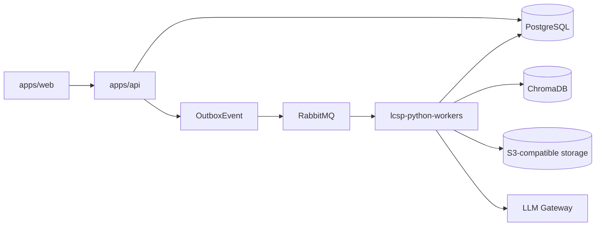

# LCSP Developer Compendium

## Status

ACTIVE_SUMMARY_GUIDE

## Purpose

Tài liệu này là lớp dẫn đường cho developer, reviewer, và AI coding agent khi làm việc với bộ active implementation docs của LCSP. Nó tổng hợp authority từ:

- `docs/project-context.md`
- `docs/implementation/**`
- `docs/implementation/tasks/**`
- `docs/implementation-artifacts/**`

Tài liệu này không thay thế authority gốc. Khi có mâu thuẫn, luôn ưu tiên file nguồn active được trích dẫn trong từng mục.

## Executive Summary

- Task catalog vẫn giữ nhãn `IMPLEMENTATION_NOT_AUTHORIZED` ở lớp planning artifact, nhưng story-level execution artifacts hiện đã mở execution surface cho toàn bộ MVP.
- Runtime shape đã khóa: `apps/web` là Next.js, `apps/api` là NestJS synchronous control plane, mọi async domain workload thuộc monorepo `lcsp-python-workers`.
- PBAC là authorization source of truth. Role label như `Manager` và `Developer` chỉ là attribute hoặc policy template.
- Scanner lifecycle do Python Scanner Worker sở hữu; Node.js chỉ còn là bounded TS/JS analyzer subprocess.
- Legal retrieval dùng ChromaDB structure-first vectorless retrieval; không dùng dense embedding hoặc pgvector cho legal MVP.
- `implementation-artifacts/` hiện phản ánh Epic `1-8` đều đang `in-progress`; Story `1.1` đã `done` và các story còn lại hiện `ready-for-dev`.

## Dev Reality Check

```text
ACTIVE_AUTHORITY_EXISTS
DOCUMENTATION_FIRST_REPOSITORY
BUILD_SEQUENCE_DEFINED
SPRINT_EXECUTION_OPEN_BY_STORY
PLANNING_GATE_AND_EXECUTION_GATE_ARE_SEPARATE
```

Điều này có nghĩa:

1. Dev có thể dùng bộ docs này để hiểu runtime, contract, task boundary, và current execution focus cho toàn bộ MVP.
2. Dev không được suy diễn rằng toàn bộ codebase đã tồn tại; nhưng ở mặt tài liệu, toàn bộ story execution surface đã được mở ở mức `ready-for-dev` hoặc `done`.
3. Story artifact trong `docs/implementation-artifacts/` là execution context gần code nhất hiện tại; implementation spec vẫn là authority kỹ thuật nền.
4. Task catalog và implementation gate ở `docs/implementation/tasks/README.md` là planning metadata; story authorization thực tế phải đọc từ `sprint-status.yaml`.

## Canonical Runtime Shape

| Concern | Canonical owner | Notes |
|---|---|---|
| Web UX | `apps/web` | Next.js frontend, chỉ gọi API |
| Sync control plane | `apps/api` | NestJS API, auth, PBAC boundary, state validation, audit, outbox creation |
| Async domain workloads | `lcsp-python-workers` | toàn bộ scanner, profile, legal, classification, document pipeline |
| Queue choreography | RabbitMQ + outbox | không publish trực tiếp trong domain transaction |
| Relational metadata | PostgreSQL | domain state, audit, outbox, workflow metadata |
| Legal retrieval store | ChromaDB | structure-first vectorless retrieval |
| Binary/object artifacts | S3-compatible storage | legal snapshots, generated documents |
| External model boundary | LLM Gateway | provider thật bắt buộc cho A-to-Z acceptance |



## Non-Negotiable Guardrails

### 1. Authority and scope

- Chỉ dùng active docs trong `docs/`, `docs/specs/`, `docs/architecture/`, `docs/implementation/`, `docs/planning-artifacts/`.
- Không dùng `docs/archive/**` làm source of truth cho behavior mới.
- `docs/project-context.md` là lớp guardrail ngắn gọn nhất cần nạp trước khi code hoặc review.

### 2. Authorization and state

- Mọi protected action phải evaluate `subject + organization + resource + action + runtime context + policy version + state gate`.
- Default là deny; thiếu policy, thiếu attribute, evaluator lỗi, hoặc gate unavailable đều fail closed.
- UI capability chỉ là projection từ backend, không phải authority.

### 3. Privacy and evidence handling

- Raw source code không được đi vào LLM, audit, queue payload, hoặc persistent store thông thường.
- Scanner workspace phải ephemeral và phải verify cleanup trước khi job thành công.
- Historical artifact chain là immutable; rerun phải tạo chain mới.

## How To Read This Documentation Set

### Fast onboarding path

1. `docs/project-context.md`
2. `docs/README.md`
3. `docs/implementation/README.md`
4. Tài liệu này
5. `docs/implementation/tasks/README.md`
6. `docs/implementation/handoffs/README.md`
7. `docs/implementation-artifacts/sprint-status.yaml`

### Nếu bạn làm backend/auth/workflow API

1. `backend-implementation.md`
2. `persistence-implementation.md`
3. `queue-implementation.md`
4. `decisions/pbac-runtime-decision.md`
5. `tasks/MW-pbac-002-pbac-policy-model-evaluator-integration.md`
6. `implementation-artifacts/1-1-approved-account-entry-and-workspace-access.md`

### Nếu bạn làm scanner và evidence pipeline

1. `scanner-implementation.md`
2. `scanner-worker-implementation.md`
3. `python-worker-platform-implementation.md`
4. `decisions/trusted-scan-trigger-retry-dlq-replay-decision.md`
5. `decisions/scanner-severity-tool-provenance-decision.md`
6. `tasks/MW-scan-001-scan-request-status-api.md`
7. `tasks/MW-pyp-001-python-worker-bootstrap-queue-idempotency.md`
8. `tasks/MW-scan-py-001-scanner-workspace-snapshot-cleanup-security.md`
9. `tasks/MW-scan-py-004-technical-evidence-report-gates.md`
10. `tasks/MW-intel-001-python-technical-profile-worker.md`

### Nếu bạn làm legal retrieval, classification, reporting

1. `legal-corpus-ingestion-implementation.md`
2. `chromadb-vectorless-legal-retriever-implementation.md`
3. `llm-gateway-implementation.md`
4. `persistence-implementation.md`
5. `queue-implementation.md`

## Workstream Map

| Workstream | Main docs | Execution units |
|---|---|---|
| Auth / Session / PBAC | `backend-implementation.md`, `persistence-implementation.md`, `decisions/pbac-runtime-decision.md` | MW-pbac-002, Story 1.1 |
| Assessment / Wizard / scan trigger | `backend-implementation.md`, `queue-implementation.md`, `readiness/state-transition-authority.md` | module task catalog range |
| Scanner runtime | `scanner-implementation.md`, `scanner-worker-implementation.md`, `python-worker-platform-implementation.md` | module task catalog range |
| Technical profile / AI usage / reconciliation | `python-worker-platform-implementation.md`, handoffs, state-transition authority | module task catalog range |
| Legal corpus / retrieval | `legal-corpus-ingestion-implementation.md`, `chromadb-vectorless-legal-retriever-implementation.md` | module task catalog range |
| LLM / classification / document | `llm-gateway-implementation.md`, backend, queue, persistence | module task catalog range |
| Audit / exports / acceptance | backend, persistence, queue, readiness | MW-aud-001, MW-qa-003, QA negative-path module coverage |

## The Three Layers You Need To Distinguish

| Layer | Folder | What it means |
|---|---|---|
| Build authority | `docs/implementation/` | canonical technical contract và runtime boundary |
| Execution planning | `docs/implementation/tasks/`, `docs/implementation/handoffs/` | work package, dependency, DoD, handoff packet |
| Current sprint execution | `docs/implementation-artifacts/` | story đang được kéo vào thực thi và status thực tế |

Sai lầm phổ biến là dùng story artifact để thay runtime authority, hoặc dùng implementation spec để giả định sprint đã authorize đầy đủ. Hai việc này phải tách bạch.

## Current Build Sequence

### Stable task catalog

Task catalog đã khóa ID từ `module task catalog` đến `QA negative-path module coverage`. Nhóm brief đã được soạn chi tiết hiện tại là:

```text
module task catalog range
```

### First deep execution chain

Chuỗi execution có độ ưu tiên cao nhất trong task catalog là:

```text
MW-scan-001 -> MW-pyp-001 -> MW-scan-py-001 -> MW-scan-py-004 -> MW-intel-001 -> MW-intel-002 -> MW-intel-004
```

Mục tiêu của chuỗi này là đưa pipeline từ scan request sang `TechnicalEvidenceReport`, `TechnicalProfile`, `AIUsageFlow`, và cuối cùng là `VerifiedProfile` mà không làm mờ boundary giữa artifact kỹ thuật và artifact nghiệp vụ.

## Current Sprint Snapshot

Theo `docs/implementation-artifacts/sprint-status.yaml` cập nhật lần cuối `2026-07-02T22:01:26+07:00`:

- `epic-1` tới `epic-8` đều đang `in-progress`
- `1-1-approved-account-entry-and-workspace-access` đã `done`
- toàn bộ story còn lại từ `1-2` tới `8-7` hiện `ready-for-dev`

### What this implies for devs

- Auth/session/membership/workspace guard vẫn là foundation, nhưng execution surface không còn giới hạn ở một story duy nhất.
- Dev có thể nhận story ở nhiều epic khác nhau nếu vẫn tôn trọng dependency chain, runtime owner, và build authority tương ứng.
- Khi có mâu thuẫn giữa task catalog và story artifact, ưu tiên story artifact cho story-level execution state và ưu tiên implementation spec cho runtime contract.

## Current Execution Posture

Story `1-1-approved-account-entry-and-workspace-access.md` hiện là foundation story đã hoàn tất. Trạng thái hiện tại khóa các điểm sau:

- Story `1.1` là baseline đã xong cho approved account entry, authenticated session, membership gate, workspace protection, deny-by-default, và audit nền.
- Các story `1.2+` và downstream epics giờ đã có official execution artifact để dev đi tiếp theo flow auth, assessment, scanner, profile, legal, classification, reporting, và audit.
- Việc chọn story tiếp theo không dựa vào handbook snapshot cũ mà dựa vào `docs/implementation-artifacts/sprint-status.yaml` cộng với artifact riêng của từng story.

Nếu bạn chuẩn bị code bootstrap đầu tiên cho repo, `module task catalog` vẫn là bootstrap authority kỹ thuật; còn khi nhận implementation theo story thì phải đọc execution artifact của story đó trước, rồi mới map về `backend-implementation.md`, `persistence-implementation.md`, `queue-implementation.md`, hoặc runtime spec phù hợp.

## Critical Decisions That Affect Most Code

| Decision | Why it matters |
|---|---|
| `DEC-PBAC-RUNTIME-001` | khóa evaluator topology, fail-closed behavior, audit fields, cache boundary |
| `DEC-TRUSTED-SCAN-TRIGGER-001` | khóa idempotency key, retry, DLQ, replay behavior cho scan orchestration |
| `DEC-SCANNER-SEVERITY-001` | khóa downstream eligibility của evidence và các privacy/provenance gate |

Ba decision này là phần tài liệu dev thường bị bỏ qua nhưng lại quyết định behavior thật khi code guard, worker, outbox, và status handling.

## Implementation Expectations By Runtime

### NestJS API

- sở hữu synchronous request handling;
- là boundary cho auth, PBAC, domain validation, audit emission, durable job creation;
- không chạy inline scan, legal retrieval, classification, hoặc document generation;
- chỉ được enqueue async work qua `OutboxEvent`.

### Python Worker Platform

- mỗi worker bind đúng một queue và một command schema family;
- phải acquire idempotent lock trước domain mutation;
- persist output trước khi emit downstream event;
- outbox publisher mới là thành phần publish RabbitMQ ra ngoài transaction.

### Scanner Worker

- runtime Python 3.11+ với Poetry;
- dùng Syft, Knip, deptry, `ast` + `libcst`, Semgrep custom rules, tree-sitter/custom parser;
- gọi TS/JS analyzer bằng subprocess cố định, không qua shell;
- cleanup failure là terminal security failure.

### Legal Retrieval

- ChromaDB chỉ dùng structure-first vectorless retrieval;
- retrieval unit cơ sở là Clause;
- parent context và one-hop referenced context phải được phân vai rõ `PRIMARY_MATCH`, `PARENT_CONTEXT`, `REFERENCED_CONTEXT`;
- citation ngoài allowlist bị reject.

### LLM Gateway

- là external model invocation boundary duy nhất;
- provider thật là bắt buộc cho A-to-Z acceptance run;
- mock chỉ dành cho unit test, offline CI, hoặc local dev không có credential;
- output schema invalid hoặc input không an toàn phải fail closed.

## Recommended Use Cases For This Compendium

- onboarding dev mới vào project;
- đưa context ngắn gọn cho AI coding agent trước khi viết code;
- chuẩn bị review cho một story hoặc task brief;
- xác định nên đọc tài liệu nào trước khi động vào từng workstream.

## When To Drop Back To Source Docs

Đọc file nguồn ngay khi bạn cần:

- contract field-level;
- exact state transition;
- retry budget hoặc failure code cụ thể;
- audit field list;
- persistence constraint hoặc immutable history rule;
- acceptance criteria/definition of done của một task hoặc story.

## Source Index

- `docs/project-context.md`
- `docs/implementation/README.md`
- `docs/implementation/backend-implementation.md`
- `docs/implementation/persistence-implementation.md`
- `docs/implementation/queue-implementation.md`
- `docs/implementation/scanner-implementation.md`
- `docs/implementation/scanner-worker-implementation.md`
- `docs/implementation/python-worker-platform-implementation.md`
- `docs/implementation/legal-corpus-ingestion-implementation.md`
- `docs/implementation/chromadb-vectorless-legal-retriever-implementation.md`
- `docs/implementation/llm-gateway-implementation.md`
- `docs/implementation/readiness/state-transition-authority.md`
- `docs/implementation/decisions/pbac-runtime-decision.md`
- `docs/implementation/decisions/trusted-scan-trigger-retry-dlq-replay-decision.md`
- `docs/implementation/decisions/scanner-severity-tool-provenance-decision.md`
- `docs/implementation/tasks/README.md`
- `docs/implementation/handoffs/README.md`
- `docs/implementation-artifacts/sprint-status.yaml`
- `docs/implementation-artifacts/1-1-approved-account-entry-and-workspace-access.md`
