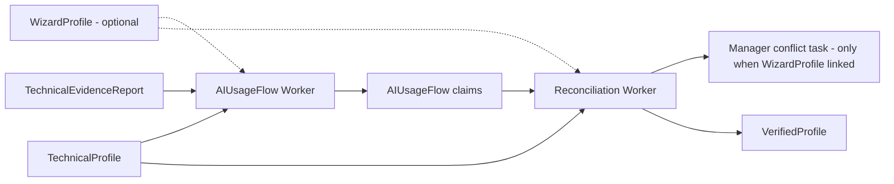

# AIUsageFlow and Reconciliation Handoff

## Target Outcome

Build the post-TechnicalProfile domain chain that creates `AIUsageFlow`, identifies uncertainty and conflict candidates, and produces `VerifiedProfile` only after reconciliation gates pass.

## Included Tasks

| Task | Purpose |
|---|---|
| MW-intel-002 | Python AIUsageFlow Worker |
| MW-intel-004 | Python Reconciliation and VerifiedProfile Worker |

## Authority Packet

| Area | Active source |
|---|---|
| Product | `docs/product/prd.md` |
| Epic/story | `docs/planning-artifacts/epics.md` Epic 4 and Epic 5 |
| Architecture | `docs/architecture/architecture.md`; `docs/architecture/multi-agent-system-architecture.md` |
| Domain spec | `docs/specs/ai-usage-flow-domain-spec.md`; `docs/specs/domain-state-machines.md`; `docs/specs/user-task-flows.md` |
| Implementation | `docs/implementation/python-worker-platform-implementation.md`; `docs/implementation/persistence-implementation.md`; `docs/implementation/queue-implementation.md`; `docs/implementation/llm-gateway-implementation.md` |
| Task briefs | `docs/implementation/tasks/modules/python-workers/intelligence/02-ai-usage-flow-worker.md`; `docs/implementation/tasks/modules/python-workers/intelligence/04-verified-profile-worker.md` |

## Execution Order

```text
TechnicalEvidenceReport + TechnicalProfile (required) + WizardProfile (optional, when linked)
-> MW-intel-002 AIUsageFlow (verificationSource: TECHNICAL_ONLY or TECHNICAL_PLUS_WIZARD)
-> MW-intel-004 Reconciliation / conflict resolution (skipped when TECHNICAL_ONLY) / VerifiedProfile
-> Legal matching handoff
```

## Architecture Context



## Boundary Rules

| Boundary | Rule |
|---|---|
| TechnicalProfile | Technical observation only. It is a required input to AIUsageFlow and reconciliation. |
| WizardProfile | Optional corroborating input. When absent, AIUsageFlow/VerifiedProfile proceed with `verificationSource: TECHNICAL_ONLY` and lower confidence on business-declaration-dependent fields, not a block. |
| AIUsageFlow | Evidence-backed business usage claims with confidence, uncertainty and conflict candidates. It does not create VerifiedProfile. |
| Reconciliation | Compares WizardProfile (when present), TechnicalProfile and AIUsageFlow, then creates conflicts or VerifiedProfile. With no linked WizardProfile there is nothing to conflict against, so VerifiedProfile is built directly from AIUsageFlow. |
| VerifiedProfile | Only post-gate source for legal matching, regardless of `verificationSource`. |

## Integration Map

| Contract | Producer | Consumer | Notes |
|---|---|---|---|
| `command.ai-usage-flow.requested.v1` | profile orchestration | AIUsageFlow Worker | requires TechnicalProfile version; WizardProfile version included when linked, otherwise flow proceeds as `TECHNICAL_ONLY` |
| `event.ai-usage-flow.completed.v1` | AIUsageFlow Worker | reconciliation orchestration | includes AIUsageFlow version |
| `command.reconciliation.requested.v1` | AIUsageFlow orchestration | Reconciliation Worker | requires immutable input versions |
| `event.reconciliation.conflict-detected.v1` | Reconciliation Worker | Manager task/status UX | blocks VerifiedProfile |
| `event.reconciliation.verified-profile-ready.v1` | Reconciliation Worker | legal matching orchestration | only after gates pass |

## Risk Register

| Risk | Impact | Mitigation |
|---|---|---|
| AIUsageFlow replaces TechnicalProfile | downstream artifact confusion | task docs and persistence contract keep separate IDs and versions |
| AIUsageFlow creates VerifiedProfile | bypasses Manager reconciliation | VerifiedProfile only in MW-intel-004 |
| provider-only evidence becomes material claim | false legal matching input | claim rules abstain without material evidence refs |
| conflict silently ignored | legal matching uses disputed facts | conflict candidates block VerifiedProfile until Manager resolution |
| stale Manager resolution | wrong version accepted | stale handoff rejection and audit |

## Exit Criteria

- AIUsageFlow claims include evidence refs, confidence and uncertainty reasons.
- Unknown/unclear material fields are preserved and visible.
- Conflict candidates are emitted for reconciliation.
- VerifiedProfile is created only after all gates and Manager conflict resolution, where applicable.
- Legal matching consumes VerifiedProfile, not raw AIUsageFlow claims directly.
