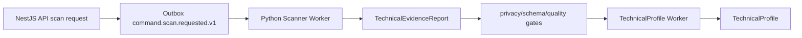

# Scanner Evidence to TechnicalProfile Handoff

## Target Outcome

Build the evidence pipeline from trusted repository scan request to accepted `TechnicalEvidenceReport` and immutable `TechnicalProfile`. This handoff ends before AIUsageFlow generation.

## Included Tasks

| Task | Purpose |
|---|---|
| MW-scan-001 | Scan request/status API |
| MW-pyp-001 | Python Worker bootstrap/queue/idempotency |
| MW-scan-py-001 | Scanner workspace/snapshot/cleanup security |
| MW-scan-py-004 | TechnicalEvidenceReport gates |
| MW-intel-001 | Python TechnicalProfile worker |

## Authority Packet

| Area | Active source |
|---|---|
| Product | `docs/product/prd.md` |
| Architecture | `docs/architecture/architecture.md`; `docs/architecture/multi-agent-system-architecture.md`; ADR-023 |
| Scanner behavior | `docs/specs/scanner-spec.md` |
| User/system flows | `docs/specs/user-task-flows.md`; `docs/specs/domain-state-machines.md`; `docs/specs/event-catalog.md` |
| Implementation | `docs/implementation/backend-implementation.md`; `docs/implementation/python-worker-platform-implementation.md`; `docs/implementation/scanner-worker-implementation.md`; `docs/implementation/queue-implementation.md`; `docs/implementation/persistence-implementation.md` |
| Task briefs | `docs/implementation/tasks/modules/scan/01-scan-job-status-endpoint.md`; `MW-pyp-001`; `MW-scan-py-001`; `MW-scan-py-004`; `MW-intel-001` |

## Execution Order

```text
MW-scan-001 Scan request/status API
-> MW-pyp-001 Python Worker bootstrap/queue/idempotency
-> MW-scan-py-001 scanner workspace/snapshot/cleanup security
-> MW-scan-py-004 TechnicalEvidenceReport gates
-> MW-intel-001 TechnicalProfile worker
```

## Architecture Context



## Artifact Boundaries

| Artifact | Meaning | Must not become |
|---|---|---|
| `RepositorySnapshot` | selected commit-pinned source snapshot | long-term raw source store |
| `TechnicalEvidenceReport` | scanner facts, findings, refs, coverage and gates | AIUsageFlow or legal result |
| `TechnicalProfile` | evidence-derived technical observation | AIUsageFlow, VerifiedProfile, risk level, compliance status |

## Integration Map

| Contract | Producer | Consumer | Notes |
|---|---|---|---|
| `command.scan.requested.v1` | Backend API outbox | Scanner Worker | idempotent per assessment + snapshot + generation |
| `event.scan.completed.v1` | Scanner Worker | status projection / profile orchestration | only after cleanup verified |
| `command.technical-profile.requested.v1` | evidence orchestration | Technical Profile Worker | accepted evidence only |
| `event.technical-profile.completed.v1` | Technical Profile Worker | downstream AIUsageFlow orchestration | immutable profile version |

## Risk Register

| Risk | Impact | Mitigation |
|---|---|---|
| API waits for scan execution | request timeout and lifecycle coupling | enqueue command and expose status projection |
| scanner stores raw source long-term | privacy/compliance breach | workspace cleanup verification before completed event |
| provider/package evidence overclaims AI use | downstream legal false positive | TechnicalProfile marks possible/coverage limits; AIUsageFlow must abstain where material evidence is missing |
| stale evidence creates new profile | broken traceability | idempotency and version checks |

## Exit Criteria

- Trusted scan request produces or resumes one scan job.
- Scanner completed event is emitted only after privacy and cleanup gates pass.
- Accepted `TechnicalEvidenceReport` is immutable and traceable.
- `TechnicalProfile` is generated from accepted evidence only.
- No AIUsageFlow or VerifiedProfile is created in this handoff.
