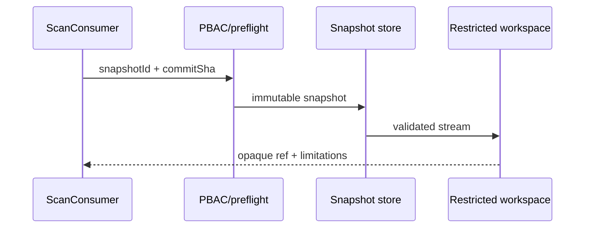

# Build tool `materialize_snapshot`

## 1. Task Information

| Item | Value |
|---|---|
| Related story / priority | AO-1 / P0 |
| Runtime | `lcsp-python-workers` scanner workspace setup |
| Exposure / mutation | `SYSTEM_ONLY` / `SYSTEM_MUTATION` (ephemeral workspace only) |
| Caller | Scan consumer after trusted scan-job dispatch |

## 2. Objective and use case

Materialize one commit-pinned repository snapshot into an isolated temporary workspace. It returns opaque references and coverage limitations only; it never exposes an archive, absolute path, or source bytes. Trigger: authorized scan job with immutable `snapshotId` and matching `commitSha`. Missing snapshot is `NEEDS_INPUT`; unsafe archive is `BLOCKED`; retrieval failure is `FAILED` and follows scan severity policy.

## 4. Tool definition

**Description:** Materialize the authorized immutable snapshot for a scan and return an opaque workspace reference plus explicit file limitations. Read owner: trusted snapshot store. Timeout: 60 s default, 120 s ceiling. Retry: `SNAPSHOT_UNAVAILABLE` twice (1 s, 4 s); archive validation, commit mismatch and size breaches never retry.

## 5. Input schema

Shared envelope: [shared-tool-contract.md](../shared-tool-contract.md). Tool input:

```json
{"type":"object","additionalProperties":false,"required":["snapshotId","commitSha"],"properties":{"snapshotId":{"type":"string","pattern":"^snapshot:[A-Za-z0-9._-]{1,128}$"},"commitSha":{"type":"string","pattern":"^[a-f0-9]{40}$"},"pathPrefixes":{"type":"array","maxItems":20,"items":{"type":"string","pattern":"^(?!/)(?!.*\\.\\.)[A-Za-z0-9._/-]{1,256}$"}}}}
```

`artifactVersions.snapshotId` must equal `input.snapshotId`; `scope` is empty; worker limits are 500 MB expanded workspace and 10 MB per file.

## 6. Output schema and examples

`result` is `{workspaceRef:string,snapshotId:string,commitSha:string,materializedFileCount:integer>=0,limitedFiles:array<=500}` where each limited item is `{relativePath,reasonCode}`. The common envelope declares provenance, coverage and evidence refs.

```json
{"status":"READY","toolName":"materialize_snapshot","toolVersion":"1.0.0","configHash":"sha256:workspace-v1","correlationId":"3d173aa4-bb5b-4bd1-a2d9-53bfb698be5f","artifactVersions":{"snapshotId":"snapshot:repo-42"},"provenanceRef":"prov:snapshot-88","coverageState":"PARTIAL","evidenceRefs":["evidence:snapshot-88"],"limitations":[{"code":"FILE_OVERSIZE","affectedScopeRef":"path:fixtures/huge.bin","reason":"file exceeds scanner ceiling","retryable":false}],"result":{"workspaceRef":"workspace:ephemeral-88","snapshotId":"snapshot:repo-42","commitSha":"0123456789abcdef0123456789abcdef01234567","materializedFileCount":241,"limitedFiles":[{"relativePath":"fixtures/huge.bin","reasonCode":"FILE_OVERSIZE"}]}}
```

## 7. Outcomes, execution and flow

| Condition | Status | Caller action |
|---|---|---|
| Job/snapshot/commit mismatch | `BLOCKED` | terminal audit; do not scan |
| Missing snapshot | `NEEDS_INPUT` | resolver supplies trusted snapshot ref |
| unsafe path/link/device/bomb | `BLOCKED` | quarantine and stop |
| storage transient | `FAILED` | bounded retry then terminal policy |



Pseudocode: validate shared/schema and job binding; stream archive under restricted root; reject traversal, symlinks/devices and decompression overflow; classify oversized files as limitations; hash manifest; `finally` register cleanup; serialize safe refs only. Build/reuse `scanner/workspace.py` and invoke from `scanner/scan_consumer.py`.

## 11–15. LLM, registry, audit, security

`exposed_to_model:false`; only the scan consumer calls it because source retrieval is unsafe to delegate. Registry: name/version `materialize_snapshot/1.0.0`, action `SCAN_EXECUTE`, allowed state `SCAN_RUNNING`, required `snapshotId`, timeout/retry above, no persistent idempotency key. Audit `requestId,scanJobId,assessmentId,actor,commitSha,snapshotId,workspaceRef hash,status,duration,limitation refs`; never log archive name, token, absolute path, bytes or source. PBAC verifies tenant/job ownership before storage access; workspace has no network or host mounts; cleanup is mandatory.

## 16–19. Scenario, AC and tests

Scenario: a scan for `snapshot:repo-42` calls the schema above; consumer receives `workspace:ephemeral-88`, runs classifiers, and LLM receives only downstream evidence—not this result. Given a 501 MB expanded archive, when extracted, then result is `BLOCKED`, no scanner executes, and audit has no archive details.

- Given a valid pinned snapshot, when called, then manifest/commit binding and opaque result are deterministic.
- Given every skipped/oversize file, then it has a relative-path limitation; no silent omission occurs.
- Given invalid/extra input, cross-tenant job or unsafe archive, then no handler/source bytes reach a model.
- Tests: unit archive traversal/link/bomb/size and cleanup; contract strict schema; integration job/commit/PBAC; privacy callback/log inspection; worker retry test.

## 20–22. Files, questions, deliverables

Change `scanner/workspace.py`, `scanner/scan_consumer.py`, workspace contracts and tests; authority: scanner task `01-scanner-workspace-setup.md`, `scanner-spec.md`. **OQ-01:** confirm source-store checksum algorithm (Tech Lead, open, does not block packet). Deliver handler, normalizer, registry declaration, audit and tests.
