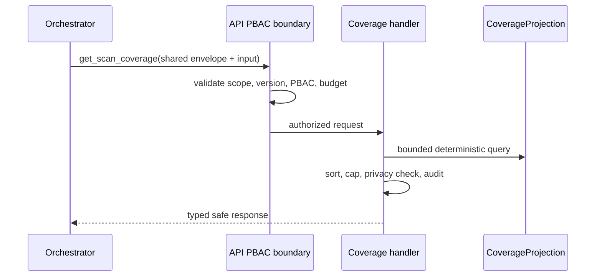

# TASK-AO-2-01 — `get_scan_coverage`

## 1. Task Information

| Item | Value |
|---|---|
| Task name | Build `get_scan_coverage` for LCSP Tool Calling |
| Module / story | Agentic Evidence / AO-2 |
| Priority | P0 |
| Runtime | Worker-owned query handler; API PBAC/audit/persistence boundary |
| Tool exposure | `LLM_CALLABLE` through AO-3 allow-list only |
| Mutation class | `READ` |
| Related data | Accepted, immutable `TechnicalEvidenceReport` coverage projection |

## 2. Objective

Return a bounded, version-pinned view of analyzed, skipped, and limited files plus tool outcomes. The LLM uses it to decide whether a later evidence claim is in sufficient scope; it cannot inspect source or interpret an empty list as complete coverage without `coverageState`.

## 3. Use Cases

**UC-01:** AO-3 receives a technical-evidence requirement, invokes this tool with an accepted report version, then either calls a bounded evidence tool when coverage is sufficient or returns `OUT_OF_COVERAGE`/a typed resolver requirement. Missing report/version returns `NEEDS_INPUT`; PBAC/state failure is `BLOCKED`; an empty exhaustive result is a valid `READY` response.

## 4. Tool Definition

| Field | Value |
|---|---|
| Description | Return bounded file and tool coverage for one accepted TechnicalEvidenceReport; use before making a scoped evidence claim. |
| Available when | Accepted report pinned; workflow permits `EVIDENCE_READ`; PBAC action `TECHNICAL_EVIDENCE_READ` passes. |
| Do not use when | Finding detail, symbol context, graph traversal, or a reanalysis mutation is required. |
| Data owner | Versioned `CoverageProjection` materialized from report coverage and tool execution metadata. |
| Side effect | None; one safe tool-invocation audit event. |
| Timeout / retry | 2 seconds query timeout; no retry for validation/PBAC/not-found; one bounded retry for transient projection-store outage. |

## 5. Input Schema

Shared envelope is mandatory per [shared contract](../shared-tool-contract.md). Tool-specific `input`:

| Parameter | Type | Required | Validation | Example |
|---|---|---:|---|---|
| `pathPrefixes` | string[] | no | 1–20 normalized relative prefixes; no `..`, absolute paths or globs | `["apps/api/"]` |
| `languages` | string[] | no | `PYTHON`, `TYPESCRIPT`, `JAVASCRIPT`, `OTHER` only | `["TYPESCRIPT"]` |
| `dispositions` | string[] | no | `ANALYZED`, `SKIPPED`, `LIMITED` only | `["LIMITED"]` |
| `toolNames` | string[] | no | registered baseline tool names only | `["run_ts_js_semantic_analysis"]` |
| `cursor` | string | no | opaque server-issued cursor, max 512 chars | `"eyJwYXRoIjoiLi4uIn0"` |
| `maxResults` | integer | yes | 1–100; server can lower it | `50` |

```json
{
  "type": "object",
  "additionalProperties": false,
  "properties": {
    "pathPrefixes": {"type":"array","items":{"type":"string","pattern":"^(?!/|.*\\.\\.)[A-Za-z0-9._/-]+/$"},"minItems":1,"maxItems":20,"uniqueItems":true},
    "languages": {"type":"array","items":{"enum":["PYTHON","TYPESCRIPT","JAVASCRIPT","OTHER"]},"maxItems":4,"uniqueItems":true},
    "dispositions": {"type":"array","items":{"enum":["ANALYZED","SKIPPED","LIMITED"]},"maxItems":3,"uniqueItems":true},
    "toolNames": {"type":"array","items":{"enum":["materialize_snapshot","classify_workspace_languages","run_syft_inventory","run_semgrep_rules","run_knip_usage_analysis","run_deptry_usage_analysis","run_python_semantic_analysis","run_ts_js_semantic_analysis","run_structural_augmentation","build_evidence_graph","validate_evidence_report"]},"maxItems":11,"uniqueItems":true},
    "cursor": {"type":"string","maxLength":512},
    "maxResults": {"type":"integer","minimum":1,"maximum":100}
  },
  "required":["maxResults"]
}
```

## 6. Output Schema

`result` is `{files,toolOutcomes,unresolvedDynamicBoundaries,counts,nextCursor,truncated}`. File objects contain only `relativePath`, `language`, `supportLevel`, `disposition`, and `limitationRefs`; no source/content/error text.

```json
{
  "status":"READY",
  "toolName":"get_scan_coverage",
  "toolVersion":"1.0.0",
  "configHash":"sha256:coverage-projection-v1",
  "correlationId":"15af9bbd-5b5a-402e-9c79-2c17e09f4e38",
  "artifactVersions":{"technicalEvidenceReportId":"ter_01J..."},
  "provenanceRef":"tool-execution:coverage_01J...",
  "coverageState":"PARTIAL",
  "evidenceRefs":["coverage:file:apps/api/src/modules/scan/scan.service.ts"],
  "limitations":[{"code":"SCAN_COVERAGE_LIMITATION","affectedScopeRef":"coverage:file:apps/api/src/generated/client.ts","reason":"GENERATED_FILE","retryable":false}],
  "result":{"files":[{"relativePath":"apps/api/src/modules/scan/scan.service.ts","language":"TYPESCRIPT","supportLevel":"FULL","disposition":"ANALYZED","limitationRefs":[]}],"toolOutcomes":[{"toolName":"run_ts_js_semantic_analysis","status":"READY","coverageState":"SUFFICIENT"}],"unresolvedDynamicBoundaries":[],"counts":{"analyzed":1,"skipped":0,"limited":1},"nextCursor":null,"truncated":false}
}
```

## 7. Error Codes and Typed Outcomes

| Code / status | Behavior | Caller action |
|---|---|---|
| `INVALID_ARGUMENT` | Reject extra, malformed, absolute or unbounded selector before handler. | Correct typed argument only. |
| `NEEDS_INPUT` | Missing/unaccepted report version. | AO-3 asks permitted resolver. |
| `NOT_FOUND` + `READY` | Valid exhaustive query has no matching files. | Do not treat as coverage limitation. |
| `OUT_OF_COVERAGE` | Requested scope was skipped/limited or no coverage projection exists for it. | Preserve limitation; optional reanalysis resolver. |
| `BLOCKED` | PBAC, organization, state, or immutable-version check fails. | Never retry. |
| `FAILED` / `TOOL_TIMEOUT` | Projection query failure. | One transient retry, then audit/terminal policy. |

## 8. Tool Calling Flow



## 9–15. Rules, Logic, LLM, Registry, Audit, Retry, Security

Use the shared contract. Handler stages are: strict parse → registry allow-list → report acceptance/version/tenant/PBAC check → normalized prefix/filter query → path/id sort → cap/cursor → derive `coverageState`/limitations → deep privacy validation → audit/output hash → response. Registry entry uses handler `CoverageQueryTool`, required artifact `technicalEvidenceReportId`, caller `LLM_CALLABLE`, action `TECHNICAL_EVIDENCE_READ`, timeout `2000ms`, retry `1` transient attempt, and mutation `NONE`. LLM receives only the response envelope and may next call registered read tools or emit `OUT_OF_COVERAGE`; it cannot request source/repository access.

## 16. Scenario

For “verify AI use in `apps/api`”, the orchestrator calls with `pathPrefixes:["apps/api/"]`. A `PARTIAL` result with a generated-file limitation means the model may describe analyzed evidence only and must carry the limitation; it may not state “no AI use exists” for the whole prefix.

## 17. Acceptance Criteria

1. Valid pinned request returns deterministically sorted safe coverage projection.
2. Extra/invalid scope is rejected before query.
3. Empty exhaustive and limited scope return distinct typed outcomes.
4. PBAC/version/tenant denial fails closed and audits safely.
5. Result never exposes source, prompt, secret, AST, absolute path, or stack trace.

## 18. Test Matrix

| ID | Scenario | Evidence |
|---|---|---|
| TC-01 | Valid page and stable cursor | Contract result/order |
| TC-02 | Extra/absolute/`..` argument | No handler dispatch |
| TC-03 | Accepted vs stale/cross-tenant report | PBAC/version integration test |
| TC-04 | Exhaustive empty vs limited file | Distinct result/status/limitations |
| TC-05 | Nested forbidden value | Privacy gate blocks payload |
| TC-06 | Projection timeout/retry | One retry then safe audit outcome |

## 19–22. DoD, Files, Open Questions, Deliverables

Implement contracts under `packages/contracts/src/agentic-evidence`, safe projection/handler under `deepagents/tools/common/agentic_evidence`, and API PBAC/audit gateway under `apps/api/src/modules/evidence`. Open decision OQ-01: ratify `maxResults=100` and 2-second timeout with Tech Lead before `READY_FOR_SPRINT`. Deliver registry entry, schemas, handler, projection, audit, and unit/contract/integration/privacy tests.

## Source Authority

- `docs/specs/spec-agentic-evidence-orchestration/tool-catalog.md`
- `docs/specs/spec-agentic-evidence-orchestration/SPEC.md`
- `docs/implementation-artifacts/ao-2-register-read-only-evidence-query-tools.md`
- `docs/implementation/tasks/modules/agentic-evidence-tools/shared-tool-contract.md`
