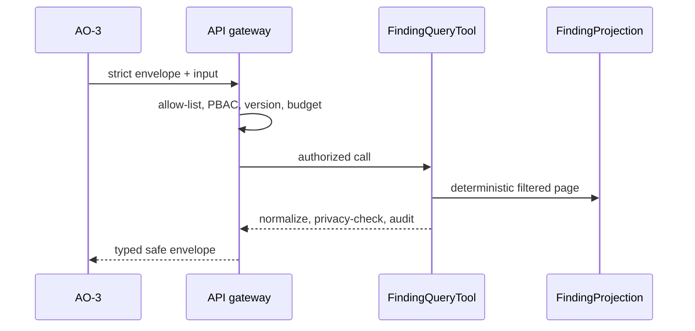

# TASK-AO-2-02 — `search_evidence`

## 1. Task Information

| Item | Value |
|---|---|
| Story / priority | AO-2 / P0 |
| Runtime | Worker-owned `FindingProjection` query behind API PBAC/audit boundary |
| Exposure / mutation | `LLM_CALLABLE` via AO-3 allow-list / `READ` |

## 2–4. Objective, Use Case, Definition

Return deterministic, bounded summaries of normalized findings in one accepted TechnicalEvidenceReport. AO-3 uses it to discover evidence references, never raw source or arbitrary text search. It is available only with `TECHNICAL_EVIDENCE_READ`, accepted report version and scope budget; use `get_finding_detail` after a finding is selected. Side effect is a safe audit event. Timeout is 2s; retry once only for projection-store `TRANSIENT_FAILURE`.

## 5. Input Schema

| Parameter | Type / bounds | Required | Meaning |
|---|---|---:|---|
| `findingKinds` | 1–10 registered kind enums | no | normalized finding filter |
| `providers` | 1–10 registered provider IDs | no | observed provider filter |
| `pathPrefixes` | 1–20 relative prefixes | no | artifact-scoped location filter |
| `minConfidence` | `LOW`/`MEDIUM`/`HIGH` | no | minimum normalized confidence |
| `cursor`, `maxResults` | opaque ≤512 / 1–100 | yes max | stable page |

Shared envelope is mandatory; this strict schema is `input` only.

```json
{"type":"object","additionalProperties":false,"properties":{"findingKinds":{"type":"array","items":{"enum":["AI_PROVIDER_INVOCATION","DATA_PATH","DECISION_PATH","HUMAN_REVIEW_PATH","DEPLOYMENT_CONTEXT","DEPENDENCY_SIGNAL"]},"minItems":1,"maxItems":10,"uniqueItems":true},"providers":{"type":"array","items":{"enum":["OPENAI","GOOGLE","ANTHROPIC","AZURE_OPENAI","OTHER"]},"minItems":1,"maxItems":10,"uniqueItems":true},"pathPrefixes":{"type":"array","items":{"type":"string","pattern":"^(?!/|.*\\.\\.)[A-Za-z0-9._/-]+/$"},"minItems":1,"maxItems":20,"uniqueItems":true},"minConfidence":{"enum":["LOW","MEDIUM","HIGH"]},"cursor":{"type":"string","maxLength":512},"maxResults":{"type":"integer","minimum":1,"maximum":100}},"required":["maxResults"]}
```

## 6. Output Schema and Examples

`result={findings:[{findingRef,kind,relativeLocation,provider?,confidence,evidenceRefs,limitationRefs}],searchedScope:{artifactVersion,filters,exhaustive},nextCursor,truncated}`. Sort `(relativePath,line,findingRef)`; cap at `maxResults`; only relative locations and typed categories.

```json
{"status":"READY","toolName":"search_evidence","toolVersion":"1.0.0","configHash":"sha256:finding-projection-v1","correlationId":"15af9bbd-5b5a-402e-9c79-2c17e09f4e38","artifactVersions":{"technicalEvidenceReportId":"ter_01J"},"provenanceRef":"tool-execution:find_01J","coverageState":"SUFFICIENT","evidenceRefs":["finding:fn_01J"],"limitations":[],"result":{"findings":[{"findingRef":"finding:fn_01J","kind":"AI_PROVIDER_INVOCATION","relativeLocation":"apps/api/src/ai/client.ts:42","provider":"OPENAI","confidence":"HIGH","evidenceRefs":["evidence:ev_01J"],"limitationRefs":[]}],"searchedScope":{"artifactVersion":"ter_01J","filters":{"providers":["OPENAI"]},"exhaustive":true},"nextCursor":null,"truncated":false}}
```

Exhaustive empty is `READY` with `findings:[]` and `exhaustive:true`; a limited scan returns `OUT_OF_COVERAGE` plus limitation refs—not an absence claim.

## 7. Errors and Typed Outcomes

| Code/status | Handling | Caller action |
|---|---|---|
| `INVALID_ARGUMENT` | invalid enum, path, cursor, cap; no dispatch | correct typed filter |
| `NEEDS_INPUT` | report version absent/unaccepted | AO-3 resolver only |
| `NOT_FOUND` + `READY` | exhaustive empty | preserve as no matching finding |
| `OUT_OF_COVERAGE` | selected scope is limited | preserve uncertainty |
| `BLOCKED` | PBAC/tenant/version/state denial | never retry |
| `TOOL_TIMEOUT`/`FAILED` | one transient retry then terminal policy | audit/checkpoint |

## 8–15. Flow, Rules, Logic, LLM, Registry, Audit, Retry, Security



Stages: validate → registry allow-list → report/tenant/PBAC/state check → normalized filter query → stable sort/cursor/cap → derive coverage → redact/deep-validate → persist invocation audit/output hash. Registry: `FindingQueryTool`, action `TECHNICAL_EVIDENCE_READ`, accepted `technicalEvidenceReportId`, `LLM_CALLABLE`, `2000ms`, one retry, `NONE`. Model context is the response fields above, max 100 summaries; it may call detail/flow tools with returned refs and must not infer invocation from `DEPENDENCY_SIGNAL`. Audit: request/workflow/assessment/org/actor IDs, safe argument hash, artifact/version, status/duration/budget, refs/output hash/correlation; never raw arguments, source, prompts, secrets, AST or stack traces. LLM never accesses DB/object store.

## 16. Scenario

For a claim “OpenAI is invoked in API”, AO-3 searches provider `OPENAI`; only an `AI_PROVIDER_INVOCATION` finding supports the claim. An empty dependency-only search supports neither presence nor absence outside sufficient scope.

## 17. Acceptance Criteria

1. Given a pinned accepted report, when valid filters are supplied, then result ordering/cursor are deterministic.
2. Given extra/free-text/absolute selectors, when called, then validation rejects before handler dispatch.
3. Given exhaustive empty versus limited scope, then returned states are distinguishable.
4. Given stale/cross-tenant/PBAC-denied artifact, then it fails closed and audits safely.
5. Given nested source/prompt/secret/AST fields, then privacy validation prevents output.

## 18. Test Matrix

| ID | Scenario | Level |
|---|---|---|
| TC-01 | provider/kind page and cursor tie order | contract + integration |
| TC-02 | invalid/extra/free-text argument | contract, no dispatch |
| TC-03 | stale and cross-tenant report | PBAC integration |
| TC-04 | exhaustive empty vs limited scope | integration |
| TC-05 | dependency-only false positive | golden fixture |
| TC-06 | nested forbidden payload and timeout | privacy + worker |

## 19–22. DoD, Files, Questions, Deliverables

Add strict contracts/registry under `packages/contracts/src/agentic-evidence`; `FindingProjection`, handler and normalizer under `deepagents/tools/common/agentic_evidence`; PBAC/audit gateway and tests under `apps/api/src/modules/evidence`. OQ-01: Tech Lead must ratify the 100-item/2s ceiling before `READY_FOR_SPRINT` (blocks: yes). Deliver schema, definition, projection query, mapper, audit and unit/contract/integration/privacy tests.

## Source Authority

- `docs/specs/spec-agentic-evidence-orchestration/tool-catalog.md`
- `docs/implementation-artifacts/ao-2-register-read-only-evidence-query-tools.md`
- `docs/implementation/tasks/modules/agentic-evidence-tools/shared-tool-contract.md`
