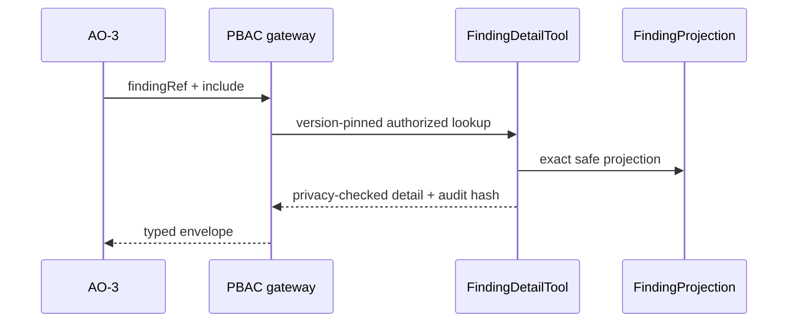

# TASK-AO-2-03 — `get_finding_detail`

## 1. Task Information

| Item | Value |
|---|---|
| Story / priority | AO-2 / P0 |
| Runtime | Worker-owned `FindingProjection` detail handler via API boundary |
| Exposure / mutation | `LLM_CALLABLE` / `READ` |

## 2–4. Objective, Use Case, Definition

Resolve one selected normalized finding from the exact accepted report version. AO-3 calls it after `search_evidence`; it returns safe metadata and refs, never the original rule payload/source/AST. Requires `TECHNICAL_EVIDENCE_READ`, matching tenant/assessment and scope. Side effect: audit only. Timeout 1s; one retry only for transient projection failure.

## 5. Input Schema

| Parameter | Type / validation | Required |
|---|---|---:|
| `findingRef` | `finding:` opaque ID, 8–128 chars | yes |
| `include` | unique allow-list `LOCATION`,`CATEGORIES`,`CONFIDENCE`,`PROVENANCE`,`LIMITATIONS`,`RELATED_REFS`; 1–6 | yes |

```json
{"type":"object","additionalProperties":false,"properties":{"findingRef":{"type":"string","pattern":"^finding:[A-Za-z0-9_-]{8,120}$"},"include":{"type":"array","items":{"enum":["LOCATION","CATEGORIES","CONFIDENCE","PROVENANCE","LIMITATIONS","RELATED_REFS"]},"minItems":1,"maxItems":6,"uniqueItems":true}},"required":["findingRef","include"]}
```

## 6. Output Schema and Examples

`result={finding:{findingRef,kind,relativeLocation?,categories?,confidence?,provenance?,limitations?,relatedRefs?}}`; absent requested safe field is omitted.

```json
{"status":"READY","toolName":"get_finding_detail","toolVersion":"1.0.0","configHash":"sha256:finding-detail-v1","correlationId":"aa11bb22-3333-4444-8555-666677778888","artifactVersions":{"technicalEvidenceReportId":"ter_01J"},"provenanceRef":"tool-execution:detail_01J","coverageState":"SUFFICIENT","evidenceRefs":["finding:fn_01J","evidence:ev_01J"],"limitations":[],"result":{"finding":{"findingRef":"finding:fn_01J","kind":"AI_PROVIDER_INVOCATION","relativeLocation":"apps/api/src/ai/client.ts:42","categories":["PROVIDER_CALL"],"confidence":"HIGH","provenance":{"tool":"run_semgrep_rules","ruleVersion":"2026-08-01"},"relatedRefs":["symbol:sym_01J"]}}}
```

Unknown scoped finding is `NOT_FOUND` with `result:{finding:null}`; limited artifact state is `OUT_OF_COVERAGE`, never a leaking lookup failure.

## 7. Errors and Typed Outcomes

`INVALID_ARGUMENT` rejects malformed/extra fields; `NEEDS_INPUT` requires accepted report version; `NOT_FOUND` is safe for absent or out-of-scope ref; `OUT_OF_COVERAGE` preserves scanner limitation; `BLOCKED` handles PBAC/tenant/state/version denial; `TOOL_TIMEOUT`/`FAILED` retry once only when transient.

## 8–15. Flow, Rules, Logic, LLM, Registry, Audit, Retry, Security



Validate → registry → exact artifact/tenant/PBAC check → ID lookup → allow-listed field projection → privacy gate → audit. Registry: `FindingDetailTool`, `LLM_CALLABLE`, `TECHNICAL_EVIDENCE_READ`, report required, 1s/one transient retry/`NONE`. The model gets max one finding and safe fields only; may call symbol/flow tools using refs, cannot ask for body, rule message, source or stack trace. Audit shared fields plus finding ref hash; never persist include data beyond safe hash. Deep deny-list enforces no raw source/prompt/secret/full AST/absolute path. 

## 16. Scenario

After search returns `finding:fn_01J`, the model asks for location, confidence and provenance to cite it; an unknown guessed ID produces indistinguishable safe `NOT_FOUND`.

## 17. Acceptance Criteria

Given a permitted exact ref it returns only requested safe fields; invalid/extra fields do not dispatch; stale/cross-tenant refs fail closed; unknown and limited states differ; audit/provenance are present; forbidden nested content never reaches LLM.

## 18. Test Matrix

| ID | Scenario | Level |
|---|---|---|
| TC-01 | requested field projection | unit + contract |
| TC-02 | guessed/malformed/extra ID | contract |
| TC-03 | stale/cross-tenant/PBAC deny | integration |
| TC-04 | unknown vs scanner limit | integration |
| TC-05 | full AST/source/secret nested value | privacy |
| TC-06 | transient timeout and audit | worker |

## 19–22. DoD, Files, Questions, Deliverables

Build contracts/registry, immutable projection repository/handler/normalizer, API PBAC/audit and listed tests in the same modules as AO-2-02. OQ-01: ratify whether normalized rule identifier is safe as `RELATED_REFS` (Security, OPEN, blocks yes). Deliver strict definition/schema, mapping, audit and tests.

## Source Authority

- `docs/specs/spec-agentic-evidence-orchestration/tool-catalog.md`
- `docs/implementation/tasks/modules/agentic-evidence-tools/shared-tool-contract.md`
