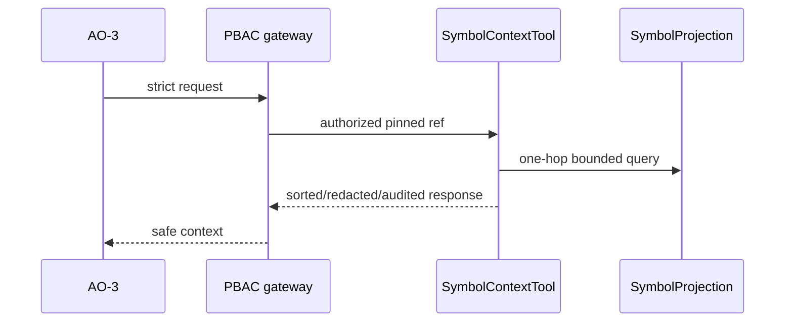

# TASK-AO-2-04 — `get_symbol_context`

## 1–4. Task Information, Objective, Use Case, Definition

| Item | Value |
|---|---|
| Story / exposure / mutation | AO-2 / `LLM_CALLABLE` / `READ` |
| Runtime / data owner | Worker `SymbolProjection` plus one-hop sanitized graph adjacency |
| PBAC / preconditions | `TECHNICAL_EVIDENCE_READ`; accepted report, tenant/assessment and budget pin |
| Purpose | Return bounded symbol categories and selected callers/callees/import/decorator facts, never function body or AST. |
| Side effect / policy | Safe audit only; 2s timeout, one retry for transient projection outage. |

UC-01: AO-3 resolves a `symbol:` ref returned by a finding, then selects a registered flow tool; absent version is `NEEDS_INPUT`, unresolved symbol is safe `NOT_FOUND`, cap/dynamic boundary is `OUT_OF_COVERAGE`.

## 5. Input Schema

| Parameter | Bounds | Required |
|---|---|---:|
| `symbolRef` | `symbol:` opaque ref | yes |
| `include` | `IMPORTS`,`DECORATORS`,`CATEGORIES`,`CALLERS`,`CALLEES`,`EVIDENCE_REFS`; 1–6 | yes |
| `maxNeighbors` | 1–50 | yes |

```json
{"type":"object","additionalProperties":false,"properties":{"symbolRef":{"type":"string","pattern":"^symbol:[A-Za-z0-9_-]{8,120}$"},"include":{"type":"array","items":{"enum":["IMPORTS","DECORATORS","CATEGORIES","CALLERS","CALLEES","EVIDENCE_REFS"]},"minItems":1,"maxItems":6,"uniqueItems":true},"maxNeighbors":{"type":"integer","minimum":1,"maximum":50}},"required":["symbolRef","include","maxNeighbors"]}
```

## 6. Output Schema and Examples

`result={symbol:{symbolRef,kind,relativeLocation,categories,imports?,decorators?,callers?,callees?,evidenceRefs},truncated}`; neighbors sort by ref, no arguments/body/content.

```json
{"status":"READY","toolName":"get_symbol_context","toolVersion":"1.0.0","configHash":"sha256:symbol-v1","correlationId":"bb11bb22-3333-4444-8555-666677778888","artifactVersions":{"technicalEvidenceReportId":"ter_01J"},"provenanceRef":"tool-execution:sym_01J","coverageState":"SUFFICIENT","evidenceRefs":["symbol:sym_01J"],"limitations":[],"result":{"symbol":{"symbolRef":"symbol:sym_01J","kind":"FUNCTION","relativeLocation":"apps/api/src/ai/client.ts:42","categories":["PROVIDER_ADAPTER"],"callees":["symbol:sym_02J"],"evidenceRefs":["evidence:ev_01J"]},"truncated":false}}
```

## 7. Errors and Typed Outcomes

Malformed/extra/capped input=`INVALID_ARGUMENT`; missing accepted report=`NEEDS_INPUT`; unknown ref=`NOT_FOUND`; limited/unresolved adjacency=`OUT_OF_COVERAGE`; PBAC/version/tenant denial=`BLOCKED`; projection timeout=`FAILED` after one transient retry.

## 8–15. Flow, Rules, Logic, LLM, Registry, Audit, Retry, Security



Validate → allow-list → PBAC/version → exact symbol + one-hop query → deterministic cap → coverage/limitation → deep privacy validation → audit. Registry: `SymbolContextTool`, action `TECHNICAL_EVIDENCE_READ`, `LLM_CALLABLE`, report required, `2000ms`, one transient retry, `NONE`. LLM sees max 50 refs/categories, may use returned refs only for query tools, and must not claim runtime behavior. Audit shared contract fields + safe arg/output hashes; no source, prompts, secrets, AST, decorator arguments, absolute paths or stack traces; no direct storage access.

## 16. Scenario

A provider invocation finding yields `symbol:sym_01J`; caller context shows one adapter callee. If 50 neighbors are reached, model must carry the returned limitation rather than assert a complete call graph.

## 17–18. Acceptance Criteria and Tests

Given valid pinned input return stable safe adjacency; invalid/extra input dispatches nowhere; unknown versus limited stays distinct; PBAC fails closed; privacy gate blocks forbidden nested content.

| ID | Scenario | Level |
|---|---|---|
| TC-01 | ref/order/max-neighbor boundary | unit/contract |
| TC-02 | aliases/unresolved and extra input | contract |
| TC-03 | tenant/version/PBAC | integration |
| TC-04 | cap and dynamic adjacency | integration |
| TC-05 | body/AST/decorator-argument leak | privacy |
| TC-06 | timeout/audit retry | worker |

## 19–22. DoD, Files, Questions, Deliverables

Implement contracts/registry, `SymbolProjection` repository/handler/normalizer, API PBAC/audit and tests under the AO-2 module seams. OQ-01: Architecture must ratify one-hop-only versus bounded two-hop context (OPEN, blocks yes). Deliver definition, schema, mapper, audit and tests.

## Source Authority

- `docs/specs/spec-agentic-evidence-orchestration/tool-catalog.md`
- `docs/implementation/tasks/modules/agentic-evidence-tools/shared-tool-contract.md`
