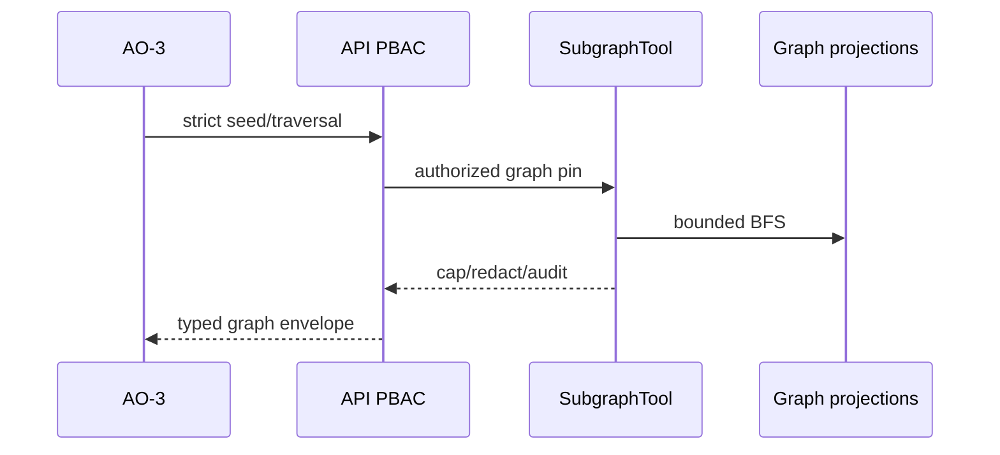

# TASK-AO-2-05 — `get_evidence_subgraph`

## 1–4. Task Information, Objective, Use Case, Definition

| Item | Value |
|---|---|
| Story / exposure / mutation | AO-2 / `LLM_CALLABLE` / `READ` |
| Runtime / data owner | Worker versioned `GraphNodeProjection` and `GraphEdgeProjection` |
| Gate | `TECHNICAL_EVIDENCE_READ`, exact accepted evidence graph/report and scope budget |
| Purpose | Traverse an explicitly seeded, bounded sanitized evidence graph; never hydrate node payload/source. |
| Policy | Audit only; 3s timeout; one retry only for transient store failure. |

UC-01: AO-3 receives a graph seed from evidence, traverses it to locate related facts, and reports `truncated`/limitations instead of assuming the graph is exhaustive.

## 5. Input Schema

| Parameter | Bounds | Required |
|---|---|---:|
| `seedRef` | `node:` opaque graph ref | yes |
| `direction` | `INBOUND`,`OUTBOUND`,`BOTH` | yes |
| `maxDepth`,`maxNodes`,`maxEdges` | 1–3 / 1–100 / 1–200 | yes |
| `nodeTypes`,`edgeTypes` | allow-listed types; max 10 each | no |

```json
{"type":"object","additionalProperties":false,"properties":{"seedRef":{"type":"string","pattern":"^node:[A-Za-z0-9_-]{8,120}$"},"direction":{"enum":["INBOUND","OUTBOUND","BOTH"]},"maxDepth":{"type":"integer","minimum":1,"maximum":3},"maxNodes":{"type":"integer","minimum":1,"maximum":100},"maxEdges":{"type":"integer","minimum":1,"maximum":200},"nodeTypes":{"type":"array","items":{"enum":["FINDING","SYMBOL","FLOW_SEGMENT","COVERAGE","ARTIFACT"]},"maxItems":5,"uniqueItems":true},"edgeTypes":{"type":"array","items":{"enum":["EVIDENCES","CALLS","FLOWS_TO","LIMITS","DERIVED_FROM"]},"maxItems":5,"uniqueItems":true}},"required":["seedRef","direction","maxDepth","maxNodes","maxEdges"]}
```

## 6. Output Schema and Examples

`result={nodes:[{nodeRef,type,label,relativeLocation?,evidenceRefs}],edges:[{edgeRef,type,fromRef,toRef,evidenceRefs}],traversal:{visitedDepth},truncated}`. BFS visited set, then ref sort.

```json
{"status":"READY","toolName":"get_evidence_subgraph","toolVersion":"1.0.0","configHash":"sha256:graph-v1","correlationId":"cc11bb22-3333-4444-8555-666677778888","artifactVersions":{"evidenceGraphId":"eg_01J"},"provenanceRef":"tool-execution:graph_01J","coverageState":"SUFFICIENT","evidenceRefs":["node:n_01J"],"limitations":[],"result":{"nodes":[{"nodeRef":"node:n_01J","type":"FINDING","label":"AI_PROVIDER_INVOCATION","relativeLocation":"apps/api/src/ai/client.ts:42","evidenceRefs":["evidence:ev_01J"]}],"edges":[],"traversal":{"visitedDepth":0},"truncated":false}}
```

## 7. Errors and Typed Outcomes

Invalid seed/filter/cap=`INVALID_ARGUMENT`; missing graph=`NEEDS_INPUT`; unknown seed=`NOT_FOUND`; cap, dynamic edge or limited graph=`OUT_OF_COVERAGE`; PBAC/graph-version denial=`BLOCKED`; timeout=`FAILED` after one retry.

## 8–15. Flow, Rules, Logic, LLM, Registry, Audit, Retry, Security



Validate → allow-list → graph artifact/tenant/PBAC → deterministic BFS (never exceed cap) → stable normalize → limitation state → privacy scan → audit. Registry `EvidenceSubgraphTool`, `LLM_CALLABLE`, action `TECHNICAL_EVIDENCE_READ`, graph ref required, 3s/one retry/`NONE`. Model receives ≤100 nodes/200 edges and may call only returned refs; it cannot infer unreturned reachability. Audit all shared identifiers/hashes/duration/budget/refs; reject raw payload, source, prompt, secret, AST and absolute paths. 

## 16. Scenario

To corroborate a finding, model traverses outbound depth 2. A cycle is emitted once; node-cap hit returns `OUT_OF_COVERAGE` and it must preserve that limitation.

## 17–18. Acceptance Criteria and Tests

Given a permitted graph, traversal is deterministic/cycle-safe and capped; schema/PBAC/version failures stop pre-query; empty unknown seed and cap limitation differ; output is audited and private.

| ID | Scenario | Level |
|---|---|---|
| TC-01 | BFS ref order/cycle | unit |
| TC-02 | every depth/node/edge cap | contract/integration |
| TC-03 | cross-artifact/tenant/PBAC seed | integration |
| TC-04 | invalid extra/filter input | contract |
| TC-05 | nested graph raw payload leak | privacy |
| TC-06 | timeout/retry/audit | worker |

## 19–22. DoD, Files, Questions, Deliverables

Build graph contracts, `EvidenceSubgraphTool`, projection repository, normalizer, gateway/audit and listed tests. OQ-01: ratify default graph caps/concurrency (Architecture, OPEN, blocks yes). Deliver registry, schema, handler, privacy gate, audit and tests.

## Source Authority

- `docs/specs/spec-agentic-evidence-orchestration/tool-catalog.md`
- `docs/implementation/tasks/modules/agentic-evidence-tools/shared-tool-contract.md`
