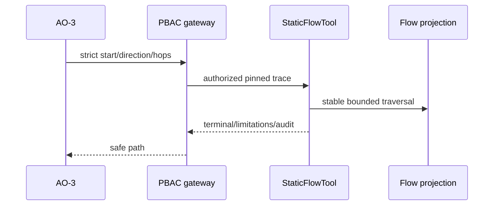

# TASK-AO-2-06 — `trace_static_flow`

## 1–4. Task Information, Objective, Use Case, Definition

| Item | Value |
|---|---|
| Story / exposure / mutation | AO-2 / `LLM_CALLABLE` / `READ` |
| Data owner | Immutable sanitized `FlowSegmentProjection` L1–L3 only |
| Gate / policy | `TECHNICAL_EVIDENCE_READ`, accepted report; audit only, 3s timeout, one transient retry |
| Purpose | Trace a bounded normalized static path and explicitly stop at dynamic/unresolved boundaries. |

AO-3 calls from a symbol/finding ref to determine structural ingress→invocation→output/action facts; it must not treat a static trace as runtime proof.

## 5. Input Schema

```json
{"type":"object","additionalProperties":false,"properties":{"startRef":{"type":"string","pattern":"^(symbol|finding|node):[A-Za-z0-9_-]{8,120}$"},"direction":{"enum":["FORWARD","BACKWARD"]},"desiredStages":{"type":"array","items":{"enum":["INGRESS","TRANSFORM","PROVIDER_INVOCATION","OUTPUT","ACTION","REVIEW"]},"minItems":1,"maxItems":6,"uniqueItems":true},"maxHops":{"type":"integer","minimum":1,"maximum":20}},"required":["startRef","direction","maxHops"]}
```

`startRef` is required; `desiredStages` narrows, never expands, traversal. Shared envelope pins report/version/scope/budget.

## 6. Output Schema and Examples

`result={segments:[{segmentRef,stage,fromRef,toRef,relativeLocation,evidenceRefs}],terminal:{state,reason,ref?},truncated}`; segment order is path order then ref.

```json
{"status":"READY","toolName":"trace_static_flow","toolVersion":"1.0.0","configHash":"sha256:flow-v1","correlationId":"dd11bb22-3333-4444-8555-666677778888","artifactVersions":{"technicalEvidenceReportId":"ter_01J"},"provenanceRef":"tool-execution:flow_01J","coverageState":"SUFFICIENT","evidenceRefs":["flow:fs_01J"],"limitations":[],"result":{"segments":[{"segmentRef":"flow:fs_01J","stage":"PROVIDER_INVOCATION","fromRef":"symbol:sym_01J","toRef":"symbol:sym_02J","relativeLocation":"apps/api/src/ai/client.ts:42","evidenceRefs":["evidence:ev_01J"]}],"terminal":{"state":"RESOLVED","reason":"NO_FURTHER_STATIC_EDGE"},"truncated":false}}
```

## 7. Errors and Typed Outcomes

Invalid/extra selector=`INVALID_ARGUMENT`; missing report=`NEEDS_INPUT`; no start ref=`NOT_FOUND`; dynamic/cap/L4 boundary=`OUT_OF_COVERAGE` with terminal; PBAC/version denial=`BLOCKED`; transient failure timeout=`FAILED` after one retry.

## 8–15. Flow, Rules, Logic, LLM, Registry, Audit, Retry, Security



Validate → registry → PBAC/version → deterministic flow traversal → stop before hop/dynamic boundary → normalize → privacy → audit. Registry `StaticFlowTool`, `LLM_CALLABLE`, `TECHNICAL_EVIDENCE_READ`, report ref, 3s/one retry/`NONE`. Model sees ≤20 structural segments and terminal only; may inspect data/decision/review path using returned ref, cannot claim runtime data/value behavior. Audit shared metadata and safe hashes; never raw sources/values/prompts/secrets/AST/config. 

## 16–18. Scenario, AC, Tests

For a provider call, forward trace reaches `DYNAMIC_BOUNDARY`; model must state scope limit and use resolver only if allowed. Valid output must be deterministic, invalid input pre-dispatch, tenant/PBAC closed, terminal explicit and payload redacted.

| ID | Scenario | Level |
|---|---|---|
| TC-01 | L1–L3 path order | unit |
| TC-02 | dynamic/L4/hop stop | integration |
| TC-03 | invalid input/PBAC/version | contract/integration |
| TC-04 | source/value payload leak | privacy |
| TC-05 | timeout/retry/audit | worker |

## 19–22. DoD, Files, Questions, Deliverables

Implement flow contract/registry/handler/read model/normalizer, API PBAC/audit and tests. OQ-01: define supported L-level mapping in scanner spec (Scanner owner, OPEN, blocks yes). Deliver exact definition/schema, handler and tests.

## Source Authority

- `docs/specs/spec-agentic-evidence-orchestration/tool-catalog.md`
- `docs/implementation/tasks/modules/agentic-evidence-tools/shared-tool-contract.md`
