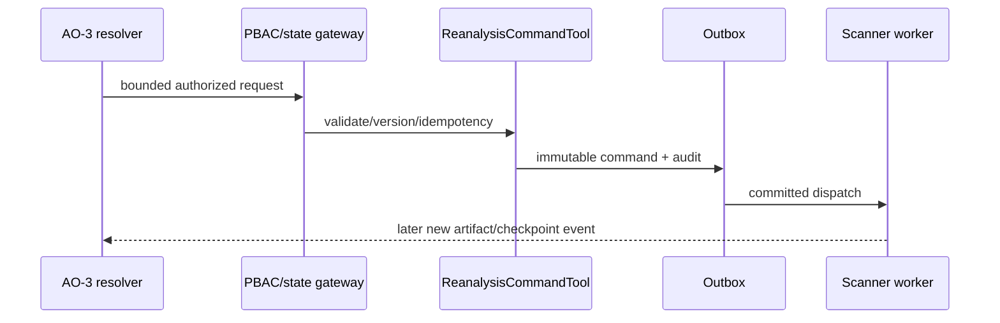

# TASK-AO-2-13 — `request_targeted_reanalysis`

## 1–4. Task Information, Objective, Use Case, Definition

| Item | Value |
|---|---|
| Story / exposure / mutation | AO-2 / `ORCHESTRATOR_ONLY` / `REANALYZE` |
| Owner / gate | Scan command/outbox; `TECHNICAL_EVIDENCE_REANALYZE`, allowed resolver state, pinned snapshot/report |
| Objective | Request one allow-listed analyzer over bounded pinned scope; never execute shell/URL/source mutation. |
| Policy | Outbox audit/state event; enqueue timeout 2s; 3 retries only `OUTBOX_TRANSIENT`; deterministic worker uses its own policy/DLQ. |

AO-3 invokes after an authorized missing-evidence resolver. Direct model access is prohibited because this creates workload and can alter derived artifacts.

## 5. Input Schema

```json
{"type":"object","additionalProperties":false,"properties":{"inputArtifactVersion":{"type":"string","pattern":"^ter_[A-Za-z0-9_-]{8,120}$"},"analyzerId":{"enum":["RUN_SEMGREP_RULES","RUN_PYTHON_SEMANTIC_ANALYSIS","RUN_TS_JS_SEMANTIC_ANALYSIS","RUN_STRUCTURAL_AUGMENTATION"]},"scope":{"type":"object","additionalProperties":false,"properties":{"pathPrefixes":{"type":"array","items":{"type":"string","pattern":"^(?!/|.*\\.\\.)[A-Za-z0-9._/-]+/$"},"minItems":1,"maxItems":20,"uniqueItems":true},"subjectRefs":{"type":"array","items":{"type":"string","pattern":"^(finding|symbol|node):[A-Za-z0-9_-]{8,120}$"},"minItems":1,"maxItems":50,"uniqueItems":true}},"minProperties":1,"maxProperties":1},"reasonRequirementId":{"type":"string","pattern":"^requirement:[A-Za-z0-9_-]{8,120}$"},"idempotencyKey":{"type":"string","pattern":"^[A-Za-z0-9_-]{16,128}$"}},"required":["inputArtifactVersion","analyzerId","scope","reasonRequirementId","idempotencyKey"]}
```

## 6. Output Schema and Examples

`result={reanalysisRequestId,state:"QUEUED"|"ALREADY_QUEUED",inputArtifactVersion,requestedAnalyzer,scopeRef,checkpointRef,auditRef}`; no synchronous scan result.

```json
{"status":"READY","toolName":"request_targeted_reanalysis","toolVersion":"1.0.0","configHash":"sha256:reanalysis-v1","correlationId":"af11bb22-3333-4444-8555-666677778888","artifactVersions":{"technicalEvidenceReportId":"ter_01J"},"provenanceRef":"tool-execution:reanalyze_01J","coverageState":"PENDING","evidenceRefs":[],"limitations":[],"result":{"reanalysisRequestId":"reanalysis:rr_01J","state":"QUEUED","inputArtifactVersion":"ter_01J","requestedAnalyzer":"RUN_TS_JS_SEMANTIC_ANALYSIS","scopeRef":"scope:sc_01J","checkpointRef":"checkpoint:cp_01J","auditRef":"audit:au_01J"}}
```

Duplicate idempotency key returns same request with `ALREADY_QUEUED`; failed worker produces a new typed state/audit, never mutates original report.

## 7. Errors and Typed Outcomes

Invalid analyzer/scope/extra args=`INVALID_ARGUMENT`; missing requirement/version=`NEEDS_INPUT`; unsupported scope=`OUT_OF_COVERAGE`; resolver/PBAC/state/snapshot denial=`BLOCKED`; transient outbox failure=`FAILED` after 3 retries then DLQ/checkpoint.

## 8–15. Flow, Rules, Logic, LLM, Registry, Audit, Retry, Security



Validate → internal registry → resolver/PBAC/state/snapshot pin → analyzer/scope allow-list → idempotency reservation → outbox transaction/audit → `QUEUED` response. Registry `TargetedReanalysisTool`, `ORCHESTRATOR_ONLY`, action `TECHNICAL_EVIDENCE_REANALYZE`, 2s/3 outbox retries/DLQ, idempotency key mandatory. `exposed_to_model:false`; AO-3 passes requirement/ref only. Audit shared metadata plus idempotency hash/command/output/checkpoint; no source, shell, URL, raw prompt/secret/AST. Worker reads commit-pinned snapshot and writes new immutable version only.

## 16–18. Scenario, AC, Tests

Limited TS semantic coverage routes allowed resolver; command queues one analyzer, later links a new report. AC: only allow-list/bounded scope, duplicate has no extra command, prior artifacts unchanged, PBAC/state closed, audit/checkpoint/DLQ observable.

| ID | Scenario | Level |
|---|---|---|
| TC-01 | allowed command/outbox event | integration |
| TC-02 | duplicate key replay | integration |
| TC-03 | analyzer/scope/PBAC/state denial | contract/integration |
| TC-04 | source preservation/new version | worker |
| TC-05 | outbox retry/DLQ/checkpoint | worker |
| TC-06 | command privacy/audit | privacy |

## 19–22. DoD, Files, Questions, Deliverables

Implement command contracts/registry, resolver gateway, idempotency/outbox/checkpoint/worker bridge and tests in contracts/API/workers. OQ-01: ratify per-tenant queued-work budget (Platform, OPEN, blocks yes). Deliver exact command schema, outbox/audit and test suite.

## Source Authority

- `docs/specs/spec-agentic-evidence-orchestration/tool-catalog.md`
- `docs/specs/spec-agentic-evidence-orchestration/orchestration-state-machine.md`
- `docs/implementation/tasks/modules/agentic-evidence-tools/shared-tool-contract.md`
