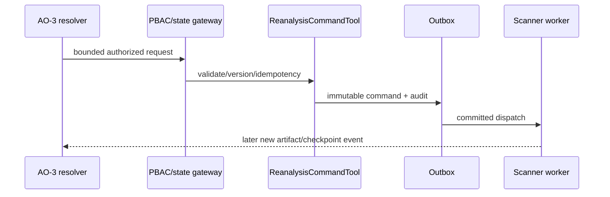

# TASK-AO-2-13 — `request_targeted_reanalysis`

## 1–4. Task Information, Objective, Use Case, Definition

| Item                        | Value                                                                                                                                                                                             |
| --------------------------- | ------------------------------------------------------------------------------------------------------------------------------------------------------------------------------------------------- |
| Story / exposure / mutation | AO-2 / `ORCHESTRATOR_ONLY` / `REANALYZE`                                                                                                                                                          |
| Owner / gate                | Scan command/outbox; `TECHNICAL_EVIDENCE_REANALYZE`, allowed resolver state, pinned snapshot/report                                                                                               |
| Objective                   | Request one allow-listed analyzer over bounded pinned scope; never execute shell/URL/source mutation.                                                                                             |
| Policy                      | The capacity, queue, retry and recovery policy below is normative. The API persists one request/checkpoint and one outbox command atomically; the worker produces a new immutable report version. |

AO-3 invokes after an authorized missing-evidence resolver. Direct model access is prohibited because this creates workload and can alter derived artifacts.

## 5. Input Schema

```json
{
  "type": "object",
  "additionalProperties": false,
  "properties": {
    "inputArtifactVersion": {
      "type": "string",
      "pattern": "^ter_[A-Za-z0-9_-]{8,120}$"
    },
    "analyzerId": {
      "enum": [
        "RUN_SEMGREP_RULES",
        "RUN_PYTHON_SEMANTIC_ANALYSIS",
        "RUN_TS_JS_SEMANTIC_ANALYSIS",
        "RUN_STRUCTURAL_AUGMENTATION"
      ]
    },
    "scope": {
      "type": "object",
      "additionalProperties": false,
      "properties": {
        "pathPrefixes": {
          "type": "array",
          "items": {
            "type": "string",
            "pattern": "^(?!/|.*\\.\\.)[A-Za-z0-9._/-]+/$"
          },
          "minItems": 1,
          "maxItems": 20,
          "uniqueItems": true
        },
        "subjectRefs": {
          "type": "array",
          "items": {
            "type": "string",
            "pattern": "^(finding|symbol|node):[A-Za-z0-9_-]{8,120}$"
          },
          "minItems": 1,
          "maxItems": 50,
          "uniqueItems": true
        }
      },
      "minProperties": 1,
      "maxProperties": 1
    },
    "reasonRequirementId": {
      "type": "string",
      "pattern": "^requirement:[A-Za-z0-9_-]{8,120}$"
    },
    "idempotencyKey": { "type": "string", "pattern": "^[A-Za-z0-9_-]{16,128}$" }
  },
  "required": [
    "inputArtifactVersion",
    "analyzerId",
    "scope",
    "reasonRequirementId",
    "idempotencyKey"
  ]
}
```

## 6. Output Schema and Examples

`result={reanalysisRequestId,state:"QUEUED"|"ALREADY_QUEUED",inputArtifactVersion,requestedAnalyzer,scopeRef,checkpointRef,auditRef}`; no synchronous scan result.

```json
{
  "status": "READY",
  "toolName": "request_targeted_reanalysis",
  "toolVersion": "1.0.0",
  "configHash": "sha256:reanalysis-v1",
  "correlationId": "af11bb22-3333-4444-8555-666677778888",
  "artifactVersions": { "technicalEvidenceReportId": "ter_01J" },
  "provenanceRef": "tool-execution:reanalyze_01J",
  "coverageState": "PENDING",
  "evidenceRefs": [],
  "limitations": [],
  "result": {
    "reanalysisRequestId": "reanalysis:rr_01J",
    "state": "QUEUED",
    "inputArtifactVersion": "ter_01J",
    "requestedAnalyzer": "RUN_TS_JS_SEMANTIC_ANALYSIS",
    "scopeRef": "scope:sc_01J",
    "checkpointRef": "checkpoint:cp_01J",
    "auditRef": "audit:au_01J"
  }
}
```

Duplicate idempotency key returns same request with `ALREADY_QUEUED`; failed worker produces a new typed state/audit, never mutates original report.

## 7. Errors and Typed Outcomes

Invalid analyzer/scope/extra args=`INVALID_ARGUMENT`; missing requirement/version=`NEEDS_INPUT`; unsupported scope=`OUT_OF_COVERAGE`; resolver/PBAC/state/snapshot denial=`BLOCKED`; transient outbox failure=`FAILED` after 3 retries then DLQ/checkpoint.

## 8–15. Flow, Rules, Logic, LLM, Registry, Audit, Retry, Security



Validate → internal registry → resolver/PBAC/state/snapshot pin → analyzer/scope allow-list → idempotency reservation → capacity admission → outbox transaction/audit → `QUEUED` response. Registry `TargetedReanalysisTool`, `ORCHESTRATOR_ONLY`, action `TECHNICAL_EVIDENCE_REANALYZE`, idempotency key mandatory. `exposed_to_model:false`; AO-3 passes requirement/ref only. Audit shared metadata plus idempotency hash/command/output/checkpoint; no source, shell, URL, raw prompt/secret/AST. Worker reads commit-pinned snapshot and writes new immutable version only.

### Capacity, queue and retry policy (v1)

The baseline scanner has a 600-second scan budget and each `ConsumerBase` process has RabbitMQ `prefetch_count=1`; an individual worker can therefore execute one scanner message at a time. Reanalysis is deliberately conservative until production measurements permit an increase.

| Control                                        |                                         Defined v1 value | Enforcement and outcome                                                                                                                                                                                                    |
| ---------------------------------------------- | -------------------------------------------------------: | -------------------------------------------------------------------------------------------------------------------------------------------------------------------------------------------------------------------------- |
| Concurrent `RUNNING` requests per organization |                                                        2 | A third accepted request remains `QUEUED`; it must not be dispatched to a worker yet.                                                                                                                                      |
| `QUEUED` requests per organization             |                                                       10 | FIFO by `createdAt`; dispatch only when fewer than 2 of that organization's requests are `RUNNING`.                                                                                                                        |
| Total active requests per organization         |                                                       12 | Includes `QUEUED` + `DISPATCHED` + `RUNNING`; a 13th distinct request is rejected as `BLOCKED` with `TENANT_REANALYSIS_CAPACITY_EXHAUSTED`, never silently dropped.                                                        |
| Submission rate per organization               | 12 distinct requests / 15 minutes; 40 / rolling 24 hours | Idempotency replays do not consume quota. A request above either window is persisted neither as a request nor as an outbox event and returns `BLOCKED` with `TENANT_REANALYSIS_RATE_LIMITED`.                              |
| Global worker dispatch target                  |                                       4 running requests | Deploy four scanner-consumer replicas or an equivalent four-slot worker pool; each process remains `prefetch_count=1`. Per-tenant limit prevents one tenant consuming more than half of this initial pool.                 |
| API outbox publish retry                       |           Initial publish + 3 retries (4 attempts total) | Targeted-reanalysis messages use `maxAttempts=4`, exponential backoff with jitter `1s`, `2s`, `4s`; then `DLQ`. This is intentionally separate from the current generic outbox default of 5 total attempts.                |
| Worker execution retry                         |       Initial execution + 3 retries (4 deliveries total) | `MAX_RETRIES=3` already represents three requeues after the first delivery. Retries use delayed queues at `10s`, `60s`, `300s`, preserving the request ID, idempotency key and checkpoint. A fourth failure becomes `DLQ`. |
| Scan execution budget                          |                                 600 seconds per delivery | Timeouts are retryable only when the analyzer has not produced an accepted report. After retry exhaustion the request is `FAILED` and the original report remains unchanged.                                               |

Admission is transactional: lock/count active requests for the organization, reserve the idempotency key, create the request in `QUEUED`, its `PENDING_DISPATCH` checkpoint and its outbox event in one database transaction. A scheduler claims the oldest eligible request with `FOR UPDATE SKIP LOCKED`, changes it to `DISPATCHED`, and publishes only if the organization has fewer than two `RUNNING` rows. The worker atomically claims `DISPATCHED` as `RUNNING`; duplicate deliveries return the stored checkpoint state rather than rerunning the analyzer.

Only transient broker/network/PBAC-unavailable/worker-infrastructure failures retry. Invalid scope, pinned-artifact mismatch, PBAC deny, privacy/schema failure and unsupported analyzer are terminal and go directly to `FAILED`/DLQ without retry. DLQ replay requires the existing protected replay path plus a fresh checkpoint transition; it cannot mutate the request scope, analyzer, pinned snapshot or already accepted evidence version.

## 16–18. Scenario, AC, Tests

Limited TS semantic coverage routes allowed resolver; command queues one analyzer, later links a new report. AC: only allow-list/bounded scope, duplicate has no extra command, prior artifacts unchanged, PBAC/state closed, audit/checkpoint/DLQ observable.

| ID    | Scenario                                                                  | Level                |
| ----- | ------------------------------------------------------------------------- | -------------------- |
| TC-01 | allowed command/outbox event                                              | integration          |
| TC-02 | duplicate key replay                                                      | integration          |
| TC-03 | analyzer/scope/PBAC/state denial                                          | contract/integration |
| TC-04 | source preservation/new version                                           | worker               |
| TC-05 | 2 running + 10 queued FIFO, 13th capacity rejection and quota windows     | integration          |
| TC-06 | API 4 publish attempts/backoff/DLQ and audit                              | integration          |
| TC-07 | worker initial + 3 delayed retries, duplicate delivery and DLQ/checkpoint | worker               |
| TC-08 | outbox retry/DLQ/checkpoint privacy                                       | worker               |
| TC-06 | command privacy/audit                                                     | privacy              |

## 19–22. DoD, Files, Questions, Deliverables

Implement command contracts/registry, resolver gateway, idempotency/capacity admission/outbox/checkpoint/worker bridge and tests in contracts/API/workers. The capacity policy above resolves OQ-01; changes require an ADR revision backed by queue wait-time, timeout and DLQ metrics. Deliver exact command schema, outbox/audit and test suite.

## Source Authority

- `docs/specs/spec-agentic-evidence-orchestration/tool-catalog.md`
- `docs/specs/spec-agentic-evidence-orchestration/orchestration-state-machine.md`
- `docs/implementation/tasks/modules/agentic-evidence-tools/shared-tool-contract.md`
