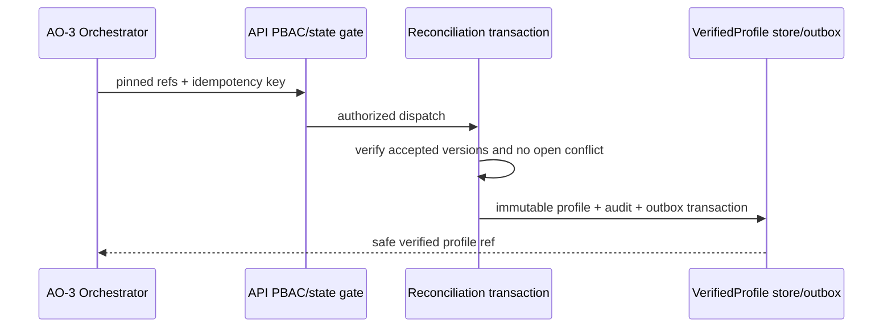

# TASK-AO-3-01 — `reconcile_profile_to_verified_profile`

## 1–4. Task information, objective, use case, definition

| Item | Value |
| --- | --- |
| Story / exposure / mutation | AO-3 / `ORCHESTRATOR_ONLY` / `SYSTEM_MUTATION` |
| Owner / gate | API `VerifiedProfile` transaction; `VERIFIED_PROFILE_PERSIST`; submitted Wizard, accepted TechnicalEvidenceReport, accepted flow, no open conflict |
| Objective | Materialize one immutable, legal-safe `VerifiedProfile` from pinned reconciliation inputs. It never resolves a conflict, modifies the Wizard, or selects a latest version. |
| Policy | 10 s; retry only transaction serialization once (250 ms); idempotent by all input refs plus key. |

When AO-3 has a typed `READY` reconciliation outcome, the orchestrator submits exact refs. A conflict remains `CONFLICT`/`BLOCKED`; an absent fact remains `NEEDS_INPUT`. The output is the only packet-owned producer accepted by `get_verified_profile` and AO-5 legal matching.

## 5. Input schema

| Parameter | Required | Validation |
| --- | ---: | --- |
| `wizardProfileRef` | yes | submitted immutable `wizard:` ref |
| `technicalEvidenceReportRef` | yes | accepted immutable `ter:` ref |
| `aiUsageFlowRef` | yes | accepted immutable `flow:` ref |
| `reconciliationDecisionRefs` | yes | 0–50 resolved decision refs only |
| `idempotencyKey` | yes | UUID |

```json
{"type":"object","additionalProperties":false,"properties":{"wizardProfileRef":{"type":"string","pattern":"^wizard:[A-Za-z0-9_-]{8,120}$"},"technicalEvidenceReportRef":{"type":"string","pattern":"^ter:[A-Za-z0-9_-]{8,120}$"},"aiUsageFlowRef":{"type":"string","pattern":"^flow:[A-Za-z0-9_-]{8,120}$"},"reconciliationDecisionRefs":{"type":"array","items":{"type":"string","pattern":"^reconciliation:[A-Za-z0-9_-]{8,120}$"},"maxItems":50,"uniqueItems":true},"idempotencyKey":{"type":"string","format":"uuid"}},"required":["wizardProfileRef","technicalEvidenceReportRef","aiUsageFlowRef","reconciliationDecisionRefs","idempotencyKey"]}
```

The shared envelope supplies assessment, workflow, correlation, bounded scope, and pinned artifact versions.

## 6. Output schema and examples

`result={verifiedProfileRef,version,lifecycleStatus,factEvidenceRefs,sourceArtifactRefs,outboxEventRef}`; fact refs sort lexically and cap at 100.

```json
{"status":"READY","toolName":"reconcile_profile_to_verified_profile","toolVersion":"1.0.0","configHash":"sha256:verified-profile-v1","correlationId":"9bc72dfd-59d8-4e2a-a49c-1163e8777720","artifactVersions":{"wizardProfileId":"wp_01J","technicalEvidenceReportId":"ter_01J","aiUsageFlowId":"flow_01J"},"provenanceRef":"prov:verified-profile:01J","coverageState":"SUFFICIENT","evidenceRefs":["evidence:invocation_01J"],"limitations":[],"result":{"verifiedProfileRef":"verified:vp_01J","version":"1","lifecycleStatus":"VERIFIED","factEvidenceRefs":["evidence:invocation_01J"],"sourceArtifactRefs":["wizard:wp_01J","ter:ter_01J","flow:flow_01J"],"outboxEventRef":"outbox:verified-profile-created:01J"}}
```

An open conflict returns `{"status":"CONFLICT","coverageState":"SUFFICIENT","result":{"openConflictRefs":["conflict:cf_01J"]}}`; it creates no profile.

## 7–15. outcomes, flow, rules, execution, context, registry, audit, retry, security

`INVALID_ARGUMENT` rejects malformed or duplicate refs; missing/stale input is `NEEDS_INPUT`; unresolved evidence is `OUT_OF_COVERAGE`; an open conflict is `CONFLICT`; PBAC/state/tenant denial is `BLOCKED`; persistence failure is `FAILED` after the listed retry.



Algorithm: validate → registry/PBAC/tenant/version/state check → load only sanitized projections → require complete conflict ledger → deterministically merge allow-listed typed facts → privacy validation → reserve/replay idempotency → atomically persist profile, audit and `event.profile.verified.v1` outbox → normalize result. Build `packages/contracts/src/evidence/reconciliation`, API `modules/reconciliation`, profile repository/outbox mapper, and worker orchestration adapter.

`exposed_to_model:false`: only AO-3 may call it after resolver validation. The model sees a later `get_verified_profile` response, never input facts, decisions, or this mutation response. Audit actor/service, PBAC policy/version, all safe refs/hashes, outcome, output hash, correlation, and duration; never raw answers, source, prompt, secret, full AST, decision notes, or stack traces. API defaults deny and verifies reviewer/actor separation where a reconciliation decision has a human actor.

## 16–22. scenarios, AC, tests, DoD, files, questions, deliverables

Scenario: a submitted Wizard and accepted report have no open conflict; AO-3 calls with pinned refs and receives `verified:vp_01J`; AO-5 may now call `get_verified_profile`. A remaining `conflict:cf_01J` returns `CONFLICT` and preserves history.

AC: Given identical refs/key, when replayed, then return the original profile without a second version; given an open conflict or stale report, when invoked, then create nothing and return the typed outcome; every verified fact has evidence refs and safe provenance.

| ID | Scenario | Level |
| --- | --- | --- |
| TC-01 | deterministic merge and immutable version | integration |
| TC-02 | stale/missing/cross-tenant refs | contract/integration |
| TC-03 | open conflict and incomplete coverage | integration |
| TC-04 | PBAC/actor separation | integration |
| TC-05 | forbidden nested source/prompt/secret payload | privacy |
| TC-06 | idempotency, transaction rollback, audit/outbox | integration |

DoD: strict contracts, registry, PBAC transaction, audit/outbox, privacy and integration suites pass. OQ-01: confirm the canonical typed fact merge precedence (Architecture + Compliance, `OPEN`, blocks readiness). Deliver the definition, handler, transaction, contract, tests, and audit mapping.

## Source authority

`tool-catalog.md`; `orchestration-state-machine.md`; `shared-tool-contract.md`; `docs/project-context.md`.
