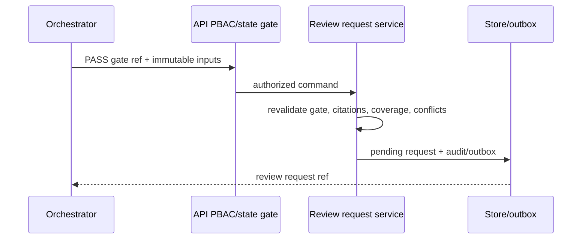

# TASK-AO-3-02 — `submit_classification_for_independent_review`

## 1–4. Task information, objective, use case, definition

| Item | Value |
| --- | --- |
| Story / exposure / mutation | AO-3 / `ORCHESTRATOR_ONLY` / `SYSTEM_MUTATION` |
| Owner / gate | API `ClassificationReviewRequest` transaction; `CLASSIFICATION_REVIEW_REQUEST_CREATE`; proposal gate `PASS` |
| Objective | Create a pinned pending review request from a passing proposal gate. It is not approval and cannot create a final classification. |
| Policy | 5 s; no retry except one transaction serialization retry; immutable idempotent request. |

The orchestrator may submit only the proposal emitted by AO-5 `validate_classification_proposal`; it cannot submit ad-hoc labels or nominate its own reviewer.

## 5. Input schema

```json
{"type":"object","additionalProperties":false,"properties":{"proposalGateRef":{"type":"string","pattern":"^classification-gate:[A-Za-z0-9_-]{8,120}$"},"baselineRef":{"type":"string","pattern":"^baseline:[A-Za-z0-9_-]{8,120}$"},"candidateLabel":{"type":"string","pattern":"^CLASSIFICATION_[A-Z0-9_]{3,64}$"},"citationRefs":{"type":"array","items":{"type":"string","pattern":"^citation:chunk_[A-Za-z0-9_-]{6,120}$"},"minItems":1,"maxItems":20,"uniqueItems":true},"idempotencyKey":{"type":"string","format":"uuid"}},"required":["proposalGateRef","baselineRef","candidateLabel","citationRefs","idempotencyKey"]}
```

The handler re-loads the exact gate and rejects any non-`PASS` proposal; shared envelope pins assessment/workflow/version/scope.

## 6. Output schema and examples

`result={reviewRequestRef,status,proposalGateRef,requiredReviewerAction,expiresAt}`.

```json
{"status":"READY","toolName":"submit_classification_for_independent_review","toolVersion":"1.0.0","configHash":"sha256:classification-review-request-v1","correlationId":"d6b1f133-d7aa-4a59-a09d-7be11dbea369","artifactVersions":{"baselineRef":"baseline:01J","proposalGateRef":"classification-gate:cg_01J"},"provenanceRef":"prov:classification-review-request:01J","coverageState":"SUFFICIENT","evidenceRefs":["citation:chunk_01J"],"limitations":[],"result":{"reviewRequestRef":"classification-review:cr_01J","status":"PENDING_INDEPENDENT_REVIEW","proposalGateRef":"classification-gate:cg_01J","requiredReviewerAction":"APPROVE_OR_REJECT","expiresAt":"2026-08-20T00:00:00Z"}}
```

## 7–15. outcomes, flow, rules, execution, context, registry, audit, retry, security

Invalid fields are `INVALID_ARGUMENT`; absent/stale gate is `NEEDS_INPUT`; gate `FAIL`, open conflict, limited coverage, or expired citations returns `BLOCKED`; PBAC/tenant/state denial is `BLOCKED`; a duplicate key replays `READY`; storage error is `FAILED`.



Validate → allow-list/PBAC/version → reload PASS gate, baseline, citation allowlist and no conflict → reserve idempotency → persist a `PENDING_INDEPENDENT_REVIEW` request with requester identity → audit/outbox → privacy normalize. Registry `ClassificationReviewSubmissionTool/1.0.0`; `ORCHESTRATOR_ONLY`; action above; valid only from `PROPOSAL_READY_FOR_INDEPENDENT_REVIEW`; 5 s / one serialization retry. `exposed_to_model:false`: an LLM can produce a proposal only; it cannot submit, choose a reviewer, or infer approval. Audit safe hashes/refs/status/policy/correlation only. Enforce tenant isolation, no requester-as-reviewer, no free-text rationale, and API-only persistence.

## 16–22. scenarios, AC, tests, DoD, files, questions, deliverables

Scenario: proposal gate `PASS` plus valid citations yields one pending request. The same request key replays it; a `FAIL` gate produces no review request.

| ID | Scenario | Level |
| --- | --- | --- |
| TC-01 | PASS request and stable result | integration |
| TC-02 | FAIL/stale/limited/conflict gate | integration |
| TC-03 | extra field and citation substitution | contract |
| TC-04 | PBAC, tenant, requester/reviewer separation | integration |
| TC-05 | sensitive payload/audit rejection | privacy |
| TC-06 | replay and outbox rollback | integration |

AC: only passing immutable gates create requests; creation never persists a classification; replay is atomic; every request is independently reviewable and auditable. Build contracts/API classification-review service, repository/migration, outbox, orchestration adapter and tests. OQ-01: set review-request expiry/SLA (Compliance, `OPEN`, blocks production readiness). Deliver strict schema, command, state record, audit/outbox and tests.

## Source authority

`tool-catalog.md`; `orchestration-state-machine.md`; `shared-tool-contract.md`; AO-5 `validate_classification_proposal` packet.
